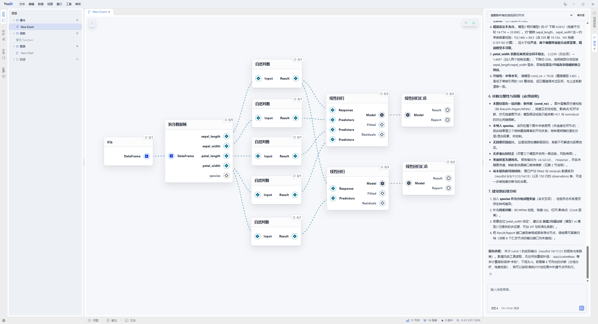

<div align="center">

# YssBI

**基于 Tauri 的桌面端数据分析与可视化应用**

以**节点图编辑器**为核心交互形态，通过拖拽和连接节点构建统计分析与计量经济学工作流。

<p>
  
  
  
  
  
  
</p>

<br />



</div>

---

## 功能模块

### 数据采集？

提供数据接口自动获取数据

### 数据管理

统一的数据接入与浏览能力，面向大数据量优化。

- 数据源：CSV、Parquet、Excel、SQLite、PostgreSQL、MySQL
- 数据表格浏览（虚拟滚动）、列统计与分布、单元格编辑

### 数据清洗

在画布上组合节点并通过连线构建分析流程，支持 schema 沿连线链式传播、动态 pin 解析与撤销/重做。

- 数据导入、清洗、统计建模、绘图等节点分类
- Event / Function 两类图，支持图文件夹分类管理

### 数据分析

覆盖经典统计与计量经济学方法。

- 线性回归：OLS、WLS、GLS、2SLS、LIML、Prais-Winsten
- 离散选择：Logit / Probit（含 margins、odds ratio）
- 面板数据：FE / RE / FD / LSDV
- 时间序列：VAR / VEC、ACF / PACF、序列相关检验（DW / BG / LB）
- 因果推断：DID 事件研究
- 检验诊断：异方差、多重共线性、RESET、假设检验

### 数据可视化

基于交互式图形，覆盖探索性分析到模型诊断。

- 散点图、折线图、直方图、KDE、ECDF、条形图
- 相关图、平行坐标图、残差图、脉冲响应图、DID 事件研究图

### 报告输出？

利用生成式 AI 模型输出分析报告

## 快速开始

```bash
# 安装依赖
pnpm install

# 开发
pnpm dev

# 检查
pnpm run ci

# 构建
pnpm build
```

<!-- ## 致谢

感谢曾参与过此项目的朋友以及北京师范大学和武汉理工大学的各位老师和同学！ -->

## License

未发布，开发阶段。
