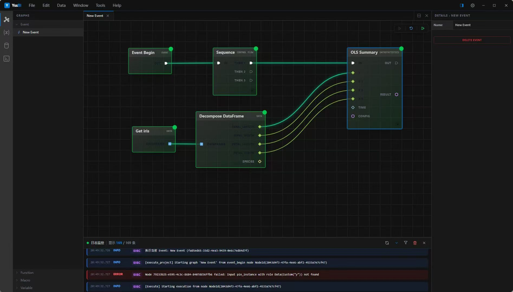
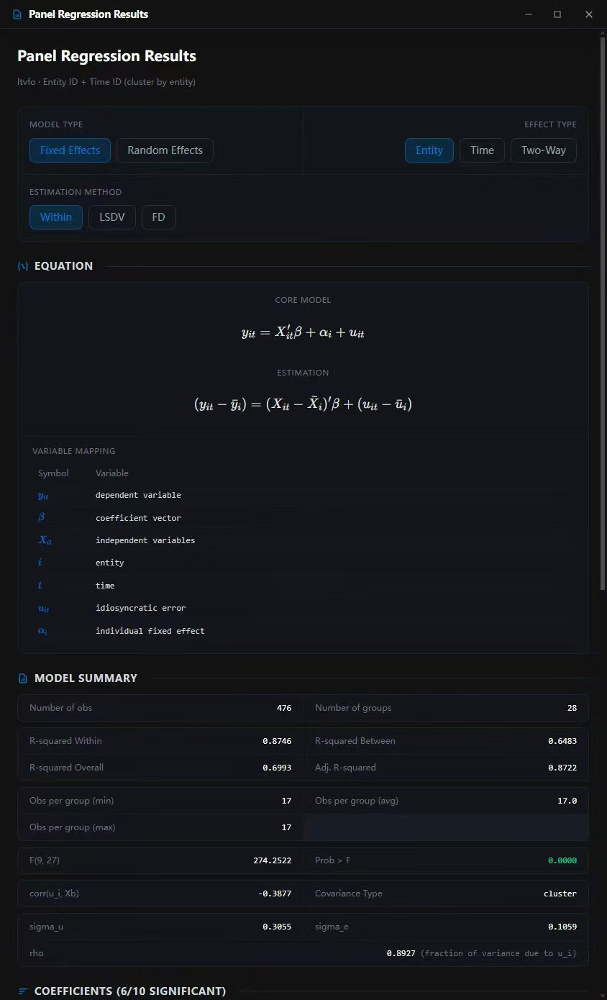

# YssBI

<div align="center">
  <table>
    <tr>
      <td></td>
    </tr>
  </table>
</div>

基于 Tauri 的桌面端数据分析与可视化应用。以**节点图编辑器**为核心交互形态，用户通过拖拽和连接节点来构建统计分析与计量经济学工作流，支持多窗口查看表格、图形、日志和模型结果。

## 功能概览

- **图编辑器** — 在画布上组合节点（数据导入、清洗、统计建模、绘图），通过连线构建分析流程
- **数据管理** — 支持 CSV、Parquet、Excel、SQLite、PostgreSQL、MySQL 多种数据源，提供数据表格浏览（虚拟滚动）、列统计与分布、单元格编辑
- **统计分析** — OLS、2SLS、LIML、二元选择模型（Logit/Probit）、VAR/VEC、Panel FE/RE/FD/LSDV、DID、Prais-Winsten、ACF/PACF、序列相关检验（DW/BG/LB）、假设检验
- **可视化** — 散点图、折线图、直方图、KDE、ECDF、条形图、相关图、平行坐标图、残差图、脉冲响应图、DID 事件研究图
- **项目管理** — 项目注册、收藏、多图管理，支持图文件夹分类（Event/Function）
- **国际化** — 中英文界面切换
- **主题系统** — 可配置的外观、编辑器与窗口布局主题

<div align="center">
    
</div>

## 技术栈

| 层 | 技术 |
|---|---|
| 桌面框架 | Tauri 2 |
| 前端 | React 19, TypeScript, Vite 7, Tailwind CSS v4, shadcn/ui |
| 状态管理 | Zustand |
| 图形渲染 | 自研 SVG 节点图编辑器, @dnd-kit, D3.js |
| 数据表格 | @glideapps/glide-data-grid, @tanstack/react-virtual |
| 公式渲染 | KaTeX, react-markdown |
| 后端 | Rust (edition 2021), tokio |
| 数据处理 | Polars, ndarray, faer, statrs, calamine |
| 数据库 | SQLite, PostgreSQL, MySQL (via sqlx) |
| 科学计算 | yss-sci (自研 Rust crate): 回归分析、时间序列、面板数据、统计检验 |

## 快速开始

### 环境要求

- Node.js 18+
- Rust 工具链 (rustc 1.70+)
- 系统依赖（Windows 下需要 Visual Studio Build Tools 或 C++ Build Tools）

### 开发

```bash
# 安装依赖
npm install

# 启动 Vite 开发服务器（仅前端）
npm run dev

# 启动完整 Tauri 桌面应用（前端 + Rust 后端）
npm run tauri -- dev
```

### 构建

```bash
npm run tauri -- build
```

## 项目结构

```
YssBI/
├── src/                          # React 前端
│   ├── app/                      # 入口、根路由、i18n、全局 Provider
│   ├── views/                    # 窗口视图（Editor、DataView、Plot、Info、Log、Project）
│   ├── features/
│   │   ├── core/                 # 核心基础设施（Store、Sync、History、DnD、Keyboard）
│   │   ├── domain/               # 纯领域逻辑与工具函数
│   │   └── application/          # 应用层用例编排 Hooks
│   ├── services/                 # Tauri invoke 封装层
│   ├── shared/                   # 跨视图共享类型、UI 组件、工具函数
│   └── components/ui/            # shadcn/ui 组件
├── src-tauri/
│   ├── src/                      # Tauri Rust 后端
│   │   ├── commands/             # Tauri command 定义（薄层）
│   │   ├── project/              # 项目生命周期、持久化
│   │   ├── graph/                # 图模型、节点注册与类型推断
│   │   ├── execution/            # 图执行引擎
│   │   ├── database/             # 多数据源引擎与编辑
│   │   └── schema/               # 编辑器节点定义
│   └── sci/                      # yss-sci 科学计算库
├── docs/                         # 架构文档、设计规范
└── .cursor/rules/                # 编码规范（Cursor IDE）
```

## 架构概览

应用采用 **CQRS 风格的后端权威架构**：

- **后端 `ProjectState` 是唯一数据权威**，前端 Zustand Store 是其后端数据的只读投影
- **查询操作**：前端 → Service → `invoke` → 后端命令 → 直接返回数据
- **修改操作**：前端 → Service → `invoke` → 后端命令 → 修改状态 → emit 事件 → 前端 Sync 层 → 更新 Store → UI 自动响应
- **高频操作**（如节点拖拽）使用 `trackPending`/`isPending` 机制抑制回显，避免竞态闪烁

更详细的架构说明见 [docs/ARCHITECTURE.md](docs/ARCHITECTURE.md)。

## 文档

- [ARCHITECTURE.md](docs/ARCHITECTURE.md) — 项目架构文档
- [前后端数据交互范式.md](docs/前后端数据交互范式.md) — 前后端数据交互规范
- [SCI_ARCHITECTURE_ANALYSIS.md](docs/SCI_ARCHITECTURE_ANALYSIS.md) — 科学计算库架构分析
- [.cursor/rules/](.cursor/rules/) — 编码规范（16 条规则）

## License

未发布，开发阶段。
