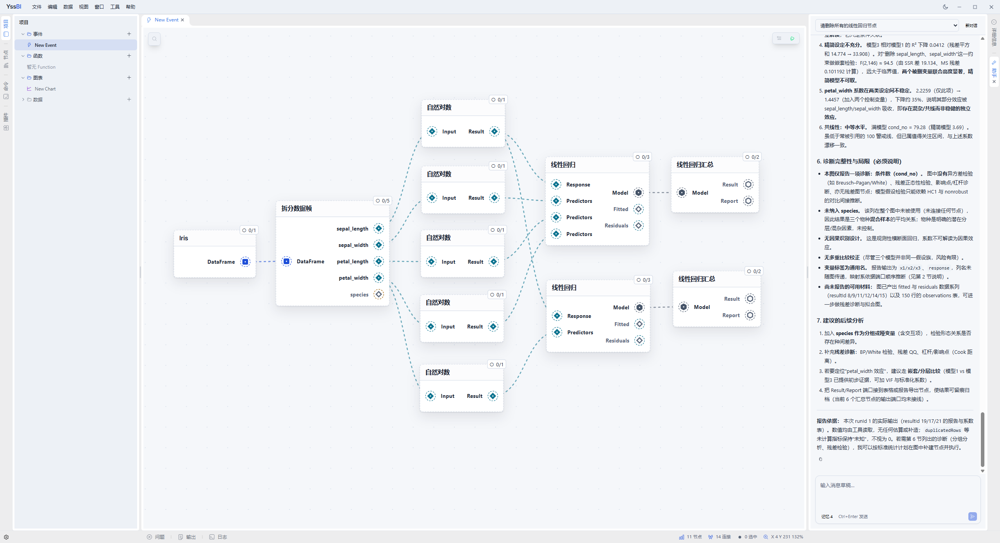

<div align="center">

# YssBI

**基于 GPUI 与 Rust 的原生桌面数据分析应用**

以**节点图编辑器**为核心交互形态，通过拖拽和连接节点构建统计分析与计量经济学工作流。

<p>
  
  
  
</p>

<br />



</div>

---

项目架构、开发流程和路线图从 [文档索引](docs/README.md) 进入。

## 功能模块

### 数据采集？

提供数据接口自动获取数据

### 数据管理

统一的数据接入与浏览能力，面向大数据量优化。

- 数据源：CSV、Parquet、Excel、SQLite、PostgreSQL、MySQL
- 数据表格浏览（虚拟滚动）、列统计与分布、单元格编辑

### 数据清洗

在画布上组合节点并通过连线构建分析流程，支持 schema 沿连线链式传播、动态 pin 解析与撤销/重做。

- 数据导入、清洗、统计建模、绘图等节点分类
- Event / Function 两类图，支持图文件夹分类管理

### 数据分析

覆盖经典统计与计量经济学方法。

- 线性回归：OLS、WLS、GLS、2SLS、LIML、Prais-Winsten
- 离散选择：Logit / Probit（含 margins、odds ratio）
- 面板数据：FE / RE / FD / LSDV
- 时间序列：VAR / VEC、ACF / PACF、序列相关检验（DW / BG / LB）
- 因果推断：DID 事件研究
- 检验诊断：异方差、多重共线性、RESET、假设检验

### 数据可视化

基于交互式图形，覆盖探索性分析到模型诊断。

- 散点图、折线图、直方图、KDE、ECDF、条形图
- 相关图、平行坐标图、残差图、脉冲响应图、DID 事件研究图

### 报告输出？

利用生成式 AI 模型输出分析报告

## 快速开始

从仓库根目录运行 Cargo 命令。Rust 最低版本由 [Cargo.toml](Cargo.toml) 的
`workspace.package.rust-version` 定义。根目录是纯 Rust workspace，默认成员为
`yss-desktop-gpui`；启动和构建不需要 Node.js、pnpm 或 Tauri 配置。

```bash
# 启动 GPUI 工作台
cargo run

# 打开项目及指定图
cargo run -- "/absolute/path/to/project" events/example.yssbi-event

# 构建
cargo build --release

# 为独立运行的可执行文件准备示例资源（将目录与程序一起分发）
cargo run -p yss-application --example build_samples -- --check --stage target/release/resources/samples
```

原生宿主、已实现交互与待验收范围见 [GPUI host](crates/yss-desktop-gpui/README.md)。
普通 `cargo run` 对桌面宿主及渲染、曲线细分和布局依赖启用定向开发优化；首次构建这些依赖会更慢。
帧率验收使用 `cargo run --release`，并在相同图规模、窗口大小和显示器刷新率下比较。
`react/` 保留原界面源码和契约样本作为开发参考，不参与原生应用构建。
示例 Parquet 已随源码提供，开发启动可离线读取；更新来源和资源校验见
[示例资产](resources/samples/README.md)。

## 开发与验证入口

[Cargo.toml](Cargo.toml) 拥有 workspace、默认入口和共享依赖。修改库时明确选择
package 和 target，并检查受影响的原生调用方。界面使用人工验收，不编写 UI 单元测试。

| 任务 | 根命令 |
| --- | --- |
| 原生编译检查 | `cargo check -p yss-desktop-gpui --bin yss-desktop-gpui` |
| 原生静态检查 | `cargo clippy -p yss-desktop-gpui --bin yss-desktop-gpui --no-deps -- -D warnings` |
| 库的聚焦测试 | `cargo test -p <package> --lib <case>` |
| 包格式检查 | `cargo fmt -p <package> -- --check` |
| workspace 模块索引 | `node scripts/generate-crate-dependencies.mjs --check` |

日常改动按[验证规则](.rules)选择受影响范围，不将 workspace 全量检查作为局部改动的默认收尾。
索引生成器仅维护文档；运行桌面应用不依赖 Node.js。

<!-- ## 致谢

感谢曾参与过此项目的朋友以及北京师范大学和武汉理工大学的各位老师和同学！ -->

## License

未发布，开发阶段。
