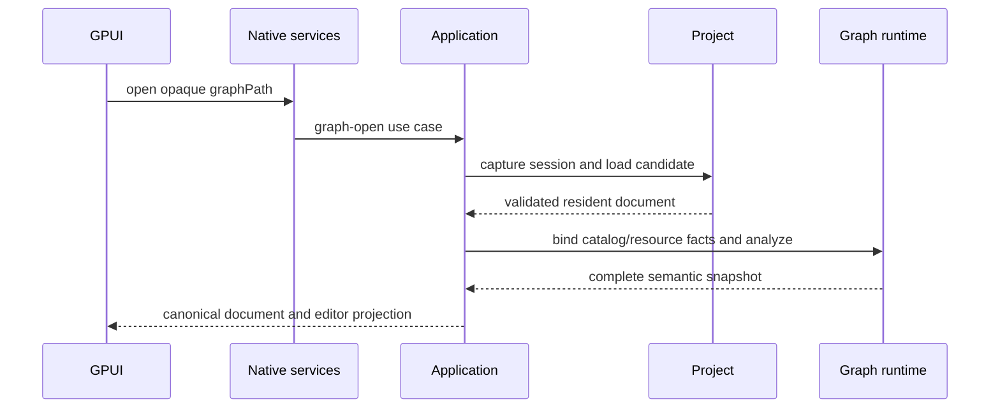

# Project application

> Status: Current
> Scope: 项目发现、查询、路径、激活与会话替换编排
> Canonical owners: Application project 用例、Project authority 和项目注册服务
> Update when: 本模块的公开入口、状态归属、生命周期或契约改变时

## Project lifecycle

通用文件能力集中在 [yss-filesystem](../../../yss-filesystem/README.md)，其运行、开发和构建依赖都不包含内部 crate。FS 不解释项目入口、图表/图文档、资源版本或索引失效；Project 解释这些业务规则并映射 ProjectOperationError，Application 组装带项目路径过滤器的监听器。文件事务默认接受任意字节，项目文档校验由 Project 显式提供。

项目发现由 `yss-project-registry` 的私有 `discovery` 模块使用 `walkdir` 遍历候选目录，链接与重解析点判断复用 `yss-filesystem`。注册流程采用发现结果并通过存储端口持久化；直接注册和扫描复用已有记录时，共用项目根身份校验。项目默认名称与规范化规则由 `yss-project-model` 统一拥有。共享进度与任务取消归 `yss-project-progress`；Application 将调用方提供的 `ProjectProgressSink` 传给注册服务，由原生宿主呈现类型化进度。

注册存储由 Application runtime 注入 SQLite adapter；adapter 将原生文件路径直接交给 SQLx，不把应用数据目录中的百分号等文件名字符解释为 URL 编码。

已有项目路径由 Rust `dunce::canonicalize` 解析，默认父目录与资源显示路径使用不访问文件系统的 `dunce::simplified`。Windows 仅在安全时简化扩展前缀，长路径、UNC 和特殊文件名所需的前缀保留；非 Windows 的展示路径原样保留。重新注册已有项目时刷新规范路径，项目身份仍由根身份校验决定。原生项目导航原样展示 Rust 路径投影，精确匹配规范入口路径，不剥离前缀、替换分隔符或忽略大小写来判断项目身份。

扫描与清理在返回成功前重查取消状态；取消不回滚已经完成的注册或清理。注册列表按收藏状态、数值化的 Unix 秒时间和名称排序，已有记录的名称与收藏状态不会被重复扫描覆盖。

原生宿主直接消费类型化激活、注册记录和生命周期回执，路径与注册时间字符串原样保留。
`ProjectRecord` 由 [Registry contract](../../../yss-project-registry-contract/src/lib.rs) 拥有，
包括根身份及其有效状态；读到记录不代表删除授权，后者仍由 Rust 核对状态与非空身份。
生命周期的部分提交结果必须按其实际 phase/outcome 结算，不能当作完整失败后重新创建目标。
扫描与清理的进度是辅助通知，命令返回后仍需重新读取实际登记列表；取消不会撤销已完成的登记或清理。
原生呈现与输入、进度交付和后续项目导航由 [GPUI host](../../../yss-desktop-gpui/README.md) 拥有。
`react/` 保留原 parser 与共享 fixture 作为契约参考，不参与原生调用链。

活动项目以一个 application session 为边界：

```text
Application session
├─ Project authority and project session
├─ Database runtime session
├─ Graph registry/runtime facts
├─ Execution runtime and ResultStore
└─ session generation / admission state
```

Project replacement 先关闭旧 session 的新任务准入并 drain 或取消活动工作，再构造和验证 candidate session，最后原子替换。旧 session 的 late event、result、database handle 和 Graph projection 因身份或 generation 不匹配而被拒绝；前端在 hydrate 新项目之前先清理旧的 backend-owned projection。

生命周期用例将开始时捕获的 Application session 传入 replacement，包括激活准备之后的替换和异步保存、创建或删除之后的刷新。session slot 在持有状态写锁时核对该会话仍是当前 owner，随后才进入替换阶段，避免迟到用例排空后续项目。Project 自身的实例、资源版本与最终文件检查继续由 Project authority 执行。

工作台“关闭项目”在保存/放弃/取消确认后调用 `close_project(projectInstanceId)`，先按预期项目身份关闭旧会话、释放执行与数据库资源并停止 watcher，再清空前端项目投影、交互、执行结果及项目面板，完成后才返回项目选择页。关闭不删除项目文件或注册记录；随后可作为非活动项目移到回收站。取消或保存失败保持当前项目。窗口布局与应用设置保留。

Application 的 watcher 适配将当前项目检查与监听源启动/停止放在同一串行边界：打开和另存为的迟到尾部只有在回执项目仍为当前项目时才能启动，关闭尾部只有在当前已无加载项目时才能停止。该边界不持有 session slot 锁执行 FS 排空；后继项目的监听源不能被旧命令替换或关闭。FS 仍只负责路径、epoch 与源会话排空，不接收项目身份。

`watch_project_changes` 与 `stop_project_watcher` 是平台中立的公开宿主入口；GPUI
传入 runtime 拥有的同一个 watcher。宿主的 `ChangeSink` 把 FS change 交给
`reconcile_project_change`，再投递其返回的索引失效事实；宿主不自行解释文件后缀或修改资源版本。

单窗口仍保留项目生命周期隔离：`ProjectInstanceId` 标识一次 Rust 项目激活并用于类型化请求；
原生宿主的本地 lifecycle 拒绝切换前的目录选择、读取和界面安装，工作台交付标识拒绝同一项目旧 binding 的通知。
激活回执中的 activation revision 仍是后端事实，不能用宿主查询代次代替。
原生切换在后台提交后查询实际激活与索引，再安装对应投影；失败且项目身份未变时保留当前编辑输入。
Project 替换、宿主生命周期与每个资源自身的版本校验分别由原 owner 负责，不能相互替代。

打开项目先通过 Project 的 activation preparation 检查目标文件，再进入 replacement。
旧格式、损坏文件或无效路径在这一阶段拒绝时，当前 Application session、准入、当前文档和 Results 保持不变。
若最终文件重验在 drain 之后失败，则从仍然有效的 Project authority 重建可用会话并返回打开错误；
只有 drain、authority 或会话重建确实无法完成时才保留恢复状态。

Project 文件、resource revision 和提交事务由 Project owner 管理。Graph resource 可以存在于磁盘和 revision index 中但保持 unloaded；create/duplicate 只声明新资源，不为了发布事件而临时加载。需要 resident document 的 load/patch/move 路径统一经过 Project 的受验证安装边界。

项目数据库列表组合 Project 的数据库声明快照与同一 Application session 下的 Database catalog。
两端 revision/fingerprint observations 必须匹配，返回前重验 Project authority、Database catalog
和捕获的 Application session。schema 按数据库身份关联；缺失对应项表示读取依据不一致，不能在应用层
补造空 schema。Runtime 返回的合法空 schema 仍按原契约投影。插件传入本次调用已捕获的会话，
列表查询不再次捕获当前会话。
GUI 的数据库列表请求还必须携带项目身份与已取得索引的 publication revision；Application 在读取前后
复用 Project 的 `validate_project_index_version`，使用声明快照捕获的 authority generation，避免把另一次
发布的数据拼入首次项目加载。插件没有索引基线时显式使用同会话的当前声明快照，继续重验原读取依据。
项目路径查询也要求调用方项目身份，规范化在 Application 完成；原生宿主使用返回的路径投影，不重复访问文件系统做同一次规范化。

工作台保存逐一提交当前脏 Graph 和 Chart，使用各资源的保存回执；项目事件流交付生命周期、资源提交和索引失效事实，不再另设整项目保存命令及无消费者的保存完成事件。

典型打开链路：


