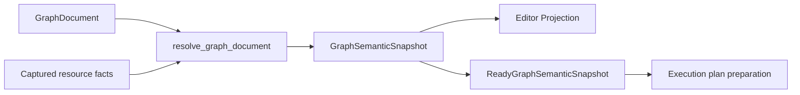

# Graph analysis

> Status: Current
> Scope: 语义快照、类型与 Schema、端口、常量和配置解析
> Canonical owners: 本 crate、Graph Document 与 Editor 的源码拥有相应类型和解析事实
> Update when: 本模块的公开入口、状态归属、生命周期或契约改变时

时间序列分类中的 `yssbi.statistics.plot.time_series` 与
`yssbi.statistics.plot.correlogram` 分别解析为 Line / Correlogram 图形结果。
它们优先于统计节点的通用结构化报告分类，继续使用既有绘图结果契约。
质量控制图的 `result` 同样解析为 Line，`summary` 为结构化统计报告，
`observations` 为普通关系结果；三个输出的分类互不混用。
直方图、经验累积分布图和箱线图节点的 `result` 分别分类为 Histogram、Ecdf、Boxplot。

## Semantic resolution

`project_parameter_form` 与已创建节点共用参数有效值、默认值、条件显隐和上下文投影，
创建前以空输入上下文提供基础编辑器；它不生成节点或可执行快照。连接后候选列仍由图解析提供。

`nodes_ready` 对 Execution 选出的节点范围检查已有语义事实；`resources_for_nodes` 沿同一快照中可达函数
收集实际资源身份。依赖环只使环及其依赖节点保持未解析，独立分支继续解析并复用缓存；图级循环诊断
通过 related locations 标明受影响节点。连接诊断同时携带端点，输入不匹配阻断消费者，不阻断其生产者的独立执行。
`diagnostics_for_nodes` 与 `nodes_ready` 共用这些定位规则，供局部校验分页消费；分页不会改变 readiness。

`lib.rs` 汇总公开入口，内部职责如下：

| 模块                                        | 职责                                                                             |
| ------------------------------------------- | -------------------------------------------------------------------------------- |
| `semantic_snapshot`                         | 节点、端口、参数、函数与诊断事实，以及快照的 ready 判定；字段由快照自身封装      |
| `analysis`                                  | 将共享快照与 registry、kernel 及语义输入身份绑定                                |
| `resolution`                                | 编排 Schema、节点、类型、输入绑定、语义及函数校验，最后一次组装完整快照          |
| `node_projection`                           | 由 protocol 和文档构造节点；`interface` 子模块组装 declared、bound、derived 端口 |
| `parameter_projection` / `port_projection`  | 参数有效值、校验与编辑事实；单个端口、可新增实例与 orphan 投影                   |
| `document_index`                            | 本次解析借用的 binding、输入连线和连接计数索引，以及唯一的节点拓扑顺序           |
| `schema_resolution` / `function_validation` | Schema 求解与输出缓存；函数 ABI 校验                                             |
| `function_arguments` / `function_structure` | 调用局部的参数绑定；结构调度事实及函数成员地址，不依赖显示标签                   |
| `type_resolution`                           | 编排输入解析、缓存复用、输出求解和节点事实安装                                   |
| `type_resolution/domains` / `node_rules`    | 类型域与泛型规则；节点声明规则、数值形状和 coercion                              |
| `type_resolution/cache`                     | 可丢弃的类型/coercion 缓存与语义指纹                                             |

完成状态统一从最终阻断诊断推导；内部解析故障仍优先于普通 incomplete。
分析依据由 [Graph Analysis Contract](../yss-graph-analysis-contract/README.md) 定义。
实际资源与缺失读取只保存在快照的依赖记录中；分析环境及 Editor 投影只保留环境与语义身份。
GroupApply/GroupTransform 通过 Registry 的函数调用角色参与资源闭包及循环检查。
Analysis 校验目标签名恰为一个 DataFrame 参数并返回 DataFrame，发布结构化 `GroupMap` 调度事实；
输出 Schema 在求值前为 Deferred，后续 Observed 列继续属于同一快照，不从第一组提前推断组合结构。
节点参数先按协议默认值和条件显隐投影当前有效集合，资源引用与 Schema 参数校验共用该集合；
默认资源的缺失读取也记录为依赖，恢复后重新校验。Schema 编辑配置与校验共用已有有效字面量，
显式值按借用读取，协议默认值使用 Protocol 的 JSON 转换。原始文档仍独立接受协议校验，
未知字段和不适用的显式值保留诊断，不因参数未投影而被忽略，也不将默认值写回文档。
列列表及筛选编辑事实使用 `schema_known` 区分未知候选和已知空集合，`context_hint` 说明未连接、
上游待定、Deferred 或结构错误；这些提示不代替图诊断。输入来源仍按参数选择，例如左右连接键
分别读取左右输入。投影保留参数意图，连接或结构变化只更新候选和诊断，不写回或清除文档参数。
派生端口每个模板只建立一次已绑定 origin 索引，随后检查未使用成员；该索引仅借用本次解析输入，
不形成持久状态或第二份端口事实。公开 resolve 和 snapshot 类型仍从 crate 根导出。
判断消失的派生端口是否仍被引用时，复用本次连接计数及文档 literal，不逐端口扫描整张图的连接。

`referenced_constant(document, node, protocol)` 按 ConstantOutput 声明及 Protocol 的有效文本规则
借用当前常量；节点事实、表格 Schema、组装列含义及 Editor 无快照连接预检共用此读取。
适用的默认引用不写回文档，隐藏引用不参与当前语义，错误显式值不回退。类型求解优先消费已投影的常量类型；
没有常量事实时，再按当前有效参数区分缺少选择与资源缺失。缓存仍以协议、文档参数和实际常量内容为依据。
复制时保留隐藏的显式引用属于 Document Edit 的存储转换规则，不用于当前语义读取。

`direct_function_dependencies(document, registry)` 按冻结注册表的 Call 角色读取适用的函数引用，
只返回合法函数路径并保持文档顺序；Application 的正文捕获与本模块的调用图校验共用该识别规则。
ABI 的 Entry/Return 选择与 owner 校验同样读取注册角色，扩展节点不依赖内置类型 ID。
ABI 的成员匹配以当前已解析的非 orphan 端口为准，按 binding origin 保留完整实例地址；
成员恢复后，文档中的旧 `Orphan` binding 与 `Resolved` binding 一样参与匹配，
仍缺失的成员继续阻断。解析不改写 binding，成员类型继续按当前签名校验。
派生端口仍按 resolver 选择成员，使用 Registry 提供的 resolver ID、角色映射及引用字段约定，
复用 Protocol 的默认值/显隐读取；叶节点也可独立消费这些 resolver。
传递依赖遍历、缺失处理及循环诊断仍由各自流程负责，
函数正文读取和资源身份重验保留在 Application/Project，不进入 Analysis。

函数事实使用 `Unbound / AwaitingSchema / Ready / Invalid` 区分合法但未绑定的定义、已绑定但仍需动态列、
就绪调用和错误。定义中依赖形参的未知 Schema 可保留；缺少连线、非法参数、已知缺列、缺失资源及循环仍阻断。
`specialize_function` 按签名 ID 与 ABI 地址绑定实参类型和 Schema，复用原解析器及缓存；
实参和运行观测只属于这次调用，不改写定义，也不复用其他调用的中间值。

`GraphNodeSpecialization` 明确区分叶内核、FunctionCall、Entry 和 Return。叶内核能力检查覆盖可达函数正文，
结构节点不使用伪造的 KernelId。Call 的表格输出是 Deferred，实际执行后可成为 Observed；
`function_output_addresses` 复用派生成员身份，包含已绑定与未 claim 的结果地址，供运行列反馈使用。

`ConcreteGraphInterface` 是 snapshot 内端口事实的借用视图，不存第二份端口表。类型使用 `Exact / Constrained / Unknown / Conflict`；`TypeExpr` 只描述声明 pattern。Add、Reroute 和七个 To 节点分别使用 NumericFold、Identity、ShapePreservingConversion 规则，coercion 和 kernel specialization 与类型结果一起交付。

Pin 创建目录和连接提交共用本模块的类型兼容规则：输出读取 snapshot 的已解析类型域，输入读取可接受类型域，候选节点的声明类型通过同一类型类展开与可赋值规则比较。类型域没有交集时拒绝；未解析的泛型仍允许连接，但不会绕过已知的容器形状或类型约束。Editor 在创建并连接、直接连线和迁移连线时重新校验，创建节点及连线属于同一原子补丁。

Schema 按 data DAG 顺序求解并保留 lineage，cycle 在递归解析前识别。`GraphSchemaState` 区分 NotApplicable、Deferred（消费关系时才确定字段）、Exact（含空字段集合）、Pending、Unavailable、Conflict 和 InternalFailure。Reroute 可传递上游 Schema。Schema 和类型仍是同一次 Resolve 内的阶段，最终组装完整节点事实并发布完整 snapshot。

`resolve_graph_semantics_with_observations` 接受由调用方按图、会话及生成依据核对的结果列观测。
只有 Deferred 输出可成为 `Observed`；声明已知的 Schema 和结构错误不被运行结果覆盖。
下游输入消费其精确字段，列身份优先沿用明确的上游 lineage。生产者自身的执行指纹仍使用 Deferred
声明，避免结果反馈立即使自己失效；消费者继续将输入字段纳入指纹。无观测的解析不会从缓存复活旧列。

每次解析由 `DocumentIndex` 计算一次节点拓扑，Schema、类型和循环诊断共同读取该结果。
仅两端节点都存在的连接参与节点依赖；缺失节点的连接仍保留在输入索引和语义校验中，产生阻断的
`PortUnknown`，不会误报循环或将无关分支的 Schema 置为循环冲突。正常文档入口继续由
Graph Document Edit 拒绝缺失端点；Analysis 的直接调用也不能将此类文档解析为 Ready。
拓扑仅在本次解析内存活，`GraphSemanticSnapshot` 仍是唯一语义事实源。

类型域和节点规则服务正向求解；缓存模块仅保存已有 `GraphSemanticCache` 的
可丢弃结果及其身份，不维护另一份图或类型状态。公开缓存类型与连接兼容入口继续从 crate 根导出。

Schema 输出缓存校验 registry、节点参数、常量内容、输入地址与上游 Schema 状态，以及该输出实际读取的资源依赖。上游编辑没有改变 Schema 时，下游可复用已有求解结果。缓存命中也记录所依赖的资源和 absent lookup，避免资源恢复后继续复用缺失状态；cycle 清空该图的 Schema 缓存，删除节点时清除其输出。类型/coercion 缓存继续使用最新 Schema 作为输入。增量结果、诊断和依赖记录须与 full resolve 一致；缓存未命中时仍遍历图、校验输入并组装完整 snapshot，不代表整个流程只访问受影响节点。

输入指纹同时包含标量/数列的列名称、语义类型、lineage 或解析问题；输出没有表 Schema 时，
改变转换目标仍会使合表、设列、频数等消费者重新求解。列事实复用本次解析的连接索引，并在原
Schema resolver 内按源端口复用成功或失败结果；该临时表随请求释放，不成为第二份持久语义状态。
Schema 与类型求解共用 `parameter_projection` 的转换目标读取；固定目标直接读取声明，参数目标按显式值优先于协议默认值解析。
值标签节点未显式设置目标时，列语义与其默认分类类型保持一致。
数据库来源、选列/排除列、重命名、合表与聚合的 Schema 求解也读取协议中的有效参数；ColumnOutput
的列事实和精确类型使用同一文本读取。按 key 读取前由 Protocol 判断参数是否适用，非法显式值不回退为默认值。
JSON 读取借用已有显式值，仅在缺失时转换协议默认值；变换求解的临时参数表借用 key 和显式 JSON，
并排除不适用字段。合表方式和右表后缀等默认值只由 Catalog 声明，不在求解器重复保存。

七个 To 节点通过 `ConversionTarget::Fixed` 声明目标，值标签节点通过 `ConversionTarget::Parameter`
读取分类或顺序参数。Schema 先沿数据依赖解析列语义，再构造端口并正向求解类型；两阶段使用同一目标事实。
下游连接只校验兼容性，不改变转换目标。无需自动目标的反向约束或收敛循环，已有 Schema 与类型缓存仍按当前输入复用。

编辑器仅在操作引用端口、需要校验或 claim 派生端口时请求前置 Resolve。移动、普通节点创建、参数设置等操作直接准备文档补丁；批次在最终文档上统一解析并生成投影，批次内部的连接操作仍读取其前序操作之后的端口事实。函数正文也延后到需要解析时捕获。图活动、历史与显式保存仍由原有事务提交。

每次解析使用借用文档的节点 binding、连线计数和有序输入索引，投影使用节点语义与诊断索引，避免逐节点或逐端口扫描整张图。局部索引随请求释放，不形成第二套图状态。

Schema 输入读取和输出指纹同样借用本次解析的连接与节点 binding 索引，不另存端点地址表。
节点输入依赖保留文档连接顺序及全部指纹字段；单端口连接仍按 order/ID 排序，动态组合输入仍按 binding 顺序求解。
组合、聚合和变换求解借用只读节点、协议和来源地址，不为递归读取复制这些事实。
类型求解在安装节点结果之前只借用既有端口事实，避免为只读求解复制端口、Schema 和编辑配置；缓存身份和最终安装边界保持不变。
类型缓存命中时直接借用缓存字段，将新结果需要持有的类型与 coercion 复制到目标容器；输入约束读取借用上游类型，未解析端口直接生成诊断，不建立中间缓存副本或地址列表。

三类端口的生命周期：

- Declared：protocol 定义的固定地址，不新增 document binding。
- User-created：instance ID/order 持久化；后端 placement 负责 append、before、after、move，member group 共用 ID/order。
- Derived：未使用成员只投影；首次连接或设置 literal 时与 mutation 原子 claim。被引用成员消失时显示 orphan；未引用的消失成员不再投影。显式编辑清理无引用的旧 derived bindings，解析与运行准备不改写 document。

变量输入直接使用 Protocol 的 `x` / `y` key 与 `X` / `Y` 标题。
`node_projection/interface` 在具体端口排序后，为用户创建的变量输入生成下标并写入既有 `instance_label`。
新增、删除和移动端口只更新显示编号，不重建实例身份或重绑连接；固定输入直接展示标题。

Decompose 的列含义读取与端口投影共用 binding origin。成员恢复后，旧 `Orphan` binding 的下游
Schema 也按当前输入字段与 lineage 恢复，并跟随字段类型变化；不以旧标签或 last-known 类型替代当前事实。

未知但被文档引用的端口以有 canonical address 的 orphan fact 展示，便于定位和断开损坏连接。Template 只表示新增能力。普通连接错误保留在 canonical Problems 中；只有附有阻断连接诊断的错误方向连接才可通过 frontend projection 验证。

引用补全按节点收集新增端口，保持首次引用顺序，再一次追加到该节点原有端口事实；不为每个缺失引用复制完整端口表。
端口去重与已有端口诊断索引仅用于本次补全，连接计数继续读取本次文档索引，最终端口和诊断仍统一归入语义快照。

Analysis Graph 只含数据依赖。Print、Control/Effect 等副作用属于 Workflow。

统计节点的 `result` 输出统一支持数值与 JSON 报告。线性 Summary 的类别保留原生分页/分析查询身份，其余统计 `result` 使用通用结构化报告类别；不再按统计方法分派专用报告页面。Fit 的 `model`、`fitted`、`residuals` 仍是普通数据，KDE 等绘图输出使用各自图形契约。

生存模型的 `predictions` 由 Catalog 的 `SchemaExpr::Fixed` 声明 Numeric
列 `time`、`event`、`risk`，Graph 按通用规则解析，不读取拟合数据。列线图结果分类为 `Nomogram`，生存校准与
决策曲线复用 `Line`；静态 Cox 模型仍可作为结构化报告读取。

残差/Cook 的 `observations` 同样消费 Catalog 声明的固定 Numeric 列
`observation`、`fitted`、`residual`、`weighted_residual`、`leverage`、
`standardized_residual`、`studentized_residual`、`cooks_distance`，编辑时不读取模型观测。
摘要 `result` 沿用通用结构化报告；观测表可分页并连接选列等数据处理节点。
Graph 不再注册或维护这两组固定表的专用 resolver；字段顺序与 Numeric 语义由声明交付给执行计划。

多元分析的得分/坐标表由 `schema_resolution::generated_tables` 消费 `components` 的有效参数，推导 Numeric 的 `axis1`…`axisK`；CCA 推导同表的 `x_axis1`…与 `y_axis1`…。
试验设计用同一生成器按 `factors` 推导 `run`、`factor1`…列；不保留固定 16 维限制，分配失败和整数溢出返回参数诊断。
Schema 依赖参数并参与既有缓存失效，维数编辑同步更新下游选列选项；编辑时不读取观测或拟合模型。判别预测的类别元素类型通过已有泛型端口从训练标签解析。

内置节点的每个数据输出端口允许连接多个下游输入，包括 Decompose 列端口和函数派生输出。
新增分支保留已有连线；输入端口仍遵循自身容量，替换单连接输入时只移除该输入的旧连线。
连接数量与动态端口数量是独立约束，同一个输出值由多个消费者共享。

命名常量由 `GraphDocument.constants` 持有，使用稳定 `ConstantId`。Event 和 Function 的 Details 面板编辑名称、类型和值；增删改通过 `SetConstant` 和同一 当前图文档 FIFO、undo/redo、Save 路径处理，没有独立的变量 Store、revision、作用域或项目资源文件。名称在所属图内唯一，重命名不会改变引用身份。

前端常量、端口和协议默认值共用 `SerializedDataValue` 及严格校验器；编辑字段是临时输入状态。常量编辑不依赖 IPC 编码器，也不维护另一份已提交数据。

表格常量保存 `tabular` 快照，`dataValue` 为 Null，不再保存由常量 ID 派生的资源句柄。编辑时提交的 JSON 文本由 Graph 原子解析、按外层 `ValueType` 校验；序列不另存元素类型、dummy 或 time-series 状态。

图内自定义常量通过 `yssbi.constant.get` 访问，其 `constant` 参数引用当前图内的常量。Details 面板可直接插入引用节点，也可在 Get 节点的参数中选择常量。尚未选择或已删除的引用可保留在草稿中，编辑解析会报告阻断诊断。单次使用的输入值仍可通过端口 literal 编辑。
固定数学常量 `yssbi.constant.pi` 和 `yssbi.constant.e` 同样位于常量目录，无输入和参数，输出 Numeric 标量。Kernel 从 Rust 标准库读取对应 Float64 常量，不创建或引用 GraphConstant；类型推导、缓存及下游广播使用现有固定节点契约。

常量类型和值由 Graph Document 校验；DataFrame/DataSeries 将列数据持久化为常量内的 `TabularSnapshot`，句柄由 ConstantId 派生。Graph Analysis 解析输出类型及表格列 Schema；Execution 的计划准备捕获不可变值，将数列转换为值列表、数据帧转换为列记录，运行过程不读取可变项目变量。常量内容参与语义 fingerprint，名称、说明和标签不使计划缓存失效。

节点投影持有已解析常量的共享事实；后续类型规则借用该事实的类型，不再次解析引用 ID 或读取文档常量表。
缺失选择与引用失效仍保留原有不同类型状态；计划准备继续消费同一节点常量事实。

Clipboard 仅携带选中 Get 节点引用的常量。目标图已有同一身份且内容相同的常量时复用；身份或名称冲突时复制定义并重写引用。常量和节点进入同一个可撤销补丁。复制整张图则生成独立常量身份。

节点参数使用文档中显式保存的值，未填写时使用 protocol 定义的默认值。Graph Analysis 计算参数有效值，Editor Projection 直接消费该语义事实，不再用文档原值二次覆盖；参数编辑从当前图文档合并改动，保留未展示参数，也不把其他参数的显示默认值写回文档。计算参数与缺失值策略由具体算法契约和输入校验拥有。

节点通过 `Parameters → ParameterGroup → Parameter` 声明 Detail 参数表单。参数值按节点内唯一 key 扁平保存；分组仅组织展示。`visible_when` 可以引用同节点任意组的无条件参数，判断时使用显式值或默认值。Rust 只向编辑器和执行计划投影当前适用的参数；编辑器投影以 `parameterGroups` 交付有序分组，空组和隐藏字段不显示。React 按声明顺序将每个参数展示为默认展开的一级区块，保留分组说明，不再显示外层分组标题；每个参数独立折叠。

`SetParameters { node_id, parameters }` 在当前文档上原子合并部分字段，null 清除显式值，随后清理不适用的条件字段并验证整个候选参数集。默认值来自声明，在投影和执行时求值，不为显示或修改其他参数而写入文档。一次跨组修改仍只有一个可逆补丁，支持现有撤销、重做和 Save 路径。GUI 与 Harness 共用该行为，不自行合并参数。导入文档中的未知字段、失效条件字段或非法值产生诊断，验证不暗中改写文档。

静态节点参数在 Detail 参数组中编辑，数据依赖通过 Canvas 引脚连接。分布采样节点提供“分布参数”和“采样设置”两组；整数范围的起点、终点和步长、相关图的最大滞后阶数均为节点参数。统计估计和报告参数归各自 Fit/Summary 节点所有，Y、X、权重等数据通过连线输入。

数据帧的列投影、筛选谓词和列选择控件从 semantic snapshot 获取当前输入 Schema 的列、兼容操作符和字面量类型，输入变化时刷新，断开输入后停止提供过期列。没有封闭选项集的字符串参数使用文本编辑。配置能力不自动提供执行 kernel；是否已安装由当前会话的冻结 KernelRegistry 决定，缺少实现时仍阻断执行。

数据描述节点 `yssbi.statistics.describe` 的 `source` 同时接受数据帧和数据序列，输出为 `statistics.report` 并按结构化统计 Result 分类，不声明表格输出 Schema。数据描述节点无参数，Kernel 在执行时统计全部受支持列并要求至少存在一列；GroupBy 的数值聚合仅投影 Numeric，计数和分组键允许所有字段。空聚合选列表示不计算该指标。`schema.aggregate` 从当前参数与输入事实推导频数值列语义和分组输出字段；缺失列、错误语义及输出名冲突产生后端诊断。输出字段使用图派生身份，参数或上游变化参与同一 Schema 缓存失效；不读取数据行。

聚合和变换的输入、输出列名复用 Data Contract 的 `TabularColumnName` 校验；原始名称包括首尾空格，
不归一化后再匹配。空白名称、重复选择、缺失字段与输出名冲突仍在原解析阶段拒绝。

`schema.transform` 从字段及有效参数推导计算列、宽长表、时间重采样与指示变量的输出结构，并校验选择列、语义和输出名冲突。透视与指示变量的类别和列名在编辑阶段声明；不会扫描数据发现字段。Scalar/DataSeries 混合输入从两种形状绑定同一元素语义，条件选择保持数列输出，并支持继续组装或替换列。窗口的可选上下文列选择器只消费当前输入 Schema。

Fixed result schemas are declared by Catalog through `SchemaExpr::Fixed`.
Graph resolves their fields without reading data or owning a duplicate field
list; output identity is assigned through the existing schema pipeline. Meta
uses this for effect, fitted-study and omission tables. Forest and funnel
results map to the existing coefficient and scatter categories.

## 相关模块

[语义缓存](../yss-graph-runtime/README.md) · [共享数据契约](../yss-data-contract/README.md) · [应用编排](../yss-application/src/graph/README.md)
