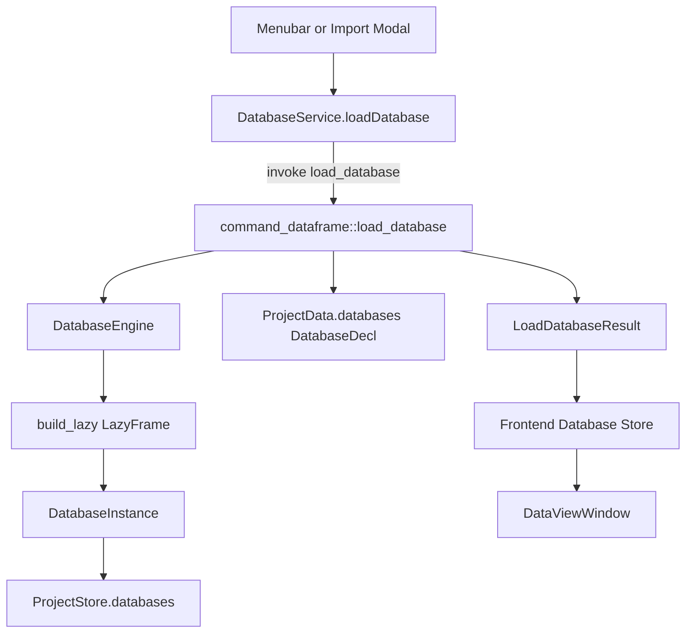
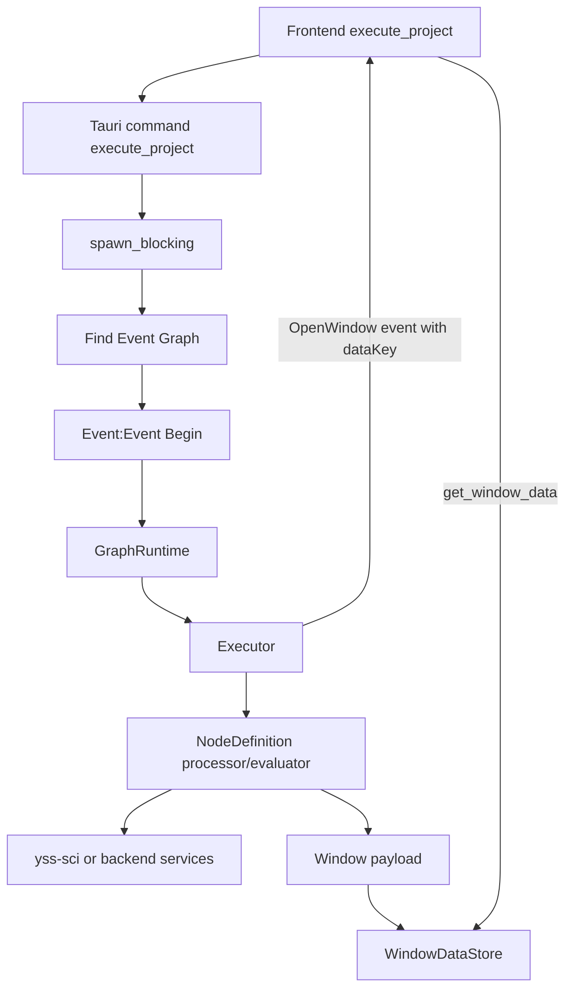

# YssBI 项目架构文档

本文档从整体到细节描述 YssBI 的当前架构：前端 React 桌面应用、Tauri/Rust 后端、图节点执行系统、数据集管理、统计计算库 `yss-sci`，以及它们之间的边界、数据流和扩展方式。

## 1. 项目定位

YssBI 是一个基于 Tauri 的桌面数据分析与可视化应用。它的核心产品形态不是传统表单式 BI，而是一个类似 IDE 的图编辑器：用户在画布上组合节点，导入数据集，执行统计、计量、时间序列、面板回归、绘图等分析流程，并通过独立窗口查看表格、图形、日志和模型结果。

从工程结构看，项目由三层组成：

- `src/`：React + TypeScript 前端，负责窗口、路由、画布交互、状态管理、UI 展示和 Tauri IPC 调用封装。
- `src-tauri/src/`：主 Rust/Tauri 后端，负责命令注册、项目持久化、数据库加载与编辑、图节点注册、图执行、日志和窗口数据暂存。
- `src-tauri/sci/`：独立 Rust workspace crate `yss-sci`，承载统计、计量、时间序列、面板模型、DataFrame 元数据和编辑辅助等数值/分析能力。

```mermaid
flowchart TD
  user[User] --> frontend["React Frontend (src)"]
  frontend -->|"invoke commands"| tauri["Tauri Backend (src-tauri/src)"]
  tauri --> project["Project State and Store"]
  tauri --> graph["Graph Runtime and Executor"]
  tauri --> database["Database Instances"]
  graph --> nodes["Node Registry and Node Definitions"]
  nodes --> sci["yss-sci Numerical Library"]
  database --> sci
  graph --> windows["WindowDataStore"]
  windows -->|"get_window_data"| frontend
  tauri -->|"events and Channel"| frontend
```

## 2. 技术栈

### 2.1 前端

- 构建工具：Vite 7。
- UI 框架：React 19、React DOM 19。
- 语言：TypeScript。
- 路由：`react-router` v7，根组件使用 `HashRouter`，适配 Tauri WebView 和多窗口 URL。
- 状态管理：Zustand，部分 store 使用 Immer。
- UI 组件：shadcn 风格组件位于 `src/components/ui/`，底层依赖 Radix、`class-variance-authority`、`tailwind-merge`。
- 样式：Tailwind CSS v4，主题变量由设置系统写入 CSS variables。
- 桌面能力：`@tauri-apps/api`、dialog、log、opener。
- 交互与渲染：`@dnd-kit/core`、`@tanstack/react-virtual`、D3、KaTeX、React Markdown。

### 2.2 后端

- 桌面框架：Tauri 2。
- Rust 主 crate：`yssbi`，lib 名称为 `yssbi_lib`。
- Workspace：`src-tauri` 下包含主 crate 和 `sci` crate。
- 数据处理：Polars、ndarray、faer、statrs。
- 数据源：CSV、Parquet、Excel、SQLite、PostgreSQL、MySQL。
- 并发与状态：`Arc`、`RwLock`、`Mutex`，执行流程通过 `spawn_blocking` 和 Tauri `Channel` 推送进度。

### 2.3 数值计算库

`src-tauri/sci` 是独立 package `yss-sci`，Rust edition 2024。主后端通过 path dependency 引用它。它不直接处理 Tauri IPC，而是作为纯 Rust 分析库被命令层和图节点调用。

## 3. 顶层目录职责

```text
YssBI/
├─ src/                         # React 前端
│  ├─ app/                      # 应用入口、根路由、全局 Provider、全局 UI Host
│  ├─ views/                    # 主要窗口和界面视图
│  ├─ features/                 # 业务状态、应用 hooks、领域辅助
│  ├─ services/                 # Tauri invoke 服务封装
│  ├─ shared/                   # 跨视图共享 UI、types、utils
│  └─ components/ui/            # shadcn 风格 UI primitives
├─ src-tauri/
│  ├─ src/                      # Tauri 主后端
│  │  ├─ commands/              # #[tauri::command] IPC 命令
│  │  ├─ project/               # 项目文档、运行时 store、项目执行入口
│  │  ├─ graph/                 # 图模型、节点、pin、registry、类型推断
│  │  ├─ execution/             # 执行器、执行栈、事件、窗口数据
│  │  ├─ database/              # 数据源 engine、DatabaseInstance、读写编辑
│  │  ├─ schema/                # 前后端 DTO/schema
│  │  ├─ variable/              # 变量系统
│  │  ├─ editor/                # 设置持久化
│  │  └─ log/                   # 日志管理
│  └─ sci/                      # yss-sci 统计计算库
└─ docs/                        # 架构、分析和需求文档
```

## 4. 前端架构

### 4.1 启动入口

前端启动链路如下：

```text
index.html
  → src/app/main.tsx
  → src/app/App.tsx
  → SettingsEffectsProvider
  → HashRouter
  → AppRouter
  → UIHost
```

`src/app/App.tsx` 是根组件。它做三件事：

- 提前导入 `@/utils/appLogger`，让前端日志拦截和转发尽早生效。
- 使用 `SettingsEffectsProvider` 应用主题、字体、窗口相关设置。
- 使用 `HashRouter` 挂载多窗口路由，并在路由外挂载 `UIHost`。

### 4.2 路由与窗口

当前前端是一个多窗口桌面应用，但所有窗口仍由同一套 React bundle 承载。窗口类型通过 hash route 区分：

- `/plot`：`src/views/PlotView/PlotWindow.tsx`
- `/dataview`：`src/views/DataView/DataViewWindow.tsx`
- `/logs`：`src/views/LogView/LogWindow.tsx`
- `/info`：`src/views/InfoView/InfoWindow.tsx`
- `*`：`src/views/EditorView/EditorWindow.tsx`，即主编辑器窗口

这些 route 组件使用 React lazy import 加载。图形、结果和数据表窗口通常还会从 URL hash 中读取 `dataKey`、窗口类型或参数，再通过后端 `get_window_data` 拉取执行器暂存的数据。

### 4.3 主编辑器布局

主窗口由 `EditorWindow` 承载，结构近似：

```text
EditorWindow
├─ Menubar
└─ horizontal shell
   ├─ ActivityBar
   └─ Workspace
      └─ LayoutNodeRenderer
         ├─ GraphEditor
         ├─ SettingsView
         ├─ Sidebar
         ├─ Detail
         └─ LogPanel
```

布局树由 `src/features/core/layout/layoutStore.ts` 管理，使用 Zustand + Immer 表示 VS Code 风格的区域树。`viewRegistry.tsx` 将字符串 view id 映射到实际 React 组件，使布局节点和渲染组件解耦。

`Workspace` 负责布局渲染、拖拽上下文和视图渲染。图编辑器、侧边栏、详情面板和日志面板都作为布局节点出现，而不是通过页面级条件渲染硬切换。

### 4.4 前端分层

前端有明确的目标分层：

```text
views → features/application → features/domain
                             → services
                             → features/core
components/ui and shared/ui → reusable UI
```

实际代码中：

- `views/`：窗口和主要界面，例如 `EditorView`、`DataView`、`PlotView`、`InfoView`、`LogView`。它们主要组合 hooks、store 和 UI。
- `features/application/`：应用用例 hooks，例如初始化、编辑器操作、菜单、数据视图编辑、数据管理。
- `features/core/`：Zustand stores、同步系统、schema store、layout store、editor store、history store、selection/viewport store、UI store 等。
- `features/domain/`：目前较薄，主要放纯函数、节点命名、sidebar 常量等。
- `services/`：Tauri `invoke` 封装，是前端访问后端命令的主要边界。
- `components/ui/`：shadcn primitives。
- `shared/ui/`：应用级共享组件，例如 `OverlayScrollbar`、Toast、Modal、SQL/导入相关 modal。

### 4.5 状态管理

前端状态主要由 Zustand store 承载：

- 项目/数据：`features/core/dataStore/`
- 布局：`features/core/layout/layoutStore.ts`
- 编辑器：`features/core/editor/`
- Schema / Node Registry：`features/core/schema`、`features/core/nodeRegister`
- 历史：`features/core/history`
- UI Modal / Toast：`features/core/ui/UIStore.ts`
- 视口、选择、手势、侧边栏、日志、执行状态等：分别由多个 core store 管理

项目初始化由 `useAppInitialization` 驱动：先等待 schema store 从后端同步节点定义，再调用 `initProjectSync` 同步项目数据。

### 4.6 前端 IPC 边界

普通后端调用通过 `src/services/**` 封装，例如：

- `services/project/projectService.ts`
- `services/database/databaseService.ts`
- `services/graph/**`
- `services/settings/**`
- `services/stats/**`
- `services/log/**`

例如 `DatabaseService` 将 `load_database`、`get_database_rows`、`edit_cell`、`export_database` 等命令包装为 TypeScript 方法。前端视图一般应通过 service 或 application hook 调用后端，而不是到处直接 `invoke`。

但也存在合理例外：窗口生命周期、窗口打开/关闭、当前窗口控制等 Tauri shell API 会在部分 view 或 layout 组件中直接使用。

### 4.7 前端事件同步

后端通过 Tauri event 推送低频项目事件。前端 `features/core/sync` 里的 `ProjectListener` 监听 `project-event`，再通过 `EventRegistry` 派发给对应 handler，最终写入 Zustand stores。

执行进度不是普通 event，而是 `execute_project` 命令传入 Tauri `Channel<ExecutionEvent>`，后端执行器通过 channel 推送 `ExecutionStart`、`NodeStart`、`NodeComplete`、`NodeError`、`OpenWindow`、`ExecutionComplete` 等事件。

## 5. Tauri 后端架构

### 5.1 启动入口

后端入口：

```text
src-tauri/src/main.rs
  → yssbi_lib::run()
  → src-tauri/src/lib.rs
  → tauri::Builder
```

`lib.rs` 负责：

- 注册 Tauri plugins：log、fs、dialog、opener。
- 注册全局 managed state：`ProjectState`、`WindowDataStore`。
- 初始化日志管理器。
- 通过 `tauri::generate_handler!` 集中注册所有命令。

命令注册列表是后端 IPC 的事实目录。新增命令时必须在 `commands/` 下实现并在 `lib.rs` 中注册。

### 5.2 后端模块职责

```text
src-tauri/src/
├─ commands/       # Tauri command 层，负责 IPC 参数/返回值
├─ project/        # 项目文档、项目状态、项目 store、执行入口
├─ database/       # 数据源 engine、lazy/load 状态、DataFrame 编辑
├─ graph/          # 图、节点、pin、连接、registry、类型推断
├─ execution/      # GraphRuntime、Executor、ExecutionEvent、WindowDataStore
├─ schema/         # 前后端 DTO/schema
├─ variable/       # 变量模型和作用域
├─ editor/         # 设置文件读写
├─ log/            # 前后端日志收集与文件输出
├─ event/          # project-event 推送
├─ ast/            # 表达式 lexer/parser/validator
└─ frontend/       # 面向前端的数据结构或辅助
```

### 5.3 ProjectState：文档状态与运行时状态

`ProjectState` 是后端最重要的全局状态：

```text
ProjectState
├─ project_data: Arc<RwLock<ProjectData>>
├─ project_path: Arc<RwLock<Option<String>>>
└─ project_store: Arc<RwLock<ProjectStore>>
```

其中：

- `ProjectData` 是可序列化项目文档，包含变量、图、数据库声明、元数据等。
- `project_path` 是当前项目 JSON 文件路径。
- `ProjectStore` 是运行时 store，包含 materialized database instances 和 node registry，不直接作为项目 JSON 保存。

`ProjectState::set_data` 是加载项目后的关键恢复入口。它会：

1. 写入新的 `ProjectData`。
2. 根据 `ProjectData.databases` 中的 `DatabaseDecl` 重建 `ProjectStore.databases`。
3. 为每个 graph 重新绑定 `NodeRegistry`。
4. 为每个 graph 设置 schema provider，并传播 schema / dynamic pins。

这一点很重要：`GraphInstance` 中的 registry 和 schema provider 是运行时对象，不能依赖 serde 自动恢复。

### 5.4 项目持久化

项目保存的是 `ProjectData` 的 JSON pretty 格式。文件型数据源在项目 JSON 中保存的是 `DatabaseDecl` 和 `DatabaseEngine`，例如 CSV/Parquet/Excel/SQL 的路径或连接信息。

运行时 DataFrame 由 `ProjectStore` 中的 `DatabaseInstance` 承载。加载项目时会从声明重建 lazy 数据源。数据编辑通过 `DatabaseInstance` 的 edit history 作用于内存中的 loaded DataFrame；是否持久化到源文件取决于后续显式 export 或项目保存策略。

## 6. 数据库与 DataFrame 架构

### 6.1 数据源模型

后端 `DatabaseEngine` 支持：

- `Csv`
- `Parquet`
- `Excel`
- `Sql`，包含 SQLite / PostgreSQL / MySQL 等子 engine
- `InMemory`

每个 engine 提供 `build_lazy()`，尽量转换为 Polars `LazyFrame`。SQL 和 Excel 会先读成 DataFrame，再转 lazy。

### 6.2 DatabaseInstance 生命周期

```text
DatabaseDecl + DatabaseEngine
  → build_lazy()
  → DatabaseInstance { state: Lazy }
  → Preview access: lazy.limit(100).collect()
  → Execution access: ensure_loaded()
  → Loaded { dataframe, original, history }
```

`DatabaseInstance` 有两种主要访问模式：

- `Preview`：只取前 100 行，适合元数据/预览。
- `Execution`：调用 `ensure_loaded()` 完整 collect，用于图执行和编辑。

编辑操作包括 cell、row、column、cast、rename、undo、redo、reset、export 等。编辑逻辑大量复用 `yss-sci::database` 中的 `EditOperation`、`apply_operation`、`reverse_operation`、JSON/Polars 类型转换辅助。

### 6.3 前端数据服务

前端 `DatabaseService` 对应后端命令：

- 加载：`load_database`
- 元信息：`get_database_meta`
- 数据页：`get_database_rows`
- 统计：`get_column_stats`、`get_column_distribution`、`get_dataset_overview`
- 编辑：`edit_cell`、`add_row`、`delete_rows`、`add_column`、`delete_column`、`cast_column`、`rename_column`
- 历史：`undo_edit`、`redo_edit`、`get_edit_state`
- 输出：`export_database`

## 7. 图节点系统

### 7.1 核心概念

图系统是 YssBI 的核心抽象：

- `GraphInstance`：一个事件图、函数图或宏图。
- `GraphDataState`：节点、连接、pin、画布等图数据。
- `NodeInstance`：图中的一个节点实例，保存位置、参数、pin 状态等。
- `NodeDefinition`：节点类型定义，包含输入输出 pin、执行函数、数据求值函数、动态 pin resolver 等。
- `NodeRegistry`：所有可用节点类型的注册表。
- `Pin` / `Connection`：图中的数据流和控制流连接。
- `GraphRuntime`：执行期图状态，引用项目数据与项目 store。

### 7.2 节点注册

内置节点统一在 `graph/register/catalog/mod.rs` 注册：

```text
register_builtin_nodes
├─ math
├─ control
├─ debug
├─ logic
├─ value
├─ dataframe
├─ event
├─ plot
└─ distribution
```

其中 `dataframe` 是统计与数据分析节点的主要集中区域，例如 OLS/WLS/GLS、IV、Prais、VAR/VEC、面板模型、时间序列对齐、绘图数据准备等。

### 7.3 节点定义与序列化边界

`NodeDefinition` 中的执行器是 Rust 函数闭包，例如 `FlowProcessor`、`DataEvaluator`，不能序列化。因此：

- 项目 JSON 保存节点实例和 `node_type`。
- 运行时通过 `NodeRegistry` 找回完整 `NodeDefinition`。
- 加载项目后必须恢复 graph registry。

这也是 `ProjectState::set_data` 必须调用 `restore_graph_registries()` 的原因。

### 7.4 类型推断与动态 Pin

后端 graph 模块包含 `infer` 子系统，用于 pin 数据类型推断和类型变量处理。部分节点会根据输入 schema 或参数动态解析 pin，例如 DataFrame 列选择、统计模型输入、可重复 pin 等。

Schema provider 来自 `ProjectState::build_schema_provider()`，它通过 `ProjectStore.databases` 读取 DataFrame schema，再供 graph 传播 schema 和解析 dynamic pins。

## 8. 图执行架构

### 8.1 执行入口

前端调用 `execute_project` 命令，后端进入：

```text
execute_project command
  → spawn_blocking
  → project_execution::execute_project_data
  → 找到 Event graph
  → 找到 Event:Event Begin 节点
  → GraphRuntime::new
  → Executor::start
```

如果指定了 target graph，则只执行目标图；否则遍历所有 `GraphKind::Event` 图。

### 8.2 Executor 职责

`Executor` 是唯一负责调度顺序的组件。它维护：

- `ExecutionStack`
- suspended frames
- `GraphRuntime`
- logs
- `EventEmitter`
- `WindowDataStore`

执行时它会：

1. 发出 `ExecutionStart`。
2. 将入口节点压入执行栈。
3. 对每个 frame 发出 `NodeStart`。
4. 执行上游纯数据节点。
5. 创建 `NodeExecutionContext`。
6. 调用节点的 `flow_processor` 或 `data_evaluator`。
7. 收集日志与窗口动作。
8. 发出 `NodeComplete`、`NodeError`、`OpenWindow` 等事件。
9. 根据 `ExecutionEffect` 决定后续 continuation。
10. 最后发出 `ExecutionComplete`。

### 8.3 数据节点与流程节点

执行器会在执行某个节点前递归执行其上游数据节点。这允许图同时表达：

- 控制流：事件开始、条件、循环、执行顺序。
- 数据流：DataFrame、Series、模型配置、统计计算输入输出。

没有 `flow_processor` 但有 `data_evaluator` 的节点被视为纯数据节点；它们可以被上游求值机制按需执行。

### 8.4 结果窗口数据

节点可以通过 `NodeExecutionContext` 产生 window action。执行器将 payload 写入 `WindowDataStore`，生成 `win_<uuid>` key，并通过 `OpenWindow` 事件通知前端。前端打开 `/plot`、`/info`、`/dataview` 等窗口后，再通过 `get_window_data` 按 key 拉取数据。

这避免了把大型图表或模型结果直接塞进 URL，也避免在 Tauri event 中传输过大的 payload。

## 9. `yss-sci` 计算库架构

### 9.1 定位

`yss-sci` 是主应用的数值计算和统计分析库。它不依赖 Tauri，不直接处理窗口、项目、命令或前端 DTO。主后端在节点和命令中调用它。

### 9.2 顶层模块

```text
src-tauri/sci/src/
├─ api.rs                  # 新增的稳定 API 门面
├─ regression/             # 回归、诊断、协方差、面板、离散模型
├─ ts/                     # 时间序列、VAR、VEC、单位根、ACF/PACF
├─ database/               # DataFrame 统计、分布、编辑操作、导出
├─ panel/                  # 面板数据对齐与差分工具
├─ tools/                  # ndarray/faer 桥接、矩阵 rank、标准化
├─ stats/                  # t test、wald test 等假设检验
├─ base/                   # LikelihoodModel trait
├─ diagnostics/            # 轻量残差诊断
├─ types/                  # doc(hidden)，当前为空
└─ data/                   # doc(hidden)，遗留/预留数据结构
```

### 9.3 Regression

`regression/` 包含：

- `linear_model/`：OLS、WLS、GLS、Prais、IV2SLS、IVLIML。
- `covariance.rs`：非稳健、HC、cluster、HAC、Newey 等协方差。
- `collinearity.rs`：共线列剔除。
- `panel/`：FE、FD、LSDV、RE BE/FGLS/MLE、time/twoway 变体。
- `diagnostics/`：Breusch-Pagan、White、IM-test、normality、weighted diagnostics、RESET、VIF、leverage。
- `discrete/`：Logit、Probit。

近期整理后，`regression/panel/re.rs` 已拆成：

```text
regression/panel/re/
├─ shared.rs
├─ be.rs
├─ fgls.rs
├─ mle.rs
├─ twoway.rs
└─ time.rs
```

`regression/diagnostics.rs` 则通过 include 分片维持原公开路径：

```text
regression/diagnostics/
├─ breusch_pagan.rs
├─ white.rs
├─ im_test.rs
├─ normality.rs
├─ weighted.rs
├─ reset.rs
├─ vif.rs
└─ leverage.rs
```

### 9.4 Time Series

`ts/` 包含：

- `align`、`lag`、`diff`、`pct_change`、`rolling`：基于 Polars Series/DataFrame 的时间序列变换。
- `acf_pacf`、`serial_correlation`：自相关、偏自相关、DW、Ljung-Box、Breusch-Godfrey。
- `unit_root`：ADF/DF 单位根检验。
- `var/`：VAR 配置、VARSOC、估计、诊断。
- `vec/`：VEC 配置、Johansen 估计、vecrank、LM/stability、协整方程统计。
- `vec_vecrank_cv.rs`：Johansen 临界值表。
- `distributions.rs`：内部正态/卡方分布 helper，避免在 VAR/VEC/unit_root 中到处直接 `unwrap()`。

近期整理后：

```text
ts/var/
├─ types.rs
├─ varsoc.rs
├─ stata.rs
└─ estimate.rs

ts/vec/
├─ types.rs
├─ stage.rs
├─ estimate.rs
├─ vecrank.rs
├─ stats.rs
└─ linalg.rs
```

### 9.5 Database Helpers

`yss-sci::database` 是主后端 database 模块的基础工具层：

- 列统计：`compute_column_stats`
- 列分布：`compute_column_distribution`
- 数据集概览：`compute_dataset_overview`
- 编辑历史：`EditHistory`、`EditOperation`、`EditState`
- 操作执行：`apply_operation`、`reverse_operation`
- JSON / Polars 类型转换
- 导出：`export_dataframe`

### 9.6 API 门面

`sci/src/api.rs` 新增了稳定 API 门面：

- `api::database`
- `api::regression`
- `api::time_series`
- `api::tools`

当前主应用仍大量使用旧路径，例如 `yss_sci::regression::panel`、`yss_sci::ts::var`。因此 `api` 目前是推荐的新入口，不是唯一入口。后续如果要进一步收窄公共 API，应逐步迁移主应用 import，再减少深层 re-export。

## 10. 日志系统

日志链路分为三类：

- Tauri plugin log：后端 `lib.rs` 中配置 stdout target 和格式。
- 前端日志：`appLogger` 拦截前端日志，通过 `frontend_log` 命令写入后端日志系统。
- 日志窗口：`LogWindow` 监听 `log-message` 事件，也可通过命令读取历史日志和日志文件路径。

日志管理位于 `src-tauri/src/log/`，设置了 debug/release 下不同的文件目录策略。

## 11. 设置系统

前端通过 settings store 管理主题、外观、窗口等设置。后端 `editor/settings` 负责将设置读写到 app config directory 下的 `settings.json`。

`SettingsEffectsProvider` 将设置同步到前端运行环境，例如 CSS variables、主题类名、字体等。

## 12. 测试结构

### 12.1 前端

当前 package scripts 只包含 Vite dev/build/preview/tauri，没有独立前端单测脚本。前端质量主要依赖 TypeScript 编译、运行时验证和手动交互测试。

### 12.2 主 Rust crate

主后端测试位于：

- `src-tauri/tests/database_test.rs`
- `src-tauri/tests/logic_test.rs`
- `src-tauri/tests/type_convert_test.rs`
- 部分模块内单测，例如 AST、execution stack、catalog 节点等。

常用验证：

```bash
cargo test -p yssbi --no-run
```

### 12.3 `yss-sci`

`sci` 测试位于：

- `src-tauri/sci/tests/regression_golden.rs`
- `src-tauri/sci/tests/ts_test.rs`
- `src-tauri/sci/tests/panel_fd_fe_test.rs`
- `src-tauri/sci/tests/panel_re_mle_diagnostic.rs`
- 多个模块内单测

常用验证：

```bash
cargo test -p yss-sci
```

## 13. 关键数据流

### 13.1 加载数据集



### 13.2 执行图并打开结果窗口



### 13.3 前后端 schema 同步

```text
App mount
  → useAppInitialization
  → useSchemaStore.syncFromBackend()
  → get_node_definitions / get_editor_schema_command
  → frontend node registry store
  → initProjectSync()
  → load project graphs/databases/variables
  → EditorWindow ready
```

## 14. 扩展指南

### 14.1 新增 Tauri 命令

推荐步骤：

1. 在业务模块中实现纯逻辑或小 API。
2. 在 `src-tauri/src/commands/` 中添加薄 command 包装。
3. 在 `src-tauri/src/lib.rs` 的 `generate_handler!` 注册。
4. 在 `src/services/` 中添加 TypeScript 调用封装。
5. 在 `features/application/` 中编排业务 hook。
6. `views/` 只组合 hook 和 UI，不直接散落复杂 `invoke`。

### 14.2 新增图节点

推荐步骤：

1. 在 `graph/register/catalog/<domain>/` 下定义节点。
2. 填写 `NodeDefinition`：分类、名称、pin、processor/evaluator、动态 pin 逻辑。
3. 在对应 `mod.rs` 的 `register` 中注册。
4. 如果节点产生窗口结果，使用 `NodeExecutionContext` 的 window action。
5. 如有前端结果窗口，在 `InfoView`、`PlotView` 或 `DataView` 中补展示组件。
6. 添加后端节点测试或 `sci` golden/smoke 测试。

### 14.3 新增统计模型

推荐边界：

1. 纯数值算法放 `src-tauri/sci`。
2. 图节点参数解析和 DTO 组装放 `src-tauri/src/graph/register/catalog/dataframe`。
3. 前端展示放 `src/views/InfoView`。
4. 前端触发和窗口数据读取走现有执行器窗口机制。

### 14.4 新增前端页面/窗口

项目规则要求多页面 UI 使用 React Router。推荐步骤：

1. 在 `src/views/<FeatureView>/` 创建窗口或页面组件。
2. 在 `src/app/App.tsx` 增加 route。
3. 如需独立 Tauri window，通过 window service 或 Tauri WebviewWindow 打开对应 hash route。
4. 普通业务提示使用统一 Toast，不使用原生 `alert/confirm/prompt`。
5. 用户可滚动纵向区域使用 `OverlayScrollbar`。

## 15. 已知架构风险

### 15.1 前端状态与事件复杂度

`docs/ARCHITECTURE_ISSUES.md` 已详细记录多个问题：

- Zustand store 不带 selector 会导致过度重渲染。
- 全局事件监听器较多，捕获阶段监听器可能影响 React 事件链。
- `useEditorGroup` 链路较重，非 Canvas 组件可能被迫实例化 Canvas 交互逻辑。
- DnD context 存在嵌套和潜在冲突。
- store 粒度不统一，存在全局变量/手动 Map 等绕开 React 数据流的状态。

这些问题不一定阻塞功能，但会影响复杂交互的稳定性和调试成本。

### 15.2 后端锁与运行时恢复

后端大量使用 `Arc<RwLock<_>>` 和 `Arc<Mutex<_>>`。命令、图执行、数据库加载之间共享 `ProjectState`，需要避免在持锁期间做耗时 I/O 或长计算。

此外，`GraphInstance` 的 registry/schema provider 是运行时字段，不随 JSON 保存。任何绕过 `ProjectState::set_data` 的反序列化路径，都可能得到不能执行或不能解析 schema 的 graph。

### 15.3 数据路径可移植性

CSV、Parquet、Excel 和部分 SQL 连接信息以路径/连接字符串形式保存在项目中。项目文件迁移到其他机器时，数据源路径可能失效。后续可以考虑：

- 相对路径策略。
- 项目资源目录。
- 缺失数据源重定位 UI。

### 15.4 WindowDataStore 生命周期

执行器将结果 payload 放入 `WindowDataStore`，前端窗口按 key 拉取。当前设计适合跨窗口传输大 payload，但如果窗口未拉取或异常关闭，key 可能残留。长期运行场景可考虑 TTL、一次性读取后删除、或按窗口生命周期清理。

### 15.5 `sci` API 收敛仍未完成

`yss-sci` 已新增 `api` 门面，但主应用仍使用深层路径。后续要真正收窄公共 API，需要迁移主应用 import，并逐步减少对内部模块的直接依赖。

### 15.6 Tauri 安全配置

`tauri.conf.json` 当前 `security.csp` 为 `null`。这在开发期常见，但发布前应评估 CSP、外部资源加载、文件访问权限和多窗口 URL 参数安全。

## 16. 当前架构评价

项目已经具备清晰的核心方向：

- 前端是 IDE-like 多窗口图编辑器。
- 后端是项目文档 + 运行时 store + 图执行器。
- `yss-sci` 是独立数值计算内核。
- IPC 基本集中在 Tauri commands 和 frontend services。
- 节点系统通过 registry 支持持续扩展。

主要需要持续治理的是：

- 前端状态和事件系统的复杂度。
- 后端 command 是否保持薄。
- 项目文档状态与运行时 store 的一致性。
- `yss-sci` 公共 API 与内部模块边界。
- 数据源路径和结果窗口 payload 的生命周期。

整体上，YssBI 的架构更接近“桌面数据分析 IDE + 可视化编排运行时”，而不是单页 CRUD 应用。后续新增功能时，应优先维护这几个边界：UI 只组合，application hooks 编排，services 封装 IPC，后端 command 保持薄，业务执行进入 project/graph/database/sci 对应模块。
