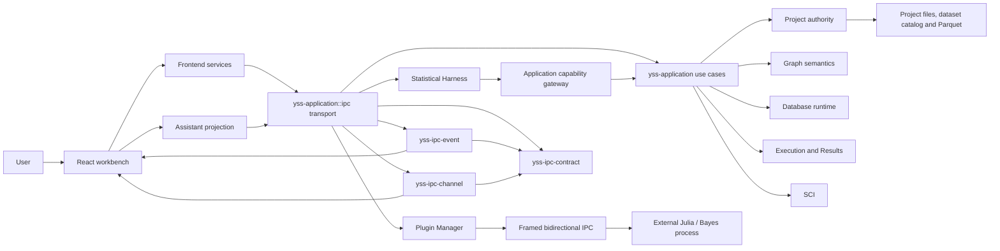
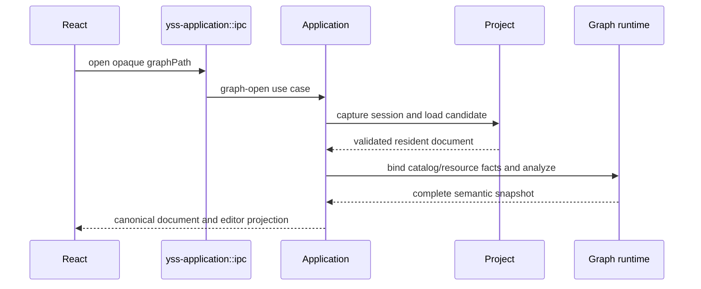

# YssBI 当前架构

> Status: Current
> Scope: 系统上下文、authority、依赖方向和主要运行链路
> Canonical owners: 本文拥有系统级心智模型；专项 contract 由文末索引中的文档和源码拥有
> Update when: 顶层 authority、依赖方向、composition root 或跨子系统主链路改变时

YssBI 是基于 Tauri 2 的桌面数据分析 IDE。用户在 React 工作台中管理项目、数据库、Analysis Graph、统计结果和 Assistant；Rust 负责所有已提交业务状态、持久化、编译执行和科学计算。本文只提供进入系统所需的总览，不维护完整 crate 清单、命令矩阵、门禁实现或重构历史。

插件系统的稳定职责由 [Plugin 架构与契约](PLUGIN.md) 定义。当前宿主通过通用 Plugin Manager 加载签名原生插件包，Julia/Bayes 前后端属于独立发布的 Julia 插件，不链接到宿主生产依赖图。目标契约中的在线目录、标准 UI provider 和 OS sandbox 等能力不因文档已接受而自动成为当前功能。

## 1. System context



`src-tauri/src/lib.rs` 的业务入口依赖为 `yss-application`，另注册本地平台插件 `tauri-plugin-tracing` 与官方 Tauri 插件。日志插件先安装采集、SQLite 和日志 Channel；Application runtime 安装业务服务、解析业务路径、显示主窗口，并直接构造内部 `ipc::CommandRuntime`。应用命令注册表、schema、error、执行通道编码和图草稿交接都在 `yss-application::ipc`，日志命令使用插件自己的命名空间。Event、中立 Channel 与共享 Contract 保持独立，且不反向依赖 Application。业务 workflow 与状态继续由应用用例和领域 owners 持有。

原生窗口几何由根包装配官方 Window State 插件，恢复和保存不经过自有业务 command。
窗口关闭与 Dockview 布局的分工见 [Workbench 窗口契约](WORKBENCH_DOCKVIEW_ARCHITECTURE.md#81-原生窗口几何与关闭)。

## 2. Authority model

| 状态或事实                                                                   | 唯一 authority                                   | 非 authority 投影                           |
| ---------------------------------------------------------------------------- | ------------------------------------------------ | ------------------------------------------- |
| 已提交 Project、资源、revision                                               | Rust Project crates                              | React Project stores、Workbench panels      |
| Graph document 的已保存版本                                                  | Rust Project / Graph document owners             | `GraphDraftSession` 中未保存 draft          |
| resolved type、schema、lineage、diagnostics、coercion、kernel specialization | Rust `GraphSemanticSnapshot`                     | Editor/Canvas/Problems projection           |
| Database declaration、physical runtime 和 schema                             | Rust Project + Database crates                   | Data explorer 和 editor projection          |
| Execution、当前 result identity、payload 和 provenance                       | Rust Execution `ResultStore`                     | Result、Inspect 和 preview UI               |
| Statistical algorithms 与插件计算                                            | SCI / 独立插件进程；项目结果由 Core 提交         | report/chart presentation models            |
| 插件安装、启用、任务账本                                                     | Rust Plugin Manager                              | 插件列表与隔离页面                          |
| Harness session、turn、workflow、ledger、memory 和 ordered events            | Rust Statistical Harness + persistence ports     | assistant-ui ExternalStore projection       |
| Root workbench topology、placement、active group/panel 和 edge state         | live root Dockview instance                      | pane-local metadata keyed by panel identity |
| 本地偏好和临时交互状态                                                       | React `localStorage`、Zustand 或 component state | —                                           |

Rust 与 React 之间只允许单向投影加显式 draft：React 不维护第二份 committed model，也不与 Rust 进行双向 merge/reconcile。Save 成功后采用 Rust 返回的 canonical state；失败时本地 draft 保持 dirty。

前端 Project hydration 由 `features/application/project/projectHydration.ts` 编排准备、投影提交和清理，并返回包含 project instance 与 publication revision 的 `ProjectLoadReceipt`。`projectIOStore.ts` 只保存已安装投影的状态和图加载运行态；加载回执不携带第二份项目内容。资源类别取自 Rust 索引中的显式字段，客户端资源键编码保留原始 opaque path。

设置页提供 AI 与外观偏好，由客户端持久化。配色由 `appearance.colorTheme` 选择的只读主题预设统一派生；主题选择与亮／暗模式的主题记忆在同一次状态更新中提交，界面、图表和表格共用主题配色。图文档通过显式 Save 提交。

缺失值策略、判秩、收敛和数值保护阈值由各算法的契约与实现管理。Graph OLS 当前仅接收有限数值并采用 Reject 策略，客户端偏好不参与统计计算。相关数值策略见 [Tolerance 分析](../reviews/2026-09-07-tolerance-analysis.md)。

命名常量属于 GraphDocument，在 Event/Function 的 Details 中通过 Graph Draft 编辑，并随图保存。没有独立全局变量资源或变量 revision。资源命令 receipt 与事件回声按提交身份去重。项目关闭使用 `clearProjectProjection` 清空客户端投影，项目加载只从 Rust 当前 session 获取完整数据。

Project manifest 是 `yss-project` 的私有持久化模块。Chart 文档编辑和函数签名修改保留当前 Application session；只有需要替换运行时资源的操作才调用 `rebuild_application_session`。

节点编辑由 Application 的 `graphEditing` 直接提交 Graph Draft mutation，并返回统一的 `GraphEditOutcome`。Draft 自身保存撤销/重做记录；Project 提交发布资源 revision 和 delta，文件事务仍负责失败回滚。

身份必须按语义分离。Project instance/session、resource path、Graph session、constant/node/pin/connection UUID、run/result、Dockview panel/group 都不是可互换的 ID。`events/...`、`functions/...` 和 `databases/...` 等资源路径跨 IPC 时是 opaque value，前端不得从字符串结构推导领域状态。

## 3. Layer and dependency direction

后端依赖从 framework/transport 指向 application，再指向 domain contract 和注入的 adapter：

```text
Tauri composition root
  → yss-application::ipc commands / invoke_handler
      → yss-ipc-event → yss-ipc-contract
      → yss-ipc-channel → yss-ipc-contract
      → yss-ipc-contract
      → yss-application use cases
          → Project / Graph / Database / Execution / SCI contracts
              → pure persisted contracts
          → injected backend adapters
```

- command 只解析和校验输入、映射 DTO/error、调用 use case，并在 commit 后交付事件或 channel；
- Application 组合跨 owner 用例和 currentness gate，不重新实现 Project、Graph、Database 或 SCI 规则；
- 图编辑器投影由 `yss-graph-editor::projection` 从语义快照生成；Application 负责调用与身份重验，IPC 负责 wire 映射；
- Node 的协议、注册表和目录由 `yss-node-protocol`、`yss-node-registry`、`yss-node-catalog` 拥有；Graph 消费这些节点定义并解析图中实例，Node 不依赖 Graph。详细边界见 [Graph 与 Execution](GRAPH_AND_EXECUTION.md#2-module-ownership)；
- domain crate 不依赖 Tauri、React、command schema 或具体基础设施；
- adapter 实现窄 port，不反向拥有 session、approval、project 或 workflow authority。

前端依赖方向是：

```text
app composition / routing
  → modules/*/public
  → features/application
      → features/core and features/domain
      → services
  → components/ui and shared presentation
```

`app/` 组合窗口、路由和跨业务 contribution；`modules/` 拥有 panel/window/editor UI，并通过根 `public.ts` 暴露；`features/application/` 编排用户用例；`features/core/` 保存领域投影和共享运行态；`features/domain/` 保存无 UI/framework 依赖的规则；`services/` 适配 IPC。普通 invoke 统一经过 `src/services/ipc/invokeCommand.ts`。

这些方向由可执行架构门禁维护，分类算法和 policy 见[架构门禁](../development/ARCHITECTURE_GATES.md)，完整 workspace 索引见[生成的 Module Map](../reference/MODULE_MAP.md)。

## 4. Project lifecycle

通用文件能力集中在 [yss-filesystem](../../src-tauri/crates/yss-filesystem/README.md)，其运行、开发和构建依赖都不包含内部 crate。FS 不解释项目入口、图表/图文档、资源版本或索引失效；Project 解释这些业务规则并映射 ProjectOperationError，Application 组装带项目路径过滤器的监听器。文件事务默认接受任意字节，项目文档校验由 Project 显式提供。

项目发现由 `yss-project-registry` 的私有 `discovery` 模块使用 `walkdir` 遍历候选目录，链接与重解析点判断复用 `yss-filesystem`。注册流程采用发现结果并通过存储端口持久化；直接注册和扫描复用已有记录时，共用项目根身份校验。项目默认名称与规范化规则由 `yss-project-model` 统一拥有。共享进度与任务取消归 `yss-project-progress`，通信适配负责向前端投递进度。

已有项目路径由 Rust `dunce::canonicalize` 解析，默认父目录与资源显示路径使用不访问文件系统的 `dunce::simplified`。Windows 仅在安全时简化扩展前缀，长路径、UNC 和特殊文件名所需的前缀保留；非 Windows 的展示路径原样保留。重新注册已有项目时刷新规范路径，项目身份仍由根身份校验决定。React 原样保存和展示 Rust 路径投影，项目选择器精确匹配规范路径，不再自行剥离前缀、替换分隔符或忽略大小写来判断项目身份。

扫描与清理在返回成功前重查取消状态；取消不回滚已经完成的注册或清理。注册列表按收藏状态、数值化的 Unix 秒时间和名称排序，已有记录的名称与收藏状态不会被重复扫描覆盖。

活动项目以一个 application session 为边界：

```text
Application session
├─ Project authority and project session
├─ Database runtime session
├─ Graph registry/runtime facts
├─ Execution runtime and ResultStore
└─ session generation / admission state
```

Project replacement 先关闭旧 session 的新任务准入并 drain 或取消活动工作，再构造和验证 candidate session，最后原子替换。旧 session 的 late event、result、database handle 和 Graph projection 因身份或 generation 不匹配而被拒绝；前端在 hydrate 新项目之前先清理旧的 backend-owned projection。

打开项目先通过 Project 的 activation preparation 检查目标文件，再进入 replacement。
旧格式、损坏文件或无效路径在这一阶段拒绝时，当前 Application session、准入、Draft 和 Results 保持不变。
若最终文件重验在 drain 之后失败，则从仍然有效的 Project authority 重建可用会话并返回打开错误；
只有 drain、authority 或会话重建确实无法完成时才保留恢复状态。

Project 文件、resource revision 和提交事务由 Project owner 管理。Graph resource 可以存在于磁盘和 revision index 中但保持 unloaded；create/duplicate 只声明新资源，不为了发布事件而临时加载。需要 resident document 的 load/patch/move 路径统一经过 Project 的受验证安装边界。

典型打开链路：



## 5. Graph compile and execute overview

Analysis Graph 只表达数据端口和数据依赖。Canvas mutation 更新前端未保存 draft；Rust 以无状态 domain operation 校验 mutation，并在同一 command response 返回 candidate document 与完整 projection，但在 Save 前不改变 committed Project authority。

```text
Open → Frontend Draft ──→ Compile complete draft ──→ immutable cached artifact ──→ Execute
                      └──→ locked atomic Save ──────→ committed Project state
```

- Compile 对完整 draft 求解，成功时产生 content-addressed artifact，不保存 Project；
- Save 校验并原子覆盖完整 document，不隐式 Compile；
- Execute 使用 `compiledArtifactId` 精确匹配缓存 artifact，并重验 session 与实际依赖；
- Projection 与 Compiler 消费同一个 `GraphSemanticSnapshot`；
- execution result 进入 Rust `ResultStore`；运行失败经 typed channel 投影到 Output panel；
- Graph Problems 由完整 projection 交付，Compile 通过 Ready/Blocked 区分语义阻断与内部 command failure。

完整的 Draft、Projection、Compile、Save、Execute、Problems、Results 和运行失败契约只在 [Graph 与 Execution](GRAPH_AND_EXECUTION.md) 维护。

## 6. Database and scientific computation

Database 用例由 Application 组合 Project declaration authority 和 session-scoped Database runtime：

- typed import source 在 transport 边界解析；
- 项目格式 5 使用 SQLite committed catalog 和不可变 Parquet 文件集；旧格式在读取入口拒绝，不自动改写；
- 大表 query/edit/profile/export 保持在 Rust，使用 DataFusion、Arrow 分页、列投影、聚合与批处理；
- 宿主与 Julia 插件均已移除 Polars，workspace 不再声明或锁定该依赖；插件结果由独立 DataFusion 适配器查询，Arrow 负责交换文件；
- 宿主 IPC/CSV/Parquet 文件边界使用 Arrow batches；精确存储 Schema 与 Graph 语义 Schema 分开，见 [Database runtime](../../src-tauri/crates/yss-database-runtime/README.md)；
- mutation 在锁外执行 I/O，并在最终 Project gate 重新验证 session/revision 后提交。

数据库导入准备和导出发布分别位于 Application 的 `database/import.rs`、`database/export.rs`，会话入口保留在 `database.rs`。数据库导出、插件 JSON/文件导出和 Julia worker assets 直接使用 `atomicwrites::replace_atomic`；临时文件、内容同步、会话重验和失败清理由各调用方负责。窗口状态由官方插件独立持久化。

文件替换要求临时文件与目标位于同一文件系统。`replace_atomic` 在 Unix 重命名后同步父目录，返回错误时目标可能已经更新；调用方统一保守地报告发布结果不确定，不自动重试、不回滚或删除目标，只清理临时路径。不能通过临时文件消失推断持久化成功。
数据库导出返回 `database_export_publication_uncertain`，插件 JSON/文件导出返回 `plugin_file_publication_uncertain`，Julia assets 返回 `julia_worker_asset_publication_uncertain` 并停止本次 worker 准备；写入前及内容写入失败继续使用原有失败码。替换失败不提交成功响应或后续内存更新，调用方需检查目标后决定后续操作。该协议不提供多文件事务或跨平台完整断电保证；`replace_atomic` 不同步文件内容，内容同步仍属于调用方。

科学计算使用独立的中性契约，只有 Execution 和 IPC Command 直接调用 SCI runtime：

```text
Application → yss-graph-execution → yss-sci-runtime (stateless functions)
IPC Command → yss-sci-runtime
yss-sci-runtime → yss-sci algorithms → yss-sci-linalg Mat / Col / views / checked factors → faer
yss-sci algorithms → shared model options/results in yss-sci-contract
Plugin Manager → framed IPC → Julia extension → Bayes worker port → Julia adapter
```

Rust algorithms 拥有统计数值和 typed result；React 只把 authoritative DTO 转换为 presentation model。Julia process/runtime、Bayes model validation、worker protocol、artifact 和 result 随独立插件编译；`yss-bayes-runtime` 是插件内部的科学编排，不是宿主 bridge。宿主 Application 只实现通用数据快照和结果提交端口，不包含 Julia/Bayes 专用 command。已提交插件结果位于项目 `extension-results/`，包含内容哈希、包摘要、操作身份、输入快照来源和通用文件；卸载插件不删除它们。

[`yss-sci-linalg`](../../src-tauri/crates/yss-sci-linalg/README.md) 拥有不透明的 `Mat`、`Col`、行与借用视图，以及矩阵运算、分解检查、稳定错误类型和秩阈值。faer 仅是该 crate 的实现依赖，对外不重导出原生类型。SCI 只通过 Linalg 使用矩阵；runtime 只调用 SCI，不依赖 Linalg 或 faer。中性契约使用业务结构和普通向量，Arrow 负责表格交换；输入与报告按逻辑行列转换，不依赖矩阵物理存储顺序。

[`yss-sci`](../../src-tauri/crates/yss-sci/README.md) 的 OLS 模块分别组织模型/结果、拟合和推断，使用中性契约中的唯一 `OlsOptions`。Runtime 按 regression、hypothesis、time_series、panel 等能力组织入口；`runtime::data` 使用 Arrow 数组与批次完成有界时间序列/面板输入准备，runtime 与核心算法均不依赖 Polars。OLS 报告由 runtime 映射拟合结果，预测值和残差使用模型已计算的事实。`ols`、`acf_pacf` 是普通函数，接收中性请求和取消/deadline 控制；桌面入口和 Application 不构造、保存或注入科学计算后端。

SCI 拥有数值设计矩阵、回归拟合、ADF/VAR/VEC 模型准备、DID 随机化推断和核密度计算。假设检验也归 SCI：复用 `yss-math-expr` 解析，完成约束线性化、参数列序、矩阵构造与 t/Wald 分派；Application 保留结果身份和项目状态检查。Julia 插件不依赖任何 SCI crate，输入值、分类角色和取消/期限契约由插件内的 `yss-bayes-worker` 拥有。

## 7. Statistical Harness

当前 Assistant 通过 Rust-authoritative Harness 工作：

```text
Assistant UI projection
  → yss-application::ipc Harness commands + yss-ipc-channel ordered delivery
  → yss-statistical-harness
      → AgentDriverPort → yss-agent-rig
      → CapabilityGatewayPort → yss-application
      → persistence ports → SQLite adapter
```

Harness 拥有 session、turn、workflow、tool ledger、approval、memory、knowledge retrieval 和 ordered event sequence；它只通过 typed capability gateway 访问业务能力。React 根据 snapshot/event replay 重建界面，不拥有 conversation 或 workflow state。当前实现与未接入目标分别见 [Statistical Harness](STATISTICAL_HARNESS.md) 和 [Harness roadmap](../roadmap/STATISTICAL_HARNESS.md)。

## 8. Runtime signals

YssBI 不使用一条“万能日志”承载所有反馈：

| 信号               | 语义                                    | Canonical owner                                                                                       |
| ------------------ | --------------------------------------- | ----------------------------------------------------------------------------------------------------- |
| Graph Problems     | 当前 draft 的 resolved domain facts     | [Graph 与 Execution](GRAPH_AND_EXECUTION.md)                                                          |
| Results / 当前输出 | 可查询的执行产物                        | [Graph 与 Execution](GRAPH_AND_EXECUTION.md)                                                          |
| Graph 运行失败     | 当前图的失败摘要与节点定位              | [Graph 与 Execution](GRAPH_AND_EXECUTION.md)                                                          |
| Logging            | 结构化运行观测、持久历史与 console      | [Runtime Signals](RUNTIME_SIGNALS.md)                                                                 |
| IPC error          | 稳定 machine-readable command rejection | [`yss-application::ipc` transport contract](../../src-tauri/crates/yss-application/src/ipc/README.md) |
| User feedback      | 本地化交互反馈                          | React application/view                                                                                |

运行观测统一进入结构化日志；日志是 sanitized、bounded、lossy、non-authoritative，不驱动业务状态。具体容量和阈值由源码常量及测试拥有，不在总架构中复制。

## 9. Subsystem documentation index

| 变更范围                         | 先阅读                                                                                                                             |
| -------------------------------- | ---------------------------------------------------------------------------------------------------------------------------------- |
| Graph、编译、执行、结果或输出    | [Graph 与 Execution](GRAPH_AND_EXECUTION.md)                                                                                       |
| 工作台布局、面板身份或生命周期   | [Workbench Dockview](WORKBENCH_DOCKVIEW_ARCHITECTURE.md)                                                                           |
| 日志、运行观测、错误或反馈       | [Runtime Signals](RUNTIME_SIGNALS.md) 与 [`yss-application::ipc` README](../../src-tauri/crates/yss-application/src/ipc/README.md) |
| Statistical Harness 或 Assistant | [Statistical Harness](STATISTICAL_HARNESS.md)                                                                                      |
| command、event、channel 或 DTO   | [`yss-application::ipc` README](../../src-tauri/crates/yss-application/src/ipc/README.md)                                          |
| Project、Database、SCI、Julia    | [文档入口](../README.md#focused-implementation-contracts)中的 owner README                                                         |
| 架构 policy 或 source 分类       | [Architecture Gates](../development/ARCHITECTURE_GATES.md)                                                                         |
| 本地命令和交付                   | [Local Workflow](../development/LOCAL_WORKFLOW.md) 与 [Change Process](../development/CHANGE_PROCESS.md)                           |

历史重构说明放入 decision 或 version 文档；尚未完成的能力放入 roadmap。本文不记录“旧 owner 已删除”之类的时间性描述。
