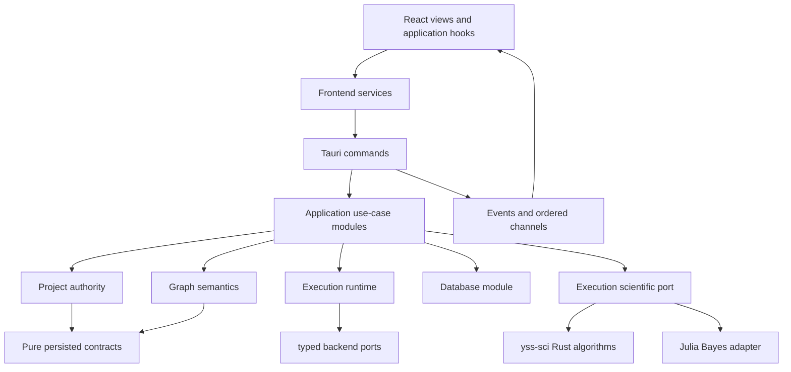
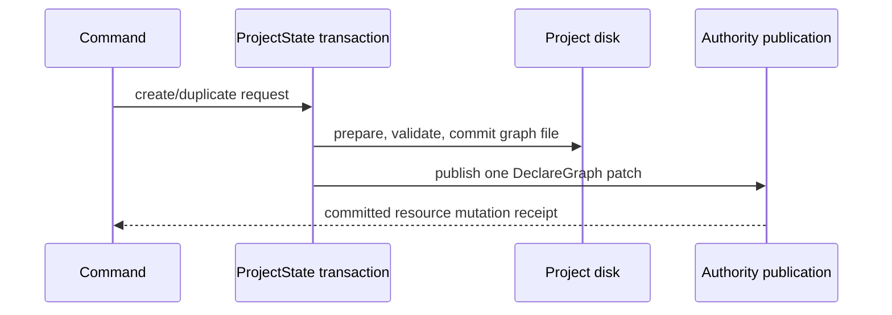
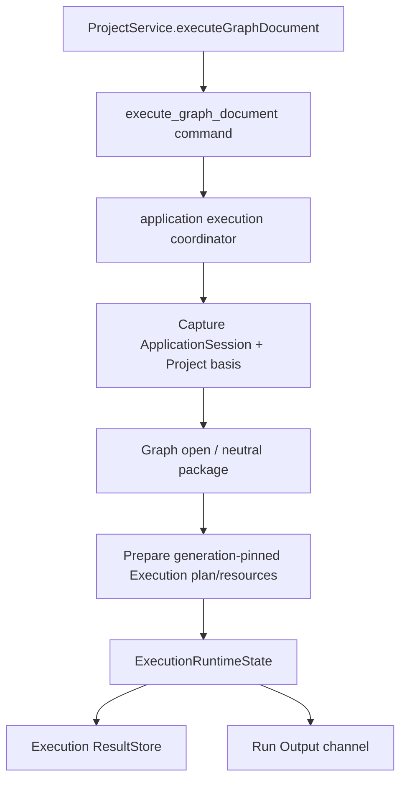

# YssBI 当前架构

本文档描述当前工作树中的实现，而不是目标蓝图。YssBI 是基于 Tauri 的桌面数据分析 IDE：React 负责交互与投影，Rust 负责项目 authority、图编译与运行、数据库语义和科学计算编排。

专项文档：

- [诊断、IPC 错误、Results 与 Run Output](./DIAGNOSTICS_ERRORS_AND_OUTPUT.md)
- [Workbench Dockview 架构](./WORKBENCH_DOCKVIEW_ARCHITECTURE.md)
- [Database 实现说明](../../src-tauri/src/database/README.md)
- [SCI 应用模块说明](../../src-tauri/src/sci/README.md)
- [Julia Bayes worker protocol](../../src-tauri/julia/README.md)

## 1. 架构语言与方向

本文使用以下术语：

- **module**：具有 interface 与 implementation 的代码单元。
- **interface**：调用方必须知道的类型、顺序约束、错误模式和性能特征。
- **seam**：module interface 所在的位置，可在此替换行为而不修改调用方。
- **adapter**：在 seam 上满足 interface 的具体实现。
- **depth**：一个较小 interface 隐藏并提供多少行为。
- **leverage**：调用方从深 module 获得的能力复用。
- **locality**：复杂度、修改和验证集中在一个 implementation 内。

当前后端的主要依赖方向是：



`commands/` 是 transport seam，不是业务 workflow 的归属。复杂行为进入 application、project、graph、execution、database 或 sci module，以提高 depth、leverage 和 locality。

`application/` 拥有跨 module 的 database use-case orchestration；`project/` 拥有 project/session authority、resource revision、commit 与 coherent snapshot，并直接依赖 `database/` 提供的存储和 runtime primitives。生产代码中的 `project/` 不依赖 `application/` 或 `commands/`；该约束由 Rust production-module architecture audit 执行。

### 1.1 Production architecture fitness gates

Rust 与 Frontend 各有一条 test-owned production architecture audit；production module 不依赖
policy、classifier 或 debt 数据。Rust audit 从 Cargo metadata 发现 workspace 中全部 library、
binary、runnable example 与 custom-build roots，排除 test/bench target，再沿每个 root 的真实
`mod` graph 发现 production source。它从 Rust AST 收集 use、re-export、path、macro、include、
attribute、`#[path]` 与 cfg reachability facts。Frontend audit 盘点完整 `src/**` production tree，
排除 `src/tests/**`、test files、generated declarations 与明确 fixtures，并把 TypeScript module
dependencies 和递归 repository stylesheet dependencies 纳入同一审计。

分类使用闭合集合而不是 rule priority。每个发现的 source 必须命中且只命中一层，zero/multiple
membership 都是 hard failure：

- Rust 共 16 层：Composition Root、Build Script、Commands、Platform Adapter、Application、
  Project、Graph、Execution、SCI Core、Database Core、Backend Adapter、Built-in Composition、
  Transport、Logging、Diagnostics、Pure Leaf。Custom-build root 及其 local modules 只属于 Build Script。
- Frontend 共 10 层：App Composition、Views、Application、Core、Domain、Services、
  Components/shared UI、Wire Schema、Diagnostics、Pure Shared。Stateful/framework-bearing shared
  files 使用 literal membership 归到真实 owner；repository assets 不伪装成 source layer。

依赖在应用 layer policy 前解析到 canonical origin。Rust origin 只有 repository declaration、
repository asset、language builtin 或 external Cargo dependency；Include/Attribute 的 repository
file fact 解析为 repository asset。Workspace-member alias 必须先进入 member library 与 re-export
graph，不能回退为 external。Frontend origin 只有 repository declaration、repository asset 或
external package；alias/barrel/re-export 解析到声明 symbol，written external package authority
则保留原 package。Canonical external target 使用 `external:<package>` 或
`external:<package>::<subpath>`；两端 canonical repository-asset target 都使用
`repository-asset:<repository-relative-path>`，repository path 统一使用 `/`。

Cargo policy 对 workspace member、declared alias、actual package、runtime/build/development scope
与 target condition 做 exact declaration check，再按 source layer、runtime/build mode、canonical
subpath 或 literal symbol capability 检查每个 production use。Build Script 当前只允许其 exact
build-mode declaration 与 `external:tauri-build::build` call。Frontend policy 双向核对 production
dependencies，并按 source layer、runtime/type-only/build-style mode、module/stylesheet resource
kind、package/subpath 与 stylesheet consumer 匹配 literal rows；development dependency 不授权
production import，唯一 build-only declaration 只通过其 exact build-style row 使用。Relative CSS、
CSS `@import` 与 `url(...)` 解析成 existing repository asset 或 exact external style target；missing、
escaping、remote、nonliteral、cyclic 与未登记 target 都 fail closed。

两端 finding 使用稳定 identity：`ruleId`、repository-relative source file、fully-qualified
owner、dependency kind 与 canonical origin target；line/column 只用于诊断。当前 production
architecture 不保留债务豁免清单，任何 finding 都直接使架构门禁失败。

Import direction 之外，semantic fitness checks 还守卫 resolved command/application symbols、Tauri
command/error shape、framework/DTO leakage、Execution plan closed parameter family、Build Script
call surface、SCI/Database/backend-adapter purpose limits、Frontend raw invoke/dialog consumers、
View-to-Core exact read capabilities、projection write ownership与 root/nested Dockview constructor
位置。稳定 type/variant/symbol contract 用 AST 和 type resolution 检查；只有无法在该层表达的
窄 contract 才使用 source-token guard。

## 2. 顶层目录与 authority

| 路径 | 当前职责 |
|---|---|
| `src/` | React views、application hooks、Zustand 投影、IPC adapter 和 UI |
| `src-tauri/src/commands/` | Tauri transport、DTO 转换、错误映射、event/channel 交付 |
| `src-tauri/src/application/` | 跨 module 用例编排 |
| `src-tauri/src/backend_adapters/` | consumer-owned ports 到 concrete backend API 的 exact adapters；由 composition root 注入 |
| `src-tauri/src/project/` | project/session authority、resource revision、事务提交与 publication、持久化协调和 coherent snapshots |
| `src-tauri/src/graph/` | Graph editor document behavior、compatibility、neutral compiler、runtime state 与 graph errors |
| `src-tauri/crates/yss-execution/` | 独立 Execution 层：immutable plan、session runtime、resource preparation、run/result/finalization 与 backend ports 的唯一 owner |
| `src-tauri/crates/yss-data-contract/` | 独立 Pure Leaf：持久化 `DataType`、`DataValue` 与关联 metadata 的唯一 canonical owner |
| `src-tauri/crates/yss-database-contract/` | 独立 Pure Leaf：persisted database declaration、engine/session identity、observation 与 fingerprint 的唯一 canonical owner |
| `src-tauri/crates/yss-graph-document/` | 独立 Pure Leaf：persisted graph document、entity identity、resource path 与 resource-name validation 的唯一 canonical owner |
| `src-tauri/crates/yss-graph-protocol/` | 独立 Pure Leaf：稳定 node/port/type/schema/value protocol、wire validation 与 dataframe nominal literals 的唯一 canonical owner |
| `src-tauri/crates/yss-graph-resource-contract/` | 独立 Pure Leaf：Graph 编译资源标识、数据 schema 与 immutable resource snapshot 的唯一 canonical owner；不拥有 built-in node catalog |
| `src-tauri/crates/yss-graph-analysis/` | 独立 Graph 层：document analysis、editor projection facts 与 result category 判定的唯一 behavior owner |
| `src-tauri/crates/yss-math/` | 独立 Pure Leaf：受限数学表达式 IR、plain/LaTeX 解析、关系拆分与输入预算的唯一 owner |
| `src-tauri/crates/yss-tabular-contract/` | 独立 Pure Leaf：有序 tabular snapshot、finite scalar 与 column identity 的唯一 canonical owner；Polars adapter 留在 `backend_adapters/`，变量归一化留在 `project/` |
| `src-tauri/crates/yss-variable-contract/` | 独立 Pure Leaf：持久化 `VariableId`、`VariableScope` 与 `VariableInstance` 的唯一 canonical owner；变量 mutation 与 authority 留在 application/project |
| `src-tauri/src/database/` | DatabaseInstance runtime semantics、DuckDB binding/storage、schema metadata、query/edit/history/overview/export primitives |
| `src-tauri/src/schema/` | 可序列化 command/event wire DTO 与转换；不拥有 project 或 database authority |
| `src-tauri/src/sci/` | 主应用的 SCI-facing typed interface 与 models；不反向依赖 Graph、Project 或 Execution |
| `src-tauri/crates/yss-sci/` | 独立 `yss-sci` Rust 数值算法 crate |
| `src-tauri/crates/yss-tracing/` | 独立 Logging 层：`tracing` subscriber、过滤、统一脱敏、bounded console 与 rolling JSONL |
| `src-tauri/src/julia/` | Julia runtime/worker host、typed worker errors 和 task ownership |
| `src-tauri/julia/` | Julia worker assets 与 Bayes operation |
| `src-tauri/crates/yss-diagnostics/` | 独立 Diagnostics 层：Rust log projection、frontend ingestion、recent ring、sequence 与 live delivery；单向依赖 `yss-tracing` |
| `src-tauri/crates/yss-window-state/` | 独立 Platform Adapter：后端权威窗口几何状态、typed failure 与原子持久化的唯一 owner |

Rust 与 React 的职责单向流动：Rust 保存 domain authority，React 只保存 UI 状态和后端投影。资源路径是 opaque identity；graph 使用 `events/...` 或 `functions/...`，database 使用 `databases/{database-id}`，variable 使用 `variables/{VariableId}`。

## 3. 前端组织与 IPC

前端依赖方向是：

```text
views
  → features/application
      → features/domain
      → features/core
      → services
components/ui and shared/ui
```

- `views/` 组合 screen/window，不直接拥有后端 workflow。
- `features/application/` 编排用户用例与生命周期。
- `features/core/` 保存 domain-scoped Zustand 投影和共享基础设施。
- `services/` 是普通 Tauri invoke 的 adapter；统一经 `src/services/ipc/invokeCommand.ts` 解析 `{ code, details, incidentId }`。
- `components/ui/` 使用 shadcn primitives；用户可见滚动使用 `ScrollArea`。

主窗口 chrome 的层级固定为：顶部 `Menubar`（包含 title/menu/window controls），中部 flex row 中只有一个 root `DockviewReact`，底部 `BottomBar` status bar。Settings 与 node documentation dialogs 作为 overlay 留在工作台之外。

`Workspace` 的 root `DockviewReact` 是所有顶层 panels 的唯一 topology authority：左侧 native Activity edge group 直接承载 `Project`、`Nodes`、`Data`、`Commands` 四个 panels；editor、Details、Assistant、Inspect、Result、Logs、Output 和 Diagnostics 由同一个 root 继续承载。Activity tabs 只允许在该 left edge group 内原生重排，普通 panels 不得进入，Activity panels 不得离开。唯一保留的 nested Dockview 位于 root `Logs` panel 内，其 authority 仅限 log-domain panels 的局部 topology、顺序与 active state；root 仍拥有 `Logs` panel 本身的位置、尺寸和可见状态。

- Zustand 只保存 modal 等非 placement UI 状态，不镜像任何 panel placement、visibility 或 Activity active tab。
- `Details` 是常驻的 permanent root singleton，固定在 canonical right edge，不能移动、split、关闭，也不能通过拖动包含它的整个 group 绕过限制。
- `Assistant` 是 layout-persisted 的普通 root singleton：新默认布局和 Reset Layout 将它放在 Details 后面，但它可以独立移动、split、关闭，并可从 View 菜单重新打开；已有 panel 的 reveal 保留其实际位置。
- `Inspect` 是按需创建的 contextual root singleton，从当前 editor session context 解析 resource/detail target、active editor group 和 node selection。
- Result 是 root Dockview 中可并存的 multi-panel：`resultKey` 标识并 upsert logical result panel，opaque `resultId` 标识该 panel 当前从 Rust `ResultStore` 读取的 payload。
- `Logs`、`Output` 与 `Diagnostics` 默认位于 root 的 native bottom edge group；该 group 使用 bottom header position，因此 content 在上、tabs 在下，尺寸与 collapse 仍由 root Dockview 原生管理。
- root layout 只在启动 hydration 时恢复；当前按 window label 隔离的 key 是 `yssbi-workbench-layout:<window-label>`（空 label 回退为 `main`），payload 只有 `root` 与 `nested.logs`，不含版本字段、preferences、迁移或旧 reader。Project replacement 不会再次从该 key 恢复 root topology。
- persisted Assistant 若存在则恢复其保存的 group/position；若用户已关闭 Assistant 且 snapshot 中缺失，startup restore 不会 additive ensure。Project replacement 保留 Details 与 Assistant topology，仅清理 project-scoped editor、Inspect 与 Result panels。

### 3.1 Plot / Visualization

Rust scientific modules 与 result payloads 拥有统计计算、canonical ordering、confidence fields 和其他科学决策。React 不成为第二套 scientific authority：Result 与 Worksheet source adapters 将 authoritative DTOs 转换为 source-independent discriminated `ChartModel` union；renderers 不感知 Rust、IPC、stores、report workflows 或 Bayes workflows。

- `src/shared/charts/ChartRenderer.tsx` 是唯一的 generic `ChartModel` dispatcher。其 registry 将 model kinds 映射到 final leaf renderers；已有窄 presentation contract 的 specialized report composition 可以直接导入 leaf renderer。
- `src/shared/charts/core/` 拥有共享 sizing、theme、geometry、stable SVG layers 与 tooltip behavior。`cartesian/` 拥有 generic Cartesian marks/axes；`statistical/` 拥有 domain-specific statistical visual grammars。两个 renderer categories 不互相依赖，category/core modules 也不导入 root public barrel。
- 当前 D3/SVG renderers 通过 keyed incremental joins 更新 stable named layers，不清空整个 SVG；`core/useChartContainerSize.ts` 是 chart production modules 中唯一创建 `ResizeObserver` 的位置。
- `views/PlotView/PlotWindow.tsx` 只保留 standalone window shell/router。Reusable renderers 不位于 `views/`，obsolete compatibility paths 直接删除而不包装。
- Canvas 与 ECharts 是需要 profiling 和显式设计决策的未实现 future options；两者都不是当前 renderer 或 project dependency。

## 4. Commands → application → domain

### 4.1 Command interface

Tauri command 只负责：

1. 解析和验证 IPC 输入。
2. 将 DTO 转换为 application/domain 类型。
3. 必要时把阻塞工作放入 blocking pool。
4. 调用 application 或 authoritative domain interface。
5. 映射为稳定 `CommandError` wire。
6. 在 authority commit 后交付 project event，或通过有序 channel 交付运行流。

Command 不拥有长 workflow、文件系统事务、graph compiler、database 编辑规则或统计实现。Event/channel 交付失败可以形成 transport error，但不会把已提交的 authority receipt 回滚成未发生。

### 4.2 Application modules

`src-tauri/src/application/` 当前提供以下主要深 module：

| Module | Interface 提供的 leverage | Implementation 所在 locality |
|---|---|---|
| `project_lifecycle` | load/clear/create/save-as/delete 的用例结果 | ProjectState、registry 与恢复状态编排 |
| `catalog_query` / `graph_open` | coherent localized/compatible catalog 与 graph projection | Application session capture、Project/Graph/Database snapshot 与 schema mapper |
| `graph_mutation` / `resource_mutation` | capture/plan/commit 的 Graph 与 Project resource mutation | Application coordination、Project authority commit 与 neutral result facts |
| `execution` | session capture、prepared plan、run/result/finalization | ApplicationSessionSlot 与 Execution-owned runtime |
| `database` | typed import/read/mutate/save/export 用例 | 编排 ProjectState authority 与 database primitives、锁外 I/O 和最终 commit |
| `bayes` | Bayes task、status、result/artifact 生命周期 | `BayesWorkerPort`、Database snapshot、SCI inputs 与 injected artifact reader |

Project/Database durable facts 由 Application 组合为 query result；DuckDB runtime binding 与 storage metadata 属于 `database/`，`ColumnInfoDTO` conversion 属于 `schema/`。

`hypothesis` 和 `pin_preview_generation` 是更窄的 application modules。它们同样把 transport 与 domain implementation 分开。

典型链路：

```text
command_project/lifecycle
  → application/project_lifecycle
  → project

command_node_system
  → application/catalog_query | graph_open | graph_mutation | execution
  → Project / Graph / Execution

command_dataframe
  → application/database
  → project + database

command_bayes
  → application/bayes
  → SCI-facing StatisticalInput
  → BayesWorkerPort
  → JuliaBayesWorkerAdapter
```

## 5. Project authority 与资源生命周期

### 5.1 ProjectData 与 ProjectStore

`ProjectState.project_data` 中的 `ProjectData` 仍是项目、resident graph document、node/pin/connection、variable、worksheet、database declaration 和 computation settings 的 authoritative state。

`ProjectStore` 只保留 Project session identity；随 project session 重建的运行时对象由
`ApplicationSessionSlot` 持有：

```text
ApplicationSessionSlot
├─ ProjectState / ProjectSession
├─ DatabaseRuntimeSession
├─ Graph catalog/runtime facts
├─ ExecutionRuntimeState
├─ ResultStore and RunRegistry
└─ session epoch / generation
```

`ProjectStore` 不替代 `ProjectData`；它只记录 Project-owned session identity。切换 project session
通过 ApplicationSessionSlot 关闭旧 Execution admission、drain 活动 work，再原子替换
Project/Database/Execution session，隔离旧 result、run 与 database handles。

`database/project.duckdb` 保存 table contents、physical schema 与 display metadata 等持久化事实。
活动 session 中，`ProjectData.databases` 是 declaration authority；DatabaseRuntimeSession 保存
session-bound runtime state。ProjectState 拥有 project identity、resource revision、commit/currentness
validation 和 publication；项目重开时从 DuckDB 用户表重建 declarations/runtime bindings。

Graph resource 文件位于 `events/...` 与 `functions/...`。对未驻留 graph，磁盘文件和 graph revision ledger/index 仍声明资源存在；`ProjectData.graphs` 中缺失表示 unloaded，而不是资源不存在。

### 5.2 唯一 resident install primitive

`ProjectState::install_validated_resident_graph` 是 private canonical resident-install primitive，也是 live graph document 的唯一 insertion implementation。它只接收已经完成路径、document、revision 和结构校验的资源。

以下路径在需要使 graph resident 时委托给该 primitive：

- 显式 `insert_graph` interface；
- `InsertGraph` resource patch；
- graph load commit；
- loaded graph move，以及 move 时仍应 resident 的 referenced graphs。

这样把实际 insertion 集中在一个 locality。Public interface、patch 和 load workflow 不是并行 installer。

### 5.3 Create/duplicate 保持 unloaded

Graph create 与 duplicate 的顺序是：



关键 invariant：

- create/duplicate 写入磁盘资源；
- 成功后只发布一次 `DeclareGraph` authority mutation；
- `DeclareGraph` 只登记 path/revision，不写入 `ProjectData.graphs`；
- 新 graph 始终以 unloaded 状态发布，绝不 transiently load；
- 若 authority publication 失败，已提交文件走 transaction rollback。

Duplicate 对 loaded source 使用 coherent `ProjectData` snapshot，对 unloaded source 读取磁盘并核对 authoritative revision；两种 source path 都不会使 target 临时 resident。

### 5.4 Load 与 coherent snapshots

Graph load 由 Application graph-open use case 注册 resource lifecycle owner，在锁外读取/解析磁盘，再在 commit gate：

1. 验证 project session、lifecycle token 与 Database catalog basis。
2. 验证 graph resource 并规范 function revision。
3. 通过 canonical resident installer 写入 `ProjectData`。
4. 合并合法 local variables 并提交 lifecycle guard。
5. 推进 authority generation，并由 Application 从同一 session basis 生成 Graph projection/result facts。

ProjectState 只发布 Project-owned durable facts；Application 将 Project session、Database catalog
snapshot、Graph document/catalog facts 与 Execution generation 组合为各 use case 的 coherent
input，禁止把旧 Project runtime handle 混入新 session。

ProjectState 在 project identity、resource revision 和 authority generation 下捕获 coherent database schema metadata。Database 提供 DuckDB/Polars metadata primitives，`schema/` 保持现有 `ColumnInfoDTO` conversion，Application 将结果组合进已有 query DTO。

## 6. Graph 与 Execution

### 6.1 Module 分层

Graph 与 Execution 的依赖方向是：

```text
yss-data-contract + yss-graph-document
  → yss-graph-resource-contract
yss-graph-document + yss-graph-protocol + yss-canonical-hash
  → yss-graph-registry → yss-graph-analysis-contract
  → yss-graph-compiler-diagnostics
  → yss-graph-catalog
yss-graph-registry + yss-graph-analysis-contract
  → yss-graph-analysis → neutral compiler
  → Application graph package mapping
  → Execution immutable plan/runtime
yss-graph-resource-contract
  → Graph compatibility/runtime + Application catalog validation
```

- `yss-canonical-hash`：域分隔 canonical JSON 编码与 SHA-256 的唯一 Pure Leaf 实现，供 registry、analysis 与 runtime 直接消费。
- `yss-graph-document`：持久化 document、entity identity、resource path 与名称校验；稳定 node/port/type/value contract 由 `yss-graph-protocol` 唯一拥有。
- `yss-graph-resource-contract`：编译资源 ID、函数/变量 contract、数据库 schema 与 immutable resource catalog snapshot 的唯一 owner；与 built-in `yss-graph-catalog` 分离。
- `yss-graph-analysis`：document analysis、editor projection facts 与 result category 判定的唯一 behavior owner；analysis input 只接收实际参与结果的 document 与 compilation basis，不保留无效 settings/catalog 参数。
- `yss-graph-registry`：provider/type/category/node 注册、验证与 fingerprint 的唯一 Graph owner；只依赖 Pure Leaf contracts。
- `yss-graph-analysis-contract`：analysis snapshot、semantic graph、diagnostic、basis 与 provenance 的唯一可序列化 Graph contract owner。
- `yss-graph-compiler-diagnostics`：compiler diagnostic code、双语模板与定义校验的唯一 Graph owner；不承载零调用的 diagnostic 构造或排序 API。
- `yss-graph-catalog`：built-in protocol/catalog composition、localized catalog 与内置节点文档的唯一 owner；测试故障注入仅通过 `test-support` feature 暴露。
- `graph/document`：Graph document 行为、mutation 与 materialization，只消费上述 Pure Leaf contracts。
- `yss-graph-analysis`、`graph/compiler`：纯 analysis facts 与 neutral compiled package，不读取 Project authority。
- `execution/plan`：immutable execution plan、demand selection 与 presentation category contract。
- `execution/state`：session-local admission、cancellation、prepared run、result store 与 finalization。
- `application/graph_contracts`：唯一 Project/Graph → Execution typed mapping seam。

Execution runtime 只消费 immutable plan、prepared resource grants 与 typed backend ports；它不会在运行中查询 Graph document、Project authority 或 concrete backend。

### 6.2 当前执行链

前端调用 `execute_graph_document`，只执行显式 graph 和显式 `ExecutionDemand`：



Application execution coordinates project identity, Graph package mapping, resource preparation and finalization. `ApplicationSessionSlot` owns the session generation; replacement closes admission and drains old work before publishing the next candidate.

Execution publishes a sealed finalization handoff; Project commits variable/resource effects only after its final authority gate. Commands only adapt the ordered channel and map the typed error/result wire.

## 7. Results、Run Output、logging 与 diagnostics

这四条数据流语义不同，不能互相替代。

### 7.1 Results

`ExecutionRuntimeState` 中的 `ResultStore` 是 session-scoped logical execution result 与 Pin history 的 authority。它提供：

- activation group 的原子 `Pending → Ready/Failed/Cancelled` transition；
- opaque、单调分配的 `ResultId`；
- result state、provenance、presentation、value contract 与 stored value；
- 每个 graph output 的 produced/reused 历史链；
- scalar inline read 与 sequence/data-series paging。

Frontend 通过 `ResultService` 调用 typed `get_result_descriptor`、`get_result_value`、`get_result_page` 和 `get_pin_result_history` queries。Project replacement 会替换 session `ResultStore`，使旧 result 与 Pin history 失效；旧 `ResultId` 不会 alias 新 project 的 result。

Public `RunEvent` wire 只包含 `{ run, kind }`。`GraphRunIdentity` 的字段是 `projectSessionId`、opaque `graphPath` 和 positive decimal-string `runId`。最小 lifecycle `kind.type` 是 `runStarted`、`runCompleted`、`runErrored` 和 `runCancelled`；`pinPreviewResultReady` 只公告 `output`、`generation` 与 `resultId`，结果检查请求使用 `resultInspectionRequested`。这些 event 是交付通知，不是 result authority；ordinary result publication 不发送 `resultGroupChanged` 或 `outputResultChanged` public stream event。

### 7.2 Run Output

用户 Print/stdout/stderr 使用独立 typed `RunOutputMessage`，与 `RunEvent` 共用有序 Tauri channel transport，但 wire shape 和前端 projection 分离。每条记录保留：

- `runId` 与严格递增 `sequence`；
- stdout/stderr stream；
- opaque `sourceGraphPath` 与 `sourceNodeId`。

Backend 每条文本最多 8 KiB，每个 run 最多 256 条文本；truncation/drop 通过 status event 明示。Frontend Output panel 维护有界投影并检测 sequence gap。Run Output 不进入 diagnostics。

### 7.3 Logging

Rust `tracing` 是唯一 logging 入口。`src-tauri/crates/yss-tracing/` 安装 process-wide subscriber，拥有 `RUST_LOG` 过滤、`log` bridge、统一脱敏、bounded console worker 与 `app_log_dir()/yssbi.log.jsonl` rolling file worker。日志是 lossy、sanitized、non-authoritative 的观察数据，不驱动 workflow、domain state 或用户反馈。

`yss-tracing::LogLimits` 是 log collection 与 frontend diagnostic validation 共用的 per-record limit source of truth。Rust 事件先形成已清理的 `LogRecord`；console、JSONL 和可选 diagnostics projection 都只能消费该记录，不能建立 raw formatter 旁路。

### 7.4 Diagnostics

`src-tauri/crates/yss-diagnostics/` 不安装 production tracing subscriber，也不拥有 console 或文件输出。它拥有 5000 条 recent ring、1024 条 ingress、Rust 分配的 `streamId + sequence`、frontend diagnostic ingestion 和 bounded live Tauri Channel。Rust diagnostics 仅由 `yss-tracing` 的 sanitized `LogRecord` 单向投影而来；显式 frontend diagnostics 只进入 recent/live 流，不反向写入日志文件。

Logging 与 Diagnostics 都是有损、非权威观察面；`diagnostic_skip_recent = true` 只抑制 diagnostics projection，不抑制日志记录。详细 contract 见专项文档。

## 8. Database module

### 8.1 Typed import 与 project DuckDB

IPC 只接受 `DatabaseImportSourceDTO`：`Csv`、`Parquet`、`Excel` 或 typed `Sql` engine。它不接受 runtime-only `InMemory` 或项目内部 `DuckDb` source。Command 将 import source 转换为内部 engine，再交给 `application::database`。

`database/project.duckdb` 保存 table contents、physical schema 与 display metadata 等持久化事实。活动 session 中，`ProjectData.databases` 是 declaration authority；`DatabaseRuntimeSession` 保存 session-bound physical/query state。ProjectState 拥有 project identity、resource revision、commit/currentness validation 和 publication；项目重开时从 DuckDB 用户表重建 declarations/runtime bindings。

### 8.2 Query 与编辑

DuckDB-backed instance 保持磁盘列存：

- page query 使用 `LIMIT/OFFSET` 并返回 DuckDB `rowid`；
- graph resource access 可以按列加载；
- column statistics、distribution 与 dataset overview 使用 SQL aggregate；
- DataView edit/undo/redo 使用增量 SQL，不先整表进入 Polars。

ProjectState 在 project identity、resource revision 和 authority generation 下捕获 coherent database schema metadata。Database 提供 DuckDB/Polars metadata primitives，`schema/` 保持现有 `ColumnInfoDTO` conversion，Application 将结果组合进已有 query DTO。

只有小表完整 materialization 才进入 `Loaded { dataframe, original, history }`；当前 in-memory edit threshold 为 50,000 rows。Ingest 以 50,000 rows 分批 append。

DuckDB delete-column undo 需要在 mutation 前捕获 reversible snapshot，上限为 50,000 rows 和 16 MiB。Snapshot 保存原 storage dtype 的可精确恢复表示、row IDs、row fingerprints 和 values；不支持精确恢复的 dtype 或超限 snapshot 会在 drop column 前拒绝。Cast operation 同样记录 `old_dtype`。

SQL path 将 identifier 与 string literal 分开引用；table/column identifier 使用 `quote_duckdb_identifier`，value/path literal 使用专用 quoting。JSON 到 Polars 的窄整数和 Float32 conversion 使用 `TryFrom`/range checks，避免静默截断。

### 8.3 Export 与 overview

DuckDB table 的 CSV/Parquet export 使用 DuckDB `COPY (SELECT ...) TO ...`，大表不会先完整物化为 Polars。Application module 先导出到 destination 的独占 sibling temp file，再在最终 project authority gate 下原子替换目标；失败时清理 temp。Loaded DataFrame 才使用 Polars writer。

Dataset overview 对 unavailable metric 使用 `null`，不伪造为 0。DuckDB-backed overview 中 `estimatedDataframeMemoryBytes` 与 `duplicatedRows` 为 unavailable；row/column count、schema 分类和 null completeness 仍由缓存 metadata 与 SQL 计算。

## 9. SCI 与 Julia

### 9.1 两层 Rust module

科学计算分为两层：

1. `src-tauri/crates/yss-sci/` 的 `yss-sci` crate：Rust 数值、回归、面板、时间序列和统计算法。
2. `src-tauri/src/sci/`：主应用 SCI-facing interface 与 models；跨层调用通过
   `execution::ports::scientific`，不由 SCI 反向编排 Project 或 Execution。

Final Execution-facing scientific request/result/error/control 由 `execution/ports/scientific.rs`
拥有；`backend_adapters/execution/scientific.rs` 负责与 SCI public API 穷尽映射，并由
`lib.rs` 注入到每个 Application execution session。Application statistics、Execution
runtime 与 commands 不再直接调用 concrete SCI implementation。

Application statistics 通过 Execution scientific port 调用 typed backend，commands 只负责
schema parse/map；Application Bayes 通过 `BayesWorkerPort` 调用 Julia worker，不直接依赖
Julia worker internals。两个 seam 分别集中输入规范化、错误类型和 backend choice。

`yss-sci` 不拥有 project data、DuckDB、编辑 history、DataFrame export、Tauri IPC 或 UI state；这些职责属于主 crate 的 database/project modules。

### 9.2 Production backend matrix

| Operation | 当前 production adapter |
|---|---|
| ACF/PACF | Rust：`backends::rust::time_series::acf_pacf` |
| Durbin-Watson/Ljung-Box/Breusch-Godfrey | Rust：`backends::rust::time_series::serial_tests` |
| t/Wald hypothesis tests | Rust：`backends::rust::stats::hypothesis` |
| Node regression/time-series statistics | Application/Execution scientific port → `yss-sci` adapter |
| Bayesian inference | Julia：`JuliaBayesWorkerAdapter` 实现 `BayesWorkerPort` |

Time-series application interface 直接调度 Rust production implementation，没有 Julia time-series adapter。Julia 是 Bayes seam 上唯一真实 production adapter。

Regression fit 不再把统计量仅当作松散 JSON。`RegressionFit.statistics` 使用 typed `RegressionStatistics` variants：`Linear`、`Binary`、`Prais`，并组合 typed coefficient/model statistics；系数统计同时保存权威 covariance matrix。Report JSON 从这些 typed statistics 显式投影 `betas`/`cov_beta` 与 binary model statistics，供 hypothesis UI 和展示 parser 使用。

### 9.3 Julia Bayes worker

Rust host 管理单个可重启 worker process、序列化 task request、progress/cancel 和 app-owned task directories。当前 Julia operation registry 只包含 `bayes_fit`。

`JuliaBayesWorkerAdapter`：

- 接收 Application 从 Project/Database snapshot 生成的 typed `StatisticalInput`；
- 在 owned task directory 写 Arrow input、model/config、generated kernels 与 exchange manifest；
- 读取 typed inference metadata/artifact manifest；
- 将保留 artifact 的 task-directory owner 转交给 result；
- 按 stable worker error code 映射 Bayes error，不解析 diagnostic prose。

Worker assets 由 Rust embed，并通过 exclusive temp file、`sync_all` 和 atomic replace 更新。Task directory 必须是 `<app-data>/julia-worker/tasks/<task-id>` 的 canonical direct child；RAII owner 只清理仍满足该 ownership invariant 的路径。

## 10. Window state persistence

`WindowStateStore` 是窗口 geometry 的后端 authority。`set` 在串行 set lock 下：

1. clone 当前状态并产生 candidate snapshot；
2. 将 JSON 写入独占 temp file 并 `sync_all`；
3. 原子替换 `window_state.json`；
4. 只有持久化成功后才提交内存 candidate。

因此磁盘失败不会留下“内存已更新、磁盘仍旧”的半提交状态。主窗口在 Tauri setup 中先应用保存的 geometry，再显示，以避免默认尺寸闪烁。

## 11. 扩展规则

### 新 command

- 先在 application/domain module 建立小 interface；
- command 只添加 transport adapter、DTO/error/event mapping；
- frontend 在 `src/services/` 添加 invoke adapter；
- view 通过 application hook 使用，不直接 invoke。

### 新 graph node

- catalog/registry 声明 trusted descriptor 和 implementation；
- compiler lowerer 将 document/config 转成 immutable plan；
- runtime kernel 只消费 plan-local parameters/resources；
- logical output 进入 `ResultStore`，Print 进入 Run Output，内部观察使用 Rust `tracing` diagnostics。

### 新 scientific operation

- 纯算法放 `yss-sci`；
- 主应用 typed interface 放 `src-tauri/src/sci/api/`；
- 只有存在真实可替换 implementation 时才建立 backend seam；
- adapter 隔离外部 runtime，不让 worker details 泄漏到 command 或 graph kernel。

### 验证

本地命令矩阵见 [LOCAL_WORKFLOW.md](../development/LOCAL_WORKFLOW.md)。架构修改应优先验证 touched module，再运行项目规则要求的 broader checks，并始终执行 `git diff --check`。
