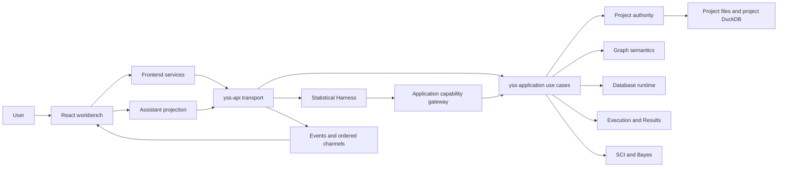
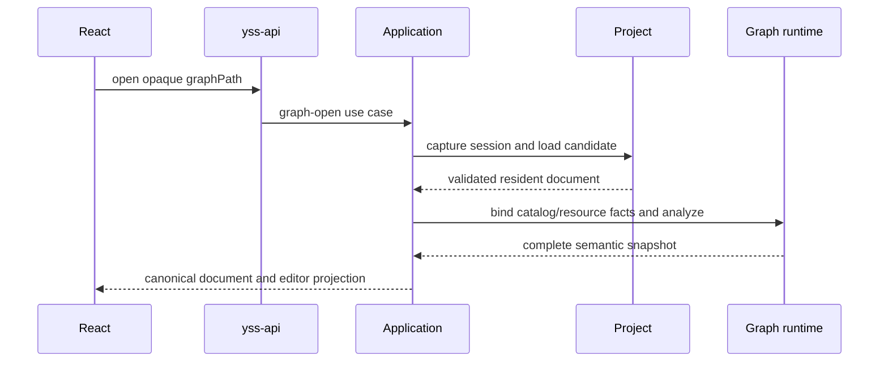

# YssBI 当前架构

> Status: Current
> Scope: 系统上下文、authority、依赖方向和主要运行链路
> Canonical owners: 本文拥有系统级心智模型；专项 contract 由文末索引中的文档和源码拥有
> Update when: 顶层 authority、依赖方向、composition root 或跨子系统主链路改变时

YssBI 是基于 Tauri 2 的桌面数据分析 IDE。用户在 React 工作台中管理项目、数据库、Analysis Graph、统计结果和 Assistant；Rust 负责所有已提交业务状态、持久化、编译执行和科学计算。本文只提供进入系统所需的总览，不维护完整 crate 清单、命令矩阵、门禁实现或重构历史。

## 1. System context



`src-tauri/src/lib.rs` 是桌面 composition root：构造 Project、Application、Execution、Diagnostics、Harness 和 platform adapters，并把它们注入 Tauri。`yss-api` 是唯一 Tauri transport seam，只向 composition root 暴露 canonical invoke handler；业务 workflow 不属于 transport。

## 2. Authority model

| 状态或事实                                                                   | 唯一 authority                                   | 非 authority 投影                           |
| ---------------------------------------------------------------------------- | ------------------------------------------------ | ------------------------------------------- |
| 已提交 Project、资源、revision、history                                      | Rust Project crates                              | React Project stores、Workbench panels      |
| Graph document 的已保存版本                                                  | Rust Project / Graph document owners             | `GraphDraftSession` 中未保存 draft          |
| resolved type、schema、lineage、diagnostics、coercion、kernel specialization | Rust `GraphSemanticSnapshot`                     | Editor/Canvas/Problems projection           |
| Database declaration、physical runtime 和 schema                             | Rust Project + Database crates                   | Data explorer 和 editor projection          |
| Execution、result state、payload 和 Pin history                              | Rust Execution `ResultStore`                     | Result、Inspect 和 preview UI               |
| Statistical algorithms 与 Bayes worker result                                | SCI/Bayes owners                                 | report/chart presentation models            |
| Harness session、turn、workflow、ledger、memory 和 ordered events            | Rust Statistical Harness + persistence ports     | assistant-ui ExternalStore projection       |
| Root workbench topology、placement、active group/panel 和 edge state         | live root Dockview instance                      | pane-local metadata keyed by panel identity |
| 应用级 computation settings                                                  | Rust settings service                            | Settings UI draft/projection                |
| 本地偏好和临时交互状态                                                       | React `localStorage`、Zustand 或 component state | —                                           |

Rust 与 React 之间只允许单向投影加显式 draft：React 不维护第二份 committed model，也不与 Rust 进行双向 merge/reconcile。Save 成功后采用 Rust 返回的 canonical state；失败时本地 draft 保持 dirty。

身份必须按语义分离。Project instance/session、resource path、Graph session、node/pin/connection UUID、run/result、Dockview panel/group 都不是可互换的 ID。`events/...`、`functions/...`、`variables/...` 和 `databases/...` 等资源路径跨 IPC 时是 opaque value，前端不得从字符串结构推导领域状态。

## 3. Layer and dependency direction

后端依赖从 framework/transport 指向 application，再指向 domain contract 和注入的 adapter：

```text
Tauri composition root
  → yss-api transport
      → yss-application use cases
          → Project / Graph / Database / Execution / SCI contracts
              → pure persisted contracts
          → injected backend adapters
```

- command 只解析和校验输入、映射 DTO/error、调用 use case，并在 commit 后交付事件或 channel；
- Application 组合跨 owner 用例和 currentness gate，不重新实现 Project、Graph、Database 或 SCI 规则；
- domain crate 不依赖 Tauri、React、command schema 或具体基础设施；
- adapter 实现窄 port，不反向拥有 session、approval、project 或 workflow authority。

前端依赖方向是：

```text
app composition / routing
  → modules/*/public
  → features/application
      → features/core and features/domain
      → services
  → components/ui and shared presentation
```

`app/` 组合窗口、路由和跨业务 contribution；`modules/` 拥有 panel/window/editor UI，并通过根 `public.ts` 暴露；`features/application/` 编排用户用例；`features/core/` 保存领域投影和共享运行态；`features/domain/` 保存无 UI/framework 依赖的规则；`services/` 适配 IPC。普通 invoke 统一经过 `src/services/ipc/invokeCommand.ts`。

这些方向由可执行架构门禁维护，分类算法和 policy 见[架构门禁](../development/ARCHITECTURE_GATES.md)，完整 workspace 索引见[生成的 Module Map](../reference/MODULE_MAP.md)。

## 4. Project lifecycle

活动项目以一个 application session 为边界：

```text
Application session
├─ Project authority and project session
├─ Database runtime session
├─ Graph registry/runtime facts
├─ Execution runtime and ResultStore
└─ session generation / admission state
```

Project replacement 先关闭旧 session 的新任务准入并 drain 或取消活动工作，再构造和验证 candidate session，最后原子替换。旧 session 的 late event、result、database handle 和 Graph projection 因身份或 generation 不匹配而被拒绝；前端在 hydrate 新项目之前先清理旧的 backend-owned projection。

Project 文件、resource revision、history 和提交事务由 Project owner 管理。Graph resource 可以存在于磁盘和 revision index 中但保持 unloaded；create/duplicate 只声明新资源，不为了发布事件而临时加载。需要 resident document 的 load/patch/move 路径统一经过 Project 的受验证安装边界。

典型打开链路：



## 5. Graph compile and execute overview

Analysis Graph 只表达数据端口和数据依赖。Canvas mutation 更新前端未保存 draft；Rust 以无状态 domain operation 校验 mutation，并在同一 command response 返回 candidate document 与完整 projection，但在 Save 前不改变 committed Project authority。

```text
Open → Frontend Draft ──→ Compile complete draft ──→ immutable cached artifact ──→ Execute
                      └──→ locked atomic Save ──────→ committed Project state
```

- Compile 对完整 draft 求解并产生 content-addressed artifact，不保存 Project；
- Save 校验并原子覆盖完整 document，不隐式 Compile；
- Execute 只接受与当前 draft/source hash 精确匹配的 artifact；
- Projection 与 Compiler 消费同一个 `GraphSemanticSnapshot`；
- execution result 进入 Rust `ResultStore`，用户程序输出进入独立 Run Output stream；
- Graph Problems 是完整 projection 的领域事实，不进入 operational logs。

完整的 Draft、Projection、Compile、Save、Execute、Problems、Results 和 Run Output contract 只在 [Graph 与 Execution](GRAPH_AND_EXECUTION.md) 维护。

## 6. Database and scientific computation

Database 用例由 Application 组合 Project declaration authority 和 session-scoped Database runtime：

- typed import source 在 transport 边界解析；
- project DuckDB 保存表内容、physical schema 和 display metadata；
- 大表 query/edit/profile/export 保持在 Rust，使用分页、列投影、SQL aggregate 或批处理；
- Polars materialization 只用于适合内存处理的路径；
- mutation 在锁外执行 I/O，并在最终 Project gate 重新验证 session/revision 后提交。

科学计算保持 backend-neutral contract：

```text
Application / Execution scientific port
  → yss-sci-contract
      → yss-sci-runtime → Rust algorithms
      → Bayes worker port → Julia adapter
```

Rust algorithms 拥有统计数值和 typed result；React 只把 authoritative DTO 转换为 presentation model。Julia process/runtime、Bayes model validation、worker protocol、artifact 和 result 各有独立 owner，Application 只编排它们，不让 worker detail 泄漏到 Graph kernel 或 IPC command。

## 7. Statistical Harness

当前 Assistant 通过 Rust-authoritative Harness 工作：

```text
Assistant UI projection
  → yss-api ordered Harness commands/channel
  → yss-statistical-harness
      → AgentDriverPort → yss-agent-rig
      → CapabilityGatewayPort → yss-application
      → persistence ports → SQLite adapter
```

Harness 拥有 session、turn、workflow、tool ledger、approval、memory、knowledge retrieval 和 ordered event sequence；它只通过 typed capability gateway 访问业务能力。React 根据 snapshot/event replay 重建界面，不拥有 conversation 或 workflow state。当前实现与未接入目标分别见 [Statistical Harness](STATISTICAL_HARNESS.md) 和 [Harness roadmap](../roadmap/STATISTICAL_HARNESS.md)。

## 8. Runtime signals

YssBI 不使用一条“万能日志”承载所有反馈：

| 信号                    | 语义                                    | Canonical owner                                                          |
| ----------------------- | --------------------------------------- | ------------------------------------------------------------------------ |
| Graph Problems          | 当前 draft 的 resolved domain facts     | [Graph 与 Execution](GRAPH_AND_EXECUTION.md)                             |
| Results / Pin history   | 可查询的执行产物                        | [Graph 与 Execution](GRAPH_AND_EXECUTION.md)                             |
| Run Output              | 有序的用户程序 stdout/stderr            | [Graph 与 Execution](GRAPH_AND_EXECUTION.md)                             |
| Logging                 | 持久/console 技术观察                   | [Runtime Signals](RUNTIME_SIGNALS.md)                                    |
| Operational diagnostics | Logs UI 的有界、可恢复观察投影          | [Runtime Signals](RUNTIME_SIGNALS.md)                                    |
| IPC error               | 稳定 machine-readable command rejection | [`yss-api` transport contract](../../src-tauri/crates/yss-api/README.md) |
| User feedback           | 本地化交互反馈                          | React application/view                                                   |

日志和 diagnostics 都是 sanitized、bounded、lossy、non-authoritative；不得驱动业务状态。具体容量和阈值由源码常量及测试拥有，不在总架构中复制。

## 9. Subsystem documentation index

| 变更范围                         | 先阅读                                                                                                   |
| -------------------------------- | -------------------------------------------------------------------------------------------------------- |
| Graph、编译、执行、结果或输出    | [Graph 与 Execution](GRAPH_AND_EXECUTION.md)                                                             |
| 工作台布局、面板身份或生命周期   | [Workbench Dockview](WORKBENCH_DOCKVIEW_ARCHITECTURE.md)                                                 |
| 日志、diagnostics、错误或反馈    | [Runtime Signals](RUNTIME_SIGNALS.md) 与 [`yss-api` README](../../src-tauri/crates/yss-api/README.md)    |
| Statistical Harness 或 Assistant | [Statistical Harness](STATISTICAL_HARNESS.md)                                                            |
| command、event、channel 或 DTO   | [`yss-api` README](../../src-tauri/crates/yss-api/README.md)                                             |
| Project、Database、SCI、Julia    | [文档入口](../README.md#focused-implementation-contracts)中的 owner README                               |
| 架构 policy 或 source 分类       | [Architecture Gates](../development/ARCHITECTURE_GATES.md)                                               |
| 本地命令和交付                   | [Local Workflow](../development/LOCAL_WORKFLOW.md) 与 [Change Process](../development/CHANGE_PROCESS.md) |

历史重构说明放入 decision 或 version 文档；尚未完成的能力放入 roadmap。本文不记录“旧 owner 已删除”之类的时间性描述。
