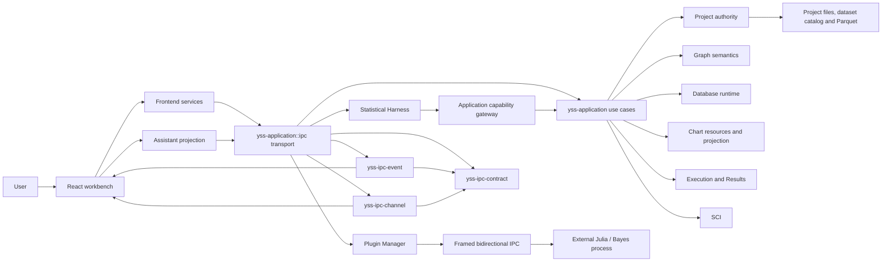

# YssBI 系统架构

> Status: Current
> Scope: 系统上下文、状态所有权、跨模块依赖与主要数据流
> Canonical owners: 本文只维护系统级关系；模块契约由源码旁 README 维护，开发约束由适用的 .rules 维护
> Update when: 本模块的公开入口、状态归属、生命周期或契约改变时

## System context



`src-tauri/src/lib.rs` 的业务入口依赖为 `yss-application`，另注册本地平台插件 `tauri-plugin-tracing` 与官方 Tauri 插件。日志插件先安装采集、SQLite 和日志 Channel；Application runtime 安装业务服务、解析业务路径、显示主窗口，并直接构造内部 `ipc::CommandRuntime`。应用命令注册表、schema、error、执行通道编码和图活动与读投影同步都在 `yss-application::ipc`，日志命令使用插件自己的命名空间。Event、中立 Channel 与共享 Contract 保持独立，且不反向依赖 Application。业务 workflow 与状态继续由应用用例和领域 owners 持有。

Application 按 `session`、`project`、`database`、`graph`、`chart` 聚合用例。图运行准备、执行交接和 Results 用例收入 `graph`；底层 Graph 与 Execution crates 继续独立。`session` 负责应用会话装配和替换；不可变 `NodeComponents` 组合节点定义与实际 kernel registry，校验绑定后供新会话复用。Chart 使用数据库查询及纯投影，共享图表呈现组件，不另建执行器或结果仓库。实际入口见 [Application 说明](../../src-tauri/crates/yss-application/README.md)。

原生窗口几何由根包装配官方 Window State 插件，恢复和保存不经过自有业务 command。
窗口关闭与 FlexLayout 布局的分工见 [Workbench 窗口契约](../../src/modules/workbench/README.md#81-原生窗口几何与关闭)。

## Authority model

| 状态或事实                                                                   | 唯一 authority                                   | 非 authority 投影                                            |
| ---------------------------------------------------------------------------- | ------------------------------------------------ | ------------------------------------------------------------ |
| 已提交 Project、资源、revision                                               | Rust Project crates                              | React Project stores、Workbench panels                       |
| Graph 当前文档、历史与保存指纹                                               | Rust Project / Graph document owners             | 当前编辑状态的只读投影                                       |
| resolved type、schema、lineage、diagnostics、coercion、kernel specialization | Rust `GraphSemanticSnapshot`                     | Editor/Canvas/Problems projection                            |
| Database declaration、physical runtime 和 schema                             | Rust Project + Database crates                   | Data explorer 和 editor projection                           |
| Execution、当前 result identity、payload 和 provenance                       | Rust Execution `ResultStore`                     | Result 面板、独立结果查看器和 preview UI                     |
| Statistical algorithms 与插件计算                                            | SCI / 独立插件进程；项目结果由 Core 提交         | report/chart presentation models                             |
| 插件安装、启用、任务账本                                                     | Rust Plugin Manager                              | 插件列表与隔离页面                                           |
| Harness session、turn、workflow、ledger、memory 和 ordered events            | Rust Statistical Harness + persistence ports     | assistant-ui ExternalStore projection                        |
| Root workbench topology、placement、active group/panel 和 edge state         | live root FlexLayout Model instance              | pane-local metadata keyed by panel identity                  |
| JSON result page composition and UI intent receipts                          | Rust Application presentation session            | React validated page projection / existing workbench actions |
| 本地偏好和临时交互状态                                                       | React `localStorage`、Zustand 或 component state | —                                                            |

Rust 与 React 之间只允许单向投影加显式 draft：React 不维护第二份 committed model，也不与 Rust 进行双向 merge/reconcile。Save 成功后采用 Rust 返回的 canonical state；失败时本地 draft 保持 dirty。

前端 Project hydration 由 `features/application/project/projectHydration.ts` 编排准备、投影提交和清理，并返回包含 project instance 与 publication revision 的 `ProjectLoadReceipt`。`projectIOStore.ts` 只保存已安装投影的状态和图加载运行态；加载回执不携带第二份项目内容。资源类别取自 Rust 索引中的显式字段，客户端资源键编码保留原始 opaque path。

设置页提供 AI 与外观偏好，由客户端持久化。配色由 `appearance.colorTheme` 选择的只读主题预设统一派生；主题选择与亮／暗模式的主题记忆在同一次状态更新中提交，界面、图表和表格共用主题配色。图文档通过显式 Save 提交。

客户端设置跨窗口只广播已提交的字段补丁。每个窗口保留防抖期间的本地待提交字段，远端补丁按字段合并，本地待提交值优先；同一字段在没有本地待提交值时采用收到的更新。保存时重新读取持久化设置并合并本地补丁，避免整份旧快照覆盖其他窗口的独立修改。接收更新不回声广播。本地读取与事件接收共用字段解析器，缺失字段可补默认值，已知字段类型错误则拒绝输入；原生窗口状态不进入此协议。

缺失值策略、判秩、收敛和数值保护阈值由各算法的契约与实现管理。Graph 线性回归当前仅接收有限数值并采用 Reject 策略，客户端偏好不参与统计计算。相关数值策略见 [SCI](../../src-tauri/crates/yss-sci/README.md) 与 [Linalg](../../src-tauri/crates/yss-sci-linalg/README.md)。

命名常量属于 GraphDocument，在 Event/Function 的 Details 中通过后端当前图编辑，并随图保存。没有独立全局变量资源或变量 revision。资源命令 receipt 与事件回声按提交身份去重。项目关闭使用 `clearProjectProjection` 清空客户端投影，项目加载只从 Rust 当前 session 获取完整数据。

Project manifest 是 `yss-project` 的私有持久化模块。Chart 文档编辑和函数签名修改保留当前 Application session；只有需要替换运行时资源的操作才调用 `rebuild_application_session`。

节点编辑由 Application 的 graphEditing 发送 typed 命令，Rust Project 直接更新当前文档与可逆历史。前端消费统一 GraphEditOutcome 及只读投影；手动编辑通过显式保存写入正文，Assistant 编辑批次默认通过同一文件事务保存并保留撤销历史，无需打开图面板。

身份必须按语义分离。Project instance/session、resource path、Graph session、constant/node/pin/connection UUID、run/result、FlexLayout panel/group 都不是可互换的 ID。`events/...`、`functions/...` 和 `databases/...` 等资源路径跨 IPC 时是 opaque value，前端不得从字符串结构推导领域状态。

## Layer and dependency direction

后端依赖从 framework/transport 指向 application，再指向 domain contract 和注入的 adapter：

```text
Tauri composition root
  → yss-application::ipc commands / invoke_handler
      → yss-ipc-event → yss-ipc-contract
      → yss-ipc-channel → yss-ipc-contract
      → yss-ipc-contract
      → yss-application use cases
          → Project / Graph / Database / Execution / SCI contracts
              → pure persisted contracts
          → injected backend adapters
```

- command 只解析和校验输入、映射 DTO/error、调用 use case，并在 commit 后交付事件或 channel；
- Application 组合跨 owner 用例和 currentness gate，不重新实现 Project、Graph、Database 或 SCI 规则；
- 图编辑器投影由 `yss-graph-editor::projection` 从语义快照生成；Application 负责调用与身份重验，IPC 负责 wire 映射；
- Node 的协议、注册表和目录由 `yss-node-protocol`、`yss-node-registry`、`yss-node-catalog` 拥有；Graph 消费这些节点定义并解析图中实例，Node 不依赖 Graph。详细边界见 [Graph 与 Execution](../../src-tauri/crates/yss-application/src/graph/README.md#module-ownership)；
- domain crate 不依赖 Tauri、React、command schema 或具体基础设施；
- adapter 实现窄 port，不反向拥有 session、approval、project 或 workflow authority。

前端依赖方向是：

```text
app composition / routing
  → modules/*/public
  → features/application
      → features/core and features/domain
      → services
  → components/ui and shared presentation
```

`app/` 组合窗口、路由和跨业务 contribution；`modules/` 拥有 panel/window/editor UI，并通过根 `public.ts` 暴露；`features/application/` 编排用户用例；`features/core/` 保存领域投影和共享运行态；`features/domain/` 保存无 UI/framework 依赖的规则；`services/` 适配 IPC。普通 invoke 统一经过 `src/services/ipc/invokeCommand.ts`。

这些方向继续作为实现与审查约束。前后端通过实际依赖、模块可见性、代码审查和受影响业务测试复核，不再运行源码架构扫描或维护逐符号的测试许可表。检查范围见[架构复核与文档检查](../development/ARCHITECTURE_GATES.md)，完整 workspace 索引见[生成的 Module Map](../reference/MODULE_MAP.md)。

## Graph editing and execution overview

Analysis Graph 只表达数据端口和数据依赖。Canvas mutation 向 Application 提交类型化编辑意图，Rust 原子更新 Project 当前文档、可逆历史与编辑版本，并返回只读投影。React 仅保留拖动、输入等临时交互状态。显式 Save 才持久化图正文。

```text
Open → Rust current GraphDocument ──→ Resolve / diagnostics / result validity
                      ├──→ Run: prepare immutable plan → Execute
                      └──→ explicit Save → project files + saved-content fingerprint
```

- 编辑解析对当前文档求解，按语义与资源依据复用缓存，交付诊断、可运行性和局部结果有效性；
- Save 校验并原子覆盖完整 document，独立于运行；
- Execute 捕获当前 document 与语义身份，在内部准备匹配计划并重验 session 与实际依赖；
- Projection 与执行计划准备消费同一个 `GraphSemanticSnapshot`；
- execution result 进入 Rust `ResultStore`；运行失败经 typed channel 投影到 Output panel；
- Graph Problems 由完整 projection 交付；普通语义阻断与内部 command failure 分开处理。

模块入口见 [Graph application](../../src-tauri/crates/yss-application/src/graph/README.md)，执行细节、结果读取和 UI 展示各自放在对应模块 README。

## Runtime signals

YssBI 不使用一条“万能日志”承载所有反馈：

| 信号               | 语义                                    | Canonical owner                                                                                       |
| ------------------ | --------------------------------------- | ----------------------------------------------------------------------------------------------------- |
| Graph Problems     | 当前 draft 的 resolved domain facts     | [Graph 与 Execution](../../src-tauri/crates/yss-application/src/graph/README.md)                      |
| Results / 当前输出 | 可查询的执行产物                        | [Graph 与 Execution](../../src-tauri/crates/yss-application/src/graph/README.md)                      |
| Graph 运行失败     | 当前图的失败摘要与节点定位              | [Graph 与 Execution](../../src-tauri/crates/yss-application/src/graph/README.md)                      |
| Logging            | 结构化运行观测、持久历史与 console      | [Runtime Signals](../../src/features/application/observability/README.md)                             |
| IPC error          | 稳定 machine-readable command rejection | [`yss-application::ipc` transport contract](../../src-tauri/crates/yss-application/src/ipc/README.md) |
| User feedback      | 本地化交互反馈                          | React application/view                                                                                |

运行观测统一进入结构化日志；日志是 sanitized、bounded、lossy、non-authoritative，不驱动业务状态。具体容量和阈值由源码常量及测试拥有，不在总架构中复制。
