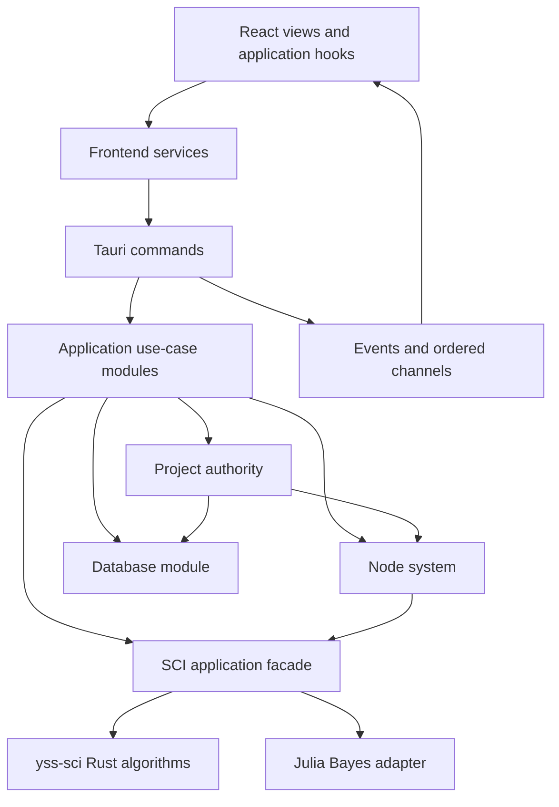
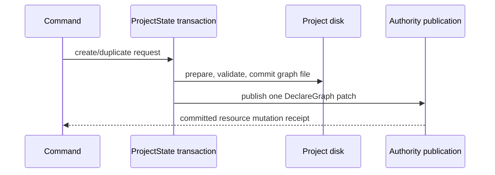
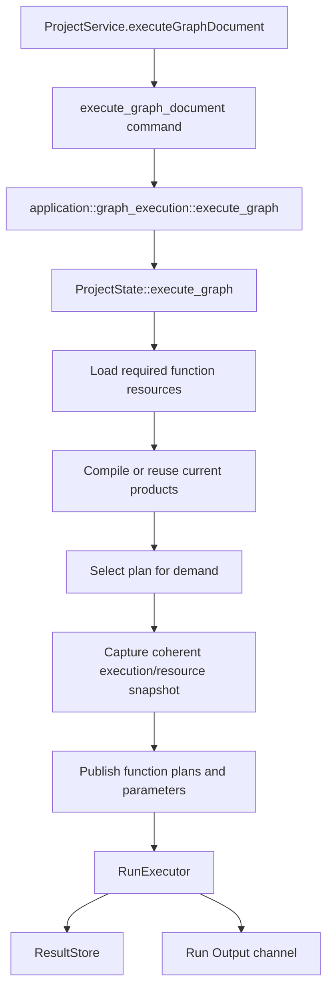

# YssBI 当前架构

本文档描述当前工作树中的实现，而不是目标蓝图。YssBI 是基于 Tauri 的桌面数据分析 IDE：React 负责交互与投影，Rust 负责项目 authority、图编译与运行、数据库语义和科学计算编排。

专项文档：

- [诊断、IPC 错误、Results 与 Run Output](./DIAGNOSTICS_ERRORS_AND_OUTPUT.md)
- [Workbench Dockview 架构](./WORKBENCH_DOCKVIEW_ARCHITECTURE.md)
- [Database 实现说明](../../src-tauri/src/database/README.md)
- [SCI 应用模块说明](../../src-tauri/src/sci/README.md)
- [Julia Bayes worker protocol](../../src-tauri/julia/README.md)

## 1. 架构语言与方向

本文使用以下术语：

- **module**：具有 interface 与 implementation 的代码单元。
- **interface**：调用方必须知道的类型、顺序约束、错误模式和性能特征。
- **seam**：module interface 所在的位置，可在此替换行为而不修改调用方。
- **adapter**：在 seam 上满足 interface 的具体实现。
- **depth**：一个较小 interface 隐藏并提供多少行为。
- **leverage**：调用方从深 module 获得的能力复用。
- **locality**：复杂度、修改和验证集中在一个 implementation 内。

当前后端的主要依赖方向是：



`commands/` 是 transport seam，不是业务 workflow 的归属。复杂行为进入 application、project、node_system、database 或 sci module，以提高 depth、leverage 和 locality。

`application/` 拥有跨 module 的 database use-case orchestration；`project/` 拥有 project/session authority、resource revision、commit 与 coherent snapshot，并直接依赖 `database/` 提供的存储和 runtime primitives。生产代码中的 `project/` 不依赖 `application/` 或 `commands/`；该约束由 Rust production-module architecture audit 执行。

## 2. 顶层目录与 authority

| 路径 | 当前职责 |
|---|---|
| `src/` | React views、application hooks、Zustand 投影、IPC adapter 和 UI |
| `src-tauri/src/commands/` | Tauri transport、DTO 转换、错误映射、event/channel 交付 |
| `src-tauri/src/application/` | 跨 module 用例编排 |
| `src-tauri/src/project/` | project/session authority、resource revision、事务提交与 publication、持久化协调和 coherent snapshots |
| `src-tauri/src/node_system/` | graph document、catalog/registry、analysis、compiler、plan 与 runtime |
| `src-tauri/src/database/` | DatabaseDecl/DatabaseInstance semantics、DuckDB binding/storage、schema metadata、query/edit/history/overview/export primitives |
| `src-tauri/src/schema/` | 可序列化 command/event wire DTO 与转换；不拥有 project 或 database authority |
| `src-tauri/src/sci/` | 主应用的科学计算 interface、typed models 与 backend adapters |
| `src-tauri/sci/` | 独立 `yss-sci` Rust 数值算法 crate |
| `src-tauri/src/julia/` | Julia runtime/worker host、typed worker errors 和 task ownership |
| `src-tauri/julia/` | Julia worker assets 与 Bayes operation |
| `src-tauri/src/tabular/` | 变量 tabular snapshot、canonical handle 与 DataFrame I/O |
| `src-tauri/src/diagnostics/` | 单一 `tracing` 管线、sanitization、bounded delivery 与 JSONL |
| `src-tauri/src/window_state/` | 后端权威窗口几何状态与原子持久化 |

Rust 与 React 的职责单向流动：Rust 保存 domain authority，React 只保存 UI 状态和后端投影。资源路径是 opaque identity；graph 使用 `events/...` 或 `functions/...`，database 使用 `databases/{database-id}`，variable 使用 `variables/{VariableId}`。

## 3. 前端组织与 IPC

前端依赖方向是：

```text
views
  → features/application
      → features/domain
      → features/core
      → services
components/ui and shared/ui
```

- `views/` 组合 screen/window，不直接拥有后端 workflow。
- `features/application/` 编排用户用例与生命周期。
- `features/core/` 保存 domain-scoped Zustand 投影和共享基础设施。
- `services/` 是普通 Tauri invoke 的 adapter；统一经 `src/services/ipc/invokeCommand.ts` 解析 `{ code, details, incidentId }`。
- `components/ui/` 使用 shadcn primitives；用户可见滚动使用 `ScrollArea`。

主窗口 chrome 的层级固定为：顶部 `Menubar`（包含 title/menu/window controls），中部 flex row 中只有一个 root `DockviewReact`，底部 `BottomBar` status bar。Settings 与 node documentation dialogs 作为 overlay 留在工作台之外。

`Workspace` 的 root `DockviewReact` 是所有顶层 panels 的唯一 topology authority：左侧 native Activity edge group 直接承载 `Project`、`Nodes`、`Data`、`Commands` 四个 panels；editor、Details、Inspect、Result、Logs 和 Output 由同一个 root 继续承载。Activity tabs 只允许在该 left edge group 内原生重排，普通 panels 不得进入，Activity panels 不得离开。唯一保留的 nested Dockview 位于 root `Logs` panel 内，其 authority 仅限 log-domain panels 的局部 topology、顺序与 active state；root 仍拥有 `Logs` panel 本身的位置、尺寸和可见状态。

- Zustand 只保存 modal 等非 placement UI 状态，不镜像任何 panel placement、visibility 或 Activity active tab。
- `Details` 与 `Inspect` 是按需创建的 root singleton panels，打开时从当前 editor session context 解析 resource/detail target、active editor group 和 node selection，而不是常驻右侧 leaf。
- Result 是 root Dockview 中可并存的 multi-panel：`resultKey` 标识并 upsert logical result panel，opaque `resultId` 标识该 panel 当前从 Rust `ResultStore` 读取的 payload。
- `Logs` 与 `Output` 默认位于 root 的 native bottom edge group；该 group 使用 bottom header position，因此 content 在上、tabs 在下，尺寸与 collapse 仍由 root Dockview 原生管理。
- root layout 只在启动 hydration 时恢复；当前按 window label 隔离的 key 是 `yssbi-workbench-layout:<window-label>`（空 label 回退为 `main`），payload 只有 `root` 与 `nested.logs`，不含版本字段、preferences、迁移或旧 reader。Project replacement 不会再次从该 key 恢复 root topology。

## 4. Commands → application → domain

### 4.1 Command interface

Tauri command 只负责：

1. 解析和验证 IPC 输入。
2. 将 DTO 转换为 application/domain 类型。
3. 必要时把阻塞工作放入 blocking pool。
4. 调用 application 或 authoritative domain interface。
5. 映射为稳定 `CommandError` wire。
6. 在 authority commit 后交付 project event，或通过有序 channel 交付运行流。

Command 不拥有长 workflow、文件系统事务、graph compiler、database 编辑规则或统计实现。Event/channel 交付失败可以形成 transport error，但不会把已提交的 authority receipt 回滚成未发生。

### 4.2 Application modules

`src-tauri/src/application/` 当前提供以下主要深 module：

| Module | Interface 提供的 leverage | Implementation 所在 locality |
|---|---|---|
| `project_lifecycle` | load/clear/create/save-as/delete 的用例结果 | ProjectState、registry 与恢复状态编排 |
| `catalog_compatibility` | 基于 graph revision 的兼容 catalog | coherent catalog snapshot、projection 与 currentness validation |
| `graph_execution` | typed request、RunEvent/RunOutput delivery bridge、delivery report | 调用 ProjectState execution 并保留 terminal delivery 事实 |
| `database` | typed import/read/mutate/save/export 用例 | 编排 ProjectState authority 与 database primitives、锁外 I/O 和最终 commit |
| `bayes` | Bayes task、status、result/artifact 生命周期 | `BayesBackend`、project data materialization 与 owned artifacts |

`database_schema` 从 coherent project resource snapshot 组合 database/variable query DTO；DuckDB runtime binding 与 storage metadata 属于 `database/`，`ColumnInfoDTO` conversion 属于 `schema/`。

`hypothesis` 和 `pin_preview_generation` 是更窄的 application modules。它们同样把 transport 与 domain implementation 分开。

典型链路：

```text
command_project/lifecycle
  → application/project_lifecycle
  → project

command_node_system
  → application/catalog_compatibility or application/graph_execution
  → project
  → node_system

command_dataframe
  → application/database
  → project + database

command_bayes
  → application/bayes
  → sci::api::bayes::BayesBackend
  → JuliaBayesBackend
```

## 5. Project authority 与资源生命周期

### 5.1 ProjectData 与 ProjectStore

`ProjectState.project_data` 中的 `ProjectData` 仍是项目、resident graph document、node/pin/connection、variable、worksheet、database declaration 和 computation settings 的 authoritative state。

`ProjectStore` 是随 project session 重建的 runtime state：

```text
ProjectStore
├─ runtime databases
├─ NodeRegistry and BuiltinCatalog
├─ KernelRegistry
├─ compiled parameters and FunctionPlanStore
├─ ResultStore
├─ SessionMemoization
├─ ProjectRunRegistry
└─ ProjectSessionId
```

`ProjectStore` 不替代 `ProjectData`。它提供不能或不应直接序列化的 runtime implementation。切换 project session 会替换这组 runtime objects，从而隔离旧 result、memo 和 run state。

`database/project.duckdb` 保存 table contents、physical schema 与 display metadata 等持久化事实。活动 session 中，`ProjectData.databases` 是 database resource identity/declaration 的 authoritative index；`ProjectStore.databases` 保存 session-bound `DatabaseInstance`、metadata snapshot 与 edit history。ProjectState 拥有 project identity、resource revision、commit/currentness validation 和 publication；项目重开时从 DuckDB 用户表重建 declarations/runtime bindings。

Graph resource 文件位于 `events/...` 与 `functions/...`。对未驻留 graph，磁盘文件和 graph revision ledger/index 仍声明资源存在；`ProjectData.graphs` 中缺失表示 unloaded，而不是资源不存在。

### 5.2 唯一 resident install primitive

`ProjectState::install_validated_resident_graph` 是 private canonical resident-install primitive，也是 live graph document 的唯一 insertion implementation。它只接收已经完成路径、document、revision 和结构校验的资源。

以下路径在需要使 graph resident 时委托给该 primitive：

- 显式 `insert_graph` interface；
- `InsertGraph` resource patch；
- graph load commit；
- loaded graph move，以及 move 时仍应 resident 的 referenced graphs。

这样把实际 insertion 集中在一个 locality。Public interface、patch 和 load workflow 不是并行 installer。

### 5.3 Create/duplicate 保持 unloaded

Graph create 与 duplicate 的顺序是：



关键 invariant：

- create/duplicate 写入磁盘资源；
- 成功后只发布一次 `DeclareGraph` authority mutation；
- `DeclareGraph` 只登记 path/revision，不写入 `ProjectData.graphs`；
- 新 graph 始终以 unloaded 状态发布，绝不 transiently load；
- 若 authority publication 失败，已提交文件走 transaction rollback。

Duplicate 对 loaded source 使用 coherent `ProjectData` snapshot，对 unloaded source 读取磁盘并核对 authoritative revision；两种 source path 都不会使 target 临时 resident。

### 5.4 Load 与 coherent snapshots

Graph load 先注册 resource lifecycle owner，在锁外读取/解析磁盘，再在 commit gate：

1. 验证 project session、lifecycle token 与 projection environment。
2. 验证 graph resource 并规范 function revision。
3. 通过 canonical resident installer 写入 `ProjectData`。
4. 合并合法 local variables 并提交 lifecycle guard。
5. 推进 authority generation、使 compile products 失效，并从同一 generation 生成 projection source。

`ProjectState::project_resource_snapshot` 在 `mutation_publication` guard 下组合：

- `project_instance_id`；
- `authority_generation`；
- `ProjectData` 中的 database declarations 与 variables；
- `ProjectStore` 中对应的 runtime database instances。

因此 graph compile/run 不会把旧 project declarations 与新 runtime store 混成一个 snapshot。Catalog、projection、history 和 execution 也使用带 project identity/revision/generation 的专用 coherent snapshots。

ProjectState 在 project identity、resource revision 和 authority generation 下捕获 coherent database schema metadata。Database 提供 DuckDB/Polars metadata primitives，`schema/` 保持现有 `ColumnInfoDTO` conversion，Application 将结果组合进已有 query DTO。

## 6. Node system 与 graph execution

### 6.1 Module 分层

`src-tauri/src/node_system/` 的依赖方向是：

```text
document + protocol
  → registry + catalog
  → semantic analysis + compiler
  → immutable plan
  → runtime
```

- `document/`：authoritative graph document、mutation、history 和 resource revision。
- `protocol/`：node type、port、value 与 dataframe protocol。
- `registry/`：trusted node implementation registry。
- `catalog/`：builtin descriptors、localized catalog 与 resource-bound creation metadata。
- `compiler/`：deterministic analysis、dynamic interface/schema resolution、specialization 和 lowering。
- `plan/`：immutable execution plan、demand selection 与 presentation contract。
- `runtime/`：plan-only synchronous executor、kernels、resources、memoization、results、streams 和 cancellation。
- `analysis/`：pure compilation basis/provenance、semantic snapshots、diagnostics 与 editor projections。

Runtime interface 明确要求只消费 immutable plan 和 plan-local handles；它不会在运行中查询 graph document 或 node registry。这一 seam 让 compiler 负责解释 mutable document，runtime 只负责执行已验证 plan。

### 6.2 当前执行链

前端调用 `execute_graph_document`，只执行显式 graph 和显式 `ExecutionDemand`：



`ProjectState::execute_graph` 负责 project identity、authority token、resource version basis、function plan generation、runtime resource leases 和 final commit gate。`ProjectRunRegistry` 管理 preparing/active/finalizing run，支持指定 run cancel，并在 project replacement 时关闭 admission、cancel 和 drain。

成功 run 的 variable effects 在 `RunExecutor` terminal success transaction 中 prepare/finalize；只有 authority 与 deadline/cancellation 仍有效才提交。Command 不实现这些规则，只负责 channel adapter、DTO/error 映射和 committed resource event。

## 7. Results、Run Output 与 diagnostics

这三条数据流语义不同，不能互相替代。

### 7.1 Results

`ProjectStore.results` 中的 `ResultStore` 是 project-session logical execution result 与 Pin history 的 authority。它提供：

- activation group 的原子 `Pending → Ready/Failed/Cancelled` transition；
- opaque、单调分配的 `ResultId`；
- result state、provenance、presentation、value contract 与 stored value；
- 每个 graph output 的 produced/reused 历史链；
- scalar inline read 与 sequence/data-series paging。

Frontend 通过 `ResultService` 调用 typed `get_result_descriptor`、`get_result_value`、`get_result_page` 和 `get_pin_result_history` queries。Project replacement 会替换 session `ResultStore`，使旧 result 与 Pin history 失效；旧 `ResultId` 不会 alias 新 project 的 result。

Public `RunEvent` wire 只包含 `{ run, kind }`。`GraphRunIdentity` 的字段是 `projectSessionId`、opaque `graphPath` 和 positive decimal-string `runId`。最小 lifecycle `kind.type` 是 `runStarted`、`runCompleted`、`runErrored` 和 `runCancelled`；`pinPreviewResultReady` 只公告 `output`、`generation` 与 `resultId`，`openResultWindow` 只公告 `resultId`。这些 event 是交付通知，不是 result authority；ordinary result publication 不发送 `resultGroupChanged` 或 `outputResultChanged` public stream event。

### 7.2 Run Output

用户 Print/stdout/stderr 使用独立 typed `RunOutputMessage`，与 `RunEvent` 共用有序 Tauri channel transport，但 wire shape 和前端 projection 分离。每条记录保留：

- `runId` 与严格递增 `sequence`；
- stdout/stderr stream；
- opaque `sourceGraphPath` 与 `sourceNodeId`。

Backend 每条文本最多 8 KiB，每个 run 最多 256 条文本；truncation/drop 通过 status event 明示。Frontend Output panel 维护有界投影并检测 sequence gap。Run Output 不进入 diagnostics。

### 7.3 Diagnostics

Rust `tracing` 是唯一 diagnostics pipeline。Recent storage、ingress、subscriber queue 和 JSONL 都是 bounded/lossy、sanitized、non-authoritative 的观察面。

`diagnostics/limits.rs` 中 private `DiagnosticLimits` 是 sanitizer 与 frontend validation 共享的 per-record limit source of truth；调用方不能建立另一套公开常量。Diagnostics 不驱动 workflow、domain state 或用户反馈，详细 contract 见专项文档。

## 8. Database module

### 8.1 Typed import 与 project DuckDB

IPC 只接受 `DatabaseImportSourceDTO`：`Csv`、`Parquet`、`Excel` 或 typed `Sql` engine。它不接受 runtime-only `InMemory` 或项目内部 `DuckDb` source。Command 将 import source 转换为内部 engine，再交给 `application::database`。

`database/project.duckdb` 保存 table contents、physical schema 与 display metadata 等持久化事实。活动 session 中，`ProjectData.databases` 是 database resource identity/declaration 的 authoritative index；`ProjectStore.databases` 保存 session-bound `DatabaseInstance`、metadata snapshot 与 edit history。ProjectState 拥有 project identity、resource revision、commit/currentness validation 和 publication；项目重开时从 DuckDB 用户表重建 declarations/runtime bindings。

### 8.2 Query 与编辑

DuckDB-backed instance 保持磁盘列存：

- page query 使用 `LIMIT/OFFSET` 并返回 DuckDB `rowid`；
- graph resource access 可以按列加载；
- column statistics、distribution 与 dataset overview 使用 SQL aggregate；
- DataView edit/undo/redo 使用增量 SQL，不先整表进入 Polars。

ProjectState 在 project identity、resource revision 和 authority generation 下捕获 coherent database schema metadata。Database 提供 DuckDB/Polars metadata primitives，`schema/` 保持现有 `ColumnInfoDTO` conversion，Application 将结果组合进已有 query DTO。

只有小表完整 materialization 才进入 `Loaded { dataframe, original, history }`；当前 in-memory edit threshold 为 50,000 rows。Ingest 以 50,000 rows 分批 append。

DuckDB delete-column undo 需要在 mutation 前捕获 reversible snapshot，上限为 50,000 rows 和 16 MiB。Snapshot 保存原 storage dtype 的可精确恢复表示、row IDs、row fingerprints 和 values；不支持精确恢复的 dtype 或超限 snapshot 会在 drop column 前拒绝。Cast operation 同样记录 `old_dtype`。

SQL path 将 identifier 与 string literal 分开引用；table/column identifier 使用 `quote_duckdb_identifier`，value/path literal 使用专用 quoting。JSON 到 Polars 的窄整数和 Float32 conversion 使用 `TryFrom`/range checks，避免静默截断。

### 8.3 Export 与 overview

DuckDB table 的 CSV/Parquet export 使用 DuckDB `COPY (SELECT ...) TO ...`，大表不会先完整物化为 Polars。Application module 先导出到 destination 的独占 sibling temp file，再在最终 project authority gate 下原子替换目标；失败时清理 temp。Loaded DataFrame 才使用 Polars writer。

Dataset overview 对 unavailable metric 使用 `null`，不伪造为 0。DuckDB-backed overview 中 `estimatedDataframeMemoryBytes` 与 `duplicatedRows` 为 unavailable；row/column count、schema 分类和 null completeness 仍由缓存 metadata 与 SQL 计算。

## 9. SCI 与 Julia

### 9.1 两层 Rust module

科学计算分为两层：

1. `src-tauri/sci/` 的 `yss-sci` crate：Rust 数值、回归、面板、时间序列和统计算法。
2. `src-tauri/src/sci/`：主应用 interface，包含 typed request/result、application-facing models、backend adapters 与 stable error mapping。

Graph kernels 和 commands 依赖 `crate::sci::api`，不直接依赖 Julia worker internals。这个 seam 将输入规范化、错误类型和 backend choice 集中起来。

`yss-sci` 不拥有 project data、DuckDB、编辑 history、DataFrame export、Tauri IPC 或 UI state；这些职责属于主 crate 的 database/project modules。

### 9.2 Production backend matrix

| Operation | 当前 production adapter |
|---|---|
| ACF/PACF | Rust：`backends::rust::time_series::acf_pacf` |
| Durbin-Watson/Ljung-Box/Breusch-Godfrey | Rust：`backends::rust::time_series::serial_tests` |
| t/Wald hypothesis tests | Rust：`backends::rust::stats::hypothesis` |
| Node regression/time-series statistics | Rust facade over `yss-sci` |
| Bayesian inference | Julia：`JuliaBayesBackend` 实现 `BayesBackend` |

Time-series application interface 直接调度 Rust production implementation，没有 Julia time-series adapter。Julia 是 Bayes seam 上唯一真实 production adapter。

Regression fit 不再把统计量仅当作松散 JSON。`RegressionFit.statistics` 使用 typed `RegressionStatistics` variants：`Linear`、`Binary`、`Prais`，并组合 typed coefficient/model statistics；系数统计同时保存权威 covariance matrix。Report JSON 从这些 typed statistics 显式投影 `betas`/`cov_beta` 与 binary model statistics，供 hypothesis UI 和展示 parser 使用。

### 9.3 Julia Bayes worker

Rust host 管理单个可重启 worker process、序列化 task request、progress/cancel 和 app-owned task directories。当前 Julia operation registry 只包含 `bayes_fit`。

`JuliaBayesBackend`：

- 从 project database snapshot materialize 必需列；
- 在 owned task directory 写 Arrow input、model/config、generated kernels 与 exchange manifest；
- 读取 typed inference metadata/artifact manifest；
- 将保留 artifact 的 task-directory owner 转交给 result；
- 按 stable worker error code 映射 Bayes error，不解析 diagnostic prose。

Worker assets 由 Rust embed，并通过 exclusive temp file、`sync_all` 和 atomic replace 更新。Task directory 必须是 `<app-data>/julia-worker/tasks/<task-id>` 的 canonical direct child；RAII owner 只清理仍满足该 ownership invariant 的路径。

## 10. Window state persistence

`WindowStateStore` 是窗口 geometry 的后端 authority。`set` 在串行 set lock 下：

1. clone 当前状态并产生 candidate snapshot；
2. 将 JSON 写入独占 temp file 并 `sync_all`；
3. 原子替换 `window_state.json`；
4. 只有持久化成功后才提交内存 candidate。

因此磁盘失败不会留下“内存已更新、磁盘仍旧”的半提交状态。主窗口在 Tauri setup 中先应用保存的 geometry，再显示，以避免默认尺寸闪烁。

## 11. 扩展规则

### 新 command

- 先在 application/domain module 建立小 interface；
- command 只添加 transport adapter、DTO/error/event mapping；
- frontend 在 `src/services/` 添加 invoke adapter；
- view 通过 application hook 使用，不直接 invoke。

### 新 graph node

- catalog/registry 声明 trusted descriptor 和 implementation；
- compiler lowerer 将 document/config 转成 immutable plan；
- runtime kernel 只消费 plan-local parameters/resources；
- logical output 进入 `ResultStore`，Print 进入 Run Output，内部观察使用 Rust `tracing` diagnostics。

### 新 scientific operation

- 纯算法放 `yss-sci`；
- 主应用 typed interface 放 `src-tauri/src/sci/api/`；
- 只有存在真实可替换 implementation 时才建立 backend seam；
- adapter 隔离外部 runtime，不让 worker details 泄漏到 command 或 graph kernel。

### 验证

本地命令矩阵见 [LOCAL_WORKFLOW.md](../development/LOCAL_WORKFLOW.md)。架构修改应优先验证 touched module，再运行项目规则要求的 broader checks，并始终执行 `git diff --check`。
