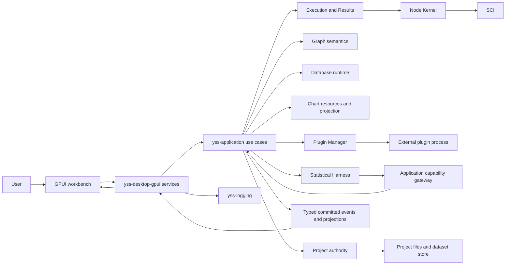

# YssBI 系统架构

> Status: Current
> Scope: 原生桌面、业务 authority、依赖方向与跨模块数据流
> Canonical owners: 本文只维护系统关系；模块契约由对应 README 维护
> Update when: 宿主、权威状态、依赖方向或跨模块关系改变时

## System context


```mermaid
flowchart LR
  USER[User] --> UI[GPUI workbench]
  UI --> NATIVE[yss-desktop-gpui services]
  NATIVE --> APP[yss-application use cases]
  APP --> PROJECT[Project authority]
  APP --> GRAPH[Graph semantics]
  APP --> DATABASE[Database runtime]
  APP --> CHART[Chart resources and projection]
  APP --> EXECUTION[Execution and Results]
  EXECUTION --> KERNEL[Node Kernel]
  KERNEL --> SCI[SCI]
  APP --> PLUGINS[Plugin Manager]
  PLUGINS --> EXT[External plugin process]
  APP --> HARNESS[Statistical Harness]
  HARNESS --> GATEWAY[Application capability gateway]
  GATEWAY --> APP
  PROJECT --> STORAGE[Project files and dataset store]
  APP --> FACTS[Typed committed events and projections]
  FACTS --> NATIVE
  NATIVE --> UI
  NATIVE --> LOGS[yss-logging]
```

根目录是纯 Cargo workspace，默认运行 [GPUI host](../../crates/yss-desktop-gpui/README.md)。
宿主组合原生窗口、执行器、日志和平台中立 ApplicationServices，直接调用类型化用例。
阻塞业务调用在 worker 中执行，指针交互不访问文件系统。
`react/` 是保留的参考源码和契约样本，不参与原生构建。

## Authority model

| 状态或事实 | 唯一 authority | 原生投影或暂态 |
| --- | --- | --- |
| Project、资源、revision | Rust Project | 项目目录和工作台视图 |
| Graph 当前文档、历史与保存身份 | Rust Project / Graph document | 只读编辑投影 |
| 类型、schema、lineage、诊断和 coercion | GraphSemanticSnapshot | Canvas / Details / Problems |
| 数据声明、运行时与 schema | Project + Database | 数据查询投影 |
| 运行身份、结果、payload 和 provenance | Execution ResultStore | Results 面板与查询租约 |
| 数值算法 | SCI / 外部计算插件 | 报告与图表呈现 |
| 插件安装、授权和任务账本 | Plugin Manager | 管理视图投影 |
| Harness 会话、turn、workflow 和 ledger | Statistical Harness + persistence ports | 宿主订阅投影 |
| 工作台拓扑、尺寸、选中和折叠 | 根 GPUI DockArea | 按面板身份查找的弱引用 |
| UI intent 回执 | Application presentation session | 原生执行队列 |
| 拖动、视口、输入和选择 | 所属原生视图 | 不提交的交互暂态 |

图视图只有单向只读投影与暂态输入。松开节点拖动后提交原 Application 编辑事务，
投影由后端完整替换；原生端不建立第二份 GraphDocument、撤销历史或保存身份。
显式 Save 才持久化手动图编辑，Assistant 编辑使用同一事务持久化完整当前图并保留历史。

身份按业务语义区分：项目实例、资源路径、图会话、节点/端口/常量、执行会话、run/result
和原生面板不是可互换的 ID。迟到的读取与回调不能安装到另一项目或图。
图常量属于 GraphDocument，不成为独立全局资源。

## Dependency direction

```text
GPUI desktop composition
  → Application services and typed use cases
      → Project / Graph / Database / Execution
          → domain contracts and infrastructure ports
  → yss-logging
```

Application 不依赖 GPUI 或窗口。Project、Graph、数据库、SCI 和通用 FS 不依赖桌面宿主。
`yss-harness-contract` 同时拥有 Harness 共享类型和 Assistant 公开读投影，不实现传输或保存业务状态。
插件进程协议属于 Plugin Manager / Plugin Protocol，与图执行和日志通知分别拥有生命周期。

`yss-filesystem` 拥有通用访问、事务和 watcher，不依赖仓库其他 crates。
`yss-node-kernel` 拥有独立于图的 invocation 值、冻结 registry 和内核适配；
Application 组合一个 registry 供准入与执行复用。科学调用方向为
Kernel → SCI Runtime → SCI → Linalg；只有 Linalg 持有 faer 和矩阵实现。

## Graph and execution

Analysis Graph 只表达数据端口与数据依赖。Project 提交图变更后生成匹配的语义投影；
Save 不运行图，Execute 不隐式保存。执行捕获文档与语义身份，在后端准备不可变计划，
缓存不成为前端生命周期。运行状态、失败、结果和 Problems 分别消费对应的后端事实。

结果查看通过原 Application 租约与有界页读取，不在 UI 重算统计量。面板真正关闭时释放租约，
拖动重挂载保留同一读取身份。普通重跑不替换已打开的保留结果。
细节见 [Graph application](../../crates/yss-application/src/graph/README.md)。

## Signals and lifecycle

| 信号 | 来源和归属 |
| --- | --- |
| Problems | 当前图的解析诊断 |
| Results | 已提交执行产物 |
| 运行失败 | 当前图匹配运行身份的失败摘要 |
| Logs | yss-logging 已提交的运行观测 |
| 操作拒绝与用户反馈 | 类型化 Application 错误，由原生宿主本地化 |

日志不重建诊断、结果或运行状态。Graph 执行事件只有安全身份和结果引用；
用户数据、文档、模型内容和密钥不进入运行日志。项目时间戳保持无时区钟面值。
窗口关闭、项目切换和显式保存由宿主调用已有 Application 用例，失败保留未保存状态。
工作台布局直接保存组件库的 DockAreaState，不镜像另一套拓扑。

模块入口见 [文档索引](../README.md)，待实现能力和各平台人工验收见
[GPUI 迁移](../roadmap/GPUI_MIGRATION.md)。宿主切换不表示功能迁移或验收已全部完成。
