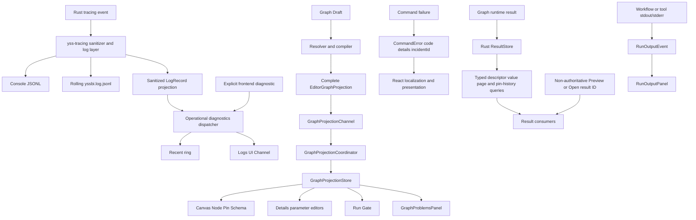

# Graph Problems、诊断、错误、结果与程序输出架构

本文档定义 YssBI 中 Graph Problems、技术诊断、错误、结果与程序输出的权威边界。目标不是把所有内容都写入一个日志，而是让不同语义的数据走独立链路，各自拥有明确的权威性、可靠性、保留和 UI 契约。

## 1. 权威性矩阵

| 信息                    | 权威来源                                                     | 传输                                                           | 保留                                           | UI 用途                                         |
| ----------------------- | ------------------------------------------------------------ | -------------------------------------------------------------- | ---------------------------------------------- | ----------------------------------------------- |
| Graph Problems          | 完整 Rust `EditorGraphProjectionDto`                         | Graph draft ACK + bounded latest-wins `GraphProjectionChannel` | 每个 Graph session 的最新 Projection snapshot  | `GraphProblemsPanel`、Canvas、Details、Run Gate |
| Logging                 | `yss-tracing` 的 Rust `tracing` 管线                         | 独立 bounded console/file workers                              | rolling JSONL；队列满时有损                    | 本地排障，不驱动业务状态                        |
| Operational diagnostics | Rust log 的 sanitized projection + 显式 frontend diagnostics | bounded dispatcher + Tauri Channel                             | 有损 recent ring                               | Logs UI 排障，不驱动业务状态                    |
| IPC error               | Rust `CommandError`                                          | command rejection                                              | 不单独保留；内部错误关联 incident              | React 按 `code` 本地化并选择反馈表面            |
| User feedback           | React application/view                                       | Zustand UI state / component state                             | 仅按交互需要                                   | `Alert`、`Dialog`、字段内错误、状态变化         |
| Results                 | Rust `ResultStore`                                           | typed query commands；run events 仅公告 Preview/Open result ID | project-session logical results 与 Pin history | Result/Inspect/Preview/presentation surfaces    |
| Program Output          | Rust Workflow/tool runtime                                   | ordered execution Channel                                      | 单次运行有界前端投影                           | 独立 Run Output 面板                            |

核心规则：

- 日志不是业务事实，不得通过读取日志决定保存、执行、选择或恢复流程。
- Problems 不是日志，而是完整 Resolved Graph Projection 的一部分；`GraphProjectionStore` 是前端唯一事实源。
- IPC error 不携带后端用户文案。
- `ResultStore` 是 result state、payload、history、provenance 与 presentation 的 authority；run event 只公告 Preview/Open result ID。
- Workflow/tool stdout/stderr 不写入 operational diagnostics。
- React 是应用错误文案、本地化和反馈表面的唯一所有者；可扩展 Rust 节点目录仅拥有确定性的节点元数据与编译器诊断模板，模板不得插入内部错误文本。



## 2. Logging 与 operational diagnostics

### 2.1 单一入口

Rust logging 统一使用 `tracing`，但 logging 与 operational diagnostics 是两个独立 subsystem。这里的 diagnostics 专指 `yss-diagnostics` 提供给 Logs UI 的技术记录投影，不是 Graph Problems。核心实现位于：

- `src-tauri/crates/yss-tracing/src/runtime.rs`：process-wide subscriber、过滤、console/file workers 与 rolling JSONL
- `src-tauri/crates/yss-tracing/src/layer.rs`：`tracing::Event → LogRecord`
- `src-tauri/crates/yss-tracing/src/sanitizer.rs`：统一脱敏与 per-record bounds
- `src-tauri/crates/yss-diagnostics/src/runtime.rs`
- `src-tauri/crates/yss-diagnostics/src/rust_projection.rs`
- `src-tauri/crates/yss-diagnostics/src/dispatcher.rs`
- `src-tauri/crates/yss-diagnostics/src/worker.rs`

Rust event 先在 `yss-tracing` 中形成已清理的 `LogRecord`，再并行投递到 console、rolling file 和可选 diagnostics projection。Operational diagnostics 不配置 subscriber，也不打开日志文件。

前端只通过显式 `logger.app/sys/exec/graph/data` 调用产生 diagnostics；`appLogger` 不替换全局 `console`。前端记录经小批量提交到 `submit_frontend_diagnostics`，随后与 Rust projection 共享同一 Rust 分配的 `streamId` 和 `sequence`。显式 frontend diagnostics 不反向进入 console 或 rolling JSONL。

禁止：

- `logger.notify`
- `tauri-plugin-log`
- 旧 `LogManager`、`get_logs`、`get_log_count`、`log-message` event
- 通过日志触发用户反馈或业务状态变化
- 把已翻译的 UI 文案作为专用日志类别

### 2.2 稳定记录契约

Rolling JSONL、console 和 Rust diagnostics projection 共享 `yss-tracing::LogRecord`：

```ts
interface LogRecord {
  timestamp: string;
  level: "trace" | "debug" | "info" | "warn" | "error";
  target: string;
  message: string;
  fields: Record<string, unknown>;
}
```

Operational diagnostics 在该记录的单向 Rust projection 或显式 frontend entry 上分配自己的 stream identity：

```ts
interface DiagnosticRecordDto {
  streamId: string;
  sequence: number;
  timestamp: string;
  level: "trace" | "debug" | "info" | "warn" | "error";
  origin: "rust" | "frontend";
  domain: "application" | "execution" | "system" | "graph" | "data" | "ui";
  target: string;
  event?: string;
  message: string;
  source?: string;
  fields: Record<string, unknown>;
}
```

`streamId + sequence` 只属于 operational diagnostics，是 Logs UI 去重和顺序的依据。Logging JSONL 不伪造该 identity；时间戳用于展示，不用于重建顺序。

### 2.3 背压与保留

当前默认边界分属两个 subsystem：

- Logging console/file output：各自独立 worker，queue 容量 1024；生产者仅使用 `try_send`。
- Logging JSONL：`app_log_dir()/yssbi.log.jsonl`，10 MiB 轮转，保留 5 个轮转文件。
- Operational diagnostics ingress：1024 条，生产者仅使用 `try_send`，不会等待容量。
- Operational diagnostics recent ring：5000 条。
- Operational diagnostics live batch：最多 128 条或约 16 ms。
- 每个 diagnostics 订阅者：8 个 batch 的独立 bounded queue；慢订阅者会被移除。

当 ingress 满时，记录允许丢弃。恢复后 dispatcher 在同一有序队列中写入一次 `diagnostics.records_dropped`，其 `droppedCount` 表示该段丢失数量。marker 不得越过导致队列满时已经接收的记录。

Logs UI 订阅使用 snapshot + live Channel。前端会检查 sequence 连续性；snapshot 握手期间溢出或出现 gap 时自动重连一次，不能静默推进 watermark。

Logging 与 operational diagnostics 都明确是有损、非权威数据。磁盘或 UI 消费者故障不得阻塞业务线程；一侧失败不得改变另一侧的业务行为。

### 2.4 过滤

无 `RUST_LOG` 时：

- release：仅第一方 `yssbi` / `yssbi_lib` / `yss_tracing` 的 INFO 及以上。
- debug：仅第一方 `yssbi` / `yssbi_lib` / `yss_tracing` 的 DEBUG 及以上。
- 第三方 target 默认 OFF。
- TRACE 只能通过显式 `RUST_LOG` 开启。

### 2.5 脱敏

`yss-tracing` 在任何输出或 Rust diagnostics projection 之前清理 `LogRecord`。console、JSONL 和 diagnostics projection 不得存在绕过 sanitizer 的 raw formatter。Frontend diagnostics 复用同一 sanitizer/limits，但只生成 `DiagnosticRecordDto`，不会因此成为持久日志。

sanitizer 至少执行：

- 敏感键脱敏：password、token、authorization、cookie、apiKey、connectionString、databaseUrl、private key 等。
- 禁止 payload 脱敏：DataFrame rows、cell values、document content、clipboard content。
- 内容级清理：Authorization/Cookie header、Bearer token、URI userinfo、常见 secret assignment。
- target/event/source/message、字段字符串、字段数量、JSON 深度、数组长度和总编码大小限制。

logging/diagnostic 调用点仍应遵循数据最小化：优先记录 ID、count、kind、digest 和稳定 code，不记录 SQL 正文、行值、文档正文或剪贴板内容。sanitizer 是最后防线，不是允许任意 `%error` / `?payload` 的理由。`diagnostic_skip_recent = true` 只跳过 diagnostics projection，不能关闭 console/file logging。

## 3. Graph Problems

### 3.1 完整 Graph Projection 是唯一事实源

Graph Problems 是 resolver/compiler 对当前 Graph Draft 的领域投影，不属于 logging 或
`yss-diagnostics`。Rust 在一次 resolve 中生成完整 `EditorGraphProjectionDto`：

```ts
interface EditorGraphProjectionDto {
  basis: ProjectionBasisDto;
  graphPath: string;
  sourceRevision: number;
  nodes: EditorNodeProjectionDto[];
  connections: EditorConnectionProjectionDto[];
  diagnostics: DiagnosticDto[];
  outcome: CompilationOutcomeDto;
  hasBlockingDiagnostics: boolean;
}
```

`projection.diagnostics` 是当前 Graph 的完整 canonical Problems 集合，覆盖 graph、resource、
connection、node、port 与 parameter 等位置。`node.diagnostics` 只是 Canvas、Node、Pin 和参数内联展示
所需的局部快速索引，不能替代顶层完整集合。Frontend `GraphProjectionStore` 将 topology、Pin、Schema、
parameter editor、diagnostics、outcome 与 `hasBlockingDiagnostics` 构造成同一个
`GraphEntityBucket` 并原子提交；不得增加第二个 authoritative `ProblemsStore` 或复制 Problems 数据。

当前 resolver producer 直接从稳定 compiler diagnostic vocabulary 生成未知节点、必填/非法参数、缺失
资源、未绑定输入、异常/孤立动态端口、未解析 Schema 与 value dependency cycle 等 Problems；这些领域
状态不会逐条写入 tracing。Value-cycle 判定由 Graph Analysis 统一拥有，compiler 与 editor projection
复用同一判断。

各消费者只从同一 projection 派生状态：

- Canvas 读取 Node、Pin、Schema 与局部 diagnostics；
- Details 读取参数编辑器及其局部状态；
- Run Gate 直接检查 `outcome.type === "success" && !hasBlockingDiagnostics`；
- `GraphProblemsPanel` 从顶层 `diagnostics` 生成完整问题列表。

关闭 Problems panel 不影响 projection 更新或执行阻断。运行按钮不得查询 panel、统计可见 rows，或把
Problems UI 当作 authority。

### 3.2 异步传输与恢复

Graph Draft mutation command 只同步返回包含 document/patch 与接受身份的
`GraphDraftAcceptedDto`。Rust 使用按 `projectInstanceId + graphSessionId + graphPath` 分区的 bounded
resolver queue；同一 Graph 只保留最新 pending request。后台 resolve 完成后通过
`GraphProjectionChannel` 发布完整 `GraphProjectionReplacementDto`，不会发送逐条
`problemAdded/problemRemoved` 事件。

当前边界为：resolver queue 最多保留 256 个不同 Graph key、每个 subscriber 最多保留 256 个不同
Graph key 的 pending event、单进程最多 16 个 subscriber，并最多跟踪 4096 个最新 Graph projection
identity。同一 key 的排队 request/event 原位覆盖为最新 generation；慢 subscriber 超界后关闭，由
snapshot 恢复，而不是无限增长或阻塞 resolver。

Frontend application-level `GraphProjectionCoordinator` 在 Problems panel 生命周期之外建立订阅，校验
project、Graph session、request generation 与 source revision，并将 Node、Pin、Schema、parameter、
diagnostics、outcome 和 run gate 原子提交到 `GraphProjectionStore`。Channel 断线、订阅竞态或 event
超时时通过 `get_graph_projection_snapshot` 恢复；snapshot 只保留每个 Graph session 的最新 publication。
Channel 结果若先于 command ACK 到达会先暂存，只有 ACK 身份匹配后才与 frontend-owned draft 一起采用。

显式 Compile、Save 与资源 mutation 仍可在自身 command response 中返回其事务性 projection；它们与
后台 draft resolve 使用同一个 store freshness gate，不形成第二事实源。`ProblemsChannel` 始终禁止。

Frontend panel 边界为：

- `src/modules/problems/internal/ui/GraphProblemsPanel.tsx`：只读取 focused Graph 对应的
  `GraphProjectionStore` bucket；由 `src/modules/problems/public.ts` 导出。
- `src/modules/output/internal/ui/RunOutputPanel.tsx`：输出 rows/status 只读取 execution output
  projection；来源显示也只使用 Execution Channel 携带的 opaque identity；由
  `src/modules/output/public.ts` 导出，不读取 Graph Projection。
- `src/modules/logs/`：只拥有 operational Logs UI，包括 `LogDomainDockviewHost` 与 `LogWindow`；
  不导出 Problems 或 Run Output panel。

Workbench 只使用 `viewId: "problems"` 与 `component: "Problems"`。Layout persistence 只接受当前
exact envelope 和 canonical identity；不保留旧 ID reader、字段转换或启动期重写路径。

### 3.3 与 tracing 的隔离

用户编辑期间预期出现的 compiler problems（例如未连接输入、schema 缺列、类型不匹配、无效参数或
orphan dynamic pin）只进入 Graph Projection，不逐条写入 `tracing`、`yss-diagnostics` recent ring
或 Logs UI。`tracing` 只记录 resolver 内部失败、compiler invariant violation、耗时、缓存命中、
stale result 丢弃、取消与 affected graph count 等技术事件。

内部错误可以同时产生稳定、可展示的 projection problem/outcome 与带技术上下文的 tracing record，
必要时通过 incident ID 关联排障；两条链路仍保持独立，Logs 不能成为 Problems 的恢复或状态来源。

## 4. IPC error

### 4.1 唯一 wire shape

所有 Tauri command rejection 使用：

```json
{
  "code": "project_not_found",
  "details": null,
  "incidentId": null
}
```

内部错误示例：

```json
{
  "code": "internal_error",
  "details": null,
  "incidentId": "8f5b..."
}
```

Rust 类型为 `src-tauri/crates/yss-api/src/error/mod.rs` 中的私有 `CommandError`。wire 中固定只有：

- `code`：稳定、lower_snake_case 的机器分类。
- `details`：安全、结构化、可选的对象；不能放内部错误文本。
- `incidentId`：wire 中始终存在；仅需要诊断关联时为字符串，否则为 `null`。

禁止 `message`、字符串前缀解析、uppercase code、`Result<T, String>` command error 或旧兼容 shape。

### 4.2 expected 与 diagnosed

- 预期失败：`CommandError::expected(code)`，通常没有 incident。
- 内部/基础设施失败：`CommandError::internal` 或 `CommandError::diagnosed`，生成 incident ID，并把技术细节写入已脱敏 diagnostics。
- command 保持薄：解析输入、调用 domain/application、映射稳定 code/details、返回 DTO。

Frontend 所有普通 command 必须经过 `src/services/ipc/invokeCommand.ts`。`IpcError.message` 只是前端技术摘要，不是用户文案，不得直接展示。

### 4.3 成功响应与异步状态中的失败

command 成功返回的 DTO 也不能借由嵌套 `message`、`detail` 或 `hint` 绕过错误协议与 React 本地化边界。异步任务失败使用稳定 `code`、安全结构化 `details` 和 `incidentId`；原始 backend error 只进入已脱敏 diagnostics。验证报告与计算诊断只传机器字段和安全上下文，由 React 按 code 本地化。

固定契约包括：

- Bayes `TaskError = { code, details, incidentId }`；取消状态不构造 error。
- Bayes `ValidationIssue = { code, severity, path }`。
- Bayes `DiagnosticWarning = { code, metric, value, threshold, parameter }`。
- Julia runtime/worker status 只返回状态枚举和安全路径/version 字段，不返回启动错误 prose。
- Result failure 只返回 `code + cause + upstreamResultIds`；runtime failure 文本留在内部 diagnostics。
- 项目路径预检以 `Result<(), CommandError>` 拒绝并返回稳定 code，不使用 `{ ok, message }` 成功 DTO。
- Database declaration 只通过 `loadFailed` 暴露物化状态；具体 `DatabaseState::Failed` 原因留在 Rust。
- Panel DID fake-group 只返回结构化统计值与 `unavailableCode`，不返回 `methodNote` 或失败文本。
- Result/chart/catalog/project 的前端临时错误状态统一保存 `{ code, incidentId }`；React 再生成对应的 Alert、inline text 或状态栏文本。
- 编译器 projection diagnostic 可使用 Rust 节点目录中的确定性本地化模板，但模板参数只能是安全领域上下文；resolver、parser 或 crate 的原始错误只进入 `tracing`。

以上 code 均为 lower-snake-case，不保留旧字段或大小写兼容路径。前端对 Bayes、Panel DID 等成功响应使用严格 parser，拒绝旧 prose 字段和未知 details key。

## 5. User feedback

React 根据 use case 决定反馈表面：

| 情况                | 表面                                     |
| ------------------- | ---------------------------------------- |
| 页面/区块可继续使用 | shadcn `Alert` / `PageAlert`             |
| 必须确认后才能继续  | 普通单按钮 `Dialog` / `uiStore.alert`    |
| 危险操作确认        | `AlertDialog`                            |
| 输入字段问题        | 字段旁 inline error + `aria-describedby` |
| 成功                | 优先由新状态、列表变化或持久状态显示     |

不使用 toaster、Sonner、浏览器 `alert/prompt/confirm` 或 native message dialog。路径选择 dialog 是桌面能力例外。

映射流程：

```text
IpcError.code + safe details + incidentId
        ↓
features/application outcome / error mapper
        ↓
i18n key + explicit feedback surface
        ↓
view renders Alert, Dialog, inline state, or no message
```

原始 Rust error、diagnostic log message、resolver/parser 文本、连接字符串和 debug details 不得进入 UI。编译器领域诊断只显示稳定 code、位置与节点目录拥有的确定性模板，不显示内部 reason。

## 6. Results

### 6.1 Authority、identity 与 atomic state

`ExecutionRuntimeState` 中的 Rust `ResultStore` 是 session-scoped logical execution result 与 Pin history 的 authority。它在同一 registry transaction 中创建 activation group 的 `Pending` outputs，并在完整校验后把 group 原子 transition 为 `Ready`、`Failed` 或 `Cancelled`；调用方不能观察同一 activation group 的部分 terminal state。

每个 logical result 使用 opaque、单调分配的 `ResultId`。`StoredResult` 保留：

- `Pending/Ready/Failed/Cancelled` state；
- run、activation、graph path/revision、node、可选 graph output 与创建时间组成的 provenance；
- `ResultPresentation`；
- planned value contract，以及 ready 时的 stored value。

Pin history 以完整 `GraphOutputRef` 为 key，记录每次 produced/reused result 的 `ResultId`、run/activation、graph revision、时间与 usage。Frontend metadata 或 run-event delivery 不能替代这份 Rust authority。

### 6.2 Typed queries、event boundary 与 invalidation

Frontend 经 `ResultService` 使用四个 typed command query：

- `get_result_descriptor`：读取 identity、state、provenance、presentation、value kind、metadata 与 count；
- `get_result_value`：读取允许 inline 的 scalar value；
- `get_result_page`：分页读取 ready stored value，并返回 value kind、metadata 与 count；
- `get_pin_result_history`：读取 graph output 的 ordered Pin history 与当前 result state。

Public run stream 中，只有 `{ type: 'pinPreviewResultReady', output, generation, resultId }` 和 `{ type: 'resultInspectionRequested', resultId }` 公告 result ID。它们不携带 authoritative state、payload、history、provenance 或 presentation；ordinary result publication 也不发送 `resultGroupChanged` 或 `outputResultChanged` public event。消费者收到 Preview/Inspection 通知后仍从 typed queries 读取 `ResultStore`。

Project replacement 会构造新的 project-session `ProjectStore` 与 `ResultStore`。旧 result 和 Pin history 随旧 store 失效，旧 `ResultId` 查询不会返回或 alias replacement project 的 result。

## 7. Program Output

Workflow/tool 等用户程序输出使用 `RunOutputEvent`，不进入 `tracing`；Analysis Graph 不提供
Print 节点：

```ts
interface RunOutputEvent {
  runId: string;
  sequence: number;
  stream: "stdout" | "stderr";
  text: string;
  sourceGraphPath: string;
  sourceNodeId: string;
  sourcePort: PortAddressDto;
}
```

运行时边界：

- 每条文本最多 8 KiB。
- 每个 run 最多 256 条文本事件。
- 第一次单条截断发送 `status: 'truncated'`。
- 达到总数上限后发送一次 `status: 'dropped'`。
- 所有事件共享每 run 单调 sequence。

Frontend `runOutputProjection` 最多保留 258 条（256 text + 2 status），拒绝重复/倒序，并在 sequence gap 或本地容量丢失时设置 `projectionDropped`。

Run Output 面板位于 `src/modules/output/internal/ui/RunOutputPanel.tsx`，并通过
`src/modules/output/public.ts` 贡献给 app-owned root panel registry；它只复用 Workbench panel
位置，不读取 operational diagnostic store 或 Graph Projection。输出 rows、status 与来源显示完全来自
execution projection 及其事件 identity。
来源路径是 opaque resource path；输出同时携带实际 `sourceGraphPath`、`sourceNodeId` 和
`sourcePort`，nested function 输出不能按 root graph 或 node UUID 猜测来源。

## 8. Review checklist

新增或修改错误、日志、结果或输出路径时检查：

1. 这条信息是 Graph Problem、persistent logging、recent/live operational diagnostic、command error、user feedback、result 还是 program output？
2. Graph Problem 是否仍属于完整 Graph Projection，并从顶层 canonical `diagnostics` 派生？
3. Projection 的 Node、Pin、Schema、parameter、diagnostics、outcome 与 run gate 是否来自同一 revision 的原子 commit？
4. 是否错误地让 logging、operational diagnostics 或 Problems panel 驱动了业务状态？
5. command error 是否仍是精确三字段 wire？
6. 用户文案是否只在 React i18n 中生成？
7. 是否可能记录 secret、row/cell/document/clipboard content？
8. 高频路径是否 bounded 且不会阻塞业务线程？
9. sequence gap、drop、truncate 是否显式可见？
10. result state、payload、history、provenance 与 presentation 是否仍以 Rust `ResultStore` 为 authority、仅通过 typed queries 读取，并在 project replacement 时失效旧 ID？
11. Preview/Open run event 是否只公告 `ResultId`，而不承载 result authority？
12. Workflow/tool output 是否完全绕开 logging 与 operational diagnostics？
13. Frontend diagnostics 是否仍只进入 recent/live 流，而没有反向写入日志文件？
14. 普通 compiler problems 是否完全绕开 `tracing` 与 operational diagnostics？
15. Graph Projection stream 是否仍是 bounded、coalescing、latest-wins，并可由 snapshot 恢复？
16. layout parser 是否只接受当前 exact envelope 与 canonical identity，而没有旧身份转换或 alternate reader？
17. 是否增加了兼容 shim，而不是直接迁移 0.x contract？
