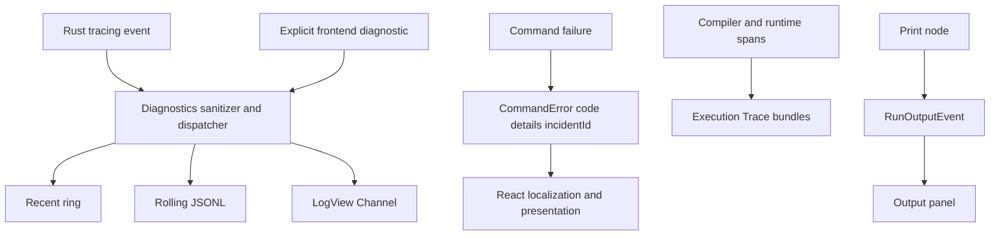

# 诊断、错误、执行追踪与程序输出架构

本文档定义 YssBI 中所有“异常信息与运行信息”的权威边界。目标不是把所有内容都写入一个日志，而是让不同语义的数据走不同通道，各自拥有明确的可靠性、保留和 UI 契约。

## 1. 权威性矩阵

| 信息 | 权威来源 | 传输 | 保留 | UI 用途 |
| --- | --- | --- | --- | --- |
| Diagnostic log | Rust `tracing` 管线 | bounded worker + Tauri Channel | 有损 recent ring + rolling JSONL | LogView 排障，不驱动业务状态 |
| IPC error | Rust `CommandError` | command rejection | 不单独保留；内部错误关联 incident | React 按 `code` 本地化并选择反馈表面 |
| User feedback | React application/view | Zustand UI state / component state | 仅按交互需要 | `Alert`、`Dialog`、字段内错误、状态变化 |
| Execution Trace | Rust runtime/compiler | trace query commands | 完整 run/compilation bundle | 性能与执行层级分析 |
| Program Output | Rust graph runtime | ordered execution Channel | 单次运行有界前端投影 | 独立 Output 面板 |

核心规则：

- 日志不是业务事实，不得通过读取日志决定保存、执行、选择或恢复流程。
- IPC error 不携带后端用户文案。
- Execution Trace 不写入普通 diagnostics 存储。
- Print/用户程序输出不写入 diagnostics。
- React 是应用错误文案、本地化和反馈表面的唯一所有者；可扩展 Rust 节点目录仅拥有确定性的节点元数据与编译器诊断模板，模板不得插入内部错误文本。



## 2. Diagnostic logging

### 2.1 单一入口

Rust 诊断统一使用 `tracing`。核心实现位于：

- `src-tauri/src/diagnostics/runtime.rs`
- `src-tauri/src/diagnostics/recent_layer.rs`
- `src-tauri/src/diagnostics/dispatcher.rs`
- `src-tauri/src/diagnostics/worker.rs`
- `src-tauri/src/diagnostics/sanitizer.rs`

前端只通过显式 `logger.app/sys/exec/graph/data` 调用产生 diagnostics；`appLogger` 不替换全局 `console`。前端记录经小批量提交到 `submit_frontend_diagnostics`，随后与 Rust 记录共享同一 Rust 分配的 `streamId` 和 `sequence`。

禁止：

- `logger.notify`
- `tauri-plugin-log`
- 旧 `LogManager`、`get_logs`、`get_log_count`、`log-message` event
- 通过日志触发用户反馈或业务状态变化
- 把已翻译的 UI 文案作为专用日志类别

### 2.2 稳定记录契约

```ts
interface DiagnosticRecordDto {
  streamId: string;
  sequence: number;
  timestamp: string;
  level: 'trace' | 'debug' | 'info' | 'warn' | 'error';
  origin: 'rust' | 'frontend';
  domain: 'application' | 'execution' | 'system' | 'graph' | 'data' | 'ui';
  target: string;
  event?: string;
  message: string;
  source?: string;
  fields: Record<string, unknown>;
}
```

`streamId + sequence` 是 LogView 去重和顺序的依据。时间戳用于展示，不用于重建顺序。

### 2.3 背压与保留

当前默认边界：

- ingress：1024 条，生产者仅使用 `try_send`，不会等待容量。
- recent ring：5000 条。
- live batch：最多 128 条或约 16 ms。
- 每个订阅者：8 个 batch 的独立 bounded queue；慢订阅者会被移除。
- console/file output：各自独立 worker，queue 容量 1024。
- JSONL：`app_log_dir()/diagnostics.jsonl`，10 MiB 轮转，保留 5 个轮转文件。

当 ingress 满时，记录允许丢弃。恢复后 dispatcher 在同一有序队列中写入一次 `diagnostics.records_dropped`，其 `droppedCount` 表示该段丢失数量。marker 不得越过导致队列满时已经接收的记录。

LogView 订阅使用 snapshot + live Channel。前端会检查 sequence 连续性；snapshot 握手期间溢出或出现 gap 时自动重连一次，不能静默推进 watermark。

Diagnostic logs 明确是有损、非权威数据。磁盘或 UI 消费者故障不得阻塞业务线程。

### 2.4 过滤

无 `RUST_LOG` 时：

- release：仅第一方 `yssbi` / `yssbi_lib` 的 INFO 及以上。
- debug：仅第一方 `yssbi` / `yssbi_lib` 的 DEBUG 及以上。
- 第三方 target 默认 OFF。
- TRACE 只能通过显式 `RUST_LOG` 开启。

### 2.5 脱敏

所有 recent、console、JSONL 和 live Channel 都消费同一个已清理的 `DiagnosticRecordDto`。不得存在绕过 sanitizer 的原始 formatter。

sanitizer 至少执行：

- 敏感键脱敏：password、token、authorization、cookie、apiKey、connectionString、databaseUrl、private key 等。
- 禁止 payload 脱敏：DataFrame rows、cell values、document content、clipboard content。
- 内容级清理：Authorization/Cookie header、Bearer token、URI userinfo、常见 secret assignment。
- target/event/source/message、字段字符串、字段数量、JSON 深度、数组长度和总编码大小限制。

诊断调用点仍应遵循数据最小化：优先记录 ID、count、kind、digest 和稳定 code，不记录 SQL 正文、行值、文档正文或剪贴板内容。sanitizer 是最后防线，不是允许任意 `%error` / `?payload` 的理由。

## 3. IPC error

### 3.1 唯一 wire shape

所有 Tauri command rejection 使用：

```json
{
  "code": "project_not_found",
  "details": null,
  "incidentId": null
}
```

内部错误示例：

```json
{
  "code": "internal_error",
  "details": null,
  "incidentId": "8f5b..."
}
```

Rust 类型为 `src-tauri/src/error/mod.rs` 中的 `CommandError`。wire 中固定只有：

- `code`：稳定、lower_snake_case 的机器分类。
- `details`：安全、结构化、可选的对象；不能放内部错误文本。
- `incidentId`：仅需要诊断关联时存在。

禁止 `message`、字符串前缀解析、uppercase code、`Result<T, String>` command error 或旧兼容 shape。

### 3.2 expected 与 diagnosed

- 预期失败：`CommandError::expected(code)`，通常没有 incident。
- 内部/基础设施失败：`CommandError::internal` 或 `CommandError::diagnosed`，生成 incident ID，并把技术细节写入已脱敏 diagnostics。
- command 保持薄：解析输入、调用 domain/application、映射稳定 code/details、返回 DTO。

Frontend 所有普通 command 必须经过 `src/services/ipc/invokeCommand.ts`。`IpcError.message` 只是前端技术摘要，不是用户文案，不得直接展示。

### 3.3 成功响应与异步状态中的失败

command 成功返回的 DTO 也不能借由嵌套 `message`、`detail` 或 `hint` 绕过错误协议与 React 本地化边界。异步任务失败使用稳定 `code`、安全结构化 `details` 和 `incidentId`；原始 backend error 只进入已脱敏 diagnostics。验证报告与计算诊断只传机器字段和安全上下文，由 React 按 code 本地化。

固定契约包括：

- Bayes `TaskError = { code, details, incidentId }`；取消状态不构造 error。
- Bayes `ValidationIssue = { code, severity, path }`。
- Bayes `DiagnosticWarning = { code, metric, value, threshold, parameter }`。
- Julia runtime/worker status 只返回状态枚举和安全路径/version 字段，不返回启动错误 prose。
- Result failure 只返回 `code + cause + upstreamResultIds`；runtime failure 文本留在内部 diagnostics。
- 项目路径预检以 `Result<(), CommandError>` 拒绝并返回稳定 code，不使用 `{ ok, message }` 成功 DTO。
- Database declaration 只通过 `loadFailed` 暴露物化状态；具体 `DatabaseState::Failed` 原因留在 Rust。
- Panel DID fake-group 只返回结构化统计值与 `unavailableCode`，不返回 `methodNote` 或失败文本。
- Result/worksheet/catalog/project 的前端临时错误状态统一保存 `{ code, incidentId }`；React 再生成对应的 Alert、inline text 或状态栏文本。
- 编译器 projection diagnostic 可使用 Rust 节点目录中的确定性本地化模板，但模板参数只能是安全领域上下文；resolver、parser 或 crate 的原始错误只进入 `tracing`。

以上 code 均为 lower-snake-case，不保留旧字段或大小写兼容路径。前端对 Bayes、Panel DID 等成功响应使用严格 parser，拒绝旧 prose 字段和未知 details key。

## 4. User feedback

React 根据 use case 决定反馈表面：

| 情况 | 表面 |
| --- | --- |
| 页面/区块可继续使用 | shadcn `Alert` / `PageAlert` |
| 必须确认后才能继续 | 普通单按钮 `Dialog` / `uiStore.alert` |
| 危险操作确认 | `AlertDialog` |
| 输入字段问题 | 字段旁 inline error + `aria-describedby` |
| 成功 | 优先由新状态、列表变化或持久状态显示 |

不使用 toaster、Sonner、浏览器 `alert/prompt/confirm` 或 native message dialog。路径选择 dialog 是桌面能力例外。

映射流程：

```text
IpcError.code + safe details + incidentId
        ↓
features/application outcome / error mapper
        ↓
i18n key + explicit feedback surface
        ↓
view renders Alert, Dialog, inline state, or no message
```

原始 Rust error、diagnostic log message、resolver/parser 文本、连接字符串和 debug details 不得进入 UI。编译器领域诊断只显示稳定 code、位置与节点目录拥有的确定性模板，不显示内部 reason。

## 5. Execution Trace

Execution Trace 是独立的 runtime/compiler observability 数据，不是普通日志。

核心实现：

- `src-tauri/src/node_system/analysis/observability.rs`
- `src-tauri/src/node_system/analysis/trace_bundle.rs`
- `src-tauri/src/node_system/analysis/trace_store.rs`
- `src-tauri/src/project/project_traces.rs`
- `src-tauri/src/commands/command_trace.rs`

### 5.1 bundle authority

- active run/compilation 在 Rust 中累积。
- 顶层 root span 完成时，完整 `RunTraceBundle` / `CompilationTraceBundle` 原子提交。
- 查询只复制已经通过 Rust hierarchy/interval/kind 校验的 bundle。
- 禁止在 query-time 静默删除 orphan、断环或修补结构。
- compilation active identity 使用 process-unique Snapshot root `SpanId`，不能用可能碰撞的 `compileId` 作为内部分组键。

### 5.2 retention

默认：

- 最多 32 个 completed run bundle。
- completed bundle 总估算约 2 MiB。
- 每个 active bundle 最多 4096 spans，并受同一 byte budget 约束。
- active identity 不被淘汰；超限时只丢弃可安全删除的 span，并累计 `droppedSpanCount`。
- completed retention 始终整 bundle 淘汰。
- 单个 root 本身超过 byte budget 时允许形成 soft floor；没有实际丢 span 就不能标记 `truncated=true`。

wire metadata 明确包含：

- `provenanceScopes`
- `truncated`
- `droppedSpanCount`
- `estimatedBytes`

Frontend 只校验 wire 形状、枚举和 opaque decimal string，不复制 Rust 的 hierarchy/cycle 语义。

Run bundle 可关联 command incident ID；Execution Trace 与 diagnostics 只共享关联 ID，不共享存储。

## 6. Program Output

Print 等用户程序输出使用 `RunOutputEvent`，不进入 `tracing`：

```ts
interface RunOutputEvent {
  runId: string;
  sequence: number;
  stream: 'stdout' | 'stderr';
  text: string;
  sourceGraphPath: string;
  sourceNodeId: string;
}
```

运行时边界：

- 每条文本最多 8 KiB。
- 每个 run 最多 256 条文本事件。
- 第一次单条截断发送 `status: 'truncated'`。
- 达到总数上限后发送一次 `status: 'dropped'`。
- 所有事件共享每 run 单调 sequence。

Frontend `runOutputProjection` 最多保留 258 条（256 text + 2 status），拒绝重复/倒序，并在 sequence gap 或本地容量丢失时设置 `projectionDropped`。

Output 面板位于 `src/views/LogView/OutputPanel.tsx`，但它只复用 workbench panel 位置，不读取 diagnostic store。来源路径是 opaque resource path；nested function 输出必须携带实际 `sourceGraphPath`，不能按 root graph 或 node UUID 猜测。

## 7. 文件组织

```text
src-tauri/src/
├─ diagnostics/                    # 有损诊断管线、脱敏、recent、worker
├─ error/                          # CommandError wire
├─ commands/command_diagnostics/   # thin diagnostics IPC
├─ commands/command_trace.rs       # thin trace query IPC
└─ node_system/
   ├─ analysis/trace_*.rs          # authoritative Execution Trace
   └─ runtime/run_output.rs        # ordered bounded program output

src/
├─ services/ipc/                   # 唯一普通 invoke error boundary
├─ services/log/                   # diagnostic Channel service
├─ features/core/log/              # LogView projection/filter
├─ features/core/execution/        # run output projection
├─ features/application/log/       # diagnostics subscription lifecycle
├─ shared/types/dto/               # strict wire DTO/parser
├─ shared/ui/PageAlert.tsx
├─ shared/ui/MessageDialog.tsx
└─ views/
   ├─ LogView/                     # diagnostics and separate Output panel
   └─ ProjectView/                 # page-level project picker feedback
```

## 8. Review checklist

新增或修改错误/日志路径时检查：

1. 这条信息是 diagnostic、command error、user feedback、trace 还是 program output？
2. 是否错误地让日志驱动了业务状态？
3. command error 是否仍是精确三字段 wire？
4. 用户文案是否只在 React i18n 中生成？
5. 是否可能记录 secret、row/cell/document/clipboard content？
6. 高频路径是否 bounded 且不会阻塞业务线程？
7. sequence gap、drop、truncate 是否显式可见？
8. trace 是否按完整 bundle 提交/淘汰？
9. Print/output 是否完全绕开 diagnostics？
10. 是否增加了兼容 shim，而不是直接迁移 0.x contract？
