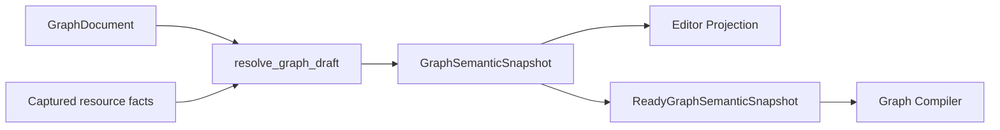

# Graph 与 Execution 当前架构

> Status: Current
> Scope: Graph Draft、Resolve、Projection、Compile、Save、Execute、Problems、Results 与 Run Output
> Canonical owners: Graph/Execution/Project 源码与测试拥有可执行事实；本文拥有阶段之间的稳定 contract
> Update when: Graph authority、阶段语义、projection、execution result 或 output 边界改变时

本文描述当前实现。条件性后续工作见 [v0.3 roadmap](../roadmap/v0_3.md)。Workbench 布局和 operational logging 不复制 Graph 领域状态。

## 1. Authority and identities

| 事实                                   | Authority                            | Frontend representation       |
| -------------------------------------- | ------------------------------------ | ----------------------------- |
| 已保存 document、resource revision     | Rust Project                         | 只读 projection               |
| 未保存编辑与 undo/redo                 | frontend GraphDraftSession           | document、保存基线、历史      |
| 解析后的端口、类型、Schema、诊断、依赖 | Rust GraphSemanticSnapshot           | 完整 editor projection        |
| 编译产物                               | session-scoped Graph runtime cache   | opaque artifactId             |
| run、当前 output result                | Rust Execution / ResultStore         | typed query 与 UI projection  |
| 程序文本输出                           | Execution RunOutputEmitter / channel | bounded Run Output projection |

`graphPath`、Project instance/session、Draft session/generation、node/port/connection、artifact、run/result 与 panel/group identity 分别表示不同生命周期。`artifactId` 的查找仍绑定当前 Project session 和 Graph path，不能单独作为跨 session 的授权。

Project 的 `graph_resource_revisions` 服务资源事务和执行资源校验；它与 Draft generation、semantic input hash 不同，见 [Project authority](../../src-tauri/crates/yss-project/README.md#graph-resource-revisions)。

## 2. Module ownership

| Owner                            | 职责                                                                        |
| -------------------------------- | --------------------------------------------------------------------------- |
| yss-graph-document / protocol    | 文档意图、稳定地址、类型与值声明、语义文档 fingerprint                      |
| yss-graph-document-edit / editor | structural validation、typed mutation、连接预检、端口顺序、clipboard        |
| yss-graph-analysis               | concrete interface、type/schema/lineage、canonical diagnostics、Ready proof |
| yss-graph-resource-contract      | immutable resource facts 与一次 Resolve 的 dependency observations          |
| yss-graph-runtime                | 唯一 resolve_graph_draft facade、claim 编排、编译 cache                     |
| yss-graph-compiler               | Ready snapshot 驱动的 immutable package lowering                            |
| yss-project                      | committed authority、资源版本、文件事务与 publication                       |
| yss-application                  | 一致事实 capture/revalidation、Graph↔Project↔Execution 编排                 |
| yss-execution                    | immutable plan、demand/DAG、KernelRegistry、ResultStore、Output emitter     |
| yss-api                          | command/event/channel DTO 与错误映射                                        |

完整清单见 [Module Map](../reference/MODULE_MAP.md)。

## 3. Open and Draft lifecycle

```text
capture active Project session and coherent resource facts
  → load/validate document, or construct mutation candidate
  → resolve_graph_draft
  → complete GraphSemanticSnapshot
  → document/editor projection response
  → validate response, recheck frontend identity, adopt
```

Open、Hydrate、Transform、Save、Compile 共用 Runtime Resolve。只读 `resolve_graph_draft` command 还用于 dirty Draft 的资源刷新及 undo/redo 目标验证；它不保存文件、不 claim 端口、不改变 Draft。

Mutation 和 history requests 由 frontend application 的同一 Graph FIFO 协调。返回后检查 Project identity、Draft session/generation 和 coordinator epoch；Compile 还检查独立 request ID。关闭重开、Project replacement、后续编辑及新 Compile 都会使旧回调失效，旧失败不能清除新 artifact。

Draft/history/projection 在写入前完成 projection preparation，避免先改 Draft 再发现 projection 无效。`GraphProjectionStore` 单个 Graph bucket 一次替换 topology、端口、顶层 diagnostics、basis、outcome 和 run gate。无效 response 保留原 document/history；不同 Store 的发布仍由 Application 协调。

Undo/redo 条目只保留文档意图，容量由 `graphDraftStore.ts` 的 `GRAPH_HISTORY_LIMIT` 限制。恢复前重新 Resolve 目标文档，并采用这次解析的投影；历史中不保留旧的解析投影。Graph locale 查询独立于加载/刷新生命周期，草稿 FIFO 不反向依赖加载流程。

本地化节点目录缓存跟随已提交资源的 publication revision 失效。Application 在正常发布、
恢复和项目初始化完成时通知目录 Store；项目生命周期重置会撤销旧目录请求。
只有索引内容变化而 Rust 水位未变时额外失效目录，覆盖外部发现未驻留文件；相同索引不重复发布。
新消费者继承已知版本下限，迟到或低于请求水位的响应不能替换目录。
该目录刷新只更新资源创建描述，不覆盖 Graph Draft，也不通过点击/拖拽改变 committed state。

Event/Function 创建、复制、删除复用 Project 的标准资源 patch 发布：回执拥有递增 publication revision
与 lifecycle delta，不以内部 authority generation 代替资源发布版本。纯资源生命周期变化不要求完整图投影；
重命名等影响已有图的操作仍声明受影响路径。前端命令回执、资源事件与 watcher 走同一发布队列和
ProjectIndex 快照安装入口，不由各 CRUD hook 自行选择是否补查。刷新已加载的干净 Graph 时安装完整
GraphEditorSession，使 document 保存基线与 projection 同步；dirty/saving 草稿保留。
函数签名修改由 Rust 同一文件事务持久化后发布，watcher 不会用旧磁盘签名覆盖已提交修改。

没有 Graph Projection background channel、独立 ProblemsStore 或面板自有 subscription。关闭 Problems 不影响 Canvas、Details 或 Run Gate。Dirty Draft 的重新解析只替换解析结果，不覆盖未保存 document。

## 4. Semantic resolution



`ConcreteGraphInterface` 是 snapshot 内端口事实的借用视图，不存第二份端口表。类型使用 `Exact / Constrained / Unknown / Conflict`；`TypeExpr` 只描述声明 pattern。Add、Reroute、Convert 复用 NumericFold、Identity、ParameterOutput 规则，coercion 和 kernel specialization 与类型结果一起交付。

Schema 按 data DAG 顺序求解并保留 lineage，cycle 在递归解析前识别。`GraphSchemaState` 区分 NotApplicable、Exact（含空字段集合）、Pending、Unavailable、Conflict 和 InternalFailure。Reroute 可传递上游 Schema。Schema 和类型仍是同一次 Resolve 内的阶段，最终组装完整节点事实并发布完整 snapshot；当前 node cache 优化 type/coercion，Schema 重算且参与 cache key，结果须与 full resolve 一致。

三类端口的生命周期：

- Declared：protocol 定义的固定地址，不新增 document binding。
- User-created：instance ID/order 持久化；后端 placement 负责 append、before、after、move，member group 共用 ID/order。
- Derived：未使用成员只投影；首次连接或设置 literal 时与 mutation 原子 claim。被引用成员消失时显示 orphan；未引用的消失成员不再投影。显式编辑清理无引用的旧 derived bindings，Resolve/Compile 不改写 document。

未知但被文档引用的端口以有 canonical address 的 orphan fact 展示，便于定位和断开损坏连接。Template 只表示新增能力。普通连接错误保留在 canonical Problems 中；只有附有阻断连接诊断的错误方向连接才可通过 frontend projection 验证。

Analysis Graph 只含数据依赖。Print、Control/Effect 等副作用属于 Workflow。

命名常量由 `GraphDocument.constants` 持有，使用稳定 `ConstantId`。Event 和 Function 的 Details 面板编辑名称、类型和值；增删改通过 `SetConstant` 和同一 Graph Draft FIFO、undo/redo、Save 路径处理，没有独立的变量 Store、revision、作用域或项目资源文件。名称在所属图内唯一，重命名不会改变引用身份。

前端共享数据类型层定义图文档使用的 `SerializedDataValue` 及其与编辑值的纯转换；传输层校验 Rust 返回的值结构。常量编辑不依赖 IPC 编码器，也不维护另一份已提交数据。

节点目录只有一个 `yssbi.constant.get`，其 `constant` 参数引用当前图内的常量。Details 面板可直接插入引用节点，也可在 Get 节点的参数中选择常量。尚未选择或已删除的引用可保留在草稿中，Compile 会阻断不完整的类型解析。单次使用的输入值仍可通过端口 literal 编辑。

常量类型和值由 Graph Document 校验；DataFrame/DataSeries 将列数据持久化为常量内的 `TabularSnapshot`，句柄由 ConstantId 派生。Graph Analysis 解析输出类型及表格列 Schema；Compiler 捕获不可变值，Application 在执行包中将数列转换为值列表、数据框转换为列记录，运行过程不读取可变项目变量。常量内容参与语义 fingerprint，名称、说明和标签不使编译缓存失效。

Clipboard 仅携带选中 Get 节点引用的常量。目标图已有同一身份且内容相同的常量时复用；身份或名称冲突时复制定义并重写引用。常量和节点进入同一个可撤销补丁。复制整张图则生成独立常量身份。

节点参数使用文档中显式保存的值，未填写时使用 protocol 定义的默认值。Editor Projection 交付该有效值供直接编辑；参数编辑从 Draft document 合并改动，保留未展示参数，也不把其他参数的显示默认值写回文档。计算参数与缺失值策略由具体算法契约和输入校验拥有，节点参数没有项目设置继承/覆盖模式。

节点通过 `ParameterEditorSpec::Configuration(ConfigurationSchema)` 声明 Detail 配置表单。Schema 复用标量 `ParameterSpec`，提供默认值、选项、约束和基于选择项的条件字段；Rust 只投影当前适用字段，React 复用参数控件。配置对象属于当前节点，保存在节点参数中。`SetConfiguration { node_id, key, values }` 在当前候选文档上合并部分字段、补齐默认值、移除不适用字段，并通过已有 Draft history 和 Save 路径支持撤销、重做与持久化。导入的配置参数必须包含完整且适用的字段，验证不会暗中补写文档。

Detail 直接编辑节点配置，不提供配置来源选择；静态配置不声明 Canvas 引脚。统计目录中的独立 Configure/VCE 节点和 Config 输入已移除，原有模型配置字段归各自 Fit/Summary 节点所有。OLS/WLS 使用常数项和协方差表单，GLS、IV、Logit、Probit、Prais、Panel 使用各自已有配置字段；其他统计节点保留原有参数。Y、X、权重等数据输入仍通过连线表达依赖。0.x 文档中已保存的旧 Configure/VCE 节点不作兼容转换，应在目标模型的 Detail 中重新设置。

同一配置约定覆盖整个内置目录：分布采样节点将分布参数与样本数放入配置表单，整数范围将起点、终点和步长放入配置表单，相关图将最大滞后阶数放入配置表单；常量值、数据转换和其他既有节点参数继续在 Detail 直接编辑。数学操作数、标准化结果、数据列等实际数据依赖保留为数据引脚。旧文档中的这些静态配置引脚及其连线不再有效，需要在对应节点的 Detail 中重新设置。

数据框的列投影、筛选谓词和列选择控件从 semantic snapshot 获取当前输入 Schema 的列、兼容操作符和字面量类型，输入变化时刷新，断开输入后停止提供过期列。没有封闭选项集的字符串参数使用文本编辑。配置能力不代表新增执行 kernel；分布采样、整数范围及绘图等尚未注册的 kernel 仍受已有执行能力边界限制。

## 5. Draft, Compile, Save, and Execute

| 操作           | 改变 committed Project            | 结果                                              |
| -------------- | --------------------------------- | ------------------------------------------------- |
| Draft mutation | 否                                | candidate document + projection                   |
| Resolve        | 否                                | 当前 Draft 的完整 projection                      |
| Compile        | 否                                | Ready 或 Blocked                                  |
| Save           | 是                                | 已提交 canonical document + 预先验证的 projection |
| Execute        | 仅 finalization 明确提交的 effect | run、Results、Output                              |

### Compile

Application 校验 document、捕获资源事实后，Runtime 先 Resolve，再复用或生成完整 Graph artifact。生产 Compiler 输入要求 `ReadyGraphSemanticSnapshot`；incremental cache 不把编译范围缩成一个选中 output。

```text
Ready   { type: ready, artifactId, projection, cacheHit }
Blocked { type: blocked, projection }
```

两个分支都不回写 document。未绑定输入、类型/Schema 问题、orphan、cycle、函数语义错误和当前 Execution registry 不支持的 kernel 返回 Blocked；执行能力诊断也进入同一个 semantic snapshot，并在命中编译缓存前检查。API 不把 Blocked 转换成 diagnosed IPC failure，frontend 不为其写执行 error log 或显示 Compile 失败弹窗。内部 resolver/compiler/cache 故障仍使用 incident-linked command rejection。

`semanticInputHash` 来自语义文档内容、registry 与实际读取的 dependency manifest，排除 node position/user label、无引用 derived metadata 和相关展示字段。manifest 记录所用函数签名/正文、变量类型、数据库 Schema 以及 absent lookup；basis 同时传递 resource versions/observations。无关 catalog 变化不改变 artifact identity。函数正文读取由 Project owner 完成，Graph resolver 不读文件。

Frontend 区分 `saveDirty` 和 `compileDirty`：只移动布局可保留匹配 artifact；语义输入改变使其失效。请求通过 session/generation/request ID 判定 currentness，不依赖 JSON 字符串比较。保存基线的 document 比较仍是 frontend 自己的 dirty 计算。

### Save

Save 是锁定编辑入口后的 full-document overwrite，不携带 frontend expectedRevision。每次尝试先构建并验证 candidate projection，再重验 capture、执行 Project 文件/document 事务；成功返回已准备的 projection，不在提交后再次 Resolve。

成功才更新保存基线并清除 Draft history。失败保留原 Draft；dirty Draft 不自动 merge/rebase。资源版本和 Project 内部事务检查仍保留。

### Execute

`execute_compiled_graph` 接收 `compiledArtifactId` 与 demand；它只读取当前 session/path 中的匹配 artifact，按精确 manifest 重验依赖并准备 generation-bound resources，不隐式 Compile/Save 或回退磁盘旧文档。

Demand selection 和 DAG scheduler 保留。`KernelRegistry` 按 KernelId 调用 `PreparedKernelInvocation`；source node type 与 kernel identity 分开保留。参数使用具名完整集合，包含已解析默认值，普通 String 不按路径前缀猜成 Resource。Input array 与 input slots 按相同顺序传递，每个 slot 携带地址、实例组、预期类型和 coercion；顺序来自 snapshot 的 concrete port/connection order，package admission 校验 slot 与 specialization 一致。

每个 Output contract 保留类型、Schema/lineage、类别和 source identity；scheduler 按 output address 校验返回值，Results 使用该 output 的类别。Operation 不再拥有一个供所有 output 共享的类别。

协议默认参数在 semantic snapshot 中保留 typed literal，Compiler 按协议类型 lowering；用于显示的 Decimal 字符串不作为运行时 String。执行阶段使用 `ExecutePreparedError` 表达失败，`RunFailure` 携带稳定的 `RunFailureCode`、`RunPhase` 及 source identity，RunErrored 传递实际阶段、原因（如 divisionByZero、invalidNumericInput、nonFiniteResult）和节点；不传递原始输入值或后端错误文案。

`RunRegistry` 通过 `RunState` 记录运行状态和终态。成功执行通过 `ExecutionFinalizationHandoff` 将候选结果交给 Application 完成 finalization。

函数签名/正文依赖、调用环、Entry/Return 一致性已在 Resolve 中检查，初期拒绝递归。Root snapshot 按资源身份保存去重后的可达函数语义；GraphFunctionAbi 按 signature 顺序保留参数 ID、Entry output、Return input 和精确类型。Execution 的 FunctionPlanAbi 使用对应的中性身份字段，admission 检查 ABI 地址和类型。实际 Function bundle lowering/subplan execution 仍是准备之后的接入工作；当前 KernelRegistry 不再把 Function 节点作为“返回第一个 input”的占位实现。

OLS Fit/Summary 从节点参数构造 `yss-sci-contract` 的共享 `OlsOptions`，通过该 crate 的 `ScientificBackend::ols` 调用 composition root 注入的 SCI runtime。节点默认值与模型使用同一个配置定义；端口返回类型化 OLS 摘要，由 Execution 转换为 runtime values。支持常数项、Nonrobust、HC0–HC3、HAC、Newey-West 和 Fixed Scale。

Execution 已注册 DataFrame source/project/filter.rows/series.select/limit/rename kernel。它们组合
`yss-relational-contract` 的关系句柄，DataFusion 原生计划保持在 `yss-datafusion` 内；计划构造不 collect。
关系和数列持有固定 session、dataset snapshot/revision、查询上下文及文件租约。资源准备检查句柄内的
session/revision 与已授权资源一致。OLS 可以接收既有数值列表，或来自同一个关系句柄的数列；后者共同投影、
消费异步 Arrow 批流，并使用独立输入内存预算准备数值矩阵。NULL/非有限值仍被拒绝，不隐式逐列删除缺失样本。
不同关系上的数列不能按长度相同直接拼接。Cluster VCE、WLS 和其他统计模型 kernel 尚未接入。

Parquet 关系数据源要求精确 Schema 显式标记独立的 RowId 与 DisplayOrder 列；读取按 DisplayOrder、RowId
确定顺序，再向 Graph 投影用户列。统计输入与拟合值/残差不会以并行批次的到达顺序替代表格的显示顺序。
文档内的物化常量使用其不可变行域内的顺序，不将文件/batch offset 当成项目数据集的长期身份。

真实项目的 DataFrame 资源现由 DatabaseRuntime 捕获 catalog 快照，并以 Project grant 的版本封装关系句柄；
固定 Parquet 链路与真实项目的 CSV 导入 → Graph Compile/Execute → OLS → Results 分页均已通过集成验证。
最终提交使用准备时捕获的同一组资源授权，Project 在发布前再次检查版本；不以空授权跳过数据集依赖。
关系候选 Results 持有懒句柄，不保存所有中间批次；计划准备不表示全部行已经成功扫描，分页扫描失败通过结果读取错误交付。
逐项证据见[数据引擎迁移验收](../reviews/2026-09-10-data-engine-migration.md)。

## 6. Results

`ResultStore` 是 session-scoped result authority，每个 output address 只保存当前结果。每个当前结果拥有 ResultId、type/presentation、payload 和 provenance；不存在结果历史列表、历史选择或结果保留设置。

Run admission 按 demand/DAG 得到实际重算的 operation outputs，在准备资源和计算前释放这些输出的旧 payload 与 ResultId 索引。一个 operation 的所有 outputs 同时失效；未参与本次 demand 的输出保留当前结果。成功 finalization 在同一写锁内发布整批结果，并验证每个输出仍属于该 run；被后续运行或图失效淘汰的 run 不能重新发布。失败、取消不恢复上次成功的 payload。

Frontend 通过 `get_pin_result(graphPath, output)` 查询当前 descriptor 或 null，通过 descriptor/value/page queries 读取当前数据。`RunStarted { outputs }` 公告本次失效范围；完成后重查当前输出。Frontend 同时删除旧 descriptor、value、pages、查询错误并拒绝迟到请求，搜索只索引当前输出。

关系和数列页面由 Application 捕获当前 Result，交给句柄在固定快照上执行有界查询；I/O 在计算线程、锁外执行。
每页最多读取请求行数加一行，通过额外行判断 `hasMore`；不为了预览执行整表 COUNT。`totalCount` 可为 null，
在能确认末页总数时返回精确值；列名/精确类型与行值一起交付。页大小和字节预算由 Result query owner 限制。
读取完成后再次检查 Application session 和 ResultId；失效结果的迟到成功/失败均不重新发布。
Frontend 在总数未知时照常请求首页，按后端 `hasMore` 翻页，在表格中显示列名；超出 JavaScript 精确整数范围的值以十进制文本显示。

Run event 使用实际 ExecutionSessionId 与 RunId 标识运行，执行会话重建后的计数重置不会混入旧运行。前端结果投影集中在 Application results 模块，Execution UI store 只保存运行状态、预览和 Output。分页只保留每个结果当前请求的一页，后续翻页使旧请求失效；Sequence 和 DataSeries renderer 都提供分页入口。读取组件持有 payload consumer lease，最后一个消费者释放时才清除本地 value/page；project reset 后的旧 lease 不能释放新项目的数据。主窗口和独立窗口的 Inspector 均由挂载的 renderer 读取数据，不预读后再重复读取。descriptor 仅表示可用结果，不携带 pending/failed/cancelled 状态；运行状态通过 Run event 与 pin status 表达。provenance 包含 RunId、输出地址与创建时间。

已打开的 Result panel 绑定 output address，在原位置清空并更新；独立展示窗口收到失效通知后释放旧内容。

语义输入改变会清除该图的当前结果；变量等资源的已提交变更按 Rust 公告的受影响图清除结果和前端缓存；移动节点等不改变语义输入的操作可保留结果。删除、重命名、卸载图和 Project session replacement 释放对应结果。Project replacement 更换 ResultStore 并清空前端投影，旧查询不能写入新 session。Run Output 与 Results 的生命周期仍独立，清除 Output 不清除当前 Results。

统计摘要区分 `LinearModelInfo` 与 `BinaryModelInfo`。Logit/Probit 使用 `pseudo_r2`、`adjusted_pseudo_r2`、`lr_chi2` 与 `prob_lr_chi2`，不生成 F/Wald 别名或线性 ANOVA 的平方和字段。通用回归 envelope 只复用系数、诊断与检验输入。

报告的字段结构由各 `parseCommon`、`parseRegression`、`parseVar`、`parseVec` 和 `parsePanel` owner 校验，复用 typed field reader，递归检查数组、矩阵和可选诊断块。`parseReportPayloadResult` 单次读取返回已校验的值或字段路径错误；OLS 的必需统计字段和标题要求在同一解析路径内表达。非法嵌套内容不能通过强制类型转换进入 renderer。

## 7. Graph Problems

顶层 diagnostics 是 canonical 集合，支持 graph/resource/connection/node/port/parameter。Node diagnostics 只作 Canvas/Details 索引。Problems、Canvas、Details 和 Run Gate 读取同一 projection。

Producer 覆盖 node/parameter/resource、binding/orphan、repeatable minimum、unbound、类型冲突、Schema 状态、连接方向/容量/顺序、literal/conflicting binding、value cycle 和函数依赖/ABI。Nominal 参数使用 registry validator，filter predicate/project columns 按当前输入 Schema 验证。无法构建内部 resolver 结果时使用 typed internal failure，不伪装成空 Schema。

诊断 wire 为 code、messageKey、arguments、severity、blocking、location、related。Rust 定义词汇和模板，frontend 生成模板表并统一本地化，未知模板/缺参数安全回退。单条 blocking 与 severity 独立，aggregate 汇总 canonical blocking；内部 failure 通过 outcome 独立阻止运行。未绑定的必需输入可为 Warning，但明确 blocking=true。

Problems 不可手动清空。定位支持 Graph、Node、Pin、Connection、Details 参数字段和已知资源；缺失资源显示 identity，related locations 提供关联跳转。普通 Graph 问题不靠 tracing/Logs 表达。

## 8. Run Output

Execution 保留 typed message/channel、strict parser、bounded projection 和 Output panel。stdout/stderr 的生产 adapter 尚未接入，当前没有通用 emitter。具体前端容量限制由源码常量拥有。

Frontend 检测跨 run、重复/缺失 sequence 和容量淘汰，显示丢失状态。清空只影响当前 Graph 的 Output。日志、Assistant text 和 Graph Problems 不进入此流。

Output panel 同时展示当前图的运行失败摘要：从 RunErrored 投影原因、阶段和节点，可定位失败节点；运行开始前的 command rejection 使用安全错误代码回退。该摘要与 stdout/stderr entries 分开存储，不伪造 Run Output 文本或 sequence。失败时 Application 打开 Output；清空 Output 或开始下一次运行清除本地摘要，不改变 Rust 的运行结果。

API 在成功交付 terminal event 后，用 command error details 的 `terminalRunEventSent: true` 标识拒绝路径；ProjectService 等待 channel 排空后才结束失败调用，确保原因投影先于错误收尾。incidentId 只用于关联技术诊断，前端不把 IpcError.message 作为用户文案。

当前 Analysis Graph 没有 Print/Effect，Workflow/tool stdout/stderr 生产 adapter 尚未实现。生产接入时需要实现有界发送、UTF-8 截断、慢 consumer 与最终 delivery/loss 状态。

## 9. Cross-boundary routing

| 信息                            | 去向                         |
| ------------------------------- | ---------------------------- |
| 普通 Graph validation / Blocked | Graph Projection / Problems  |
| 计算结果                        | ResultStore + typed query    |
| 用户程序 stdout/stderr          | Run Output                   |
| 内部技术故障                    | sanitized tracing / incident |
| command rejection               | yss-api stable error wire    |
| 用户反馈                        | React localization / UI      |

详见 [Runtime Signals](RUNTIME_SIGNALS.md)、[API contract](../../src-tauri/crates/yss-api/README.md)、[Workbench](WORKBENCH_DOCKVIEW_ARCHITECTURE.md) 与 [Local Workflow](../development/LOCAL_WORKFLOW.md)。
