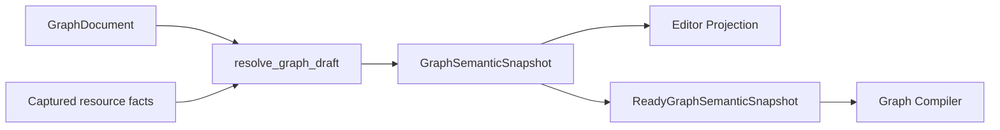

# Graph 与 Execution 当前架构

> Status: Current
> Scope: Graph Draft、Resolve、Projection、Compile、Save、Execute、Problems、Results 与 Run Output
> Canonical owners: Graph/Execution/Project 源码与测试拥有可执行事实；本文拥有阶段之间的稳定 contract
> Update when: Graph authority、阶段语义、projection、execution result 或 output 边界改变时

本文描述当前实现。准备工作的验收记录和条件性后续工作见根目录 [plan.md](../../plan.md)。Workbench 布局和 operational logging 不复制 Graph 领域状态。

## 1. Authority and identities

| 事实                                   | Authority                            | Frontend representation       |
| -------------------------------------- | ------------------------------------ | ----------------------------- |
| 已保存 document、resource revision     | Rust Project                         | 只读 projection               |
| 未保存编辑与 undo/redo                 | frontend GraphDraftSession           | document、保存基线、历史      |
| 解析后的端口、类型、Schema、诊断、依赖 | Rust GraphSemanticSnapshot           | 完整 editor projection        |
| 编译产物                               | session-scoped Graph runtime cache   | opaque artifactId             |
| run、result、Pin history               | Rust Execution / ResultStore         | typed query 与 UI projection  |
| 程序文本输出                           | Execution RunOutputEmitter / channel | bounded Run Output projection |

`graphPath`、Project instance/session、Draft session/generation、node/port/connection、artifact、run/result 与 panel/group identity 分别表示不同生命周期。`artifactId` 的查找仍绑定当前 Project session 和 Graph path，不能单独作为跨 session 的授权。

Project 的 `graph_resource_revisions` 仍服务资源事务、历史和执行资源校验；它与 Draft generation、semantic input hash 不同，见 [Project authority](../../src-tauri/crates/yss-project/README.md#graph-resource-revisions)。

## 2. Module ownership

| Owner                            | 职责                                                                        |
| -------------------------------- | --------------------------------------------------------------------------- |
| yss-graph-document / protocol    | 文档意图、稳定地址、类型与值声明、语义文档 fingerprint                      |
| yss-graph-document-edit / editor | structural validation、typed mutation、连接预检、端口顺序、clipboard        |
| yss-graph-analysis               | concrete interface、type/schema/lineage、canonical diagnostics、Ready proof |
| yss-graph-resource-contract      | immutable resource facts 与一次 Resolve 的 dependency observations          |
| yss-graph-runtime                | 唯一 resolve_graph_draft facade、claim 编排、编译 cache                     |
| yss-graph-compiler               | Ready snapshot 驱动的 immutable package lowering                            |
| yss-project                      | committed authority、资源版本、文件事务与 history                           |
| yss-application                  | 一致事实 capture/revalidation、Graph↔Project↔Execution 编排                 |
| yss-execution                    | immutable plan、demand/DAG、KernelRegistry、ResultStore、Output emitter     |
| yss-api                          | command/event/channel DTO 与错误映射                                        |

完整清单见 [Module Map](../reference/MODULE_MAP.md)。

## 3. Open and Draft lifecycle

```text
capture active Project session and coherent resource facts
  → load/validate document, or construct mutation candidate
  → resolve_graph_draft
  → complete GraphSemanticSnapshot
  → document/editor projection response
  → validate response, recheck frontend identity, adopt
```

Open、Hydrate、Transform、Save、Compile 共用 Runtime Resolve。只读 `resolve_graph_draft` command 还用于 dirty Draft 的资源刷新及 undo/redo 目标验证；它不保存文件、不 claim 端口、不改变 Draft。

Mutation 和 history requests 由 frontend application 的同一 Graph FIFO 协调。返回后检查 Project identity、Draft session/generation 和 coordinator epoch；Compile 还检查独立 request ID。关闭重开、Project replacement、后续编辑及新 Compile 都会使旧回调失效，旧失败不能清除新 artifact。

Draft/history/projection 在写入前完成 projection preparation，避免先改 Draft 再发现 projection 无效。`GraphProjectionStore` 单个 Graph bucket 一次替换 topology、端口、顶层 diagnostics、basis、outcome 和 run gate。无效 response 保留原 document/history；不同 Store 的发布仍由 Application 协调。

没有 Graph Projection background channel、独立 ProblemsStore 或面板自有 subscription。关闭 Problems 不影响 Canvas、Details 或 Run Gate。Dirty Draft 的重新解析只替换解析结果，不覆盖未保存 document。

## 4. Semantic resolution



`ConcreteGraphInterface` 是 snapshot 内端口事实的借用视图，不存第二份端口表。类型使用 `Exact / Constrained / Unknown / Conflict`；`TypeExpr` 只描述声明 pattern。Add、Reroute、Convert 复用 NumericFold、Identity、ParameterOutput 规则，coercion 和 kernel specialization 与类型结果一起交付。

Schema 按 data DAG 顺序求解并保留 lineage，cycle 在递归解析前识别。`GraphSchemaState` 区分 NotApplicable、Exact（含空字段集合）、Pending、Unavailable、Conflict 和 InternalFailure。Reroute 可传递上游 Schema。Schema 和类型仍是同一次 Resolve 内的阶段，最终组装完整节点事实并发布完整 snapshot；当前 node cache 优化 type/coercion，Schema 重算且参与 cache key，结果须与 full resolve 一致。

三类端口的生命周期：

- Declared：protocol 定义的固定地址，不新增 document binding。
- User-created：instance ID/order 持久化；后端 placement 负责 append、before、after、move，member group 共用 ID/order。
- Derived：未使用成员只投影；首次连接或设置 literal 时与 mutation 原子 claim。被引用成员消失时显示 orphan；未引用的消失成员不再投影。显式编辑清理无引用的旧 derived bindings，Resolve/Compile 不改写 document。

未知但被文档引用的端口以有 canonical address 的 orphan fact 展示，便于定位和断开损坏连接。Template 只表示新增能力。普通连接错误保留在 canonical Problems 中；只有附有阻断连接诊断的错误方向连接才可通过 frontend projection 验证。

Analysis Graph 只含数据依赖。Print、Control/Effect、Variable Set 等副作用仍属于 Workflow。

## 5. Draft, Compile, Save, and Execute

| 操作           | 改变 committed Project            | 结果                                              |
| -------------- | --------------------------------- | ------------------------------------------------- |
| Draft mutation | 否                                | candidate document + projection                   |
| Resolve        | 否                                | 当前 Draft 的完整 projection                      |
| Compile        | 否                                | Ready 或 Blocked                                  |
| Save           | 是                                | 已提交 canonical document + 预先验证的 projection |
| Execute        | 仅 finalization 明确提交的 effect | run、Results、Output                              |

### Compile

Application 校验 document、捕获资源事实后，Runtime 先 Resolve，再复用或生成完整 Graph artifact。生产 Compiler 输入要求 `ReadyGraphSemanticSnapshot`；incremental cache 不把编译范围缩成一个选中 output。

```text
Ready   { type: ready, artifactId, projection, cacheHit }
Blocked { type: blocked, projection }
```

两个分支都不回写 document。未绑定输入、类型/Schema 问题、orphan、cycle 和函数语义错误返回 Blocked；API 不把它转换成 diagnosed IPC failure，frontend 不为 Blocked 写执行 error log 或显示 Compile 失败弹窗。内部 resolver/compiler/cache 故障仍使用 incident-linked command rejection。

`semanticInputHash` 来自语义文档内容、registry 与实际读取的 dependency manifest，排除 node position/user label、无引用 derived metadata 和相关展示字段。manifest 记录所用函数签名/正文、变量类型、数据库 Schema 以及 absent lookup；basis 同时传递 resource versions/observations。无关 catalog 变化不改变 artifact identity。函数正文读取由 Project owner 完成，Graph resolver 不读文件。

Frontend 区分 `saveDirty` 和 `compileDirty`：只移动布局可保留匹配 artifact；语义输入改变使其失效。请求通过 session/generation/request ID 判定 currentness，不依赖 JSON 字符串比较。保存基线的 document 比较仍是 frontend 自己的 dirty 计算。

### Save

Save 是锁定编辑入口后的 full-document overwrite，不携带 frontend expectedRevision。每次尝试先构建并验证 candidate projection，再重验 capture、执行 Project 文件/document 事务；成功返回已准备的 projection，不在提交后再次 Resolve。

成功才更新保存基线并清除 Draft history。失败保留原 Draft；dirty Draft 不自动 merge/rebase。资源版本和 Project 内部事务检查仍保留。

### Execute

`execute_compiled_graph` 接收 `compiledArtifactId` 与 demand；它只读取当前 session/path 中的匹配 artifact，按精确 manifest 重验依赖并准备 generation-bound resources，不隐式 Compile/Save 或回退磁盘旧文档。

Demand selection 和 DAG scheduler 保留。`KernelRegistry` 按 KernelId 调用 `PreparedKernelInvocation`；source node type 与 kernel identity 分开保留。参数使用具名完整集合，包含已解析默认值，普通 String 不按路径前缀猜成 Resource。Input array 与 input slots 按相同顺序传递，每个 slot 携带地址、实例组、预期类型和 coercion；顺序来自 snapshot 的 concrete port/connection order，package admission 校验 slot 与 specialization 一致。

每个 Output contract 保留类型、Schema/lineage、类别和 source identity；scheduler 按 output address 校验返回值，Results 使用该 output 的类别。Operation 不再拥有一个供所有 output 共享的类别。

函数签名/正文依赖、调用环、Entry/Return 一致性已在 Resolve 中检查，初期拒绝递归。Root snapshot 按资源身份保存去重后的可达函数语义；GraphFunctionAbi 按 signature 顺序保留参数 ID、Entry output、Return input 和精确类型。Execution 的 FunctionPlanAbi 使用对应的中性身份字段，admission 检查 ABI 地址和类型。实际 Function bundle lowering/subplan execution 仍是准备之后的接入工作；当前 KernelRegistry 不再把 Function 节点作为“返回第一个 input”的占位实现。

## 6. Results

`ResultStore` 是 session-scoped result authority。一个 node activation 的 outputs 原子进入 Ready、Failed 或 Cancelled；每个 output 分别拥有 ResultId、type/presentation、payload 和 provenance。一个 node evaluation 仍是共同的失效单位，不创建按 Pin 的独立求值 authority。

Frontend 通过 typed descriptor/value/page/history queries 读取；event 只公告 identity。Project replacement 更换 ResultStore，旧 ID 不 alias 新 session。Output clear 不清空 Results 或 Pin history。

## 7. Graph Problems

顶层 diagnostics 是 canonical 集合，支持 graph/resource/connection/node/port/parameter。Node diagnostics 只作 Canvas/Details 索引。Problems、Canvas、Details 和 Run Gate 读取同一 projection。

Producer 覆盖 node/parameter/resource、binding/orphan、repeatable minimum、unbound、类型冲突、Schema 状态、连接方向/容量/顺序、literal/conflicting binding、value cycle 和函数依赖/ABI。Nominal 参数使用 registry validator，filter predicate/project columns 按当前输入 Schema 验证。无法构建内部 resolver 结果时使用 typed internal failure，不伪装成空 Schema。

诊断 wire 为 code、messageKey、arguments、severity、blocking、location、related。Rust 定义词汇和模板，frontend 生成模板表并统一本地化，未知模板/缺参数安全回退。单条 blocking 与 severity 独立，aggregate 汇总 canonical blocking；内部 failure 通过 outcome 独立阻止运行。未绑定的必需输入可为 Warning，但明确 blocking=true。

Problems 不可手动清空。定位支持 Graph、Node、Pin、Connection、Details 参数字段和已知资源；缺失资源显示 identity，related locations 提供关联跳转。普通 Graph 问题不靠 tracing/Logs 表达。

## 8. Run Output

Execution 已有 `RunOutputEmitter`、typed message/channel、strict parser、bounded projection 和 Output panel。Emitter 统一 run sequence、单条/总量限制、UTF-8 截断、truncated/dropped marker 与明确 source；具体限额由源码常量拥有。

Frontend 检测跨 run、重复/缺失 sequence 和容量淘汰，显示丢失状态。清空只影响当前 Graph 的 Output。日志、Assistant text 和 Graph Problems 不进入此流。

当前 Analysis Graph 没有 Print/Effect，Workflow/tool stdout/stderr 生产 adapter 尚未实现。Emitter 与通道是可接入能力，不能声称已完成生产端到端输出；接入时还需验证慢 consumer 和最终 delivery/loss 状态。

## 9. Cross-boundary routing

| 信息                            | 去向                         |
| ------------------------------- | ---------------------------- |
| 普通 Graph validation / Blocked | Graph Projection / Problems  |
| 计算结果                        | ResultStore + typed query    |
| 用户程序 stdout/stderr          | Run Output                   |
| 内部技术故障                    | sanitized tracing / incident |
| command rejection               | yss-api stable error wire    |
| 用户反馈                        | React localization / UI      |

详见 [Runtime Signals](RUNTIME_SIGNALS.md)、[API contract](../../src-tauri/crates/yss-api/README.md)、[Workbench](WORKBENCH_DOCKVIEW_ARCHITECTURE.md) 与 [Local Workflow](../development/LOCAL_WORKFLOW.md)。
