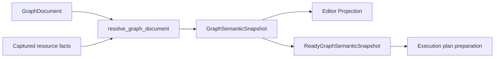

# Graph 与 Execution 当前架构

> Status: Current
> Scope: 当前图文档、Resolve、Projection、Save、运行准备、Execute、Problems、Results 与运行失败反馈
> Canonical owners: Graph/Execution/Project 源码与测试拥有可执行事实；本文拥有阶段之间的稳定 contract
> Update when: Graph authority、阶段语义、projection、execution result 或 output 边界改变时

本文描述当前实现。条件性后续工作见 [v0.3 roadmap](../roadmap/v0_3.md)。Workbench 布局和 operational logging 不复制 Graph 领域状态。

## 1. Authority and identities

| 事实                                    | Authority                    | Frontend representation  |
| --------------------------------------- | ---------------------------- | ------------------------ |
| 当前可编辑 GraphDocument、资源 revision | Rust ProjectData             | 只读文档投影             |
| 撤销、重做、已保存内容指纹              | Rust GraphEditingMetadata    | dirty、canUndo、canRedo  |
| 已保存正文                              | Project 文件事务             | 保存成功回执             |
| 解析后的端口、类型、Schema、诊断、依赖  | Rust GraphSemanticSnapshot   | 编辑器投影               |
| 执行计划、run、结果                     | Rust Execution / ResultStore | 查询、运行事件与 UI 投影 |

图编辑直接更新 Project 的当前驻留文档，不维护独立 Draft 文档或前端历史。临时变更候选用于验证及原子提交，不构成另一套可写状态。保存状态比较当前内容与已保存内容的指纹，不保留完整 savedDocument 副本。

GraphEditVersion 包含后端编辑会话 ID 与 Project resource revision，编辑 revision 跨 JS 边界使用十进制字符串。前端 sessionId、projectionGeneration 只控制视图和请求生命周期。Project instance/session、图路径、语义输入 hash、run/result、panel/group 身份继续分别校验。

资源 revision 同时服务文件事务和执行资源校验，语义内容由独立的 semanticInputHash 表达，见 [Project authority](../../src-tauri/crates/yss-project/README.md#graph-resource-revisions)。

## 2. Module ownership

| Owner                                                                     | 职责                                                                             |
| ------------------------------------------------------------------------- | -------------------------------------------------------------------------------- |
| yss-node-protocol / yss-node-registry / yss-node-catalog                  | 节点能力与接口声明、注册校验与指纹、内置定义及节点目录本地化                     |
| yss-graph-document                                                        | 节点实例、连线、位置、文档意图、稳定地址和语义文档 fingerprint                   |
| yss-graph-document-edit / editor                                          | structural validation、typed mutation、连接预检、端口顺序、clipboard、编辑器投影 |
| yss-graph-analysis                                                        | concrete interface、type/schema/lineage、canonical diagnostics、Ready proof      |
| yss-graph-resource-contract                                               | immutable resource facts 与一次 Resolve 的 dependency observations               |
| yss-graph-runtime                                                         | 唯一 resolve_graph_draft facade、claim 编排、编辑解析缓存                        |
| yss-graph-diagnostics                                                     | 图诊断代码、模板与定义校验                                                       |
| yss-project                                                               | committed authority、资源版本、文件事务与 publication                            |
| yss-application                                                           | 一致事实 capture/revalidation、Graph↔Project↔Execution 编排                      |
| yss-graph-execution                                                       | 计划构建与缓存、demand/DAG、内核调用适配、ResultStore、运行事件                  |
| yss-node-kernel                                                           | 中立内核调用契约、运行值、冻结 KernelRegistry 与内置执行适配                     |
| yss-application::ipc / yss-ipc-event / yss-ipc-channel / yss-ipc-contract | 命令适配、事件发送、通道交付及共享 wire 协议                                     |

完整清单见 [Module Map](../reference/MODULE_MAP.md)。

Node 描述一种节点的端口、参数、类型约束及执行语义，不拥有某张图的节点实例或解析结果。
三个 `yss-node-*` crate 均不依赖 Graph；`DocumentNode`、位置与连线属于图文档，连接后的类型、
Schema、血缘与诊断仍由 `GraphSemanticSnapshot` 统一管理。`yss-graph-type-mapping` 留在 Graph。
节点目录接收调用方提供的资源创建描述，不读取项目状态，也不解析图中连接。

数据 Detail 中的 Physical 与七种 Semantic 是独立的字段元数据，契约由
[Dataset store](../../src-tauri/crates/yss-database-store/README.md#field-meaning-and-physical-conversion) 维护。
七种基础语义统一由 `yss-data-contract::SemanticType` 定义，`ValueType::Scalar` 引用它。
DataSeries、DataFrame 及内部结构/专用产物描述保留各自职责，Physical 不进入端口类型层级。
旧 `DataType` 枚举已删除，Graph 不再将 Int64、Float64、Boolean、String、Date、Time 注册为基础语义。
分解 DataFrame 或选列得到 `DataSeries<Numeric>`、`DataSeries<Identifier>` 等精确语义；类别、等级、
二元映射及精确 Physical 保留在数据元数据中，并参与捕获资源的依赖身份。
NumericFold 只推导语义与标量/数列结构，整数/浮点选择、广播和精度校验由执行适配与内核根据实际
输入完成。非 Numeric 语义不能因底层为整数或浮点数进入数值计算。节点不改写用户设置，数据视图
保持原始值；Schema revision 和完整元数据的依赖身份负责解析与结果失效。

常量、函数签名、编辑器投影和前端解析器共享该契约。标量类型 wire 为
`{ "kind": "Scalar", "inner": "Numeric" }`，数列在 `DataSeries.inner` 中引用它。
`DataValue` / `RuntimeValue` 的整数、浮点、布尔和字符串载体保留实际表示，不定义第二套基础语义。
项目尚未发布，文件读取与实时命令均直接使用当前类型契约，不提供旧类型声明的迁移或兼容转换。

`yss-graph-editor::projection` 拥有编辑器投影模型与纯映射，消费 Graph Analysis 的语义事实，
生成节点、端口、Schema、诊断与解析结果。Application 捕获输入、调用该能力并重验会话与资源身份；
IPC 只将模型转换为 wire DTO。投影不依赖 Application，也不构成第二份语义 authority。

`yss-graph-runtime` 负责编辑解析；`yss-graph-execution::graph_preparation` 消费只读的 `GraphAnalysis`，
直接构建已有 `ExecutionPlan`、`PlanParameterBundle` 和输出契约。计划缓存归执行会话，资源授权依据
在每次准备时重新绑定。Application 组织资源和会话校验，不再持有一套图包到执行包的转换。
调度器消费执行计划；`kernel_invocation` 将已求值输入、输入模板名、已解析参数及输出类型/字段投影为中立内核调用，kernel 不消费 Graph 计划。运行准备不读取 UI 投影或 Project 可变状态。

Application 的图用例集中在 `graph/`，包括编辑、解析、资源、运行与结果查询；`session/` 独立拥有整个
Project/Database/Graph/Execution 会话的组装和替换。`chart/` 按资源操作、数据库查询及纯图表投影组织，
Chart 预览和图结果复用前端渲染器，各自保留数据持有与失效规则。

执行能力由 `yss-node-kernel` 的冻结 `KernelRegistry` 拥有。`NodeComponents` 在组装时检查定义与已安装实现的参数字段及
输出数量，随后冻结 kernel 表；未安装的实现由编辑解析产生 `graph.node.kernel_unavailable` 阻断。
编辑阶段的支持检查与实际调度读取同一会话的注册表。注册的标识、显式实现 revision 和调用契约共同
形成能力指纹；实现行为改变时必须更新 revision，配置改变通过新的会话配置生效。

Application 的 GUI 创建目录和兼容节点目录保留完整定义，按会话 KernelRegistry 标注 `available`，未接入的节点置灰且禁止目录创建；AI 搜索只返回可用节点。结构节点和透明节点无需叶内核。完整定义注册表仍用于已有图的解析及缺少实现诊断。目录可创建不代表具体图已满足端口、资源或函数依赖要求，最终运行准入仍由语义解析决定。

逻辑比较统一为六个节点，标量返回 Binary，任一输入为 DataSeries 时逐元素输出 Binary 数列，支持任一侧标量广播。`NodeTypingSpec::BinaryPredicate` 要求输入元素语义一致并推导二元输出形状，供比较及 AND/OR 复用；反向约束同时支持自动转换经这些端口传播语义和形状需求。等于/不等于支持七种基础语义的值比较，排序比较支持 Numeric 和 Text，不根据分类编码隐式推断等级。
内存数列必须等长，惰性数列必须属于同一关系行域，不混用未对齐的内存列表。任一元素为空时输出空值。Tabular Contract 拥有精确标量比较，Kernel 处理内存值，DataFusion 对相同物理类型使用 Arrow 比较，对混合整数/浮点复用精确标量比较，避免优化器的隐式浮点提升；不支持的表示失败。比较实现 revision 参与已有能力指纹及执行缓存。
原数据序列数值/字符串比较节点已移除。“整体相等”独立递归比较完整内存列表和记录，返回单个 Binary，空值与空值相等；不读取惰性数列或数据帧。
AND/OR/NOT 接受 Binary 标量或数列，采用 SQL 三值逻辑，内存数列要求等长并支持标量广播。NOT 保持输入类型和形状，使用类型恒等规则但仍是执行叶节点。惰性输入通过关系契约构造 DataFusion 原生 AND/OR/NOT 表达式，在结果消费时执行，不由布尔运算节点物化整列或封装自定义布尔 UDF；具备正值映射的非标准二元编码先复用语义转换规范化。关系行域必须一致。这些节点属于数据计算，不构成图的控制流或上游短路执行承诺。

类型转换由 `yss-data-contract::SemanticConversion` 定义目标语义、数值表示、显式值域、时间形式/精度与解析格式，支持全部七种 Semantic。
`ShapePreservingConversion` 按输入形状推导标量或 DataSeries 输出；原有按 Int64/Float64/String 组合拆分的数列转换定义已移除。
目标语义默认 Auto，通过解析器内部的单调类型域约束求解下游输入 Pin 的交集，支持重路由及泛型端口反向传播；不由输入语义或数据值猜测。未连线或交集仍有多个候选时保持未确定，空交集为类型冲突，均不生成可执行 specialization。反向约束进入自动转换节点的解析缓存指纹，重连及下游类型变化会重算目标；持久化参数仍为 Auto。内核只消费当前不可变计划中已确定的输出语义。
反向约束仅在包含自动转换节点的连通分量中分配类型域并求解；完整图仍由已有正向解析生成最终语义快照。
数值表示的自动模式保留已有 Numeric 物理表示，文本解析为 Float64，Binary 转为 Int64；整数/实数模式显式选择 Int64/Float64。
Null 保持 Null，非有限值、溢出及有损数值转换失败。目标配置、默认值和类型推导均由 Rust 拥有。
Kernel 的标量和内存数列通过精确授权的 Arrow 适配入口共用批次转换规则，中立值直接构建 Arrow 数组；惰性数列通过关系契约生成 DataFusion UDF。
`PreparedConversion` 在构造时解析字段、确定转换操作，并预编译值域及数值边界校验；每个批次只转换和验证实际值。其校验实现与数据集导入/编辑共用。UDF 持有不可变的共享转换对象和输出字段，执行时不重复解析字段元数据或重建值域。
UDF 的相等性和哈希包含源/输出字段元数据与实际转换操作，不包含未生效的配置；输出字段携带 Semantic 和 nullability，转换保持来源关系与行对齐。
分类值域可继承已声明的分类/顺序/二元值域；新建顺序必须显式配置等级或继承已有顺序。类别编码、标签及等级顺序不按批次重建。Identifier 保留原始值，不附加唯一性要求。Datetime 复用无时区日历转换，支持显式日期/时间形式、精度及格式，拒绝无提示的精度损失与数值时间戳猜测。
`RuntimeValue::with_metadata` 为已物化的分类、顺序、日期时间和标识值构造 `Annotated`；私有载荷只允许标量或平坦标量列表，不能嵌套标注或包装资源句柄。`ConversionMetadata` 的时间表示使用已确定的 `TemporalType`，不携带配置中的 Auto。执行缓存保留该标注，转换会重新使用它。结果展示/分页只投影原始值，通用值比较比较底层值；元数据不作为可变前端副本或新的图状态 authority。
构建表达式不读取整列或修改数据集；错误在实际消费时返回，结果预览失败不改写已完成的 Run。完整列校验不能从局部预览或 LIMIT 的成功推断。

能力指纹进入 Graph 的语义输入哈希和 Execution 的 `PlanBasis`。Execution 在计划准备、资源准备和执行入口
检查该指纹；同一图文档不会复用能力版本不同的计划。节点输出缓存
的输入指纹也包含该能力指纹。普通数值扩展的[注册与执行样例](../../src-tauri/crates/yss-application/src/session/components/tests.rs)
复用现有 Node 类型及调度语义；注册 API 不承担新的语言语义或动态插件加载。

## 3. 当前图文档与投影生命周期

```text
GUI / Harness typed command
  → 捕获当前 Project / Graph 编辑版本
  → Application 按图串行编排
  → Graph Document Editor 准备可逆补丁与完整语义投影
  → Project 原子提交当前文档、revision、历史和请求回执
  → Execution 更新结果有效性，发布图变更通知
  → 命令返回 snapshot/delta，React 安装只读投影
```

普通编辑、undo/redo 与 Save 使用同一后端图身份。GUI 队列保留请求与显示顺序，最终版本校验和写入顺序由 Rust 决定。按图协调只持有操作预约；Resolve、文件 I/O 和交付期间不持有 Project 数据锁，独立图的编辑不共享一个长临界区。

GUI 的 saving 标志在保存入队时关闭新编辑与历史请求的准入；此前已接受的任务继续执行和安装结果，保存到达队首后读取最新版本。saving 不用于取消已接受的任务，项目与视图身份校验仍独立生效。

前端通过 `installGraphSession` 同步安装会话与画布投影，先用 `canAcceptGraphSession` 拒绝同一后端编辑会话的旧 revision，再更新所有相关镜像及资源标记。项目快照在最终同步提交前复用该接纳规则，并重新检查 dirty/saving；不能让编辑 Store 拒绝旧版本后，画布仍安装该版本。

GUI 与 Rust 的每图队列均有容量限制，过载返回 `graph_edit_busy`。每个成功接受的编辑、历史或保存命令推进 revision，包括文档未变化的命令；dirty 仍由内容指纹判断。Project 在同一次提交内保存 operation ID、请求指纹、原始编辑版本及实际回执，最近回执同时限制条目数和序列化预算。重复的相同请求复用原提交，不再修改文档或历史；复用 ID 改写请求会被拒绝。回执淘汰后，旧请求的版本不能再次授权写入。

`get_graph_edit_receipt` 按项目、图、编辑会话、请求版本与 operation ID 查询，等待该图在途提交完成。空结果表示没有保留的回执，不证明操作从未发生。GUI 在传输或响应解析失败时先查询原提交，再读取最新投影；旧保存回执只证明原修订已保存，不能清除后续编辑的 dirty。回执随驻留编辑会话结束而释放，不提供跨进程提交恢复。

GraphDocumentPatch 的 before/after 操作提供可逆历史，一个普通操作或 Harness 批次对应一个事务。历史按条目数和序列化字节数限制，阈值由 [graph_editing.rs](../../src-tauri/crates/yss-project/src/project_state/graph_editing.rs) 拥有。Undo/redo 恢复文档意图后重新 Resolve，不能恢复历史中的类型、诊断或结果 payload。结构有效但暂时不能运行的图仍可编辑，阻断诊断由 Graph Problems 展示。

普通编辑、撤销、运行、兼容节点查询或复制导出不上传完整图文档，而是携带图身份和后端 version。导入或粘贴等本身包含新内容的操作仍交付真实输入。过期版本被拒绝，不自动合并并行修改。

编辑器读取与写入响应使用同一投影同步协议。Rust 按 window/project/graph/locale 缓存有界基线；首次读取、基线失效、后端编辑会话变化或增量不划算时发送 snapshot。小变动使用 set/remove 路径批次，客户端在候选上应用并验证完整结构后发布。未变化的节点、端口及连线复用引用。该协议只交付读投影，不代替 Graph typed 编辑操作。

两端基线均限制为 32 条、32 MiB 序列化预算，单条超过 16 MiB 时只读而不缓存。交付中的 `snapshotBytes` 由 Rust 在编码时计算，前端据此计量，避免主线程为了缓存预算重新编码完整图。增量最多 512 个操作；字节预算与条目限制不代替真实桌面的安装耗时、长任务及帧率验收。

Project 的图活动 Channel 通知后台编辑并交付 Harness 执行事件。通知与命令回执在既有 Graph FIFO 中协调，已覆盖通知不重复查询，密集通知合并。通知滞后时重新读取当前图快照，已知运行的终态从 Execution RunRegistry 查询；无法补回的逐项运行事件不由图投影伪造。普通 GUI 执行保留独立 RunEvent Channel 和终态排空。

关闭视图、HMR、窗口销毁和 Project replacement 释放订阅或使旧回调失效。最后一个编辑器关闭并完成既有保存/放弃流程后可卸载驻留数据，再次打开生成新的编辑身份。Harness 可直接打开已关闭的图，内部读取使用后端分配的 lifecycle token。

关闭最后一个 Graph 标签页前先经过该图 FIFO 屏障，再读取 dirty 和编辑版本决定保存/丢弃。普通缓存释放也进入同一队列，Rust 在提交边界拒绝释放 dirty 文档；明确丢弃携带用户确认时的 GraphEditVersion，版本变化则拒绝丢弃。卸载返回是否允许释放（已经不驻留也视为成功），只有后端确认且 lifecycle 仍有效时才清除前端文档、投影和资源状态；保留或失败时恢复缓存可用标记。清理后的迟到回执不能覆盖重新打开的会话。

Project watcher 保留未保存的当前文档。资源重命名和函数签名事务只持久化其负责的变更，不顺带保存图正文；重命名同步更新历史中的资源引用及保存指纹。节点目录和资源索引仍由现有 Project publication owner 安装。

Graph 重命名在文件系统 lease 内枚举持久化图及驻留图，对当前文档、磁盘正文和可逆历史分别重写引用，再通过同一文件事务与版本校验提交；未加载的调用图保持未加载。Project 的 `graph_references` 共用实现只改写函数 call 的 target、entry/return 的 function 参数及动态端口 FunctionParameter 来源，保留普通文本、字面量和端口实例身份。复制复用此引用规则，但仍单独重新分配节点、连接与动态端口实例身份。

从 Pin 查询兼容节点时读取匹配版本的当前文档，使用同一次 Resolve 的端口类型、Schema 和约束。查询不 claim 端口，真正连接时才原子登记。Canvas、Details、Problems 和运行准入共享同一语义投影，没有面板自有的图事实源。

### Canvas presentation and input

节点画布使用 React Flow，每个 FlexLayout panel/group/resource 挂载独立 provider。
节点、连线及稳定 handle ID 单向派生自现有 editor projection；React Flow 的测量、
临时坐标和连接手势只是 UI 状态，不参与 Graph document 序列化，不创建第二套草稿或历史。
节点标题、端口、参数输入、执行状态和诊断仍由项目自己的 React 组件展示。
受控节点保留 React Flow 返回的 measured 尺寸和 dragging 标记；未变化节点复用对象引用，
避免拖动或选择时丢失 handle 测量并反复隐藏节点。测量回调在只读预览面板中也被接收，
零尺寸观察不覆盖已知有效尺寸；这些数据只属于渲染器，不提交到草稿。

拖动中的位置覆盖只保存在该画布，结束时通过现有 Application 命令提交一次 MoveNodes。
未完成 mutation 保留自己的预览；失败后恢复投影，迟到回调不能清除较新手势的预览。
Escape、失活、保存锁定、关闭图和替换项目都撤销手势；回调在提交前复核物理面板与项目身份。
取消旧面板的选择预览不能改变新面板的 Details 上下文。

鼠标平移只接受当前有效手势的 viewport 更新；取消后忽略剩余移动，松键时也恢复画布库内部
变换，防止下一次平移跳动。受控视口的程序化同步不创建或结束鼠标手势。
框选在按下时捕获完整的节点/连线选择，Escape 立即关闭选框并恢复原选择，后续松键不重新提交
框选或触发空白点击。Shift 轻点空白保留选择，普通空白点击清空；框选与节点/连线拖动均不
隐式自动平移。端口命中区域始终隔离节点拖动和平移，包括禁用和 orphan 端口。

普通连接、Ctrl 迁移端口连接、Alt 断开、空白处创建并连接节点和双击连线插入 Reroute，
继续走已有草稿命令与 Rust Resolve。React Flow loose handles 只表达连接锚点，方向和兼容性
来自投影，受损连接仍可显示以供修复；动态端口重排即使未改变节点尺寸，也重新测量 handle。
删除、复制粘贴和撤销重做不使用画布库自建的文档修改或历史。

受控 viewport 复用既有 group/graph viewport session，缩放、导航定位、侧栏拖入和视图偏好
共享同一坐标系。当前保持全部节点挂载，供 F/Home 与 Problems 定位读取完整节点边界；
不默认启用可见区域裁剪，也不随迁移引入自动布局引擎。

## 4. Semantic resolution



`ConcreteGraphInterface` 是 snapshot 内端口事实的借用视图，不存第二份端口表。类型使用 `Exact / Constrained / Unknown / Conflict`；`TypeExpr` 只描述声明 pattern。Add、Reroute、Convert 复用 NumericFold、Identity、ParameterOutput 规则，coercion 和 kernel specialization 与类型结果一起交付。

Schema 按 data DAG 顺序求解并保留 lineage，cycle 在递归解析前识别。`GraphSchemaState` 区分 NotApplicable、Exact（含空字段集合）、Pending、Unavailable、Conflict 和 InternalFailure。Reroute 可传递上游 Schema。Schema 和类型仍是同一次 Resolve 内的阶段，最终组装完整节点事实并发布完整 snapshot。

Schema 输出缓存校验 registry、节点参数、常量内容、输入地址与上游 Schema 状态，以及该输出实际读取的资源依赖。上游编辑没有改变 Schema 时，下游可复用已有求解结果。缓存命中也记录所依赖的资源和 absent lookup，避免资源恢复后继续复用缺失状态；cycle 清空该图的 Schema 缓存，删除节点时清除其输出。类型/coercion 缓存继续使用最新 Schema 作为输入。增量结果、诊断和依赖记录须与 full resolve 一致；缓存未命中时仍遍历图、校验输入并组装完整 snapshot，不代表整个流程只访问受影响节点。

Graph Runtime 为最近使用的图保留一个不含本地化文本的完整 `GraphAnalysis` 缓存，容量由 [semantic_cache.rs](../../src-tauri/crates/yss-graph-runtime/src/semantic_cache.rs) 定义。复用前校验解析文档指纹、registry/kernel 指纹和之前实际读取的资源，包括传递函数正文和 absent lookup。解析缓存的身份与执行身份分开：常量名称、函数参数名称、诊断所用 connection ID 和 orphan metadata 会影响解析快照，不能仅凭 `semanticInputHash` 复用。无关资源变化不使该缓存失效。

位置和节点 user label 从当前文档投影，不进入解析缓存身份；资源显示名与语言按当前请求本地化。缓存命中跳过 Schema、类型和函数语义重算，仍执行输入指纹计算、本地化、投影生成以及 Application 的资源/session 重验。缓存只是可丢弃的派生结果，没有文档或历史写权限；解析、哈希、本地化和大对象释放均在缓存锁外完成。

编辑器仅在操作引用端口、需要校验或 claim 派生端口时请求前置 Resolve。移动、普通节点创建、参数设置等操作直接准备文档补丁；批次在最终文档上统一解析并生成投影，批次内部的连接操作仍读取其前序操作之后的端口事实。函数正文也延后到需要解析时捕获。图活动、历史与显式保存仍由原有事务提交。

每次解析使用借用文档的节点 binding、连线计数和有序输入索引，投影使用节点语义与诊断索引，避免逐节点或逐端口扫描整张图。局部索引随请求释放，不形成第二套图状态。

三类端口的生命周期：

- Declared：protocol 定义的固定地址，不新增 document binding。
- User-created：instance ID/order 持久化；后端 placement 负责 append、before、after、move，member group 共用 ID/order。
- Derived：未使用成员只投影；首次连接或设置 literal 时与 mutation 原子 claim。被引用成员消失时显示 orphan；未引用的消失成员不再投影。显式编辑清理无引用的旧 derived bindings，解析与运行准备不改写 document。

未知但被文档引用的端口以有 canonical address 的 orphan fact 展示，便于定位和断开损坏连接。Template 只表示新增能力。普通连接错误保留在 canonical Problems 中；只有附有阻断连接诊断的错误方向连接才可通过 frontend projection 验证。

Analysis Graph 只含数据依赖。Print、Control/Effect 等副作用属于 Workflow。

内置节点的每个数据输出端口允许连接多个下游输入，包括 Decompose 列端口和函数派生输出。
新增分支保留已有连线；输入端口仍遵循自身容量，替换单连接输入时只移除该输入的旧连线。
连接数量与动态端口数量是独立约束，同一个输出值由多个消费者共享。

命名常量由 `GraphDocument.constants` 持有，使用稳定 `ConstantId`。Event 和 Function 的 Details 面板编辑名称、类型和值；增删改通过 `SetConstant` 和同一 当前图文档 FIFO、undo/redo、Save 路径处理，没有独立的变量 Store、revision、作用域或项目资源文件。名称在所属图内唯一，重命名不会改变引用身份。

前端共享数据类型层定义图文档使用的 `SerializedDataValue` 及其与编辑值的纯转换；传输层校验 Rust 返回的值结构。常量编辑不依赖 IPC 编码器，也不维护另一份已提交数据。

图内自定义常量通过 `yssbi.constant.get` 访问，其 `constant` 参数引用当前图内的常量。Details 面板可直接插入引用节点，也可在 Get 节点的参数中选择常量。尚未选择或已删除的引用可保留在草稿中，编辑解析会报告阻断诊断。单次使用的输入值仍可通过端口 literal 编辑。
固定数学常量 `yssbi.constant.pi` 和 `yssbi.constant.e` 同样位于常量目录，无输入和参数，输出 Numeric 标量。Kernel 从 Rust 标准库读取对应 Float64 常量，不创建或引用 GraphConstant；类型推导、缓存及下游广播使用现有固定节点契约。

常量类型和值由 Graph Document 校验；DataFrame/DataSeries 将列数据持久化为常量内的 `TabularSnapshot`，句柄由 ConstantId 派生。Graph Analysis 解析输出类型及表格列 Schema；Execution 的计划准备捕获不可变值，将数列转换为值列表、数据帧转换为列记录，运行过程不读取可变项目变量。常量内容参与语义 fingerprint，名称、说明和标签不使计划缓存失效。

Clipboard 仅携带选中 Get 节点引用的常量。目标图已有同一身份且内容相同的常量时复用；身份或名称冲突时复制定义并重写引用。常量和节点进入同一个可撤销补丁。复制整张图则生成独立常量身份。

节点参数使用文档中显式保存的值，未填写时使用 protocol 定义的默认值。Editor Projection 交付该有效值供直接编辑；参数编辑从 当前图文档 合并改动，保留未展示参数，也不把其他参数的显示默认值写回文档。计算参数与缺失值策略由具体算法契约和输入校验拥有，节点参数没有项目设置继承/覆盖模式。

节点通过 `ParameterEditorSpec::Configuration(ConfigurationSchema)` 声明 Detail 配置表单。Schema 复用标量 `ParameterSpec`，提供默认值、选项、约束和基于选择项的条件字段；Rust 只投影当前适用字段，React 复用参数控件。配置对象属于当前节点，保存在节点参数中。`SetConfiguration { node_id, key, values }` 在当前候选文档上合并部分字段、补齐默认值、移除不适用字段，并通过已有 后端图历史 和 Save 路径支持撤销、重做与持久化。导入的配置参数必须包含完整且适用的字段，验证不会暗中补写文档。

Detail 直接编辑节点配置，不提供配置来源选择；静态配置不声明 Canvas 引脚。统计目录中的独立 Configure/VCE 节点和 Config 输入已移除，原有模型配置字段归各自 Fit/Summary 节点所有。OLS/WLS 使用常数项和协方差表单，GLS、IV、Logit、Probit、Prais、Panel 使用各自已有配置字段；其他统计节点保留原有参数。Y、X、权重等数据输入仍通过连线表达依赖。0.x 文档中已保存的旧 Configure/VCE 节点不作兼容转换，应在目标模型的 Detail 中重新设置。

同一配置约定覆盖整个内置目录：分布采样节点将分布参数与样本数放入配置表单，整数范围将起点、终点和步长放入配置表单，相关图将最大滞后阶数放入配置表单；常量值、数据转换和其他既有节点参数继续在 Detail 直接编辑。数学操作数、标准化结果、数据列等实际数据依赖保留为数据引脚。旧文档中的这些静态配置引脚及其连线不再有效，需要在对应节点的 Detail 中重新设置。

数据帧的列投影、筛选谓词和列选择控件从 semantic snapshot 获取当前输入 Schema 的列、兼容操作符和字面量类型，输入变化时刷新，断开输入后停止提供过期列。没有封闭选项集的字符串参数使用文本编辑。配置能力不代表新增执行 kernel；分布采样、整数范围及绘图等尚未注册的 kernel 仍受已有执行能力边界限制。

## 5. 编辑、保存与运行

| 操作                   | 修改当前 Project 文档            | 写入文件     | 结果                       |
| ---------------------- | -------------------------------- | ------------ | -------------------------- |
| GUI Edit / Undo / Redo | 是                               | 否           | 新编辑版本、历史能力及投影 |
| Assistant Edit         | 是                               | 自动保存     | 可撤销批次及持久化提交回执 |
| Resolve                | 否                               | 否           | 当前版本的语义投影         |
| Save                   | 保持捕获正文，更新保存指纹       | 是           | 文件事务回执与编辑状态     |
| Execute                | 只执行明确的 finalization effect | 不隐式保存图 | run、Results、Output       |

### 编辑解析与运行准备

编辑阶段解析类型、Schema、血缘、输入转换及执行能力，交付完整诊断和结果有效性依据。未绑定输入、orphan、cycle、函数语义错误和缺少 kernel 均在编辑投影中阻断运行；不为普通诊断产生技术故障弹窗。

运行准备消费当前不可变的 `GraphAnalysis`，由 `ExecutionRuntimeState::prepare_graph_package` 生成或复用完整计划。它要求当前语义快照满足 Ready 条件，直接构造操作、参数、输入绑定、输出契约和查看意图；选中 output 的 demand 由后续执行调度处理。命中计划缓存前也必须检查当前解析结果的可运行性。计划准备没有独立的用户操作或前端状态。

执行能力检查新增阻断诊断时，同步将完整解析的 snapshot 标为 Incomplete，投影为 `analysisBlocked`；`success` 不得同时携带阻断诊断。已有 InternalFailure 保留原故障信息。

`semanticInputHash` 来自语义文档内容、registry 与实际读取的 dependency manifest，排除 node position/user label、无引用 derived metadata 和相关展示字段。manifest 记录所用函数签名/正文、变量类型、数据库 Schema 以及 absent lookup；basis 同时传递 resource versions/observations。无关 catalog 变化不改变 artifact identity。函数正文读取由 Project owner 完成，Graph resolver 不读文件。

保存状态与计划准备分开。内部计划缓存按图路径与语义输入匹配；移动节点、修改显示标签可以复用计划。请求通过编辑版本和语义身份判定 currentness，前端只消费相应投影，不保存独立的计划身份或准备状态。

### Save

Save 接收当前编辑 version 与 operation ID，由 Rust 读取匹配的当前文档并通过文件事务持久化。它不接收前端 authored document，也不把版本不匹配的请求自动覆盖到新内容上。投影在事务前准备，成功后通过同一回执交付；视图增量恢复只执行读取，不能重放写操作。

成功后更新保存指纹并清理图历史，失败保留当前内存编辑与历史。前端 saving 只用于交互反馈，后端按图协调及版本校验保护真正的提交。保存后的视图恢复读取最新状态，不能把较新的内存编辑误标为已保存。

Assistant 的 `apply_graph_edit` 默认通过同一文件事务保存整个当前图文档，包含调用前已有的手动编辑。
Project 在一次提交内安装编辑、保存指纹、历史及幂等回执；写入失败或版本失效时回滚文件，保留调用前的内存文档和历史。
自动保存保留批次的撤销记录；手动撤销使图重新变为未保存，重做回到已保存内容后清除 dirty。
助手编辑不要求打开图面板，也不通过 Webview 确认提交。

Chart Save 同样按提交的完整内容覆盖资源，不接受 frontend `expectedRevision`。`ChartDocument` 和图表文件只保存图表配置与格式版本，不携带资源 `revision`；资源版本由 Rust Project 单独管理。前端用 operation ID 和资源路径确认保存回执，通过文档内容判断保存期间是否产生新编辑，成功才清除 dirty。干净图表的刷新依据资源索引；为索引加载文档时，读取请求绑定同一 Project publication revision，由 Rust 校验快照一致性。重命名、删除等资源操作和 Rust 内部事务继续校验资源版本。

### Execute

`execute_graph` 接收编辑版本、`semanticInputHash` 与 demand，并从 Project 读取该版本的 document。Application 先校验文档并向 Project 准备资源授权，再捕获、解析及重验依赖，确认语义身份和可运行性；随后捕获结果发布依据、调用 Execution 准备计划及资源绑定。运行不隐式保存，也不回退磁盘旧文档。草稿或依赖变化返回 `graph_draft_changed`，阻断诊断返回 `graph_not_ready`，内部解析和计划构建故障保留诊断编号。

Demand selection 和 DAG scheduler 保留。`yss-node-kernel::KernelRegistry` 按 KernelId 向已注册实现传递 `KernelInvocation`；source node type 与 kernel identity 分开保留。参数使用具名完整集合，包含已解析默认值，普通 String 不按路径前缀猜成 Resource。计划中的 input slots 继续携带地址、实例组、预期类型和 coercion；顺序来自 snapshot 的 concrete port/connection order，package admission 校验 slot 与 specialization 一致。

Execution 的 `kernel_invocation` 在已授权的 PreparedRunResources 中解析资源参数，向 kernel 传运行值、固定端口/重复组的局部键、有序输出类型与字段、取消/deadline、预算及中立关系工厂。Application 装配时核对输入布局；调用时注册表复核布局和输出外层载体。Literal 与资源运行值可以借用，列表和记录使用不可变共享缓冲。Execution 将局部输出映射回 PlanOutputRef，并保留 lineage、category 与结果来源。

同一运行的 demand selection 和 producer 索引从准入传给调度器，不重复构建。最终结果在持有 ResultStore 写锁前已成为 `Arc<StoredResult>`，发布只增加引用。GraphAnalysis 的语义快照也按引用共享，展示投影修改时才取得独立内容。协议指纹显式排除展示字段，保留配置对象校验、条件和资源解释；不会递归删除用户数据中的同名字段。

内核的 `KernelError` 不携带图地址、运行阶段或项目状态；Execution 的 `OperationExecutionError` 负责节点定位，并保持已有 RunFailure 错误码和取消/超时终态。RuntimeValue、KernelId、KernelParameterKey 和 KernelFingerprint 由 Node Kernel 拥有，ResultStore 与结果租约仍属于 Execution。

每个 Output contract 保留类型、Schema/lineage、类别和 source identity；scheduler 按 output address 校验返回值，Results 使用该 output 的类别。Operation 不再拥有一个供所有 output 共享的类别。

协议默认参数在 semantic snapshot 中保留 typed literal，Execution 按协议类型构造参数；用于显示的 Decimal 字符串不作为运行时 String。执行阶段使用 `ExecutePreparedError` 表达失败，`RunFailure` 携带稳定的 `RunFailureCode`、`RunPhase` 及 source identity，RunErrored 传递实际阶段、原因（如 divisionByZero、invalidNumericInput、nonFiniteResult）和节点；不传递原始输入值或后端错误文案。

`RunRegistry` 通过 `RunState` 记录运行状态和终态。成功执行通过 `ExecutionFinalizationHandoff` 将候选结果交给 Application 完成 finalization。

函数签名/正文依赖、调用环、Entry/Return 一致性已在 Resolve 中检查，初期拒绝递归。Root snapshot 按资源身份保存去重后的可达函数语义；GraphFunctionAbi 按 signature 顺序保留参数 ID、Entry output、Return input 和精确类型。实际函数子计划 lowering/execution 尚未接入，缺少实现时编辑解析明确阻断。Execution 不携带始终为空的函数包、另一套 FunctionPlanAbi 或未使用的 recursion_limit；通用执行包只持有实际计划、参数与来源依据。

加、减、乘、除按已解析 specialization 的元素类型和形状执行。标量 Int64 使用检查溢出的整数运算，
仅在类型契约要求时提升为 Float64；数列的元素提升和标量广播由计算 kernel 处理，调度器不制造数列长度。
已物化的常量数列按位置广播/运算，要求等长并约束输出内存；带关系身份的数列保留固定行域和文件租约，
通过 DataFusion 原生表达式及 Arrow 批运算执行，不在节点求值时整列 collect。
原始列和计算数列都由 `SeriesHandle` 持有 adapter-owned 表达式，表达式不进入持久化 Graph 文档。
数据帧组合使用原生 Union、Join、Projection 及用于稳定顺序的 Window/Sort 计划。按行拼接保留重复行、输入顺序及各来源行序；列名模式补齐缺失列，位置模式使用首表列名。公共列要求相同物理类型和兼容语义，不进行隐式有损提升。连接支持多列键和 inner/left/right/full，空键不匹配，重复键保留全部匹配组合；输出保留两侧键，右侧重名列使用后缀消歧。
`RelationHandle::bindings` 保留全部来源绑定，组合执行检查项目会话、执行环境及同一数据集的快照一致性。来源租约由组合结果和输出流共同持有；资源准备入口仍要求每个数据源授权值只有一个匹配绑定。多来源结果不伪装成单一数据集，自动化只读检查按预算列出其来源。
DataFrame 字面量和内存列组合通过注入的 `RelationFactory` 一次性导入同一 DataFusion runtime，之后复用上述关系运算及分页。它们的来源绑定为空；空绑定不授权任何外部数据集。旧的 Record 表执行分支已移除，普通结构化值仍使用 Record。
DataFusion adapter 单独持有行域及域内列表达式。筛选列、重命名和数列投影保留行域证明；筛选行、截取、行拼接和连接建立新行域。按列拼接与组装只组合可证明对齐的惰性输入，不以长度或行号猜测独立数据帧的对应关系。组装也支持等长内存数列，保留其已物化形式，不混用惰性与内存数列。
源行顺序的内部字段仅留在 adapter 的域计划中；组合时由显式排序的行号窗口生成内部位置，确保分页稳定，不复用源表的可编辑行标识。输出只暴露用户列，并保留语义元数据；组合输出的字段身份由图的派生 Schema 负责。动态输入顺序进入 Schema 缓存指纹，连接键编辑器和校验分别使用对应一侧的 Schema。
同一关系的数列可以连续运算并联合投影，名称重复的计算列按投影位置区分；不同关系或无对齐证明的物化列表
不能按长度相同与关系数列拼接。Results 分页调用数列表达式投影，不按其显示名回查基表字段。
标量除零在节点求值时拒绝；数据内的 NULL、除零、非有限值或溢出在批流实际消费时返回类型化错误。
幂和任意底数对数复用同一算术契约及形状推导，两个操作数都是可连线的数值输入，输出为 Float64。`NumericOperation::evaluate_float` 统一内存和批执行的实数计算、定义域及非有限结果规则；整数输入仍须无损提升。独立指数函数节点由幂节点设置底数 e 替代。
自然对数、以 2/10 为底的对数、平方及平方根采用单输入 Numeric 操作，复用相同执行管线并保持输入形状；统一输出 Float64。`accepts_arity` 约束操作数数量，`evaluate_unary_float` 使用对应的实数函数并统一定义域/非有限值检查。数列按批惰性计算，空值和非法定义域均报错，不隐式填充 null。
分页、统计输入消费沿用各自的取消、deadline 和内存边界，不将非法计算值写成正常结果。

线性回归 Fit 从节点参数构造 `OlsOptions` 和 `LinearRegressionMethod`，由 Node Kernel 调用 `yss_sci_runtime::linear_regression`，传入本次执行的取消标记和 deadline。OLS/WLS 支持截距、Nonrobust、HC0–HC3、HAC、Newey-West 和 Fixed Scale；GLS 接收相对误差协方差矩阵并估计尺度，标准误仅支持 Nonrobust。Summary 读取上游原生模型，不调用拟合；Predict 复用训练系数和截距。

Runtime 将普通数组交给 SCI 拟合；SCI 通过 `yss-sci-linalg` 封装的矩阵计算，faer 不越过 Linalg 边界。Results 的 ACF/PACF、序列检验和假设检验由 Application 读取并复核结果身份，再由 `yss_graph_execution::result::analysis` 从同一 OLS 结果构造输入并调用 runtime。Application 保留请求范围校验、会话和结果有效性检查；SCI 完成约束解析、线性化和 t/Wald 检验。

`yss-node-kernel` 的统计适配、`yss-graph-execution` 的结果分析及独立 OLS benchmark、`yss-application::ipc` 的独立统计命令直接调用 runtime。独立统计命令在 IPC 层转换中性请求/结果；ACF/PACF 命令保留会话准入检查和 60 秒 deadline。桌面入口和普通 Application 模块不注入或持有科学后端对象。取消与 deadline 保留同步计算前后的检查，不承诺中断正在进行的矩阵分解。通用数学语法由 `yss-math-expr` 拥有。

Node Kernel 已注册 DataFrame source/project/filter.rows/series.select/decompose/limit/rename kernel。它们组合
`yss-relational-contract` 的关系句柄，DataFusion 原生计划保持在 `yss-database-engine` 内；计划构造不 collect。
Decompose 的每个动态输出在 semantic snapshot 中携带单列 Schema（当前列名、类型和 lineage），
计划准备将其保留到输出契约。执行按该列名返回共享上游关系的 `SeriesHandle`，不按端口顺序或显示标签猜列，
也不为每列提前扫描数据；下游统计消费或 Results 分页时才交由 DataFusion 投影和读取。
文档内已物化的 DataFrame 常量按同一输出契约返回对应列的值列表。
关系和数列持有固定 session、dataset snapshot/revision、查询上下文及文件租约。资源准备检查句柄内的
session/revision 与已授权资源一致。OLS 可以接收既有数值列表，或来自同一个关系句柄的原始/计算数列；后者共同投影、
消费异步 Arrow 批流，并使用独立输入内存预算准备数值矩阵。NULL/非有限值仍被拒绝，不隐式逐列删除缺失样本。
不同关系上的数列不能按长度相同直接拼接。Cluster VCE、WLS 和其他统计模型 kernel 尚未接入。

Parquet 关系数据源要求精确 Schema 显式标记独立的 RowId 与 DisplayOrder 列；读取按 DisplayOrder、RowId
确定顺序，再向 Graph 投影用户列。统计输入与拟合值/残差不会以并行批次的到达顺序替代表格的显示顺序。
文档内的物化常量使用其不可变行域内的顺序，不将文件/batch offset 当成项目数据集的长期身份。

真实项目的 DataFrame 资源现由 DatabaseRuntime 捕获 catalog 快照，并以 Project grant 的版本封装关系句柄；
固定 Parquet 链路与真实项目的 CSV 导入 → Graph Execute → OLS → Results 分页均已通过集成验证。
最终提交使用准备时捕获的同一组资源授权，Project 在发布前再次检查版本；不以空授权跳过数据集依赖。
关系候选 Results 持有懒句柄，不保存所有中间批次；计划准备不表示全部行已经成功扫描，分页扫描失败通过结果读取错误交付。
逐项证据见[数据引擎迁移验收](../reviews/2026-09-10-data-engine-migration.md)。

## 6. Results

`ResultStore` 是 session-scoped result authority，分别维护当前 output address 索引和不可变结果记录。
结果以 `{ executionSessionId, resultId }` 标识，保留 type/presentation、payload 与生成时的 provenance。
`StoredResult` 直接保存 `RuntimeValue` 和输出类别，不再维护平行标量/文本/空值分支或递归类别包装。
`StoredResultSnapshot` 表示共享结果的一致性读取视图；这一机制称为结果缓存与持有租约，不提供历次运行归档。
当前输出和显式报告租约是结果的持有者；输出不再指向结果且最后一个租约释放后，移除结果索引。
计算中的查询通过临时 `Arc` 保证内存安全，最后一个共享引用释放后回收实际数据；不依赖周期性 GC 或前端计数。

每个现存输出最多持有一份结果缓存。缓存持有与有效性分开：语义编辑保留旧值，但只让依据仍匹配的输出参与当前查询。
Graph 提供包含参数、类型、输入绑定与 coercion 的节点指纹；Application 映射资源版本，Execution 记录实际消费的上游结果身份。
依赖检查沿数据关系传播，不因整图 hash 改变而统一释放结果。撤销重新 Resolve 后仅恢复仍存在且依据匹配的缓存；
已删除输出、重算准入或显式清理释放的结果不会被撤销重新创建。

`get_graph_result_state` 按当前语义 hash 返回缺失、过期或有效状态，仅有效状态携带当前结果 ID；
查询重验资源依赖，不交付执行计划身份。查询协调器按草稿会话、代次与请求身份拒绝迟到回执。
同一投影还返回当前连线是否已被目标节点实际消费：新绑定、保有旧结果的过期绑定和有效绑定分别表示。
仅有输入的“查看数据”节点也参与此投影：Execution 将成功运行的查看记录及其输入依据附在共享结果上，
重验时同时检查当前绑定与源结果有效性。该记录不复制数据，也不增加结果持有者；新连线不能仅凭源 Pin 有缓存显示已执行。
前端以这份投影组合实际 RunStarted demand 和诊断，驱动连线、Pin 与节点样式；尚无匹配结果时显示未运行，不以内部计划缓存代替执行结果，也不再持有执行录制、回放或逐节点动画队列。
节点按有效输出数量显示完整或部分结果，仅有输入的查看节点按实际消费的连线汇总；运行效果遵守减少动态效果设置。编辑使本地运行请求失效，迟到回执不能覆盖后续运行。
真实桌面人工验收仍在[组件化计划](../draft/component-plan.md#p0确认范围清理执行遗留并建立图状态契约)中记录，不以接口与测试具备代表该验收已完成。

Run admission 按 demand/DAG 得到实际重算的 operation outputs，在准备资源和计算前解除这些输出的旧结果绑定。
一个 operation 的所有当前 outputs 同时失效；未参与本次 demand 的输出保留当前结果。已打开报告的租约保留旧快照，
但不把它重新绑定为当前输出。成功 finalization 在同一写锁内发布整批结果，并验证每个输出仍属于该 run；
被后续运行或图失效淘汰的 run 不能重新发布。失败、取消不恢复上次成功的当前输出。

Frontend 通过 `get_pin_result(graphPath, output)` 查询当前 descriptor 或 null，descriptor/value/page queries 使用完整结果引用。
`RunStarted { outputs }` 公告当前输出的失效范围；完成后重查当前输出。Frontend 只撤销这些 pin 查询和未被读取组件持有的缓存，
不清空已打开报告或中断其分页/分析。Pin 预览与搜索只索引当前输出，按引用读取保留快照不会重写当前 pin 绑定。

关系和数列页面由 Application 捕获当前 Result，交给句柄在固定快照上执行有界查询；I/O 在计算线程、锁外执行。
每页最多读取请求行数加一行，通过额外行判断 `hasMore`；不为了预览执行整表 COUNT。`totalCount` 可为 null，
在能确认末页总数时返回精确值；列名/精确类型与行值一起交付。页大小和字节预算由 Result query owner 限制。
读取完成后再次检查 Application session 和 ResultId；失效结果的迟到成功/失败均不重新发布。
Frontend 在总数未知时照常请求首页，按后端 `hasMore` 翻页，在表格中显示列名；超出 JavaScript 精确整数范围的值以十进制文本显示。
分页只用于数据表格和数列（包括报告内的观测表）；报告概览、图形和分析结果本身不分页。

Run event 使用实际 ExecutionSessionId 与 RunId 标识运行，执行会话重建后的计数重置不会混入旧运行。前端结果投影集中在 Application results 模块，Execution UI store 只保存运行状态、预览和 Output。分页只保留每个结果当前请求的一页，后续翻页使旧请求失效；Sequence 和 DataSeries renderer 都提供分页入口。读取组件持有 payload consumer lease，最后一个消费者释放时才清除本地 value/page；project reset 后的旧 lease 不能释放新项目的数据。主窗口和独立窗口的 Inspector 均由挂载的 renderer 读取数据，不预读后再重复读取。descriptor 仅表示可用结果，不携带 pending/failed/cancelled 状态；运行状态通过 Run event 与 pin status 表达。provenance 包含 RunId、输出地址与创建时间。

显式打开的 Result panel 和独立展示窗口绑定打开时的结果引用；节点删除、图语义修改、重跑均不会更换已有报告的数据。
Application 在创建面板前通过 `retain_result` 原子取得租约和 descriptor。租约 token 由调用方预先生成，
便于丢失响应后清理；Rust 确认结果和窗口身份，同 token 的重复申请/释放不会重复计数。
FlexLayout 的真实面板集合驱动窗口内租约对账，移动、隐藏和 React 重新挂载不代表面板关闭；打开失败会释放申请的租约。

独立窗口使用指定接收窗口的租约交接：父窗口先保留结果，新窗口通过 `claim_result_lease` 原子接管，
不存在创建窗口期间无人持有数据的间隙。窗口销毁时后端清理所属租约及尚未接管的交接，并拒绝该 owner 的迟到申请；
独立结果窗口使用唯一实例 label。前端卸载事件不是唯一回收来源。
原生窗口创建以 `tauri://created` / `tauri://error` 为成功或失败依据；构造 WebviewWindow 对象本身不代表创建成功，
异步创建失败进入租约释放流程。几何插件按种类分组不会合并实例 label 或结果租约身份。
所有权操作按窗口串行协调，查询与统计计算不进入该队列；每次对账只遍历该窗口的租约。

删除、重命名或卸载图解除其缓存绑定，有租约的结果继续可读。语义编辑使受影响缓存过期，移动节点等布局操作保留有效缓存。
Pin 查询与当前结果搜索重新验证数据库内容及函数依赖；报告仍按打开时的完整引用读取。
编辑及资源版本变化撤销旧运行的发布资格，撤销恢复相同语义也不会恢复旧运行的资格。
执行会话结束（包括项目关闭、切换或会话重建）撤销所属租约并释放 ResultStore，
前端清理 project-scoped 面板并通知独立报告窗口关闭。跨窗口通道只通知会话结束，不再把输出失效广播成结果销毁。
旧会话引用不能读取新会话中的同号结果。运行失败摘要与 Results 的生命周期独立，清除 Output 中的错误不清除 Results。

统计摘要区分 `LinearModelInfo` 与 `BinaryModelInfo`。Logit/Probit 使用 `pseudo_r2`、`adjusted_pseudo_r2`、`lr_chi2` 与 `prob_lr_chi2`，不生成 F/Wald 别名或线性 ANOVA 的平方和字段。通用回归 envelope 只复用系数、诊断与检验输入。

线性回归统一使用 `yssbi.statistics.linear.fit`、`linear.summary` 与 `linear.predict`。Fit 在配置中选择 OLS/WLS/GLS，输出 `model`、`fitted`、`residuals`；Summary 只接收 `model`，无拟合参数，也不重新估计；Predict 使用同一模型的系数与截距。
WLS 通过一个按需添加的 `weights` 数列接收正精度权重；GLS 通过按顺序添加的 `sigma` 数列接收完整相对误差协方差矩阵的各列，验证有限、方阵、对称与正定。只允许所选方法需要的辅助输入。WLS 权重与训练列联合读取以验证共同样本；协方差矩阵的行列顺序由调用者对应训练样本。GLS 当前仅支持常规标准误；其他标准误配置被拒绝。
执行计划保留端口实例分组身份和模板名，内核只接收中立模板名来区分 predictors/weights/sigma，不解析图地址。

Fit 的 `model` 与 Summary 的 `result`、`report` 共享不可变的原生 `LinearRegressionResult`，仍由当前 `ResultStore` 拥有。报告类别统一为 `linearRegressionSummary`，标题为 Linear Regression Summary，模型概览保留实际 OLS/WLS/GLS 方法。WLS/GLS 的平方和与 R² 使用变换尺度，拟合值与残差保留原始尺度。
拟合值、残差、设计矩阵与参数协方差留在 Rust；报告 value 只包含模型概览、条件数、
`{ executionSessionId, resultId }` 引用，以及 coefficients/observations 表引用与行数。
引用的 part 是固定枚举，不是任意 JSON 路径；观测表把拟合值和残差按拟合时的行序配对。
`get_result_table_page` 复用有界页面投影；`analyze_result` 按类型执行残差图投影、ACF/PACF、
序列相关与假设检验。图形投影可按拟合值范围筛选、跨整个匹配总体进行系统抽样，并标明总体/匹配数和抽样状态；
统计检验使用完整拟合数据。Application 捕获共享结果后在锁外读取/计算，返回前重验 session 与结果可用性，
结果回收或会话结束后的迟到成功和失败均被丢弃；仅当前输出失效不撤销有租约的快照读取。
数据仍由原 ResultStore 拥有，不另建报告存储或复制完整数据。

Application 的 `query_result_json` 拥有界面和 AI 共用的完整结果 JSON 投影。普通 JSON 对象递归保留字段、数组和文本；原生线性回归结果通过同一报告投影转成概览与表引用，不序列化完整设计矩阵、拟合值或残差。通用数值编码也由 Application 共用，保持宽整数的精确文本表示。DataFrame、DataSeries 和顶层内存数列走现有分页入口；AI 不另维护统计字段白名单。AI 的 JSON 与表引用读取语义见 [Harness capability 契约](STATISTICAL_HARNESS.md#4-registered-capabilities)。

线性回归报告按区域读取：概览与系数首页先加载，展开图形/观测表后才读取对应投影，检验由用户提交参数触发。
前端复用 Result query coordinator，以执行会话、结果和 part/analysis kind 隔离请求；每张表和每类分析仅保留当前投影，
分析参数参与读取匹配。最后一个 payload consumer 释放、结果回收或会话结束会清理这些投影。
报告字段的结构不再随观测数增长，也不通过大 scalar 的分页回退搬运完整数值数组。

报告的字段结构由各 `parseCommon`、`parseRegression`、`parseVar`、`parseVec` 和 `parsePanel` owner 校验，复用 typed field reader，递归检查数组、矩阵和可选诊断块。`parseReportPayloadResult` 单次读取返回已校验的值或字段路径错误；OLS 的必需统计字段和标题要求在同一解析路径内表达。非法嵌套内容不能通过强制类型转换进入 renderer。

### 线性回归语义报告布局

线性回归报告的章节顺序与显示状态由 `LinearRegressionReportSpec` 控制，用户可在「报告布局」中调整并导入／导出 JSON。
Spec 只含版本、固定报告类型、当前结果引用及带稳定 ID 的平面章节列表；章节词汇、数量和文本长度上限由
`src/shared/types/domain/linearRegressionReportSpec.ts` 定义。它不接受统计值、查询参数、任意 props、嵌套树、脚本、网络请求或 IPC action。
未知字段、重复 ID／章节类型、越界数量、不支持的版本及不匹配的结果引用都拒绝安装；错误保留上一份有效布局。
完整报告 payload 的引用还必须与后端 descriptor 匹配，不能通过布局切换到其他结果。

轻量类型化解释器继续调用原有模型概览、系数、残差图、分页观测表和检验组件。Result query coordinator 与
`ResultStore` 仍拥有数据和能力校验，数值不来自 Spec。观测表和残差图只在展开后读取，检验仍由用户提交参数触发。
布局编辑文本留在控制器本地，只有应用有效配置才更新报告；稳定章节 ID 在重排时保留已挂载章节的交互状态。

首个试点只保存当前挂载报告视图的布局，不写入 Project 或持久化 Workbench。关闭／重新打开恢复默认布局。
Spec 不申请结果租约，继续使用真实 Result panel／独立窗口的既有租约与会话清理；隐藏章节不释放面板租约，
重跑造成当前输出失效不销毁已保留报告快照，结果回收或执行会话结束仍遵循上述 Results 契约。
与受限 json-render catalog 的对比和真实桌面验收边界见[实施记录](../reviews/2026-09-15-motion-json-driver-implementation.md)。

## 7. Graph Problems

顶层 diagnostics 是 canonical 集合，支持 graph/resource/connection/node/port/parameter。Node diagnostics 只作 Canvas/Details 索引。Problems、Canvas、Details 和 Run Gate 读取同一 projection。

Producer 覆盖 node/parameter/resource、binding/orphan、repeatable minimum、unbound、类型冲突、Schema 状态、连接方向/容量/顺序、literal/conflicting binding、value cycle 和函数依赖/ABI。Nominal 参数使用 registry validator，filter predicate/project columns 按当前输入 Schema 验证。无法构建内部 resolver 结果时使用 typed internal failure，不伪装成空 Schema。

诊断 wire 为 code、messageKey、arguments、severity、blocking、location、related。Rust 定义词汇和模板，frontend 生成模板表并统一本地化，未知模板/缺参数安全回退。单条 blocking 与 severity 独立，aggregate 汇总 canonical blocking；内部 failure 通过 outcome 独立阻止运行。未绑定的必需输入可为 Warning，但明确 blocking=true。

图诊断定义与模板由 `yss-graph-diagnostics` 拥有，代码及模板键使用 `graph.*` 与 `diagnostics.graph.*`。`GraphRuntimeState::from_components`
在构造时校验定义并返回类型化初始化错误。`yss-node-catalog` 只保存节点、端口、参数和分类文本，
不装配诊断词条，也不依赖诊断类型；Graph Runtime 查询节点文本来填充语义投影，诊断仍交给前端 Graph 模板渲染。

Problems 不可手动清空。定位支持 Graph、Node、Pin、Connection、Details 参数字段和已知资源；缺失资源显示 identity，related locations 提供关联跳转。普通 Graph 问题不靠 tracing/Logs 表达。

## 8. 运行失败反馈

Execution channel 直接交付 `RunEventDto`，传递运行生命周期与结果通知；前端严格解析事件并以执行会话和运行身份隔离迟到消息。Analysis Graph 没有 Print/Effect，不提供 stdout/stderr 消息、缓存或订阅。

Output panel 展示当前图的运行失败摘要：从 RunErrored 投影原因、阶段和节点，可定位失败节点；运行开始前的 command rejection 使用安全错误代码回退。失败时 Application 打开 Output；清除错误或开始下一次运行清除本地摘要，不改变 Rust 的运行结果。日志、Assistant text 和 Graph Problems 各自保持原有职责与生命周期。

API 在成功交付 terminal event 后，用 command error details 的 `terminalRunEventSent: true` 标识拒绝路径；ProjectService 等待 channel 排空后才结束失败调用，确保原因投影先于错误收尾。incidentId 只用于关联技术诊断，前端不把 IpcError.message 作为用户文案。

Harness 事件及其恢复、插件进程通信由各自协议拥有，不通过 Graph 执行通道转发。

## 9. Cross-boundary routing

| 信息                            | 去向                                   |
| ------------------------------- | -------------------------------------- |
| 普通 Graph validation / Blocked | Graph Projection / Problems            |
| 计算结果                        | ResultStore + typed query              |
| 图运行失败                      | RunErrored + Output panel 失败摘要     |
| 内部技术故障                    | sanitized tracing / incident           |
| command rejection               | yss-application::ipc stable error wire |
| 用户反馈                        | React localization / UI                |

详见 [Runtime Signals](RUNTIME_SIGNALS.md)、[API contract](../../src-tauri/crates/yss-application/src/ipc/README.md)、[Workbench](WORKBENCH_LAYOUT_ARCHITECTURE.md) 与 [Local Workflow](../development/LOCAL_WORKFLOW.md)。
