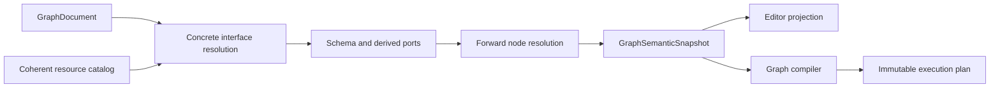

# Graph 与 Execution 当前架构

> Status: Current
> Scope: Graph Draft、Projection、语义求解、Compile、Save、Execute、Problems、Results 与 Run Output
> Canonical owners: Graph/Execution/Project 源码与测试拥有可执行事实；本文拥有这些阶段之间的稳定 contract
> Update when: Graph authority、阶段语义、projection、execution result 或 output 边界改变时

本文是 Graph 与 Execution 生命周期的 canonical 架构说明。Workbench 只负责 panel 放置，operational logging 只负责技术观察；二者不得复制这里的领域状态。

## 1. Authority and identities

| 事实                                               | Authority                              | Frontend representation                       |
| -------------------------------------------------- | -------------------------------------- | --------------------------------------------- |
| 已保存 Graph document 与 Project resource revision | Rust Project / Graph document owners   | Rust projection 的只读副本                    |
| 未保存编辑                                         | frontend `GraphDraftSession`           | document、dirty/history 和 editor interaction |
| resolved semantics                                 | Rust `GraphSemanticSnapshot`           | atomic editor projection                      |
| compiled artifact                                  | Rust Graph runtime cache               | opaque source hash / compile outcome          |
| run、result、payload 与 Pin history                | Rust Execution runtime / `ResultStore` | typed query result 和 UI projection           |
| program output                                     | Rust Execution ordered stream          | bounded frontend run-output projection        |

以下 identity 必须保持不同：

- opaque `graphPath` 标识 Project resource；
- frontend Graph/editor lifecycle 和 Project instance/session 标识一次活动上下文；
- UUID 标识 node、pin 和 connection；
- `PortAddress` 标识一个可寻址 output/input；
- run、activation 和 `ResultId` 标识执行生命周期；
- `panelInstanceId` 只标识一个 Dockview panel。

Frontend 不从 `graphEntities`、panel 是否存在或资源路径格式推断 backend resident state。所有 command response、projection、compile artifact、run event 和 query 都必须以明确的 project/session/path/lifecycle 或 source identity 通过 currentness gate。

## 2. Module ownership

| Owner                                          | 当前责任                                                                                |
| ---------------------------------------------- | --------------------------------------------------------------------------------------- |
| `yss-graph-document` / `yss-graph-protocol`    | 持久 document、entity identity、稳定 port/type/schema/value contract                    |
| `yss-graph-document-edit` / `yss-graph-editor` | document invariant、draft mutation、保守连接预检和可移植 subgraph                       |
| `yss-graph-registry` / `yss-graph-catalog`     | node protocol registry、built-in catalog、validation 和 fingerprint                     |
| `yss-graph-analysis`                           | concrete interface、type/schema/lineage 求解、Problems、coercion 和 specialization      |
| `yss-graph-compiler`                           | snapshot 驱动的 lowering、immutable compiled package 和 compile error                   |
| `yss-graph-runtime`                            | session-scoped registry/catalog 组合、analysis、compile cache 和 editor planning facade |
| `yss-project`                                  | resource revision、resident document、持久化事务、history 和 authority commit           |
| `yss-application`                              | coherent session/resource capture、Graph↔Project↔Execution 用例编排和 currentness gate  |
| `yss-execution`                                | immutable plan、demand、run、result store、output stream 和 finalization                |
| `yss-api`                                      | command/event/channel DTO mapping，不拥有上述业务规则                                   |

完整 crate 清单由[生成的 Module Map](../reference/MODULE_MAP.md)提供；本文不逐项记录文件移动和历史 facade。

## 3. Open and Draft lifecycle

打开 Graph 的顺序是：

```text
capture active Project session
  → load and validate the opaque resource
  → install the resident document
  → bind coherent registry/database/resource facts
  → materialize concrete and dynamic ports
  → solve one complete semantic snapshot
  → return canonical document + editor projection
  → create frontend Draft session
```

Canvas、keyboard、Details、clipboard 和 undo/redo mutation 只推进当前 frontend Draft。它们不得在 Save 前修改 `ProjectState` 或发出 authoritative Project event。

Rust draft transformer 是无状态 domain operation：它根据完整当前 draft 校验一次 mutation，构造 candidate document，并在同一 command response 返回 candidate document、changed 状态和完整 projection。Frontend application coordinator 按 Graph 串行 mutation requests；返回后先重验 Project identity/lifecycle，再原子安装 draft 与 projection。不存在 Graph Projection background channel、逐条 `problemAdded` / `problemRemoved` 事件或第二套 request-generation authority。

Frontend application coordinator 在 Problems panel 生命周期之外管理 projection，并在同一次 commit 中采用：

- compilation basis 和 graph path；
- nodes、concrete ports 和 connections；
- resolved type、schema 和 parameter editor facts；
- 顶层完整 diagnostics；
- compilation outcome 和 run-gate state。

属于旧 project/session/lifecycle 的 command result 必须拒绝。Project event 触发的 clean Graph rehydrate 同样经过 lifecycle/currentness gate；dirty draft 不被外部 projection 覆盖。不存在独立的 authoritative `ProblemsStore`。

## 4. Semantic resolution

`GraphDocument` 保存用户意图和稳定结构：node、parameters、concrete port identity/order、connections 和 input overrides。Protocol `TypeExpr` 描述节点接受的 pattern，不表示当前端口的 resolved type。

输入 literal override 使用经过 protocol 校验的 typed value；普通异构 parameters 才使用 JSON value。Analysis 和 Compiler 消费该 exact literal type，Editor Projection 只投影控件所需 payload，React 不再次猜测类型。



`GraphSemanticSnapshot` 是 resolved port types、schemas、lineage、diagnostics、input coercions 和 kernel specialization 的唯一 authority。关键不变量：

- 一个 node evaluation 是求解和 cache invalidation 单位；resolver 先收集完整 inputs，再一次发布全部 outputs；
- type/schema/lineage 只沿同一组 data edges 前向传播；下游和 connection iteration order 不能反向改变上游结果；
- Projection 和 Compiler 消费同一个完整 snapshot，不各自建立 inference model；
- semantic cache 只优化纯求解，结果必须与 full resolve 一致，UI position/selection/zoom 不进入 key；
- derived port 的 active facts 来自当前 resource/schema；`last_known` 只服务 orphan 展示和恢复；
- connection preflight 只拒绝确定不兼容的组合，最终 mismatch 由完整 analysis 诊断；
- Editor Projection 只暴露有 canonical address 的 concrete ports。可新增实例的 template 是 node capability，不是 synthetic pin 或 React callback。

Analysis Graph 只包含数据端口和数据依赖。当前 built-in catalog 不包含 Event Begin、Print、Control/Effect 或 Variable Set 等流程/副作用节点；这类行为属于独立 Workflow responsibility。

## 5. Draft, Compile, Save, and Execute

四个操作相互独立：

| 操作           | 输入                                            | 改变 committed Project            | 产物                                              |
| -------------- | ----------------------------------------------- | --------------------------------- | ------------------------------------------------- |
| Draft mutation | 当前 draft + typed operation                    | 否                                | candidate draft + 同步完整 projection             |
| Compile        | 完整当前 draft + coherent resource facts        | 否                                | content-addressed immutable artifact + projection |
| Save           | 完整当前 draft                                  | 是                                | 持久化 canonical document + projection            |
| Execute        | explicit demand + matching compiled source hash | 仅 finalization 明确提交的 effect | run、Results、Run Output                          |

### Compile

Compile 覆盖 draft 中每个 node，构造完整 data-dependency DAG，解析动态接口，传播 type/schema/lineage，检测 cycle，并降低 immutable plan。增量复用不能把 compile 变成只覆盖一个 output 的局部 artifact。

artifact hash 来自语义 document、registry 和 resource catalog facts；纯布局位置不参与。Compile 安装内存 artifact，但不保存文件、不替换 committed Project document，也不清除 frontend dirty state。

### Save

Save 是 atomic full-document overwrite，不携带 frontend `expectedRevision`。开始 Save 后 editor 必须锁定所有 draft mutation 入口。Rust 校验 candidate，在文件事务中持久化，再替换 Project authority；任一阶段失败都不能留下半提交状态。

成功时 frontend 整体采用返回的 canonical document/projection，并清除 dirty/history；失败时保留原 draft。dirty draft 不与 backend snapshot 自动 merge 或 rebase。干净 projection 可以因资源变化重新 hydrate。

### Execute

Execute 必须提交当前 compile 返回的 source hash。Application 从同一 active session 解析精确 artifact、准备 generation-bound resources，再交给 Execution runtime；找不到或不匹配时拒绝运行，不能隐式 Save、隐式重新 Compile 或回退到磁盘旧 document。

默认 demand 从完整 plan 的终端 outputs 反向选择依赖；Pin Preview 或显式 outputs 只改变运行调度范围，不改变 compile 范围。Execution 运行 immutable plan，不在 kernel 执行期间查询 mutable Graph document 或 Project authority。

## 6. Results

`ResultStore` 是 session-scoped result authority。一个 activation group 的 outputs 原子从 Pending 进入 Ready、Failed 或 Cancelled，消费者不能观察部分 terminal transition。

每个 logical result 使用 opaque `ResultId`，并保存 state、run/activation provenance、compiled source/output identity、presentation、value contract 和 ready payload。每个 Graph output 的 produced/reused history 也由同一 store 持有。

Frontend 通过 typed descriptor/value/page/history queries 读取；run events 只公告需要打开或预览的 result identity，不承载 payload、history 或 authoritative state。Project replacement 更换整个 ResultStore，旧 ID 不得 alias 新 session 的 result。

一个 node evaluation 可以产生多个 individually addressed outputs，但这些 outputs 来自同一次完整 node evaluation，共享同一失效生命周期；不能为每个 pin 建立独立 mutation/evaluation authority。

## 7. Graph Problems

Graph Problems 是当前 Draft 的 resolved domain facts，属于完整 editor projection。顶层 diagnostics 是 graph、resource、connection、node、port 和 parameter 问题的 canonical 全集；node-local diagnostics 只用于 Canvas/Details 的快速索引。

Canvas、Details、Run Gate 和 `GraphProblemsPanel` 从同一 projection bucket 派生。关闭或移动 Problems panel 不影响 analysis，也不能解除 run gate。普通 unbound input、missing resource/column、type mismatch、invalid parameter、cycle 或 orphan port 不写入 `tracing` 和 Logs UI。

只有 resolver/compiler 自身的内部故障、invariant violation、耗时、取消或 stale-result 丢弃才进入技术 logging。需要时可以用 incident identity 关联领域失败与技术记录，但 Logs 不能恢复 Problems。

## 8. Run Output

Run Output 是 Execution 的 typed ordered stream，与 run lifecycle event、Result query 和 operational diagnostics 分离。每条输出保留 run、strictly increasing sequence、stdout/stderr stream 和实际 source graph/node/port identity；nested execution 不能用 root graph 或 UI focus 猜测来源。

Backend 和 frontend projection 都必须有明确容量，截断、丢弃或 sequence gap 必须可见并可恢复或终止，业务线程不能因 UI 消费慢而无限阻塞。具体容量是源码常量和测试事实，不在本文复制。

当前 Analysis Graph catalog 不产生 Print/Effect output；Run Output contract 供能够合法产生用户程序 stdout/stderr 的 Execution/Workflow adapter 使用。Assistant text、Graph Problems 和 diagnostics 都不能进入该 stream。

## 9. Cross-boundary routing

| 信息                            | 去向                                             |
| ------------------------------- | ------------------------------------------------ |
| expected Graph validation issue | complete Graph Projection / Problems             |
| logical computation result      | Rust ResultStore + typed query                   |
| user program stdout/stderr      | Run Output channel                               |
| internal technical observation  | Rust `tracing` → logging/operational diagnostics |
| command rejection               | `yss-api` stable error wire                      |
| localized user feedback         | React application/view                           |

日志与用户反馈边界见 [Runtime Signals](RUNTIME_SIGNALS.md)，transport 细节见 [`yss-api` README](../../src-tauri/crates/yss-api/README.md)，panel placement 见 [Workbench Dockview](WORKBENCH_DOCKVIEW_ARCHITECTURE.md)。变更前使用 [Change Process](../development/CHANGE_PROCESS.md)，验证命令只以 [Local Workflow](../development/LOCAL_WORKFLOW.md) 为准。
