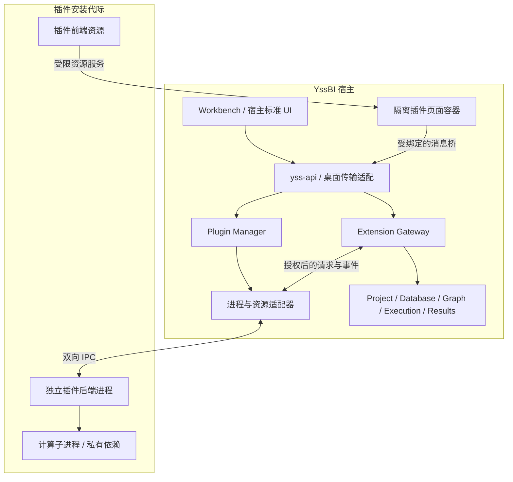

# YssBI Plugin 架构与契约

> Status: Accepted Decision
> Contract: Target Architecture
> Scope: 插件分发、宿主边界、Extension API、IPC、任务与数据、声明式扩展点、Webview、生命周期、安全及验收
> Canonical owners: 本文拥有 Plugin 目标架构与稳定语义；协议 schema 拥有可执行 wire 定义；各 Core owner 继续拥有项目、数据、Graph、执行、结果和持久化事实
> Update when: 插件职责、协议兼容性、扩展点、授权、提交点、恢复或分发契约改变时

本文是面向实现、审查和验收的完整目标契约。“必须”“不得”是实现约束，不表示对应代码已经完成。当前生产行为仍以代码、测试、manifest 和各 Current 专项文档为准。原型文件存在、页面可打开或某个 RPC 可调用，均不能作为整个契约已满足的证据。

当前生命周期实现见 [Plugin runtime](../../src-tauri/crates/yss-plugin-runtime/README.md)，源码与分发入口见
[Julia 插件](../../plugins/julia/README.md)。当前协议 2 引入有保留期的操作标识、实际预算、进度和诊断投影；
同仓库仍发布一个 `yssbi.julia` 包。在线目录、自动更新、OS sandbox 和 checkpoint/recover 等其余目标不因此视为完成。

采用稳定 Extension API、声明式扩展点、宿主标准 UI、独立插件进程、隔离 Webview 和消息通信。源码组织、发布单位、进程边界和业务 authority 分别建模，不按 Rust crate 数量划分插件。

## 1. 目标与不可破坏的边界

1. 未安装插件时，宿主可以启动、打开项目并使用其他功能；不启动该插件或其运行时，不初始化其依赖。
2. 插件的后端实现、前端页面、计算脚本和私有依赖独立构建、签名、安装及更新；安装插件无需重新编译宿主。
3. 宿主不依赖 Julia、贝叶斯或其他插件专属实现、页面、wire DTO、任务模型和硬编码 ID 白名单。插件业务新增方法不要求修改宿主命令表。
4. 插件通过 Extension API 获取受控能力，不访问宿主内部模块、React store、Workbench DOM、数据库连接、Tauri command registry 或 Rust 私有对象。
5. Project、Database、Graph、Execution、ResultStore 和 Workbench 的既有 authority 不迁入插件管理器。插件不能建立它们的第二份已提交模型。
6. 插件拥有内部算法、业务模型和计算过程；宿主拥有通用任务监督、授权、输入绑定与产物接收记录，不重建插件内部调度器。
7. 所有进程、请求、队列、任务、数据 lease、页面和文件都有明确 owner、容量、失效与回收路径。
8. 协议兼容性由版本协商、schema 和契约测试保证，不依赖 Rust ABI、共享 React 实例或宿主内部路径。
9. 插件崩溃、断开、更新或缺失不能破坏宿主项目、其他插件或已有通用结果。
10. 本地包与目录服务下载的包经过同一安装管线，来源不改变执行与授权规则。

## 2. 系统结构与依赖方向



Plugin Host 指宿主的管理器、网关、进程监督和页面消息桥，不要求额外的 Node.js 服务。原生插件 executable 直接实现协议；其他语言插件可以携带执行环境并使用同一 Extension API。

每个启用的插件安装代际，在一个 application session 中最多有一个后端进程，供多个窗口和视图使用。进程身份为 pluginId、installationGeneration、appSessionId 的组合。项目操作使用每次调用携带的受限 context，不能在插件全局变量中保存一个会被其他请求覆盖的“当前项目”。

| 责任                                           | Owner                  | 不承担的责任                   |
| ---------------------------------------------- | ---------------------- | ------------------------------ |
| 发现、信任、安装、启用、版本切换、贡献注册     | Rust Plugin Manager    | 插件算法、贝叶斯配置与内部调度 |
| API 校验、身份、授权、限额和宿主用例调用       | Rust Extension Gateway | 绕过 Core 执行项目写入         |
| 创建进程、管道、退出监测、进程树清理和 OS 限制 | 平台执行适配器         | 插件业务准入策略               |
| 命令、菜单、标准视图、Dockview 面板与占位      | 宿主前端               | 执行插件业务脚本               |
| 页面装载、资源授权、焦点和消息绑定             | Webview Host           | 插件页面业务模型               |
| 算法、私有模型、依赖环境和计算子进程           | 插件后端               | 宿主项目与数据库 authority     |
| 复杂表单、可视化和编辑器页面                   | 插件前端               | 直接访问宿主 Tauri 或内部状态  |
| 类型、客户端封装和服务端校验                   | 协议 schema 与 SDK     | 第二套运行时 authority         |

宿主编译依赖只允许通用插件协议、管理用例、平台适配器和 Core contracts。SDK 与插件可以共享通用类型 crate，但不能使插件实现反向链接进宿主。插件身份和许可通过签名目录、信任策略和能力声明解析，不通过针对 Julia 的条件分支识别。

## 3. 身份、作用域与状态 authority

### 3.1 身份

| 标识                                 | 作用                             | 有效期                   |
| ------------------------------------ | -------------------------------- | ------------------------ |
| pluginId                             | 发布者命名空间下的稳定身份       | 跨版本稳定               |
| packageDigest                        | 一个已验证包的内容身份           | 不可变                   |
| installationGeneration               | 安装、替换与授权变更的宿主代际   | registry 提交后生效      |
| instanceId                           | 宿主分配的插件进程身份           | 重启即改变               |
| appSessionId                         | 宿主运行会话                     | 应用重启即改变           |
| projectInstanceId / projectSessionId | Core 的项目及运行时身份          | 遵循 Project 生命周期    |
| viewId / viewInstanceId              | 声明视图类型及宿主页面实例       | 类型稳定，实例可重建     |
| panelInstanceId / groupId            | Dockview 的物理面板和 group      | root Dockview 管理       |
| requestId                            | 一次 RPC 的关联身份              | 单连接、单发起方向内唯一 |
| operationId                          | 一次逻辑写入或任务准入的幂等身份 | 跨重连保留               |
| taskId                               | 宿主监督的执行身份               | 按任务及回执保留策略回收 |
| snapshotId / leaseId                 | 不可变数据快照及授权使用权       | 有释放、撤销与到期语义   |
| streamId / sequence                  | 事件流及其连续位置               | 流重建后重新分配         |
| resourceRef / resultId               | Core 资源和已接收结果            | 对应 Core contract 管理  |

运行期 ID 都是 opaque value。PID、路径、显示名、requestId 与 taskId 不可互换。宿主从连接和页面绑定推导调用者，不接受自报 pluginId 或 projectId 作为授权依据。

跨 JavaScript 边界的 64 位 revision、sequence 和计数使用规范十进制字符串，不经过可能丢失精度的 Number。JSON 数值必须有限且符合 schema 范围；大数据数值使用声明的数据格式，不以 NaN、Infinity 或隐式字符串转换绕过类型。

### 3.2 状态

| 维度     | 状态                                                 | 唯一事实源                     |
| -------- | ---------------------------------------------------- | ------------------------------ |
| 包可用性 | absent / installed / quarantined                     | 安装 registry 与文件完整性验证 |
| 安装操作 | idle / staging / validating / committing / failed    | 宿主安装事务                   |
| 启用策略 | enabled / disabled / blocked                         | 宿主设置与信任策略             |
| 兼容性   | compatible / hostIncompatible / platformIncompatible | 清单与握手                     |
| 外部依赖 | unknown / missing / preparing / ready / invalid      | 插件依赖查询                   |
| 进程     | stopped / starting / running / stopping / crashed    | 宿主进程监督                   |
| 页面     | unloaded / loading / ready / suspended / failed      | 宿主页面生命周期               |
| 长期任务 | admitted / running / cancelRequested / terminal      | 宿主监督账本与已验证插件事件   |

各维度独立。包已安装但 Julia 缺失时仍是 installed，依赖为 missing；系统已有 Julia 也不能让未安装的插件变成 installed。

列表、侧栏与安装按钮使用 Rust 投影。不得通过 React localStorage、前端计数或 runtime ready 反推安装状态。查询失败显示 unknown/unavailable，不伪造 absent 或成功。

## 4. 包、清单与构建契约

### 4.1 分发单元

包是带清单和签名的归档文件，逻辑内容如下：

```text
plugin.json
files.json
signature.json
bin/<target>/executable and private libraries
web/<entry>/HTML, CSS, JS and static assets
runtime/<dependency>/lockfiles and bundled resources
locales/<language>/messages
licenses/
```

清单只包含逻辑相对路径。每个运行期文件均进入索引。发布产物不依赖 workspace 源码、开发服务器、系统 Cargo/npm，也不在用户机器上编译 Rust。

后端和前端独立构建。页面携带自身依赖，不导入宿主源文件或复用宿主 React。源码可以同仓库维护，插件包必须可以独立发布和加载。

### 4.2 Manifest

| 字段                                | 契约                                                                            |
| ----------------------------------- | ------------------------------------------------------------------------------- |
| schemaVersion                       | 清单 schema；未知必需语义拒绝安装                                               |
| id / publisher / name / description | 稳定身份及展示元数据；展示文字不是信任凭证                                      |
| version                             | 插件 SemVer；相同发布者、ID、版本和平台变体不能发布不同内容                     |
| engines.hostApi                     | 支持的宿主 Extension API 范围                                                   |
| protocol                            | 支持的 major/minor 范围和 requiredFeatures                                      |
| targets                             | OS、CPU、ABI、最低 OS 条件及 executable                                         |
| execution                           | 执行模式、所需隔离、子进程及依赖声明                                            |
| activation                          | 命令、视图、资源打开或受控启动事件                                              |
| contributes                         | commands、menus、views、statusItems、resourceTypes、taskTypes、computeProviders |
| permissions                         | 宿主能力、scope 和可选授权说明                                                  |
| dependencies                        | 运行时约束及消费的 provider capability                                          |
| resourceBudget                      | 请求、任务、缓存、页面与数据预算申请                                            |
| storage                             | 私有数据和文档格式的 schema、迁移及恢复要求                                     |
| locales / icons                     | 本地化资源和经校验图标                                                          |
| extensions                          | 命名空间隔离的可选元数据；不改变授权或执行语义                                  |

schema 校验字段类型、长度、数量、ID 与路径。贡献 ID 在插件内唯一，跨插件用 pluginId 区分。未声明的命令、页面、图标或能力引用使清单无效。

files.json 列出规范路径、字节数与 SHA-256，按 UTF-8 路径字节排序。packageDigest 是规范清单和文件索引组成的签名载荷摘要，索引绑定全部执行资产；不对签名文件自身递归取摘要。签名载荷以 RFC 8785 JCS 规范化，使用 Ed25519 签名，包含发布者 keyId、包身份、平台变体与 schema 版本。拒绝重复 JSON key 和不满足规范编码的数值。算法演进必须经分发协议协商，不能由包任意指定不受信算法。[JCS 规范](https://www.rfc-editor.org/rfc/rfc8785)、[Ed25519 规范](https://www.rfc-editor.org/rfc/rfc8032)

### 4.3 信任与来源

签名目录记录绑定发布者、插件 ID、版本、平台与摘要，下载包必须完全匹配。拒绝同版本不同内容、身份替换、吊销签名、不兼容目标与过期的目录信任链。

目录暂时离线只影响发现、下载与更新。已验证安装使用固定的包和授权记录；是否允许离线执行由信任策略中的有效期与已知撤销状态决定，不能把联网失败误判为插件已卸载。

本地安装经过同样的结构和完整性校验。未由受信发布者签名的包，必须明确要求用户信任该包摘要；授权不扩展到同名不同内容或新增权限的更新。校验和不能冒充发布者签名。

执行信任分为：

- sandboxRequired：平台必须满足清单要求的 OS 隔离和限制，否则 blocked。
- trustedNative：用户或组织明确允许原生代码以当前用户身份执行；宿主 API 仍受限制，但不声称这些限制阻止插件自行调用 OS。

不得自动降级这两种模式。签名证明来源，不证明代码没有副作用。

## 5. Extension API 与能力边界

API 是带 schema、版本和 scope 的稳定能力，不是 Tauri commands 的镜像。协议 schema 是生成 Rust/TypeScript 类型、边界校验器、SDK 和接口参考文档的唯一输入。两端都执行校验，JSON 扩展字段不能绕过封闭 schema。

### 5.1 宿主服务

| 家族       | 主要操作                                   | 授权和提交边界                              |
| ---------- | ------------------------------------------ | ------------------------------------------- |
| context    | 查询上下文、订阅项目变化                   | 宿主分配 context，不接受客户端伪造          |
| commands   | 执行注册命令                               | ID、输入 schema、声明调用方及权限           |
| views      | 打开、聚焦、请求关闭本插件视图             | 只表达意图，布局由 Workbench 提交           |
| standardUi | 分页数据、form draft、selection、局部失效  | 不传 DOM 或宿主组件实例                     |
| data       | 数据目录、schema、snapshot、分页、释放     | project session、revision、列/行范围与预算  |
| resources  | 打开资源、读取内容、准备和提交修改         | resourceRef、expectedRevision、operationId  |
| tasks      | 准入、查询、取消、订阅、恢复回执           | taskType、context、deadline、幂等与归属     |
| results    | 申请 staging、校验和提交产物、查询通用表示 | 输入绑定、任务回执、Core 接收事务           |
| storage    | 设置、私有状态、插件项目数据               | 命名空间、scope、配额与格式版本             |
| secrets    | 获取受限引用或请求受控使用凭据             | 不进入页面、普通 storage 或日志             |
| system     | 文件选择、URL、受控网络与依赖操作          | 用户手势、资源 grant、目的地与信任模式      |
| feedback   | 结构化状态、诊断和用户决策请求             | 区分任务、日志、错误与结果，不接受任意 HTML |

列举不隐含读取，读取不隐含写入，安装不隐含全部 permissions 已批准。准入和提交前都检查适用的授权与 currentness。

bayes.fit、julia.install 属于插件命令或 taskType。宿主不增加这些专属方法，只根据注册描述转发到插件。

插件间调用经宿主 broker，绑定 provider capability、版本、目标实例和调用链。有效权限是调用上下文、两方授权和能力 scope 的交集；不授予被调用方调用者全部权限，不传递私有句柄或任意 method 名称。

### 5.2 插件服务

| 服务面                                                  | 语义                           |
| ------------------------------------------------------- | ------------------------------ |
| lifecycle.initialize / activate / deactivate / shutdown | 协商、激活与停机               |
| commands.execute                                        | 声明命令；长期工作返回 taskId  |
| tasks.start / get / cancel / recover                    | 插件任务与宿主监督记录关联     |
| views.attach / detach / message                         | 页面实例绑定、销毁与消息       |
| providers.query / invalidate                            | 标准 UI 分页数据和失效通知     |
| resources.open / validate / prepareSave / migrate       | 插件文档语义；物理提交仍归宿主 |
| dependencies.inspect / prepare                          | 外部运行时状态与准备任务       |

只允许清单声明且握手接受的服务。运行中不能扩大贡献或权限；provider 更新条目、计数和可用状态不等于注入新的代码入口。

## 6. IPC 控制协议

### 6.1 连接和分帧

本地后端使用双向 JSON-RPC 2.0，宿主写入插件 stdin，插件写入 stdout。stdout 专用于协议；stderr 独立有界排空，插件不得输出启动 banner 或第三方日志到协议流。

每帧为 4 字节无符号大端长度与对应长度的 UTF-8 JSON，长度不含头部。读取器必须先验证长度再分配内存，限制 JSON 深度；禁止无界 read_line 或全流 read_to_end。

使用命名参数对象与字符串 requestId；业务调用不使用 batch，批量语义由显式分页和 bulk API 定义。响应只包含 result/error 之一。notification 只承载可恢复事件，不承担必须确认的写入、取消或终态提交。

控制协议与大数据分离。数据不通过 base64 大包、长 JSON 数组或日志输送。writer 串行写完整帧，reader 独立分发，不因业务 handler 阻塞取消和反向请求。

### 6.2 握手

1. 宿主验证包、启用策略和平台，分配 instanceId、installationGeneration、appSessionId 与一次性连接绑定。
2. 建立受监督进程树和私有管道，以结构化 argv 启动声明 executable。
3. initialize 发送宿主 API 范围、协议范围、feature、语言、主题版本和预算上限。
4. 插件返回真实 ID、版本、包摘要、协议范围与 requiredFeatures。
5. 宿主对照清单选择共同支持的 major 及最高共同 minor，生成 grantedCapabilities 与有效预算。
6. 插件确认最终协商结果后才 Ready；失败关闭实例，不尝试其他同名 executable。

握手不自动读取项目数据、安装依赖或执行用户任务。清单兼容校验与实际握手都必须通过。

同插件、同安装代际的并发激活共享一个启动过程和结果。包验证、进程创建与握手在全局状态锁外完成；跟随请求有等待数量与时间上限，成功、失败或异常退出都唤醒等待者。安装、更新和卸载不能穿过未完成的启动或已授予的活动 lease；唤醒后再次确认实例仍然有效才授予 lease。

### 6.3 请求上下文

每个业务请求绑定连接身份、宿主 contextId，以及适用的 viewInstanceId、taskId、operationId、资源 grant、剩余预算与调用链。

SDK 可以携带引用，但不能生成授权。宿主从 token 表解析 application/project session，拒绝旧实例、跨项目、已撤销和 scope 不匹配的请求。

跨进程传递 remainingBudgetMs，不比较两端单调时钟数值。接收时建立本地单调 deadline；排队计入预算，转发扣除耗时，不能重新获得完整预算。

### 6.4 调度、超时与终结

requestId 在连接内不复用，两方发起方向使用独立命名空间。pending 表、handler 并发、发送队列、反向调用深度均有上限，超限返回 resource_exhausted，不无限 spawn。

关闭连接必须唤醒所有等待者并释放 pending/cache。已经终结请求的 late response 丢弃并计数，允许识别 late ID 的记录也必须有界；未知 ID、错误 envelope 或持续违规按协议故障处理。

RPC 超时不证明任务未执行。副作用请求不得自动重发；先查询 operation receipt 或 task snapshot，再决定是否可恢复。

### 6.5 错误

JSON-RPC error 包含整数 code、固定机器标签 message，以及 data 中的结构化失败。message 不作为用户文案。禁止输出堆栈、命令行、文件内容、数据值或第三方原始错误。

data 归一为 code、details、incidentId，details 只包含相应错误 schema 允许的安全字段。到宿主前端的 Tauri 错误继续遵循既有精确三字段 wire，不增加 JSON-RPC 包装。

必须区分 protocol_incompatible、permission_denied、stale_context、resource_exhausted、dependency_unavailable、process_exited、request_timeout、cancelled 和 outcome_unknown。不能将 transport failure 伪造成算法原因或成功结果。

宿主通用错误由宿主本地化；插件错误由包内受信本地化资源呈现。上述 envelope 遵循 [JSON-RPC 2.0](https://www.jsonrpc.org/specification)，分帧、scope、预算和生命周期属于 YssBI 的协议 profile。

## 7. 长期任务、取消与恢复

宿主 Task Registry 负责准入记录、归属、提交回执和可恢复终态。插件拥有算法参数、业务队列、采样进度和实现细节。两者通过 taskId 关联，不复制完整业务模型。

### 7.1 准入和执行

宿主为一次逻辑执行分配 operationId，捕获 project session、输入 snapshot/revision、插件包摘要、参数摘要和授权，持久化 admitted 记录。tasks.start 必须快速接受或拒绝，不能把整个计算塞在准入 RPC 中。

相同 operationId 加相同输入返回原 task receipt；相同 ID 加不同输入返回冲突。插件在自己的账本中持久化接受记录后确认。宿主和插件的两个接受记录通过可查询回执协调，不假定一次 IPC 能构成跨进程事务。

任务从 admitted 进入 running，可以进入 cancelRequested，终态为 succeeded、failed、cancelled 或 outcomeUnknown。只有必要产物和副作用回执验证完成，宿主才记录 succeeded；插件的完成事件不代替结果提交。

commands.execute 的耗时命令同样返回受监督 task，包括依赖准备、文档迁移和导出。任务不属于 Webview 的内存生命周期。

### 7.2 取消与 deadline

取消是独立、可确认的控制请求。进入 cancelRequested 不立即宣称 cancelled。插件停止派生新工作，协作取消子任务、封闭候选输出，并返回取消确认或已经存在的终态回执。

计算 deadline、RPC deadline 与取消投递 deadline 独立。计算超时先请求取消，限定宽限期内未停止则终止受监督进程树。不能关闭 pipe 后任由 Julia 子进程继续运行。

已经完成的 Core 提交不能因迟到取消伪装成“未执行”。无法确定外部副作用是否发生时进入 outcomeUnknown，保留任务和回执，不宣称取消成功。

### 7.3 崩溃和重新连接

实例退出使旧请求、页面端口与临时 capability 失效。已由 Core 接收的结果保持有效。未终结任务依据账本、operationId 和输入绑定恢复；插件声明是否支持检查点恢复，不能推断任意任务都可续跑。

重启分配新 instanceId。恢复是显式协议过程，不重放旧内存请求或自动重新执行副作用。自动重启必须退避且受重启预算限制，超限保持 crashed 并等待用户操作。

重新连接后，宿主先查询尚未确定的 operation receipt，再让插件恢复允许恢复的任务。回执保留期限和查询不可用的结果必须在 schema 中定义；回执已过期不能被解释为“从未提交”。

outcomeUnknown 表示该次执行观察已结束但结果待核实，不是确定的失败或成功。恢复发现权威回执后追加 reconciliation revision，保留原未知记录与关联证据；这一步澄清结果，不再次执行任务，也不改写已经确认的终态。

### 7.4 项目替换和应用退出

Project replacement 协调者先冻结旧项目的新准入，drain 或取消任务，处理 dirty 资源和未确认提交，再撤销旧 context、lease 与页面绑定。新 project session 安装后才能发布它的当前结果。

旧任务的迟到产物可隔离保留供恢复，但不得提交到新项目或伪装成当前结果。同一路径重新打开也必须使用新的 session。

应用退出先停止准入，处理文档和任务，再有界 shutdown。超时清理进程树，持久化未确定状态；不能无限等待插件退出。

## 8. 事件、背压与资源预算

### 8.1 事件语义

| 类别                           | 交付与恢复                                    |
| ------------------------------ | --------------------------------------------- |
| 终态、提交回执、授权撤销       | 可靠语义；持久记录可查询，通知丢失时恢复查询  |
| 安装、依赖状态、进度、视图失效 | 单调 revision，可合并最新值，以 snapshot 恢复 |
| 日志、性能采样                 | 有界可丢弃，报告丢失计数，不作为业务事实      |
| 数据和结果内容                 | 查询或数据 lease，不通过通用事件广播          |

有序订阅返回 snapshot、streamId 与一致的 sequence 起点。生产者原子建立订阅与快照边界，避免先读快照再监听导致间隙。消费者遇到 gap 或 stream 更换停止套用增量，重新请求 snapshot。

ack 用于流量控制与恢复位置，不是业务 commit。日志、计算输出、Graph Problems 和用户反馈仍遵循 [Runtime Signals](RUNTIME_SIGNALS.md)，不能互相替代。

### 8.2 ResourcePolicy

宿主提供单一版本化 ResourcePolicy，清单提出需求，最终取宿主允许的有效预算。插件不得提升宿主上限。协商结果必须覆盖：

| 预算域          | 必须限制                                                                     |
| --------------- | ---------------------------------------------------------------------------- |
| control         | frame bytes、JSON depth、pending requests、handler concurrency、queued bytes |
| streams         | unacknowledged events/bytes、snapshot size、progress/log rate                |
| tasks           | 活动与排队任务数、执行期限、取消宽限期、重启次数                             |
| data            | 列数、行数、字节数、lease 数、mapped bytes、并发传输                         |
| package/storage | 文件数、单文件大小、解包总字节、展开比、私有状态和缓存                       |
| views           | 活动页面数、保留页面缓存、UI state 大小、消息速率                            |
| process         | 子进程、句柄、CPU/内存约束能力、启动与退出期限                               |

具体默认值由 policy schema 与生成配置拥有；没有完整预算的连接不能 Ready。禁止“无限”或负值绕过限制，协议必须定义范围错误。插件可以降低资源使用，不得扩大有效授权。

reader、writer、控制请求和业务执行使用独立有界调度。取消、shutdown、授权撤销与健康查询保留控制容量；公平调度防止单个插件、任务或页面独占宿主。

反向 API 和耗时操作不在持有全局 registry 或原 RPC handler 锁时执行。等待对方响应不能堵住读取对方反向请求的通道。资源回收不得依赖已经饱和的业务队列。

## 9. 数据交换与共享资源

### 9.1 读取

数据调用携带 dataset reference、列投影、行选择与 expectedRevision。宿主验证项目、声明与数据 revision，生成不可变 snapshot，再授予受限 lease。lease 绑定插件实例、任务、project session、格式、schema、字节数和到期时间。

预览使用有界分页。大规模列数据通过 Arrow IPC 文件或文件描述符传递，插件以 mmap 或顺序读取使用；JSON 只传描述符与 handle。完整 DataFrame 不经过 Webview，数据库连接和凭据不离开对应 Core owner。

宿主不允许插件直接打开项目 DuckDB。快照缓存按数据身份、revision、投影和选择条件索引；授权后的消费者可以共享不可变字节，但每个消费者的 lease 与权限独立，不能因缓存命中绕过鉴权。

### 9.2 Lease 与清理

lease 显式 release，并在到期、撤销或实例退出后回收。文件保留到最后一个合法读者释放，或相关进程被确定终止；不得覆盖仍被 mmap 的内容。

trustedNative 的路径交付只是传输方式，不是文件系统隔离承诺。sandboxRequired 使用只读 handle 或平台隔离目录。插件自报绝对路径不能建立数据读取权。

资源 grant 不能由 pluginId 和路径拼接还原，不能跨实例借用。回收依据宿主授权账本和拥有的目录，不扫描用户目录猜测所有权。

### 9.3 输出与结果接收

插件申请 task-scoped staging，写入候选产物并提交 manifest，包含类型、字节数、schema、摘要与来源绑定。

宿主验证产物位于授权目录，拒绝路径穿越、链接或 junction/reparse point 逃逸、设备路径、重复别名与超限。提交前重验 project session、任务、输入绑定和 expectedRevision。

验证成功由 Core 原子接收不可变产物并分配 resultId/resourceRef。必须通过复制、权限转移或独占所有权等方式，使插件无法继续修改已提交字节；只把插件路径登记为结果不算接收完成。

provenance 记录插件 ID、版本、packageDigest、taskType/算法版本、输入 snapshot/revision、参数摘要，以及随机种子等复现信息。读取错误、数据内容和 schema 内容不写入诊断 payload；可记录摘要、计数、耗时与安全身份。

## 10. 文档、结果与 Graph

### 10.1 插件文档和 Save

插件声明 resourceType、文档格式版本和编辑器贡献。Project 保存通用 envelope、内容、revision 与来源；插件解释私有模型。Webview 只持有显式 unsaved draft，不拥有宿主 committed project state。

Save 捕获 resourceRef 与 expectedRevision，插件校验并准备候选内容，Core 检查权限/currentness 后提交事务并返回 receipt。页面收到成功回执才清除 dirty。失败保留 draft，Save 前不得修改宿主文件。

插件升级中的文档迁移使用副本、明确格式版本和恢复记录。后台迁移不能覆盖未保存 draft；数据迁移与包切换作为可恢复操作关联，不能在失败后混用格式。

### 10.2 插件缺失后的可读性

缺失实现时仍能打开项目。保留资源文件、revision 和恢复信息，可以通过宿主通用查看器读取资源或显示“未安装/不兼容”提示，不静默删除或重置数据。插件自身贡献的 panel/tab 遵循面板与卸载契约，不因资源仍存在而重新创建已卸载插件的面板。

持久保存的分析结果必须包含宿主可读取的通用表示，例如表格、声明式图表、图片或无脚本报告。交互式插件表示是附加能力；卸载后通用结果仍可读。存储保留策略由现有结果和 Project owner 决定，不因插件机制自动增加历史结果。

### 10.3 Graph 与自动化

插件可声明 computeProvider 与版本化节点描述，包含输入输出类型、参数 schema、确定性要求及执行能力。宿主只安装验证后的通用描述，类型解析、GraphSemanticSnapshot、诊断和编译产物仍由既有 Graph owner 生成。

编译产物绑定 provider identity、packageDigest、描述版本与输入约束。更新、禁用或缺失使受影响的 provider 绑定失效；Execute 重验匹配实现，不静默使用新版本或由插件页面推断类型。

Analysis Graph 仍只表达数据依赖。安装、联网、项目写入和控制流不能伪装成纯计算节点；副作用进入 Application/Workflow 协调。Assistant 调用插件能力经过既有 Capability Gateway，不自动把所有插件命令发布为模型工具。

## 11. 声明式 UI 与 Workbench

### 11.1 宿主标准 UI

宿主渲染命令、菜单、工具栏、状态栏、插件列表及标准树、列表、表单、表格和数据选择器。插件提供稳定条目 ID、数据、schema、动作引用和失效通知，不提供宿主组件实例或 DOM。

- Tree/List 按 parent 或 cursor 分页，使用 revision 与稳定 ID；展开和选择由宿主 UI 管理。
- Table 的列 schema 与数据分页分离，以行 ID 标识。排序/筛选带 query generation，旧响应不可覆盖新查询。
- Form 使用封闭字段 schema、label、校验和显式 draft/commit 动作，不执行插件提供的脚本表达式。
- Menu/Toolbar/Status 绑定 command reference 和受限 context predicate，predicate 不接受 eval 或任意 JavaScript。
- 复杂模型编辑器、绘图和交互计算页面使用 Webview，不把标准 UI schema 扩展成任意编程语言。

标准控件、事件、可访问性语义和主题 token 按独立 UI schema 版本管理，不依赖宿主组件库版本。

### 11.2 动态面板

插件面板 metadata 包含结构化 pluginId、viewId 和需要时的 instanceKey，物理 panelInstanceId 由 Dockview 分配。业务 ID 不进入固定 WorkbenchViewId 枚举，不增加每插件专用 RootPanelRegistry entry。

通用 PluginView renderer 根据验证后的贡献加载标准 UI 或插件页面。singleton 视图在声明 scope 中唯一；多实例编辑器按 resourceRef 或声明实例键区分。插件只请求 open/reveal/close，不修改 group、尺寸或排序。

默认位置仅在首次创建时生效，之后使用 root Dockview 的用户布局。插件管理入口固定在 Activity Bar 底部。插件贡献入口由 installed、enabled 与兼容状态决定；外部依赖未就绪时仍可展示配置页，不通过隐藏标签伪造未安装。

布局恢复在安装状态未确定时先保留通用插件 metadata 和占位，不因查询失败重置 layout。registry 确认未安装时移除该插件的贡献面板及 tab；已安装但禁用或暂不可用时可保留占位。项目资源的持久化内容不随贡献面板删除。dirty 关闭、项目替换、reset 继续使用 [Workbench Dockview](WORKBENCH_DOCKVIEW_ARCHITECTURE.md) 的唯一协调者。

### 11.3 注册事务

安装 commit 产生 registry revision。宿主从一致快照构建贡献索引，批量发布 UI，避免逐条注册产生可见中间状态。禁用、更新和卸载撤销同一安装代际的贡献及 callback。

宿主元数据校验区分内建面板与通用插件面板。插件不能把贡献伪装成宿主设置、受信发布者标记或其他插件命令。

## 12. Webview 契约

### 12.1 容器与资源

页面在宿主创建的隔离容器中运行，资源来自验证过的不可变包。业务页面不能作为 React 组件动态 import 到宿主主树，不依赖全局 Tauri 对象。

容器提供独立文档、存储域和脚本上下文，限制导航、弹窗、下载及网络。平台 Webview 或 iframe 适配必须满足同样的隔离契约；不具备等价语义时明确 blocked，不静默降级。

每个页面获得绑定安装代际的资源授权，只能读取声明资源。URL 由宿主签发，不接受任意 file URL 或绝对路径。CSP 默认禁止外部脚本、eval、远程连接及跨插件资源；额外资源能力需声明并批准。

SVG、HTML 报告等主动内容也需要净化或隔离，不能注入宿主 DOM。插件页面不能获授主窗口的 Tauri capabilities；通用转发入口不得接受任意 Tauri method。平台约束参见 [Tauri Capabilities](https://v2.tauri.app/security/capabilities/)。

### 12.2 消息绑定

宿主建立专用 MessagePort 或等价受认证通道，绑定 viewInstanceId、pluginId、packageDigest、instanceId、窗口和 context。页面握手完成后才获得受限 SDK。

桥接器验证来源、连接、schema、顺序与容量。opaque origin 的 iframe 不能仅检查 event.origin，必须验证来源窗口并以一次性绑定交换私有通道；targetOrigin 星号不作为持续业务消息的认证机制。

页面调用插件逻辑经宿主转发到绑定实例。调用宿主 UI 能力时使用受限 view capability；后端数据权限不自动授予页面。客户端发送的目标 ID 不得覆盖宿主路由绑定。

### 12.3 视觉和交互

宿主提供版本化语义 token，包括背景、前景、强调色、边框、输入、焦点、状态、字体、字号、间距、动效、语言、方向与高对比度。更新有 revision，页面原子应用。

插件支持尺寸变化、键盘导航、可见焦点、缩放、减少动效和高对比度。文件选择、剪贴板、外部链接、跨面板拖放和全局菜单经宿主处理，不绕过用户手势。

页面聚焦时宿主只保留明确的全局安全快捷键，不能让删除、保存等操作误作用于背后编辑器。焦点进入、离开、Tab 顺序与弹窗关闭都必须可测试。

### 12.4 生命周期

attach 创建绑定，hide 只改变可见性，不终止任务；suspend 可以释放页面资源，但先保存有界 UI state；detach 撤销端口与临时 UI grants。

iframe 容器的普通显示切换不得销毁或重新挂载文档；Dockview 插件 panel 使用常驻 DOM 的渲染策略，仍按首次可见延迟激活。会话替换必须串行等待旧会话释放确认；失败时保留可重试的 lease 身份，不以反复 attach 或提高配额掩盖释放失败。非预期导航撤销绑定，不向新文档重新授予旧端口。错误保留稳定分类与当前阶段，不能把正常显示切换计入故障重试次数。

dirty draft 在 suspend/close 前可恢复，否则阻止卸载并请求用户决策。后台计算从 task snapshot 恢复，不从页面内存推导。

恢复生成新的 viewInstanceId 与端口，仅恢复显式 UI state schema，不恢复旧 capability、DOM 或请求队列。活动页面数量和缓存必须有界，安装数量不能决定常驻 Webview 数量。

更换宿主前端框架时，保留容器、消息、资源、主题和生命周期语义，才能保持插件网页兼容。[VS Code Webview](https://code.visualstudio.com/api/extension-guides/webview) 提供类似职责划分；YssBI 不承诺兼容 VS Code 插件包或 API。

## 13. 安装、更新、禁用和卸载

### 13.1 存储与提交点

包按 packageDigest 存放于不可变目录。registry、插件私有数据、缓存、任务 staging 分离。插件不得写入运行包，宿主不就地覆盖已加载 executable、库或页面。

Plugin Registry 是当前包、安装代际、启用和授权的唯一提交记录。staging 目录不是 installed 证据。安装操作有恢复日志，文件发布与 registry commit 的顺序允许从每个崩溃点恢复。

### 13.2 安装

下载或选择包 → 宿主 staging → 验证签名、摘要、平台、schema、路径、容量和依赖声明 → 信任及权限决策 → 发布不可变包 → 原子提交 registry → 发布贡献快照。

解包拒绝绝对路径、父目录跳转、Windows 驱动器/UNC/设备路径、大小写或 Unicode 别名冲突，以及符号链接、hardlink、junction/reparse point 逃逸。限制实际展开字节、文件数与展开比，不能只相信 archive 中的 size。文件操作防跟随链接、防覆盖和检查使用间替换。

安装包不自动安装系统依赖，不执行不受监督的 postinstall shell。依赖准备是独立、可见、可取消任务。健康检查只在执行信任批准后运行，不授予项目权限。

### 13.3 更新

新版本在独立目录验证。切换前冻结该插件准入，处理 dirty 资源，drain 或取消任务，完成兼容与迁移检查，再提交新 installationGeneration。

切换撤销旧实例、页面和授权，整体替换贡献快照。旧包、必要数据备份和回执保留到恢复策略允许回收。失败回到明确旧版本或 blocked，不能混用两个版本的页面和后端。

新增权限、签名身份或执行模式变化不能沿用旧批准，自动更新不得绕过这些决策。依赖更新使用独立环境或可回滚版本，不修改其他插件和用户的共享环境。

### 13.4 禁用与卸载

禁用先停止新准入，协调任务与 dirty 文档，再停止进程、撤销贡献和授权，保留包及用户数据。

卸载经过相同的静止过程，撤销 registry 当前安装，再回收插件拥有的包。删除私有用户数据、项目资源或已有结果是独立明确操作，不作为卸载的隐式副作用。

确认卸载成功后，通过 Workbench 唯一布局 authority 删除该 pluginId 的全部贡献 panel 和 tab，并提交清理后的持久化布局；取消或卸载失败保留原布局。注销后的旧回调、排队贡献注册与迟到状态查询不能重新创建面板。关闭插件页面不删除项目中的已保存结果。

用户或其他软件安装的系统 Julia/Python 不归插件所有，不得删除。插件安装的依赖按所有权、版本和引用计数清理；仍被合法消费者使用的内容不能回收。

多窗口的同插件操作由 per-plugin 协调器串行化。长 I/O 不持有全局 registry 锁：准备时记录 intent，提交前重验 operationId 和 installationGeneration，拒绝过期结果。

### 13.5 恢复

恢复只清理宿主记录的 staging 和孤立包，不根据用户目录扫描猜测删除权限。必须区分：下载中断、包发布但 registry 未提交、registry 已提交但通知未送达、旧版本尚待回收。

安装/卸载响应丢失后查询 operationId，不能重复执行文件事务。已安装包损坏进入 quarantined，停止执行并保留修复、回滚或卸载入口。

## 14. 进程与依赖治理

宿主提供最小环境变量、明确工作目录、私有数据区和已授权资源引用，不继承宿主凭据、内部 socket 或调试入口。executable 来自验证后的包，argv 是结构化参数，不通过 shell 拼接用户内容。

进程树监督在插件代码有机会启动子进程前生效。Windows 使用受控 job，其他平台提供等价的进程组和监督机制。正常退出、崩溃、超时和宿主异常退出都覆盖子进程清理；监督失败不能留下脱离管理的 worker。

依赖声明包含版本范围和锁定环境。复用系统 Julia 前检查可执行程序、版本和环境兼容性。插件私有 Julia environment 与用户全局环境分离，不静默改变系统默认版本或其他插件的依赖。

宿主 API 始终执行最小权限，但 native OS 权限取决于执行信任模式。进程隔离不等于 OS 沙箱，这一点必须在 manifest、UI、测试和治理策略中一致。[VS Code 运行时安全说明](https://code.visualstudio.com/docs/configure/extensions/extension-runtime-security) 也区分了扩展宿主与系统权限边界。

秘密数据只通过批准的 secrets/network capability 使用，不能进入页面、UI state、manifest、普通 storage、任务事件和错误详情。联网声明必须包含目的地和数据使用范围；系统策略或用户可以拒绝。trustedNative 绕过宿主调用 OS 的风险不能被描述成已由 API allowlist 消除。

## 15. 性能与实现约束

性能来自有界工作量、批处理和正确的数据路径，不通过绕过校验取得。

- 启动读取安装 registry 和贡献索引，不执行所有插件、不预热 Julia、不加载全部 Webview。
- 视图或能力被使用时按 activation 策略启动；并发激活合并为一个启动任务，不重复拉起进程。
- 独立 reader 与有界执行器避免每消息一个线程、每状态查询一个进程、每页面一份后台轮询。
- 多页面共享一个实例状态订阅；不可见 UI 更新可以合并或暂停，但任务监督与取消仍工作。
- 大数据通过投影、快照、Arrow 与 lease 传递。mmap 不等于全链路零拷贝，必须测量实际复制与峰值内存。
- UI 分页和虚拟化，事件批量发布 projection，避免每条进度消息重绘整个工作台。
- 解包、校验、转换和计算不占用 UI 主线程或取消所需的控制执行器。
- 缓存按 packageDigest、schema、revision 和查询条件索引，限制大小；缓存命中不延长授权。
- 无任务、页面、资源或订阅 lease 的进程可按 idle policy 停止。禁用或撤销后的实例不得被缓存继续使用。
- 排队、句柄、进程树、文件、订阅和 pending 都可追踪。禁止无限队列、无限重启和长期全局锁。

性能验收记录宿主/插件版本、OS、硬件、数据形状和有效预算，并比较无插件、已安装未激活、激活空闲、计算中、取消及故障恢复的启动时间、控制延迟、UI 响应、内存和句柄。

每个 release profile 都必须提供可执行的延迟、吞吐、内存及清理阈值。阈值属于版本化基准配置，不能通过改文档掩盖回归；没有测量不得宣称高效或零开销。

## 16. Julia 插件归属

Julia 是本契约的一个插件实现，不是宿主特殊协议。

| 内容                                                   | 归属                            |
| ------------------------------------------------------ | ------------------------------- |
| Julia 查找、版本、environment、脚本、worker 和计算取消 | Julia 插件后端                  |
| 贝叶斯模型、校验、算法、队列、结果解释与专属格式       | Julia 插件后端                  |
| 运行状态页、贝叶斯编辑器与专属可视化                   | 插件 Webview 或标准 UI provider |
| 包管理、通用任务监督、授权、页面容器和布局             | YssBI 宿主                      |
| 数据快照、项目提交、通用结果存储和导出                 | 既有 Core owners                |
| 插件协议、数据交换格式与 SDK                           | 通用契约，可被双方依赖          |

Julia 和 Bayes 专属 Rust crates 保持内部职责划分，共同构建插件程序。宿主 production dependency graph 不包含这些专属实现；不得把 yss-plugin-bayes 之类插件专属桥接保留为宿主依赖。

贝叶斯 UI 通过通用宿主 API 选择数据，以插件自己的 taskType 执行计算。宿主不解释贝叶斯公式、参数 schema 或算法分支。插件提交候选产物，Core 接收并分配通用结果身份。

“安装”指插件包，“配置运行时”指外部依赖准备。页面关闭不结束计算，插件卸载不删除系统 Julia 或已保存结果。

## 17. 兼容性与演进

分别管理 manifest schema、IPC protocol、Extension API、标准 UI schema、交换格式、主题 token 与插件文档版本。package version 不能代替其中任何一个版本。

同一 API major 内只允许有默认值和协商规则的兼容扩展。新增必需字段，改变提交点、取消语义、单位、权限或稳定 ID 含义，均属于 breaking change，必须改变对应 major；不能要求旧宿主猜测。

解析器按协商 schema 验证封闭字段；未知可选元数据仅允许存在于声明的 extensions 容器中。未知 requiredFeature、必需 permission 或贡献类型使插件 incompatible，不自动忽略。

协议 schema、生成 SDK、参考文档和 conformance fixtures 同步发布。CI 验证支持版本的交叉兼容、错误 shape、数值精度、空值与缺失字段，避免只有同一代码版本之间才能通信。

宿主不承诺加载 VS Code 包，也不把 Tauri、Rust、React 或 OS Webview 的内部版本作为插件 API。平台差异位于受测试适配层；缺少必需能力明确 blocked。

## 18. 可执行 schema 的最小完整数据面

以下定义逻辑字段与语义要求；实际编码必须从同一协议 schema 生成，不能由宿主与插件分别手写维护两份 DTO。新增字段遵循第 17 节的协商规则。

| 数据类型               | 必需内容                                                                                                          |
| ---------------------- | ----------------------------------------------------------------------------------------------------------------- |
| ConnectionAgreement    | 协议与 API 版本、instanceId、installationGeneration、appSessionId、grantedCapabilities、有效预算                  |
| ContextRef             | contextId、剩余预算；适用时含 viewInstanceId、taskId、operationId 和 grant 引用                                   |
| CapabilityGrant        | capability、被授予实例、scope、资源集合或受限选择、有效期、撤销代际                                               |
| ContributionDescriptor | pluginId 内唯一 ID、类型、标题/图标资源、输入/输出 schema、activation、默认位置与 scope                           |
| SnapshotDescriptor     | snapshotId、datasetRef、project session、sourceRevision、投影/选择摘要、schema、行数、字节数、格式、contentDigest |
| DataLease              | leaseId、snapshotId、接收实例、taskId、只读传输方式、到期、资源预算                                               |
| TaskAdmission          | taskId、operationId、contextId、packageDigest、taskType、输入 lease、参数摘要、deadline、publicationPolicy        |
| TaskSnapshot           | taskId、revision、执行状态、进度摘要、恢复能力；终态含结果引用或结构化失败/未知原因                               |
| MutationReceipt        | operationId、owner、resource/result identity、旧/新 revision、commit identity、最终状态                           |
| ArtifactCandidate      | taskId、stagingGrant、文件清单、格式/schema、大小、摘要和 provenance                                              |
| EventEnvelope          | streamId、sequence、context 绑定、事件类型与经校验 payload                                                        |
| ViewBinding            | viewInstanceId、面板身份、包摘要、实例和窗口、context、页面资源授权、主题及语言 revision                          |
| InstallationReceipt    | operationId、pluginId、旧/新 packageDigest、installationGeneration、registry revision、恢复状态                   |

示例请求只展示控制 envelope，不是可直接重用的用户数据：

```json
{
  "jsonrpc": "2.0",
  "id": "host-request-id",
  "method": "providers.query",
  "params": {
    "context": {
      "contextId": "host-issued-context",
      "remainingBudgetMs": 5000
    },
    "input": {
      "providerId": "dataset-list",
      "cursor": null,
      "limit": 50
    }
  }
}
```

initialize 是建立 context 前的受限方法，不要求 ContextRef。其余需要身份的 API 必须携带或由已认证通道补齐 context，缺少授权不能通过空对象默认成全局 scope。

publicationPolicy 在准入时明确为 currentInput 或 capturedSnapshot：Graph 当前输出使用 currentInput，提交前重验输入 revision；独立快照分析允许 capturedSnapshot，结果必须标注捕获的输入身份，不替代 Graph 当前输出。源数据变化不修改已租赁快照，但可以使 currentInput 发布失效。

operationId 和 taskId 的命名空间、回执保留期限、snapshot/lease 到期、字符串/数字范围、空值与可选字段、错误枚举、分页 cursor、事件 gap 及订阅握手都必须进入 schema 或相应状态机测试，不能只保留客户端类型。

## 19. 验收契约

下列结果通过自动化测试、故障注入或目标平台验证证明，不能只检查类名、目录或按钮是否存在。

| 验收域      | 必须证明                                                                       |
| ----------- | ------------------------------------------------------------------------------ |
| 构建分发    | 宿主不依赖插件专属 crate/页面；插件可以独立构建、安装和运行                    |
| 动态扩展    | 安装另一个符合协议的插件无需修改宿主枚举、命令表或 registry 源码               |
| 缺失插件    | 项目可打开，资源和布局保留占位，通用结果仍可读取                               |
| 包安全      | 路径逃逸、别名、链接、超限、摘要和签名身份问题被拒绝                           |
| 原子安装    | 在每个安装/更新/卸载提交边界崩溃后恢复到一致 registry 与文件状态               |
| 协议        | 破碎/超限帧、未知方法、旧实例、错误 response、反向 RPC 和容量耗尽均有界处理    |
| 任务        | 取消/完成竞争、deadline、重复 operationId 和断连不导致重复写入或虚假成功       |
| currentness | 项目替换、revision 变化、权限撤销后的旧请求不能错误提交到当前项目              |
| 数据        | 投影、一致快照、lease、跨插件隔离、产物路径及原子接收可验证                    |
| 页面安全    | 伪造来源、旧端口、越权消息、未授权资源和宿主 DOM/Tauri 访问均被拒绝            |
| UI          | 动态视图、占位恢复、重开、缩放、焦点、快捷键、语言和主题满足契约               |
| 生命周期    | 关闭视图不误杀任务，崩溃和停机清理整棵受监督进程树                             |
| 数据恢复    | 迁移失败可回滚，卸载不删除系统运行时、项目或已保存结果                         |
| 性能        | 达到版本化 release profile 的延迟、吞吐和资源阈值，无无限增长                  |
| 端到端      | 安装插件、读取真实项目数据、完成计算和结果接收、取消任务、卸载后宿主仍正常工作 |

验证命令与范围由 [本地开发工作流](../development/LOCAL_WORKFLOW.md) 管理。模拟状态测试不能描述成真实运行时安装或完整端到端验证，不能通过降低本表要求宣称完成。

## 20. 专项文档关系

本契约提供目标职责，不给过渡实现豁免，也不以当前原型的 crate 和字段反向限制架构。实现偏差应在对应变更中消除，并同步 Current 专项文档；尚未通过验收时不得声称已完成完整插件化。

- 当前系统 authority 与链路：[系统架构](ARCHITECTURE.md)。
- 宿主 Tauri wire：[yss-api](../../src-tauri/crates/yss-api/README.md)。
- 布局、关闭、reset 和项目替换：[Workbench Dockview](WORKBENCH_DOCKVIEW_ARCHITECTURE.md)。
- Graph、执行和结果：[Graph 与 Execution](GRAPH_AND_EXECUTION.md)。
- 日志、错误、反馈与运行信号：[Runtime Signals](RUNTIME_SIGNALS.md)。
- Assistant 能力网关：[Statistical Harness](STATISTICAL_HARNESS.md)。

插件包、运行时或占位视图的存在不是完整实现的证据。实现满足契约后，Current 文档记录经过验证的生产行为，本文继续拥有稳定的目标语义和验收边界。
