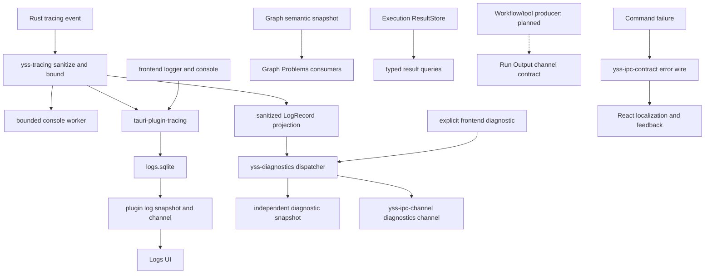

# Runtime Signals 当前架构

> Status: Current
> Scope: logging、operational diagnostics、IPC error、user feedback 以及运行信号之间的语义边界
> Canonical owners: `tauri-plugin-tracing`、中立的 `yss-tracing`、独立的 `yss-diagnostics`、`yss-application::ipc` 和 React feedback owners；Graph/Results/Run Output 由 Graph 文档拥有
> Update when: 信号分类、logging/diagnostics 数据流、可靠性、安全或反馈边界改变时

YssBI 不把所有信息汇入一条“日志”。不同信号具有不同 authority、可靠性和保留语义；选择错误的链路会造成第二事实源、隐私泄漏或无法恢复的 UI 状态。

## 1. Authority matrix

| 信息                    | Authority                                                  | Delivery / retention                         | UI 用途                             | Canonical detail                                                                          |
| ----------------------- | ---------------------------------------------------------- | -------------------------------------------- | ----------------------------------- | ----------------------------------------------------------------------------------------- |
| Graph Problems          | Rust `GraphSemanticSnapshot` 经完整 editor projection 投影 | command response 原子替换                    | Canvas、Details、Problems、Run Gate | [Graph 与 Execution](GRAPH_AND_EXECUTION.md#7-graph-problems)                             |
| Results / 当前输出      | Rust `ResultStore`                                         | typed queries；event 只公告 identity         | Result、Inspect、Preview            | [Graph 与 Execution](GRAPH_AND_EXECUTION.md#6-results)                                    |
| Run Output              | Rust Execution output contract                             | channel 与 bounded UI 已有；producer 预留    | Output panel                        | [Graph 与 Execution](GRAPH_AND_EXECUTION.md#8-run-output)                                 |
| Logging                 | sanitized Rust `tracing` + frontend logs                   | SQLite history + bounded recent/live channel | Logs UI、本地技术排障               | 本文                                                                                      |
| Operational diagnostics | sanitized Rust projection + explicit frontend diagnostics  | independent bounded recent/live channel      | 运行诊断消费者                      | 本文                                                                                      |
| IPC error               | Rust `yss-application::ipc` transport error                | command rejection                            | React 按 stable code 映射           | [`yss-application::ipc` README](../../src-tauri/crates/yss-application/src/ipc/README.md) |
| User feedback           | React application/view                                     | UI state，按交互生命周期保留                 | Alert、Dialog、inline/status        | 本文                                                                                      |
| Assistant text/events   | Rust Statistical Harness                                   | ordered persisted event stream               | Assistant projection                | [Statistical Harness](STATISTICAL_HARNESS.md)                                             |

直接规则：

- logging 和 operational diagnostics 都是 lossy、non-authoritative observation；
- Graph Problems 不是 diagnostics log；
- Result event 不是 result authority；
- Run Output 不是 log；
- command error 不是 backend user message；
- Assistant transcript 不进入 logs、Run Output 或 Graph Problems。

## 2. Signal flow

日志和运行诊断是两条独立的观察流，可以接收同一个已脱敏 Rust 事件，但各自拥有 identity、sequence、缓冲、订阅及生命周期。前端日志提交不写入诊断流，前端诊断提交也不写入日志 SQLite。Graph、Result、Output 和 error 流继续由各自的业务 owner 管理。

Compile 的普通语义问题使用成功的 Blocked outcome 与完整 projection；内部故障继续走 diagnosed rejection。详情见 [Compile](GRAPH_AND_EXECUTION.md#compile)。

桌面入口先注册 `tauri-plugin-tracing`，由插件解析日志路径、打开 SQLite、安装全局 logging subscriber 并保留 guard。随后 `yss-application::initialize(app)` 单独创建 `DiagnosticsRuntime`，向中立 `LoggingRuntime` 注册诊断投影 sink，并安装业务服务。日志目录或 SQLite 不可用时保留 console，插件查询/订阅返回 `logs_unavailable`，不阻止诊断和业务初始化。Application 不安装第二个 tracing subscriber。

## 3. Logging

`src-tauri/crates/tauri-plugin-tracing/` 拥有日志 SQLite、日志 recent snapshot、前端日志接收、分页查询、统计和日志 Channel。插件只依赖中立的 `yss-tracing`，不依赖 `yss-diagnostics`、Graph、SCI 或 Problems 的业务 owner。

`src-tauri/crates/yss-tracing/` 保留不依赖 Tauri/SQLx 的采集基础设施：process-wide subscriber/filter、`tracing::Event` 到 `LogRecord` 的转换、脱敏与单条记录限额、bounded console worker 和非阻塞 sanitized record sinks。Rust 任意 crate 只需使用普通 `tracing` 宏；`log` facade 通过 LogTracer 接入。默认接收全部 crate/level，`RUST_LOG` 可显式收窄范围。`println!`/进程 stdout/stderr 不属于 tracing 采集入口。

前端显式 logger 和 `console.log/info/debug/trace/warn/error` 共用日志批次队列，提交到插件。显式 logger 的 console 输出不会重复入库。console 中的任意对象、数组只记录类型/长度摘要，避免序列化用户文档或数据集；transport 失败不递归产生日志。采集从桌面前端入口安装后开始，超出有界队列或应用异常终止时允许丢失，不能承诺每条日志必达。

### SQLite 与交付顺序

日志文件为 `app_log_dir()/logs.sqlite`。日志 dispatcher 的专用线程使用 SQLx 写入 SQLite WAL；数据库自身关闭 statement logging，避免记录自己的 INSERT 形成反馈循环。表结构由 [store.rs](../../src-tauri/crates/tauri-plugin-tracing/src/store.rs) 唯一维护：`logs` 包含 sequence、stream_id、timestamp、level、origin、domain、target、event、message、source 和 JSON 编码的 fields；`tracing_meta` 保留该库的 stream identity。

同一批记录先完成 SQLite transaction，再更新 recent snapshot 并发送 Channel。退出时同步排空已接收记录；重启从同一数据库恢复 identity、sequence 和 recent snapshot。数据库预期由一个应用进程写入，其他 SQLx 连接可以只读查询。写入失败发送 `storage_unavailable` 终止信号，后续查询/订阅失败，不将未提交记录显示成持久历史；console 和独立诊断仍可继续。

插件 IPC 使用 `plugin:tracing|` 前缀：

| 命令                                  | 职责                                              |
| ------------------------------------- | ------------------------------------------------- |
| `submit_frontend_logs`                | 接收显式前端日志和 console 日志批次               |
| `subscribe_logs` / `unsubscribe_logs` | 日志 snapshot + live Channel 与释放订阅           |
| `query_logs`                          | 按 sequence 游标、level/origin 过滤并分页查询历史 |
| `log_statistics`                      | 查询持久日志总量与 level/origin 分组计数          |

权限由插件的 `tracing:default` 声明。命令错误只返回 `{ code, details, incidentId }`，不传递底层数据库错误文本。SQLite 当前保留全部已提交记录，尚无自动历史清理。UI recent buffer 与后端 recent ring 均有界，不等于数据库的全部历史。

### Logs UI

[LogService](../../src/services/log/logService.ts) 只调用日志插件。[subscription](../../src/features/application/log/useLogSubscription.ts)、[buffer](../../src/features/application/log/logBuffer.ts) 和 `src/modules/logs/` 只投影 `Log*Dto`，不消费 `Diagnostic*Dto` 或 Graph Problems。

实时 receiver 发现 gap、stream replacement、malformed batch 或存储失败后停止推进 watermark，释放旧 Channel 并进行有界重订阅。丢弃和截断可检测；“刷新”重新读取 recent snapshot，“清空”只修改当前前端 buffer，不删除 SQLite 或后端 ring。历史分页接口独立于当前面板的 recent/live 展示。

项目与日志新产生的日历时间使用本机钟面时间，序列化为不带时区的 `YYYY-MM-DDTHH:mm:ss.SSS`；不附加 `Z`、UTC 名称或偏移。已有项目元数据的带偏移时间在解析时保留原日期和钟面并移除偏移。Unix 秒/毫秒和单调时钟仍用于内部时间点、排序或耗时，不添加时区文本。图表日期/日期时间表示无时区日历字段，显示时不得通过浏览器时区移动它们。

## 4. Operational diagnostics

`src-tauri/crates/yss-diagnostics/` 独立管理运行诊断的 DTO、Rust projection、显式 frontend diagnostic ingestion、有界 recent ring、dispatcher 和订阅状态。它不依赖日志插件，不拥有 SQLite 日志文件，不计算图或统计模型的业务诊断。诊断 projection 可以筛选 Rust 记录（如 `diagnostic_skip_recent`）；这不影响该事件进入插件日志。

Application 拥有 `DiagnosticsRuntime` 的创建与生命周期。`yss-application::ipc` 保留 `submit_frontend_diagnostics`、`subscribe_diagnostics` 和 `unsubscribe_diagnostics`，通过中立的 `yss-ipc-channel::diagnostics` 交付；前端入口是 [DiagnosticsService](../../src/services/diagnostics/diagnosticsService.ts)，保留独立的 `Diagnostic*Dto` 和 parser。

诊断的 ingress、recent ring、batch 和 subscriber queue 均有界，慢 subscriber 不阻塞业务 producer；stream identity/sequence、snapshot/live handoff、丢弃标记和 gap 检测保持原有语义。诊断历史不跨进程恢复，不读取日志 SQLite 补齐。前端只复用通用的 [Channel 订阅管理](../../src/services/ipc/recordSubscription.ts)，不复用日志 buffer、序号或命令注册表。

Graph 诊断和 Problems 继续来自 `GraphSemanticSnapshot`；模型诊断继续由 SCI/结果 owner 产生；Run Output、IPC error 和 user feedback 也保持各自的契约。它们都不由日志插件重建。

## 5. Security and data minimization

记录调用点优先使用 ID、count、kind、duration、digest、stable code 和 incident identity。以下内容不得进入 logging 或 operational diagnostics：

- DataFrame/table rows、cells 或原始用户数据；
- document、clipboard、prompt、transcript、model response 或 tool payload；
- SQL text、connection string、authorization/cookie header、token、API key 或 private key；
- provider、parser、database 或 infrastructure 的未清理 payload。

sanitizer 是最后防线，不是记录任意 `%error`、`?request` 或完整对象的许可。字段键和值、message、target/source/event、结构深度、集合长度和编码大小都必须受限。Frontend diagnostics 应遵守同一数据最小化规则。

Run Output 允许显示用户程序明确产生的文本，但它有自己的 source identity、容量和交互语义，不能因此写入 logs。Harness transcript 和 memory 属于持久业务数据，也不得伪装成 diagnostics。

## 6. IPC errors and incidents

Transport failure 的 exact wire、DTO ownership 和 frontend invoke adapter 由 [`yss-application::ipc` README](../../src-tauri/crates/yss-application/src/ipc/README.md#error-contract) 唯一维护。本文只规定跨信号关系：

- expected domain/application failure 映射为 stable machine code 和安全 details；
- internal/infrastructure failure 可以生成 incident identity，并在 sanitized technical record 中保留关联信息；
- wire 不携带 backend-owned user prose 或 raw error；
- successful DTO 和 asynchronous status 不能用 `message`、`detail`、`hint` 等字段透传原始内部错误；Graph diagnostic 的安全模板契约由 Graph owner 维护；
- diagnostic record 不能反过来成为 command response 或 UI 状态来源。

一个失败可以同时具有 stable domain/transport outcome 和 incident-linked technical observation，但两者的可靠性、受众和保留策略仍然独立。

## 7. User feedback

React application/view 根据 use case 将 stable code 和安全 details 映射为本地化文案与反馈表面：

| 情况                   | 反馈表面                                      |
| ---------------------- | --------------------------------------------- |
| 页面或区块仍可继续使用 | persistent `Alert` / page or section state    |
| 输入字段无效           | inline error + accessible description         |
| 必须确认后继续         | application `MessageDialog` / ordinary Dialog |
| 破坏性操作确认         | `AlertDialog`                                 |
| 成功                   | 优先用新状态、列表变化或持久状态表达          |

用户反馈应由应用动作与 typed outcome 驱动，不使用日志触发通知，也不把 `IpcError.message`、Rust error 或 parser reason 当作用户文案。Logs panel 展示 sanitized operational record 是其自身职责；Graph diagnostic 按 Rust-owned 模板键与安全参数在 React 本地化，具体契约见 [Graph Problems](GRAPH_AND_EXECUTION.md#7-graph-problems)。路径选择等桌面 capability dialog 不等同于应用错误反馈。

Graph 运行失败由 Output panel 的失败摘要反馈：React 本地化 Rust RunErrored 的原因和阶段，保留节点定位及可用的 incidentId。该 UI 摘要不属于用户程序 stdout/stderr，也不由 Logs 重建；具体生命周期和 terminal channel 排空契约见 [Run Output](GRAPH_AND_EXECUTION.md#8-run-output)。

## 8. Routing decisions

新增信息流时先回答：

1. 它是当前业务事实、可查询结果、用户程序输出、技术观察、transport failure，还是 UI feedback？
2. 谁是唯一 authority，consumer 丢失全部本地状态后如何恢复？
3. delivery 是 reliable、replayable、latest-snapshot，还是允许 loss？
4. 容量、backpressure、drop/gap/terminal semantics 在哪里由代码定义？
5. payload 是否跨越数据、隐私或用户文案边界？

具体修改检查项放在 [Change Process](../development/CHANGE_PROCESS.md)，命令放在 [Local Workflow](../development/LOCAL_WORKFLOW.md)，本文不复制 checklist 或容量表。
