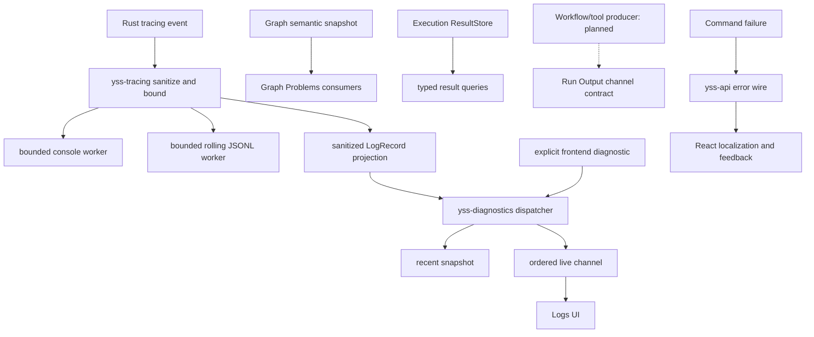

# Runtime Signals 当前架构

> Status: Current
> Scope: logging、operational diagnostics、IPC error、user feedback 以及运行信号之间的语义边界
> Canonical owners: `yss-tracing`、`yss-diagnostics`、`yss-api` 和 React feedback owners；Graph/Results/Run Output 由 Graph 文档拥有
> Update when: 信号分类、logging/diagnostics 数据流、可靠性、安全或反馈边界改变时

YssBI 不把所有信息汇入一条“日志”。不同信号具有不同 authority、可靠性和保留语义；选择错误的链路会造成第二事实源、隐私泄漏或无法恢复的 UI 状态。

## 1. Authority matrix

| 信息                    | Authority                                                     | Delivery / retention                      | UI 用途                             | Canonical detail                                              |
| ----------------------- | ------------------------------------------------------------- | ----------------------------------------- | ----------------------------------- | ------------------------------------------------------------- |
| Graph Problems          | Rust `GraphSemanticSnapshot` 经完整 editor projection 投影    | command response 原子替换                 | Canvas、Details、Problems、Run Gate | [Graph 与 Execution](GRAPH_AND_EXECUTION.md#7-graph-problems) |
| Results / Pin history   | Rust `ResultStore`                                            | typed queries；event 只公告 identity      | Result、Inspect、Preview            | [Graph 与 Execution](GRAPH_AND_EXECUTION.md#6-results)        |
| Run Output              | Rust Execution output contract                                | channel 与 bounded UI 已有；producer 预留 | Output panel                        | [Graph 与 Execution](GRAPH_AND_EXECUTION.md#8-run-output)     |
| Logging                 | sanitized Rust `tracing` record                               | bounded console/rolling file workers      | 本地技术排障                        | 本文                                                          |
| Operational diagnostics | sanitized Rust log projection + explicit frontend diagnostics | bounded recent snapshot + live channel    | Logs UI                             | 本文                                                          |
| IPC error               | Rust `yss-api` transport error                                | command rejection                         | React 按 stable code 映射           | [`yss-api` README](../../src-tauri/crates/yss-api/README.md)  |
| User feedback           | React application/view                                        | UI state，按交互生命周期保留              | Alert、Dialog、inline/status        | 本文                                                          |
| Assistant text/events   | Rust Statistical Harness                                      | ordered persisted event stream            | Assistant projection                | [Statistical Harness](STATISTICAL_HARNESS.md)                 |

直接规则：

- logging 和 operational diagnostics 都是 lossy、non-authoritative observation；
- Graph Problems 不是 diagnostics log；
- Result event 不是 result authority；
- Run Output 不是 log；
- command error 不是 backend user message；
- Assistant transcript 不进入 logs、Run Output 或 Graph Problems。

## 2. Signal flow

只有第一条纵向链属于 operational logging/diagnostics。右侧的 Graph、Result、Output 和 error 流不能通过 Logs UI 聚合成 authority。

Compile 的普通语义问题使用成功的 Blocked outcome 与完整 projection；内部故障继续走 diagnosed rejection。详情见 [Compile](GRAPH_AND_EXECUTION.md#compile)。

## 3. Logging

Rust logging 的唯一入口是 `tracing`。`src-tauri/crates/yss-tracing/` 负责：

- process-wide subscriber 和 filter；
- `tracing::Event` 到 stable `LogRecord` 的映射；
- 在任何 consumer 之前执行 sanitization 和 per-record bounds；
- 独立的 bounded console 与 rolling JSONL delivery；
- 向 operational diagnostics 提供 sanitized projection。

console、file 和 diagnostics projection 只能消费同一个 sanitized record，不得增加 raw formatter 或绕过清理的旁路。生产者不等待慢日志 consumer；queue、文件或 UI 失败不得改变业务事务结果。

过滤配置、queue capacity、rotation size、retention count 和 record limits 是源码常量与测试事实。架构要求的是：默认过滤安全、第三方噪声受控、输出有界且允许丢弃、不同 sinks 故障隔离。具体数字不在本文建立第二份配置。

## 4. Operational diagnostics

`src-tauri/crates/yss-diagnostics/` 拥有 Logs UI 的技术记录投影：recent snapshot、Rust 分配的 stream identity/sequence、frontend diagnostic ingestion、subscriber delivery 和 gap recovery 所需状态。它不安装 tracing subscriber，也不打开或分页读取日志文件。

Rust diagnostics 只来自 `yss-tracing` 已清理的 `LogRecord`。Frontend 可以通过显式 logger 提交技术诊断；这些记录只进入 diagnostics recent/live 流，不反向写入 console 或 rolling file。

当前实现：

- ingress、recent ring、batch 和 subscriber queue 均有界；
- slow subscriber 不得阻塞业务 producer；
- 丢弃、sequence gap 和 stream replacement 必须可检测；
- frontend 使用 snapshot + live handoff，激活前发现 pending overflow 或 sequence gap 时进行有界重试；
- timestamp 用于显示，`streamId + sequence` 才用于 diagnostics 顺序和去重。

`src/modules/logs/` 只展示 operational diagnostics。它不拥有 Graph Problems、Results 或 Run Output，关闭 Logs panel 也不影响任何 domain workflow。

实时 receiver 发现 gap、stream replacement 或 malformed batch 后停止交付和推进 watermark。LogService 释放旧 channel/subscriber，Application 执行有界自动重订阅；过期回调不能写入当前 buffer。连续有效 batch 或手动刷新会重置恢复预算。

Workspace controller 分别暴露 subscription 状态与 complete/truncated/disconnected 连续性。Snapshot 截断、不可恢复的 stream replacement、容量淘汰和 sequence gap 都显示不完整提示；重新连接不代表历史恢复完整，日志文件不是 channel replay source。

“刷新”重新订阅 recent snapshot；“清空”只修改本地 buffer 和选中项，不删除 Rust recent ring 或 rolling file，之后的 snapshot 可能重新带回 recent records。实现入口为 [receiver](../../src/services/log/diagnosticBatchReceiver.ts)、[subscription](../../src/features/application/log/useDiagnosticSubscription.ts) 和 [buffer](../../src/features/application/log/logBuffer.ts)。

## 5. Security and data minimization

记录调用点优先使用 ID、count、kind、duration、digest、stable code 和 incident identity。以下内容不得进入 logging 或 operational diagnostics：

- DataFrame/table rows、cells 或原始用户数据；
- document、clipboard、prompt、transcript、model response 或 tool payload；
- SQL text、connection string、authorization/cookie header、token、API key 或 private key；
- provider、parser、database 或 infrastructure 的未清理 payload。

sanitizer 是最后防线，不是记录任意 `%error`、`?request` 或完整对象的许可。字段键和值、message、target/source/event、结构深度、集合长度和编码大小都必须受限。Frontend diagnostics 应遵守同一数据最小化规则。

Run Output 允许显示用户程序明确产生的文本，但它有自己的 source identity、容量和交互语义，不能因此写入 logs。Harness transcript 和 memory 属于持久业务数据，也不得伪装成 diagnostics。

## 6. IPC errors and incidents

Transport failure 的 exact wire、DTO ownership 和 frontend invoke adapter 由 [`yss-api` README](../../src-tauri/crates/yss-api/README.md#error-contract) 唯一维护。本文只规定跨信号关系：

- expected domain/application failure 映射为 stable machine code 和安全 details；
- internal/infrastructure failure 可以生成 incident identity，并在 sanitized technical record 中保留关联信息；
- wire 不携带 backend-owned user prose 或 raw error；
- successful DTO 和 asynchronous status 不能用 `message`、`detail`、`hint` 等字段透传原始内部错误；Graph diagnostic 的安全模板契约由 Graph owner 维护；
- diagnostic record 不能反过来成为 command response 或 UI 状态来源。

一个失败可以同时具有 stable domain/transport outcome 和 incident-linked technical observation，但两者的可靠性、受众和保留策略仍然独立。

## 7. User feedback

React application/view 根据 use case 将 stable code 和安全 details 映射为本地化文案与反馈表面：

| 情况                   | 反馈表面                                      |
| ---------------------- | --------------------------------------------- |
| 页面或区块仍可继续使用 | persistent `Alert` / page or section state    |
| 输入字段无效           | inline error + accessible description         |
| 必须确认后继续         | application `MessageDialog` / ordinary Dialog |
| 破坏性操作确认         | `AlertDialog`                                 |
| 成功                   | 优先用新状态、列表变化或持久状态表达          |

用户反馈应由应用动作与 typed outcome 驱动，不使用日志触发通知，也不把 `IpcError.message`、Rust error 或 parser reason 当作用户文案。Logs panel 展示 sanitized operational record 是其自身职责；Graph diagnostic 按 Rust-owned 模板键与安全参数在 React 本地化，具体契约见 [Graph Problems](GRAPH_AND_EXECUTION.md#7-graph-problems)。路径选择等桌面 capability dialog 不等同于应用错误反馈。

## 8. Routing decisions

新增信息流时先回答：

1. 它是当前业务事实、可查询结果、用户程序输出、技术观察、transport failure，还是 UI feedback？
2. 谁是唯一 authority，consumer 丢失全部本地状态后如何恢复？
3. delivery 是 reliable、replayable、latest-snapshot，还是允许 loss？
4. 容量、backpressure、drop/gap/terminal semantics 在哪里由代码定义？
5. payload 是否跨越数据、隐私或用户文案边界？

具体修改检查项放在 [Change Process](../development/CHANGE_PROCESS.md)，命令放在 [Local Workflow](../development/LOCAL_WORKFLOW.md)，本文不复制 checklist 或容量表。
