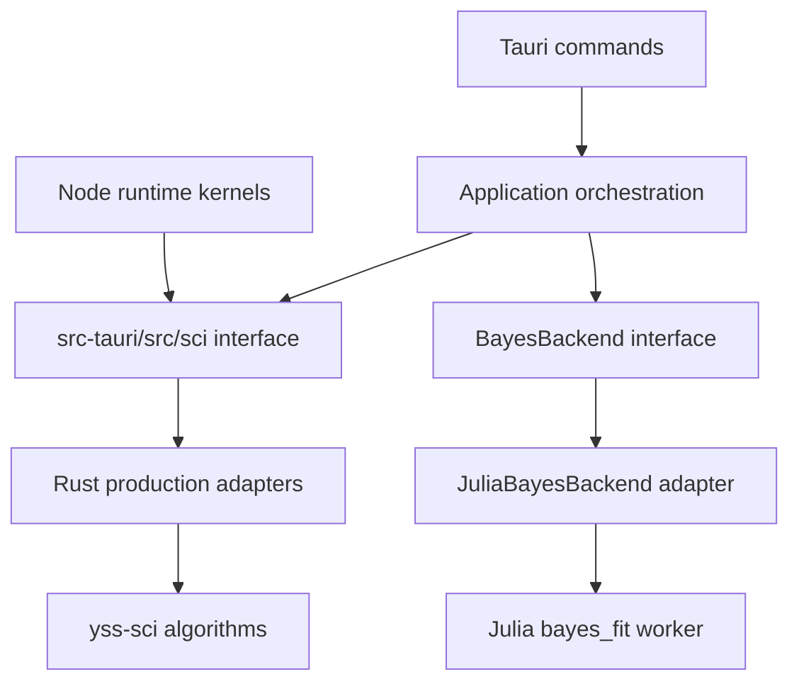

# SCI 当前架构与已闭合问题

> 本路径为兼容历史链接而保留。本文记录当前工作树中已核实的 architecture 状态与已经闭合的职责问题，不再作为未来重构路线图，也不把未验证事项写成结论。

## 1. 当前结论

SCI 已形成两层 Rust module 和一个真实外部 adapter：



- `src-tauri/sci/` 是独立 `yss-sci` 数值算法 crate。
- `src-tauri/src/sci/` 是主应用科学计算 interface，负责 typed inputs/results、models、error mapping 和 adapters。
- `src-tauri/src/application/` 负责编排需要 project authority 或 task lifecycle 的用例，例如 hypothesis parsing 和 Bayes inference。
- `src-tauri/src/database/` 独立拥有数据导入、DuckDB、编辑 history、undo/redo、overview 与 export。
- `src-tauri/src/julia/` 和 `src-tauri/julia/` 只为 Bayes 提供 worker host 与 operation implementation。

该 seam 让 graph kernels 与 commands 只学习 application-facing interface；算法细节、worker protocol 和 project/database authority 保持 locality。较小 interface 隐藏输入规范化、backend dispatch 和错误分类，为调用方提供 depth 与 leverage。

## 2. 当前 ownership

### 2.1 `yss-sci`

`yss-sci` 当前承载：

- regression、covariance、panel estimators 与 diagnostics；
- time-series transforms、ACF/PACF、serial correlation、ADF、VAR、VEC；
- hypothesis statistics 与数值/矩阵工具。

它不拥有：

- Tauri command 或 frontend DTO；
- ProjectState、resource revision 或 project event；
- DuckDB declarations/runtime instances；
- DataView edit operation、EditHistory 或 undo/redo；
- CSV/Parquet application export workflow；
- Julia process/task lifecycle。

### 2.2 主应用 SCI facade

`src-tauri/src/sci/` 的当前结构：

```text
sci/
├─ api/
│  ├─ bayes/                 # model/draft/validation/result/backend interface
│  ├─ node_statistics.rs     # graph-kernel-facing typed statistics
│  ├─ stats/hypothesis.rs    # typed t/Wald interface
│  └─ time_series/           # typed ACF/PACF and serial tests
├─ backends/
│  ├─ rust/                  # production stats/time-series adapters
│  └─ julia/bayes/           # production Bayes adapter
├─ models/
│  ├─ regression.rs          # typed regression statistics/models
│  └─ panel_did.rs
├─ engine.rs                 # explicit Rust SciContext
├─ error.rs                  # stable SciError
└─ kde.rs
```

Node runtime statistics kernels call `crate::sci::api::node_statistics`; plotting/ACF paths call `crate::sci::api::time_series`. This keeps direct `yss_sci` imports inside the facade implementation rather than spreading them through consumers.

## 3. Production adapter truth

| Capability | Interface | Production implementation |
|---|---|---|
| ACF/PACF | `api::time_series::acf_pacf` | Rust adapter over `yss_sci::ts::acf_pacf` |
| Serial tests | `api::time_series::serial_tests` | Rust adapter over `yss_sci::ts::serial_correlation` |
| Linear hypothesis tests | `api::stats::hypothesis` | Rust adapter over `yss_sci::stats` |
| Node regression/time-series operations | `api::node_statistics` | Rust implementation over `yss-sci` |
| Bayesian inference | `api::bayes::BayesBackend` | `JuliaBayesBackend` + Julia `bayes_fit` |

ACF/PACF、Durbin-Watson、Ljung-Box、Breusch-Godfrey、t test 和 Wald test 的 production path 均为 Rust。Julia module 只导出 `bayes`，没有 time-series adapter。这里不存在为了“未来可能替换”而保留的假 seam。

Bayes 是真实 seam：`BayesBackend` 定义 fit/cancel interface，application `BayesInferenceService` 依赖该 interface，Tauri setup 注入 `JuliaBayesBackend`。测试或未配置状态可以使用其它 adapter，而 production behavior 不泄漏到调用方。

## 4. Typed regression statistics

`RegressionFit` 当前保存：

- coefficients、fitted values 与 residuals；
- `StatisticalObservationMetadata`；
- typed `RegressionStatistics`。

`RegressionStatistics` 是 tagged variants：

- `Linear`：`RegressionCoefficientStatistics` + `LinearRegressionStatistics`；
- `Binary`：typed link + coefficient statistics + `BinaryRegressionStatistics`；
- `Prais`：coefficient statistics + `PraisRegressionStatistics`。

Coefficient statistics 明确包含 standard errors、test statistics、p-values 与 confidence intervals；model statistics 明确包含 goodness-of-fit、degrees of freedom、sum/mean squares、likelihood 或 convergence fields。Report JSON 由 `regression_report` 从 typed model 投影，不再反向把展示 JSON 当作统计 authority。

## 5. 已闭合问题

| 历史问题 | 当前闭合状态 | 代码事实 |
|---|---|---|
| 科学计算与应用数据库编辑混在同一 crate | 已闭合 | 编辑、history、DuckDB、overview、export 全部位于 `src-tauri/src/database/`；`yss-sci` 无 database module |
| Command/node 直接依赖算法与 worker internals | 已闭合 | 调用方进入 `crate::sci::api` 或 application module；adapter implementation 集中在 `src-tauri/src/sci/backends/` |
| Julia time-series 与 Rust production path 形成无真实差异的 seam | 已闭合 | time-series 只有 Rust production adapters；Julia backend 只包含 Bayes |
| Regression fit 统计量依赖松散展示对象 | 已闭合 | `RegressionStatistics`、coefficient/model statistics 和 observation metadata 均为 typed Rust models |
| Julia task path 与 artifact 生命周期缺少明确 owner | 已闭合 | `JuliaWorkerTaskDirectory` 验证 app-owned canonical direct child；artifact 需要保留时 owner 转移给 inference result，否则 RAII cleanup |
| Worker failure 依赖解析错误文本分类 | 已闭合 | JSON-RPC code 映射为 `JuliaWorkerErrorCode`，再映射为 stable Bayes code；diagnostic prose 仅进入 diagnostics |
| Worker asset 更新可能暴露部分写入 | 已闭合 | Embedded assets 写入 exclusive temp、`sync_all` 后 atomic replace |

## 6. Interface invariants

- SCI facade 不拥有 project/database/UI authority。
- `yss-sci` algorithm errors 在 adapter 处转换为 `SciError` 或 typed Bayes errors。
- Commands 只做 transport/error mapping；需要 project snapshot 或 task lifecycle 的 workflow 位于 application module。
- Rust production statistics 不通过 Julia worker round-trip。
- Julia operation registry 当前只有 `bayes_fit`。
- Worker error 分类依赖 stable code，不依赖 message/detail 文本。
- Regression report 是 typed statistics 的展示 projection。

## 7. 文档状态

本文件不再提供目录重命名、兼容入口或分阶段迁移建议。没有列入“已闭合问题”的历史内部实现细节，不在本文中被宣称为已解决；判断它们应以当前代码与专项测试为准。
