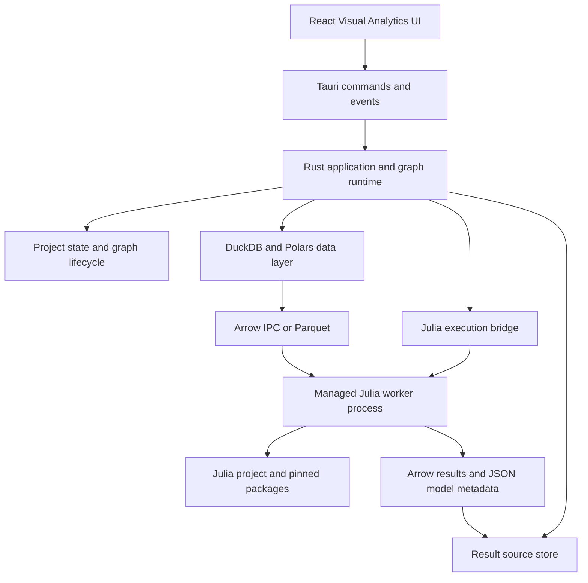

我先快速梳理当前 `sci` 库的职责、Rust/前端耦合点和本地运行链路，再给你一个基于实际代码的迁移可行性判断与分阶段方案。

现状已经比较清楚：`yss-sci` 不只是“模型计算”，还承载了 Polars 编辑历史、数据集统计、类型转换等后端基础能力；而核心数据层同时依赖 DuckDB 与 Polars。再确认一下调用范围和现有节点覆盖面，避免把迁移规模低估成单纯替换回归实现。

## 结论

**可行，但不建议直接把目标定义为“去掉 `sci`，全面改成 Julia Runtime”。**

更准确、风险更低的方向是：

> **YssBI = Visual Analytics Desktop App（React + Tauri/Rust）  
> Rust 负责项目、图执行、数据资产与 UI 协调  
> Julia 作为可插拔的科学计算执行引擎。**

也就是说，Julia 应该先成为**分析节点的计算后端**，而不是替换整个 Rust 后端，更不应一开始替换数据库/数据编辑基础设施。

---

## 基于当前项目的判断

当前 `yss-sci` 的职责并不纯粹是科学计算：

| `yss-sci` 当前内容 | 适合迁往 Julia？ | 建议 |
|---|---:|---|
| OLS/WLS/GLS、IV、Logit/Probit | 是 | 可逐步由 Julia 模型实现替代 |
| 面板 FE/FD/RE/FGLS/MLE、DID | 是，但难度高 | 需要逐模型验证统计口径 |
| VAR/VEC、单位根、协整、诊断 | 是，但难度高 | Julia 包覆盖与现有 Stata 风格输出未必完全等价 |
| ACF/PACF、Ljung-Box、DW 等 | 是 | 很适合作为首批迁移对象 |
| `DataFrame` 编辑历史、撤销/重做 | 否 | 应留在 Rust `database/` 层 |
| JSON / Polars 类型转换、导出 | 否 | 应留在 Rust 数据访问层 |
| 数据概览、列统计、分布统计 | 通常否 | 当前 DuckDB/Polars 路径更合适 |

代码和架构文档也证明这一点：

- `src-tauri/sci` 同时有 `regression`、`ts`，也有 `database/edit_operation.rs`、导出与 Polars 转换。
- `src-tauri/src/database/` 已经以 **DuckDB + Polars** 管理数据集、分页、编辑、落盘。
- 图节点直接使用许多 `yss_sci` 类型，例如 `PanelOLSResult`、`OLSResult`、`VECConfig` 等，而不是隔着稳定的引擎协议。
- 项目现有的 `SCI_ARCHITECTURE_ANALYSIS.md` 本身也指出：科学计算与编辑语义混在一个 crate 中，是当前架构问题。

所以：**“移除 `sci`”本身是一个值得做的架构目标；但“全部交给 Julia”并不是唯一或最自然的实现方式。**

---

## 你会获得什么

转向 Julia 的核心收益不只是“换语言”，而是：

1. **科学计算生态更强**
   - 数值计算、优化、微分方程、贝叶斯、统计建模、GPU 与科学机器学习更成熟。
   - 对未来的空间分析、仿真、因果推断、机器学习、领域模型扩展更友好。

2. **更适合 Visual Analytics 的扩展模式**
   - 可以让高级用户或插件作者以 Julia 编写自定义节点。
   - 图节点可以映射到 Julia 函数/包，而不是持续把每个算法都手写一遍 Rust。

3. **降低自研算法维护压力**
   - 当前 `sci` 覆盖计量、面板、时间序列、协整等较深领域；继续自维护会长期承担数值稳定性、统计口径和验证成本。
   - 项目待办中已有 `yss-sci` 的 clippy 错误、较多 warning 与架构债务，说明维护成本已经开始显现。

---

## 不能低估的风险

### 1. 统计结果不能假设“换包后自然一致”

你当前实现明显带有 Stata 风格语义，例如：

- cluster / HAC / Newey 协方差
- FE / FD / RE / FGLS / MLE 及 time/two-way 变体
- VAR lag selection、VEC/Johansen、vecrank
- DID 的平行趋势、安慰剂检验、事件研究

Julia 有相应生态，但**默认值、缺失值处理、自由度、协方差校正、共线列处理、p-value 与临界值口径**可能都不同。

因此迁移标准不能是“Julia 跑得通”，而应是：

- 现有 `regression_golden.rs`、时间序列和面板测试成为基线；
- 为每个模型保留固定输入与预期输出；
- 明确数值误差容限；
- 对有意改变的统计定义，显式写入用户可见的版本说明。

### 2. Julia Runtime 的桌面分发与升级会变成产品工作

目前是 Tauri/Rust 的单一桌面应用；加入 Julia 后，需要处理：

- Windows/macOS/Linux 的 Julia runtime 打包；
- Julia package 环境与 artifact 的下载、预编译、版本锁定；
- 用户无网络或首次启动慢的体验；
- 崩溃隔离、错误日志与诊断信息；
- 运行时体积、安装包大小和升级策略；
- macOS 签名、公证，以及各平台动态库加载问题。

这不是不可解决，但它应被视为**运行时平台工程**，而不是一次普通依赖替换。

### 3. 不建议直接嵌入 `libjulia`

Rust 内嵌 Julia 可以研究 `jlrs` / `libjulia`，但不适合作为第一步：

- Julia 的 GC root、线程约束、异常边界都需要谨慎处理；
- Tauri 的异步/多线程模型与 Julia runtime 生命周期要严格隔离；
- 动态库加载与跨平台打包更脆弱；
- Julia 侧 native 崩溃可能直接带走桌面应用进程。

**首选是独立 Julia worker 进程**。Rust 仍是宿主与控制面，Julia 只是可重启、可替换、可隔离的计算面。

---

## 推荐的目标架构



边界应当是：

- **Rust 保留**
  - Tauri、项目存储、图生命周期、节点注册、权限、取消、日志、窗口结果源；
  - DuckDB、数据导入、数据编辑、撤销/重做、分页、导出；
  - Arrow/Parquet 的数据资产交换；
  - 前后端 DTO、可视化数据整理。

- **Julia 接管**
  - 回归、检验、时间序列、面板模型、仿真、优化等计算密集型分析；
  - 将来可开放的自定义分析脚本 / 包节点。

- **不要做**
  - 不要在每次节点执行时通过 JSON 把整张表传给 Julia；
  - 不要让 Julia 直接成为项目状态或图状态的权威来源；
  - 不要让前端直接调用 Julia；
  - 不要让 Julia 直接修改项目中的 DuckDB 文件。

数据交换优先级：

1. **Arrow IPC / Parquet**：表格、中大型数据集；
2. **JSON**：参数、节点配置、模型摘要、诊断结果；
3. **共享 DuckDB 文件**：可以作为后续优化，但需要严格的只读与并发协议，不宜作为第一版边界。

Julia 侧可从 `Arrow.jl`、`DataFrames.jl`、`StatsModels.jl` 等基础组件开始；具体面板/时间序列包必须按现有模型清单做验证，而不是先假设可一一映射。

---

## 建议的迁移路线

### Phase 0：先拆边界，不引入 Julia

先完成一个纯 Rust 的无行为变更重构：

1. 把 `yss-sci::database` 里的：
   - `EditHistory`
   - `EditOperation`
   - `EditState`
   - 编辑操作执行与反操作
   - Polars/JSON 类型转换
   - 数据导出

   迁回 `src-tauri/src/database/` 或单独的应用数据 crate。

2. 收窄 `sci` 的目标，使其只保留：
   - 数值工具；
   - 统计/计量；
   - 时间序列；
   - 可被独立测试的纯计算模型。

这是当前架构文档已经指出的正确方向，无论最终是否采用 Julia 都有收益。

### Phase 1：建立 Julia Bridge，但不替换现有节点

新增一个最小的 Julia worker 协议：

- Rust 启动并监控 worker；
- 使用 JSON-RPC（stdin/stdout 或本地 socket）发送任务控制消息；
- 输入表通过 Arrow/Parquet 文件传递；
- 输出为 Arrow 数据 + JSON 元数据；
- 支持任务 ID、进度、取消、结构化错误。

首个 PoC 建议选一个**无副作用、输入输出清晰、结果容易验证**的节点：

- ACF / PACF；
- 描述性统计；
- 简单 OLS；
- 或新增一个独立的 “Julia Script / Julia Analysis” 节点。

不要一开始迁移 VEC、RE MLE 或复杂 DID。

### Phase 2：双引擎影子验证

对已选模型同时执行：

```text
现有 yss-sci 引擎
        ↓
与 Julia 输出比较
        ↓
记录系数、标准误、统计量与耗时差异
```

在开发模式或测试中跑双引擎，直到结果满足预设容限。  
这时用户默认仍用 Rust 引擎，Julia 只用于验证和实验。

### Phase 3：按能力域切换，而非按技术层切换

较适合的顺序：

1. 纯统计检验、描述统计；
2. OLS / WLS / Logit / Probit；
3. 时间序列变换和诊断；
4. 面板 FE / DID；
5. VAR / VEC / Johansen；
6. RE / FGLS / MLE 等口径最敏感的模型。

每迁移一个能力域：

- 稳定输入/输出 DTO；
- 保留 golden tests；
- 将图节点依赖从 `yss_sci::*Result` 改为 YssBI 自己的模型结果 DTO；
- 再删除对应的 Rust 算法实现。

### Phase 4：删除纯计算 `sci`，保留或拆分真正需要的 Rust 部分

只有当所有计算节点都已迁移并验证后，才删除 `yss-sci`。  
届时数据编辑/导出逻辑早已迁回 Rust 数据层，不会被 Julia 迁移阻塞。

---

## 我的建议

我会支持这个方向，但建议把项目叙事从：

> “去掉 sci 库，科学计算全部换 Julia”

调整为：

> **“构建以 Julia 为可扩展计算引擎的 Visual Analytics 平台，同时保持 Rust 作为稳定的数据与图执行宿主。”**

这既能得到 Julia 的生态与扩展性，又不牺牲当前 Tauri + DuckDB + Polars 在桌面数据管理方面已经具备的优势。

**第一项实际工程工作不应该是嵌 Julia，而是将 `yss-sci::database` 的应用层职责迁回 `src-tauri/src/database/`，并把图节点对 `yss-sci` 的具体结果类型依赖收敛为 YssBI 自有 DTO。** 这样无论最终使用 Julia、Rust 或多引擎，都不会被当前 crate 边界绑死。