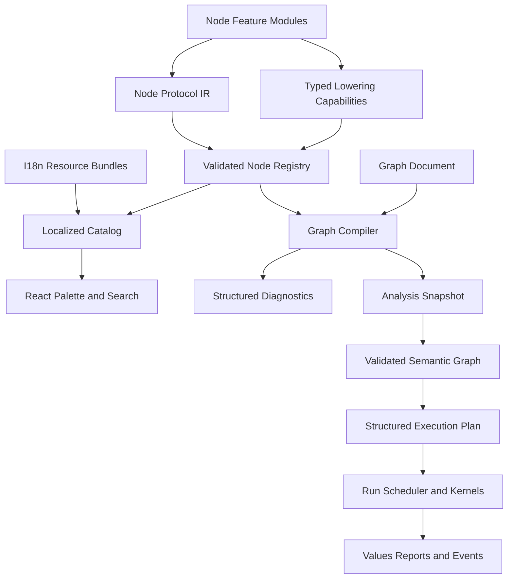
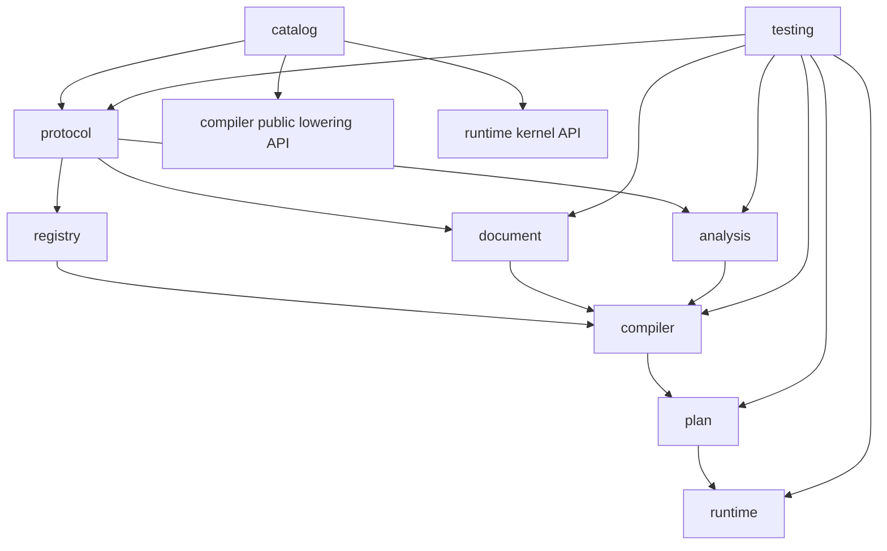

# Node Protocol and Execution Architecture Plan

本文定义 YssBI 节点系统的长期目标架构。项目尚未发布，因此直接以最终形态为目标，优先追求：

- 稳定、语言无关的节点身份；
- 单一权威的节点协议；
- 声明、展示、编辑、编译和执行职责彻底分离；
- 动态端口、类型推断和 Schema 推导统一建模；
- 编辑图易持久化，执行图高效运行；
- 节点数量持续增长后仍保持局部、可测试和可扩展。

最终采用：

> **静态 Node Protocol + 规范化 GraphDocument + AnalysisSnapshot + ValidatedSemanticGraph + 结构化 ExecutionPlan + Run**

不再扩展当前万能 `NodeDefinition`，也不以宏压缩现有 builder 代码作为目标架构。

---

## 1. 核心决策

### 1.1 Rust 是节点协议和图状态的权威来源

- Rust 定义节点协议、参数约束、端口契约、类型规则、动态接口、验证和执行行为。
- React 只消费后端投影出的 localized catalog、editor node/port projection、delta 和诊断。
- 前端不得重新实现动态端口、函数签名投影、类型推断或 Schema 推导。
- Tauri commands 保持薄层，只负责输入解析、调用应用/领域代码和 DTO 映射。

### 1.2 节点只能通过稳定 ID 识别

系统节点使用永久稳定、无展示语义的 ID：

```text
yssbi.control.branch
yssbi.dataframe.decompose
yssbi.statistics.ols.fit
yssbi.project.function.call
```

禁止使用以下内容作为节点身份：

- 节点显示名；
- 中文名或英文名；
- 分类显示路径；
- `category + name` 拼接值；
- i18n 翻译文本。

节点名称、描述、分类、端口名称和参数名称变化不得影响项目文件或节点查找。

### 1.3 编辑图与执行图完全分离

- `GraphDocument` 是项目文件和编辑器的权威模型。
- `AnalysisSnapshot` 表示当前分析结果，`ValidatedSemanticGraph` 表示可执行语义，`ExecutionPlan` 是运行时不可变计划。
- 执行前由 `GraphCompiler` 完成注册表解析、动态端口物化、参数编译、类型检查、Schema 推导、连接验证和执行拓扑构建。
- 执行阶段不得按字符串查询节点、按展示 role 遍历 port、重新推断类型或读取编辑器状态。

### 1.4 i18n 只参与展示和搜索

- 系统文本全部通过稳定 `I18nKey` 解析。
- i18n 文本不得参与持久化身份、连接、类型判断或执行。
- 所有语言共享同一个 `NodeTypeId`、`PortKey`、`ParameterKey` 和 `NodeCategoryId`。
- 搜索索引包含当前语言、技术术语、稳定 ID、别名和可选拼音；其他语言词库仅在产品显式启用时加载。

---

## 2. 总体架构



边界定义：

| 层 | 负责 | 不负责 |
|---|---|---|
| Node Protocol IR | 稳定身份、端口、参数、类型、能力声明 | 本地化文本、图实例状态、执行状态 |
| i18n Bundle | 系统文本、别名、搜索词 | 节点身份、业务规则 |
| Node Registry | 注册、校验、索引、协议查询 | 图编辑和执行调度 |
| GraphDocument | 节点、参数、位置、动态成员、PortAddress 连接、持久化 | 推断结果和执行状态 |
| AnalysisSnapshot | 当前 resolved interface、partial type/schema 和诊断 | 执行 |
| ValidatedSemanticGraph | 无 blocking error 的纯语义图 | UI 编辑状态和运行资源 |
| GraphCompiler | 解析、验证、lowering 和安全优化 | UI 和项目持久化 |
| ExecutionPlan | value/control/effect dependency、structured region、kernel 和资源需求 | 本地化、编辑状态和已获取资源 |
| React | 展示、搜索、交互、前端投影 | 核心节点解析算法 |

---

## 3. 稳定身份体系

### 3.1 强类型标识符

核心模型禁止裸 `String` 混用：

```rust
#[serde(transparent)]
pub struct NodeTypeId(Arc<str>);

#[serde(transparent)]
pub struct PortKey(Arc<str>);

#[serde(transparent)]
pub struct ParameterKey(Arc<str>);

#[serde(transparent)]
pub struct NodeCategoryId(Arc<str>);

#[serde(transparent)]
pub struct TypeId(Arc<str>);

#[serde(transparent)]
pub struct I18nKey(Arc<str>);
```

边界和持久化使用可读语义 ID。紧凑 handle 只有在明确 owner/lifetime 后才引入：RegistrySnapshot-local NodeTypeHandle、TypeRegistrySnapshot-local TypeHandle、ResolvedInterface-local PortIndex、ExecutionPlan-local OperationIndex/ValueRef。它们不可序列化，也不能跨 snapshot/revision；未被选定 IR 使用的 handle 不预先定义。

### 3.2 ID 命名规则

```text
<provider>.<domain>.<feature>.<operation>
```

示例：

```text
yssbi.control.branch
yssbi.dataframe.filter
yssbi.statistics.ols.configure
yssbi.statistics.ols.fit
yssbi.statistics.ols.summary
yssbi.project.variable.get
yssbi.project.variable.set
yssbi.project.function.call
```

ID 不得因改名、移动分类或翻译变化而修改。协议发生变化时同步更新节点协议、项目格式、全部调用方、测试和示例数据。

---

## 4. Node Protocol IR

节点协议描述节点“是什么”，不包含节点“如何执行”。Rust 源码中的 `StaticNodeProtocol` 使用 `&'static str`/slice；Registry 启动时将其验证并 intern 为运行时 `NodeProtocol`；IPC 只输出 purpose-specific DTO。三者用途不同，不能用一个 owned/serializable 结构同时充当静态定义、Registry 对象和前端协议。

```rust
pub struct NodeProtocol {
    pub type_id: NodeTypeId,
    pub catalog: NodeCatalogProtocol,
    pub interface: NodeInterfaceProtocol,
    pub parameters: ParameterSchema,
    pub execution: ExecutionSemantics,
    pub scope: NodeScope,
    pub managed_role: Option<ManagedNodeRole>,
}

`NodeTypeId` 自带全局 namespace；provider 归属和类型定义由 Registry/ProviderRegistration 单独管理，NodeProtocol 只引用已注册 TypeId，不重复拥有类型定义。
```

### 4.1 Catalog 协议

```rust
pub struct NodeCatalogProtocol {
    pub title_key: I18nKey,
    pub description_key: Option<I18nKey>,
    pub documentation_key: Option<I18nKey>,
    pub aliases_key: Option<I18nKey>,
    pub category_id: NodeCategoryId,
    pub icon_id: IconId,
    pub style_id: NodeStyleId,
    pub hidden: bool,
}
```

Catalog 只引用 i18n key，不存储中文或英文标题。

### 4.2 执行类别与能力策略

避免布尔 capability soup，也不把所有能力塞进一个互斥枚举。协议使用一个封闭的主执行类别和一组具名策略：

```rust


pub struct ExecutionSemantics {
    pub determinism: Determinism,
    pub purity: Purity,
    pub evaluation: EvaluationPolicy,
    pub cache: CachePolicy,
    pub effects: EffectSemantics,
}

pub enum EvaluationPolicy {
    DemandDriven,
    EagerWhenRegionEntered,
}
```

ExecutionSemantics 只描述正交运行策略。接口解析直接由 PortInstances/InterfaceResolver 定义，Schema 传播直接由 SchemaExpr/SchemaResolver 定义，不再维护摘要 capability。结构化控制由 GraphCompiler 专用 pass 识别，不通过普通 leaf lowerer。

---

## 5. 端口协议与地址

不再持久化所有固定 `PinInstance`。协议声明固定、重复和派生端口，GraphDocument 中的连接通过稳定 `PortAddress` 指向端口：

```rust
pub struct PortSpec {
    pub key: PortKey,
    pub label_key: I18nKey,
    pub direction: PortDirection,
    pub kind: PortKind,
    pub value_type: TypeExpr,
    pub instances: PortInstances,
    pub connections: ConnectionsPerPort,
    pub input_binding: Option<InputBindingSpec>,
    pub consumption: Option<InputConsumption>,
    pub production: Option<OutputProduction>,
    pub editor: PortEditorSpec,
}

pub struct InputBindingSpec {
    pub literal_policy: LiteralPolicy,
    pub default_value: Option<TypedValue>,
}

pub enum PortInstances {
    Declared,
    UserCreated { min: u16, max: Option<u16> },
    Derived { resolver: InterfaceResolverId },
}

pub enum ConnectionsPerPort {
    Single,
    Multiple { max: Option<u16>, ordered: bool },
}

pub struct PortAddress {
    pub node_id: NodeId,
    pub port: PortRef,
}

pub enum PortRef {
    Declared { key: PortKey },
    Instance {
        template: PortKey,
        instance_id: PortInstanceId,
    },
}
```

Declared 恰好产生一个 `(NodeId, PortKey)` 地址；UserCreated 产生受 min/max 限制的实例地址；Derived 由 resolver 投影当前成员。每个 materialized port 的连接数由 ConnectionsPerPort 独立约束，required input 由 effective binding validation 表达，不再用第二个 min。实例端口身份是 `(NodeId, PortKey, PortInstanceId)`；PortInstanceId 是 document-owned opaque UUID，排序单独使用 OrderKey。

函数签名和当前 Schema 成员是权威资源的派生投影，不为每个成员复制文档记录。只有成员被连接、拥有 literal/用户排序或已成为 orphan 时，才持久化 DynamicPortBinding。Resolved 始终从权威资源投影 metadata，不读取 fallback；只有转为 Orphan 时才持久化 last_known，避免 live metadata 双写。

```rust
pub enum DynamicPortBinding {
    Resolved {
        origin: DynamicMemberLocator,
        order: OrderKey,
    },
    Orphan {
        origin: DynamicMemberLocator,
        order: OrderKey,
        last_known: LastKnownPortMetadata,
    },
}

pub enum DynamicMemberLocator {
    FunctionParameter { function: GraphResourcePath, parameter: FunctionParameterId },
    SchemaField { source: SchemaSourceIdentity, field: SchemaFieldIdentity },
}
```

Schema provider 必须声明字段 identity guarantee 为 `Stable`、`SnapshotScoped` 或 `None`。Stable 可跨 snapshot 精确解析；SnapshotScoped 只在同一 source snapshot 内有效，snapshot 变化后 binding 变为 orphan；None 字段只能展示，禁止创建持久化 binding、连接、literal override 或用户排序。字段消失后保留 orphan binding 和 last-known metadata，禁止模糊重连。

未持久化 derived member 只存在于 revision-scoped editor projection，并使用：

```rust
pub struct ProjectedMemberRef {
    pub node_id: NodeId,
    pub template: PortKey,
    pub locator: DynamicMemberLocator,
    pub basis: CompilationBasis,
}
```

创建连接、literal override 或用户排序的 Rust transaction 接收并验证 projection ref，原子分配 PortInstanceId、写入 port_bindings，再创建连接或 InputState。Frontend 不得生成持久化 PortInstanceId。

`PortKey` 只负责协议身份，`label_key` 只负责显示：

```text
PortKey:  dependent
zh-CN:    因变量
en-US:    Dependent Variable
```

### 5.1 输入绑定

用户输入值属于 GraphDocument，不属于运行时 Pin 状态：

```rust
pub struct InputState {
    pub literal_override: Option<TypedValue>,
}

pub enum EffectiveInputBinding {
    Connections(Vec<ConnectionId>),
    Literal(TypedValue),
    ProtocolDefault(TypedValue),
    Unbound,
}
```

InputBindingSpec 只允许出现在 data input port，并且 default/literal 必须可规范化为 value_type；output/control/effect port 必须为 None。协议保存默认值，文档只保存用户 literal override。唯一解析顺序是：有效连接 → literal override → protocol default → unbound diagnostic。连接期间保留 dormant literal，断开后自动恢复。Multiple input 的连接顺序由连接 OrderKey 表达，不能依赖 UUID/map 顺序；运行时不读写前端 port UI state。

---

## 6. 统一类型表达式

具体类型、泛型、类型构造器和联合类型统一表示为 AST：

```rust
pub enum TypeExpr {
    Concrete(TypeId),
    Generic(TypeParameterId),
    Applied {
        constructor: TypeConstructorId,
        arguments: Vec<TypeExpr>,
    },
    Union(Vec<TypeExpr>),
    Unknown,
}
```

示例：

```text
Float64                  Concrete(core.float64)
DataSeries<Float64>      Applied(data_series, [Float64])
Float64 | Categorical    Union([Float64, Categorical])
T                        Generic(T)
```

类型兼容、泛型绑定、前端展示和编译验证必须围绕同一个 `TypeExpr` 模型，节点模块不得自行实现局部类型规则。

类型规则声明为约束而不是节点内条件分支：

```rust
pub enum TypeConstraint {
    Equal(TypeTerm, TypeTerm),
    Assignable(TypeTerm, TypeTerm),
    Implements(TypeTerm, TypeClassId),
    ElementOf(TypeTerm, TypeTerm),
    OneOf(TypeTerm, Vec<TypeTerm>),
}
```

求解器使用 interned types、Union-Find、constraint worklist 和 SCC，只重算受影响约束分量。普通组合数据环直接报错；循环状态只能通过明确的 loop-carried value、delay/state 节点或 fixed-point operator 表达。

### 6.1 Schema Algebra

常见 Schema 传播使用可分析的声明式代数，而不是任意闭包：

```rust
pub enum SchemaExpr {
    Input(PortKey),
    Project { input: Box<SchemaExpr>, columns: ColumnSelectionExpr },
    Append { inputs: Vec<SchemaExpr> },
    Rename { input: Box<SchemaExpr>, mapping: RenameExpr },
    Filter { input: Box<SchemaExpr> },
    Derived {
        resolver: SchemaResolverId,
        dependencies: Vec<SchemaDependency>,
    },
}
```

透传、投影、追加、重命名和过滤由编译器直接理解，只有复杂统计语义使用具名 resolver，并显式声明依赖。这样 Schema 失效范围可计算，且不会因 opaque closure 被迫全图重算。

---

## 7. 参数协议

核心 graph 模块不维护按特殊节点增长的 `NodeInstanceParams` 大枚举。节点参数采用 Schema + Values，在编译阶段转为强类型运行时参数。

```rust
pub struct ParameterSpec {
    pub key: ParameterKey,
    pub title_key: I18nKey,
    pub description_key: Option<I18nKey>,
    pub value_type: ParameterType,
    pub default_value: Option<ParameterValue>,
    pub constraints: Vec<ParameterConstraint>,
    pub editor: ParameterEditorSpec,
}

pub struct ParameterValues {
    pub values: BTreeMap<ParameterKey, ParameterValue>,
}
```

持久化只保存稳定 key：

```json
{
  "include_constant": true,
  "target_function": "functions/Calculate Sales.yssbi-function"
}
```

节点 compiler 将其解析成强类型结构：

```rust
pub struct CompiledCallFunctionParams {
    pub target: GraphResourcePath,
    pub function_handle: FunctionHandle,
}
```

这样同时满足：

- 图格式可扩展；
- 前端可根据 Schema 生成编辑器；
- Rust 执行器保持强类型；
- graph 核心不依赖全部节点参数类型。

---

## 8. Lowering Capability

运行行为不放入可序列化协议，也不使用一个万能解释型 `NodeExecutor`。为避免五套 lowerer trait 的组合爆炸，所有节点实现一个显式结果类型的 lowering contract：

```rust
pub trait NodeLowerer: Send + Sync {
    fn lower(
        &self,
        node: &ValidatedSemanticNode,
        ctx: &mut LoweringContext<'_>,
    ) -> Result<LoweredNode, LowerError>;
}

pub enum LoweredNode {
    Scalar(ScalarFragment),
    Relational(RelationalFragment),
    Kernel(KernelFragment),
}
```

Effect 和 resource requirement 是 fragment metadata/dependency，不是平行 compiler trait。端口级 consumption/production 是协议约束，lowering 只能保持或加强约束，不能削弱；ExecutionPlan 是 Run 的最终权威。动态接口、复杂 Schema 和验证保持独立 capability，因为它们属于 semantic analysis。

内建协议由 typed builder/codegen 生成 `&'static StaticNodeProtocol`，运行行为由显式 Rust 类型链接。生成物是派生构建产物，不是第二权威来源。Registry 启动时仍验证 ID、i18n、类型引用和 lowering 实现完整性。

---

## 9. Registry

Registry 不只是 HashMap::insert，而是协议、类型和行为绑定的校验/索引边界：

```rust
pub struct ProviderRegistration {
    pub provider: ProviderId,
    pub types: Box<[StructTypeMeta]>,
    pub nodes: Box<[RegisteredNode]>,
}

pub struct NodeRegistry {
    by_id: HashMap<NodeTypeId, Arc<RegisteredNode>>,
    type_index: TypeRegistry,
    category_index: CategoryRegistry,
    catalog_manifest: CatalogManifest,
}
```

注册 API 必须返回错误，禁止静默覆盖：

```rust
pub fn register(
    &mut self,
    node: RegisteredNode,
) -> Result<(), NodeRegistrationError>;
```

注册阶段至少校验：

- `NodeTypeId` 唯一；
- `PortKey`、`ParameterKey` 唯一；
- TypeExpr 引用有效；
- Derived source port 存在且方向合法；
- provider type registration 中 TypeId 唯一且定义无冲突，node protocol 只引用已注册类型；
- 分类和全部必需 i18n key 存在；
- leaf node 有 lowerer，structural control node 由 compiler-recognized role 处理且不注册 leaf lowerer；
- NodeScope 和受托管节点角色合法。

系统节点注册失败应阻止应用进入可编辑状态，而不是在用户创建或执行节点时延迟失败。

---

## 10. 规范化 GraphDocument

编辑图是项目数据的唯一权威来源，采用规范化表结构，只保存用户明确创建或修改的状态：

```rust
pub struct GraphDocument {
    pub nodes: BTreeMap<NodeId, DocumentNode>,
    pub port_bindings: BTreeMap<PortAddress, DynamicPortBinding>,
    pub connections: BTreeMap<ConnectionId, DocumentConnection>,
    pub input_states: BTreeMap<PortAddress, InputState>,
}

pub struct DocumentNode {
    pub id: NodeId,
    pub node_type: NodeTypeId,
    pub position: NodePosition,
    pub parameters: ParameterValues,
    pub user_label: Option<String>,
}

pub struct DocumentConnection {
    pub id: ConnectionId,
    pub output: PortAddress,
    pub input: PortAddress,
    pub order: Option<OrderKey>,
}
```

固定端口由协议提供，不持久化 UUID 或完整对象。当前函数签名/Schema 成员是派生投影；只有被引用、定制或 orphan 的成员进入 `port_bindings`。NodeId、ConnectionId、PortInstanceId 使用稳定 UUID；运行时 handle 只在单个 snapshot 内有效，绝不跨 IPC、持久化、revision 或 undo record。

结构完整性必须始终成立：endpoint node 存在、instanced address 有匹配 binding、binding owner/template 与 address 一致、连接不跨 graph、删除节点原子删除所属连接/input state/binding、序列化顺序规范化。协议存在、方向、类型、Schema、connection policy 和 external locator 可解析属于语义有效性，允许失败并产生诊断，不能破坏文档。

端口/连接索引是派生状态，加载后重建。Undo 恢复原 ID。DocumentNode 不保存系统标题、分类、描述、style、完整协议、推断类型、Schema、runtime behavior 或翻译文本。

---

## 11. AnalysisSnapshot 与 ValidatedSemanticGraph

系统区分可包含错误的当前分析结果和可执行语义。所有编译产物共享同一个完整 basis：

```rust
pub struct CompilationBasis {
    pub graph_revision: GraphRevision,
    pub registry_fingerprint: RegistryFingerprint,
    pub resource_versions: ResourceVersionSet,
}

pub struct AnalysisSnapshot {
    pub basis: CompilationBasis,
    pub nodes: Box<[AnalyzedNode]>,
    pub resolved_interfaces: Box<[ResolvedInterface]>,
    pub partial_types: TypeFacts,
    pub partial_schemas: SchemaFacts,
    pub diagnostics: Box<[NodeDiagnostic]>,
}

pub struct ValidatedSemanticGraph {
    pub basis: CompilationBasis,
    pub nodes: Box<[ValidatedSemanticNode]>,
    pub dependencies: Box<[SemanticDependency]>,
}

pub enum SemanticDependency {
    Value(ValueEdge),
    Control(ControlEdge),
    Effect(EffectDependency),
}
```

当前 revision 即使有错误也发布 `AnalysisSnapshot`，用于前端显示 resolved/orphan ports、partial type/schema 和诊断；只有无 blocking error 时才产生 `ValidatedSemanticGraph`。诊断只在 AnalysisSnapshot 中保存，避免与 compile result 重复权威来源。

Semantic 层只保存纯分析语义：稳定 source ID、protocol fingerprint、规范化参数、resolved interface/type/schema、已解析资源标识/约束和 source mapping。CompiledResourceRequirement、kernel handle、native backend plan、provider lease 和运行时强类型参数只属于 ExecutionPlan。

Frontend 只消费 purpose-specific editor projection，不接收完整后端协议 AST：

```ts
interface EditorNodeProjectionDto {
  graphPath: string
  sourceRevision: number
  nodeId: string
  nodeTypeId: string
  display: NodeDisplayDto
  ports: ResolvedPortDto[]
  parameterEditors: ParameterEditorDto[]
  diagnostics: DiagnosticDto[]
}
```

动态接口按 revision 原子替换，Frontend 可以布局但不得生成端口、匹配字段或推断类型。

---

## 12. GraphCompiler

Compiler pipeline：

1. 快照 GraphDocument 和资源 fingerprint；
2. 校验结构完整性；
3. 解析静态协议、参数、input state 和资源引用；
4. 解析 PortAddress、derived projection 和 orphan binding；
5. 分别构建 InterfaceDependencyGraph、TypeConstraintGraph、SchemaDependencyGraph、CallGraph；
6. 完成所有用户可修复的 lowerability validation，并生成 `AnalysisSnapshot`；
7. 发布 AnalysisSnapshot；无 blocking diagnostic 时生成 `ValidatedSemanticGraph`；
8. lower 为 value dependency、structured control region、effect dependency 和 relational subplan；
9. 分配 runtime layout 并输出不可变 `ExecutionPlan`；
10. 仅在 CompilationBasis 仍 current 时发布 plan。

所有用户可修复错误必须在 AnalysisSnapshot 中表达。ValidatedSemanticGraph 产生后，NodeLowerer 只允许因 cancellation、resource exhaustion 或 internal compiler error 失败；内部错误不创建第二套语义诊断来源。第一实现使用完整、确定性编译，加 debounce/coalesce 和 stale-result CAS rejection。Revision 用于发布一致性；内容 fingerprint 用于阶段缓存。只有 profiling 证明编译成为瓶颈后，才对特定 phase 增加区域增量。

类型、Schema、interface、call 和 execution dependency 可共享 graph/SCC 工具，但各自拥有独立求解规则。SCC 只是分析工具，不代表环合法。普通 execution data cycle 拒绝；递归函数使用 call frame/recursion limit；state、fixed-point 和 control loop 必须是显式语言构件。

---

## 13. ExecutionPlan 与 Run

ExecutionPlan 组合四种边界明确、可单独验证的执行结构：

```rust
pub struct ExecutionPlan {
    pub basis: CompilationBasis,
    pub operations: Box<[PlannedOperation]>,
    pub value_dependencies: Box<[ValueDependency]>,
    pub root_region: StructuredControlRegion,
    pub effect_dependencies: Box<[EffectDependency]>,
    pub relational_subplans: Box<[RelationalSubplan]>,
    pub resources: Box<[CompiledResourceRequirement]>,
    pub results: Box<[PlanResult]>,
}

pub enum PlannedKernel {
    Native(KernelHandle),
    Relational(RelationalSubplanIndex),
}

pub struct PlannedInput {
    pub value: ValueRef,
    pub consumption: InputConsumption,
}

pub struct PlannedOutput {
    pub value: ValueRef,
    pub production: OutputProduction,
}

pub struct PlannedOperation {
    pub source_node_id: NodeId,
    pub kernel: PlannedKernel,
    pub inputs: Box<[PlannedInput]>,
    pub outputs: Box<[PlannedOutput]>,
    pub params: CompiledParameterHandle,
}
```

纯数据部分是 acyclic value dependency graph。控制流使用可执行结构：

```rust
pub struct RegionValueBinding {
    pub destination: ValueRef,
    pub source: ValueRef,
}

pub struct BranchResultBinding {
    pub destination: ValueRef,
    pub then_source: ValueRef,
    pub else_source: ValueRef,
}

pub struct LoopCarriedBinding {
    pub body_input: ValueRef,
    pub initial_source: ValueRef,
    pub next_source: ValueRef,
    pub result: ValueRef,
}

pub enum StructuredControlRegion {
    Sequence(Box<[ControlStep]>),
    If {
        condition: ValueRef,
        then_region: Box<StructuredControlRegion>,
        else_region: Box<StructuredControlRegion>,
        results: Box<[BranchResultBinding]>,
    },
    Loop {
        body: Box<StructuredControlRegion>,
        carried: Box<[LoopCarriedBinding]>,
        continue_condition: ValueRef,
        max_iterations: u64,
    },
    Call {
        target: FunctionPlanHandle,
        arguments: Box<[RegionValueBinding]>,
        results: Box<[RegionValueBinding]>,
    },
}

pub enum ControlStep {
    Operation(OperationIndex),
    Region(Box<StructuredControlRegion>),
}
```

ValueRef 标识 plan-global logical value；activation/frame 只属于 Run storage。Compiler 专用 control-region pass 整体识别并验证 Sequence/If/Loop/Call，structural control node 不进入 NodeLowerer，不能由 leaf node 局部拼接，也不能从任意数据环猜测。If 只激活选中分支；Loop 每次迭代创建一次 body activation；Call 创建独立 frame。Operation 每个 region activation 至多执行一次，未使用的 demand-driven 纯 operation 不激活；per-run memoization 必须包含 operation identity 和 activation/call-frame identity，除非证明 loop/call invariant。State/Delay、FixedPoint 和递归分别定义生命周期、收敛和 call-frame 语义。

副作用顺序是显式 dependency edge，不使用 operation 上含义模糊的单个 token。没有 value/control/effect dependency 的 effect operation 允许并行；非幂等 effect 不自动 retry。UI presentation 继续通过不可变 result-source snapshot 和事件投影。

### 13.1 Relational subplan

关系节点在编译期按最大相连分量合并成 backend-owned lazy subplan：

```rust
pub struct RelationalSubplan {
    pub backend: RelationalBackendId,
    pub compiled_plan: CompiledRelationalPlan,
}
```

首个实现只选择一个关系后端，不建设自动多后端优化器。YssBI 只做安全的图级处理：不可达/未使用节点消除、projection/limit 下推提示和相邻 relation 合并；其余优化交给后端。运行时 slot 保存 materialized value、batch stream 或 artifact handle，不保存待优化逻辑 plan。

Materialization 由 consumer contract 决定，而不是由 Analytical/Effect/Sink 类别决定：

```rust
pub enum InputConsumption {
    Streaming,
    SinglePassBatches,
    RewindableBatches,
    RandomAccess,
    FullyMaterialized,
}
```

Compiler 根据 producer/consumer 插入 collect、buffer、spill、replay 或 stream bridge。统计 kernel 可以按自身契约消费 stream/batch/materialized input。

### 13.2 资源所有权

ExecutionPlan 只保存 `CompiledResourceRequirement`，不在编译阶段获取数据库连接、GPU buffer、sidecar session、stream 或临时文件。Run 启动时获取 `RunResourceSet`，结束、失败或取消时释放：

```text
ExecutionPlan → acquire RunResourceSet → execute → release
```

ExecutionPlan 可以持有轻量 implementation reference；昂贵和可变资源属于 Run。CompileJob、ExecutionPlan、Run、Provider、ResourceLease、Stream 和 Artifact 各自拥有独立生命周期，不共享一个万能状态机。

---

## 14. i18n 架构

### 14.1 本地化范围

必须 i18n：

- 系统节点标题、描述和文档；
- 系统分类；
- 固定系统端口；
- 系统参数和选项；
- 系统诊断模板。

不得 i18n：

- 用户函数名；
- 用户变量名；
- DataFrame、列和资源名称；
- 用户自定义节点标题；
- 项目资源路径。

例如 Call Function 的系统标题是“调用函数”，目标函数 `Calculate Sales` 是用户内容，两者分别展示，不互相替代。

### 14.2 资源格式

```json
{
  "nodes": {
    "statistics": {
      "ols": {
        "fit": {
          "title": "OLS 回归",
          "description": "使用普通最小二乘法拟合线性回归模型",
          "aliases": [
            "普通最小二乘",
            "最小二乘回归",
            "线性回归",
            "回归",
            "OLS"
          ],
          "ports": {
            "dependent": "因变量",
            "independent": "自变量",
            "model": "模型"
          }
        }
      }
    }
  }
}
```

协议只引用资源 key：

```text
nodes.statistics.ols.fit.title
nodes.statistics.ols.fit.ports.dependent
```

### 14.3 Fallback

统一 fallback：

```text
用户 locale → 同语言通用 locale → en-US → 稳定 ID/key
```

Rust 节点定义中不得另存一份英文标题作为隐式 fallback。

### 14.4 构建时验证

构建或 Registry 初始化时检查：

- 默认语言所有必要 key 完整；
- 其他语言缺失可报告；
- aliases 是结构化数组；
- 节点、分类、端口和参数引用的 key 存在；
- 未使用 key 和重复 key 可追踪；
- i18n key 不直接作为正常用户显示结果。

---

## 15. 本地化搜索

Rust 导出当前 locale 的 localized catalog、稳定 technical terms 和 NodeTypeId；React 拥有交互式索引、query state、recent usage 和排序。Rust 仍对最终创建/连接做权威校验，前端兼容过滤只用于提示。

默认索引：当前语言标题/别名、NodeTypeId、locale-independent technical terms、用户函数/变量/资源名称；中文 locale 可增加拼音。其他 locale 词库按产品需求加载，不默认索引全部语言和描述正文。统一定义 Unicode normalization、case folding 和 punctuation 规则。

搜索结果是创建描述符，而不只是类型 ID：

```ts
type NodeCreationDescriptor =
  | { kind: 'static'; nodeTypeId: NodeTypeId }
  | {
      kind: 'resourceBound'
      nodeTypeId: NodeTypeId
      resource: GraphResourcePath
      createArgs: ResourceBoundCreateArgsDto
    }
```

CreateArgs 是针对资源绑定场景的窄 DTO，不暴露任意 ParameterValue map，也不得携带前端预计算 port。函数和变量等用户资源可以参与搜索，Rust 在创建事务中验证资源并物化接口。

---

## 16. 结构化诊断

节点行为不得把英文错误直接编码为 `String`。统一返回：

```rust
pub struct NodeDiagnostic {
    pub code: DiagnosticCode,
    pub message_key: I18nKey,
    pub arguments: DiagnosticArguments,
    pub severity: DiagnosticSeverity,
    pub primary: DiagnosticLocation,
    pub related: Vec<DiagnosticLocation>,
}

pub enum DiagnosticLocation {
    Graph,
    Node(NodeId),
    Port(PortAddress),
    Connection(ConnectionId),
    Parameter { node_id: NodeId, key: ParameterKey },
    Resource(ResourceKey),
}
```

稳定 `code` 用于日志、测试和排错，`message_key + arguments` 用于前端本地化。

示例：

```text
code: node.input.not_connected
message_key: diagnostics.node.inputNotConnected
arguments: nodeType, portAddress
```

---

## 17. Node Family

同构节点不重复编写完整协议和执行器。使用领域节点族抽象变化点：

- 数值二元运算；
- 比较运算；
- DataSeries 聚合；
- 常量；
- 分布函数；
- 统计检验；
- 模型 Configure/Fit/Summary 家族。

例如：

```rust
pub struct BinaryOperatorDefinition {
    pub type_id: NodeTypeId,
    pub title_key: I18nKey,
    pub operator: BinaryOperator,
    pub input_type: TypeExpr,
    pub output_type: TypeExpr,
}
```

Node Family 抽象领域变化点；宏或代码生成只用于生成协议和消除样板，不用于掩盖职责混合。

---

## 18. 最终目录与依赖边界

现在固定长期顶层所有权边界，但不预先锁死每个内部文件。Rust 最终目录：

```text
src-tauri/src/node_system/
├── protocol/     # 稳定 ID、类型、port/parameter/schema/execution contract
├── registry/     # protocol/type/lowerer 注册、验证和 fingerprint
├── document/     # GraphDocument、PortAddress、binding、patch、revision
├── analysis/     # AnalysisSnapshot、resolved projection、diagnostic
├── compiler/     # snapshot、语义分析、control region、lowering
├── plan/         # ExecutionPlan 纯数据结构
├── runtime/      # Run、scheduler、kernel、resource、stream、artifact
├── catalog/      # 具体节点协议注册和领域适配器
└── testing/      # 跨层 fixture、harness 和 assertions
```

### 18.1 唯一所有者

| 概念 | 唯一所有者 |
|---|---|
| NodeTypeId、PortKey、ParameterKey、TypeExpr | `protocol/` |
| RegisteredNode、TypeRegistry、RegistryFingerprint | `registry/` |
| GraphDocument、DocumentPatch、PortAddress | `document/` |
| CompilationBasis、AnalysisSnapshot、Diagnostic | `analysis/` |
| GraphCompiler、resolver、control-region construction、lowering | `compiler/` |
| ExecutionPlan、PlannedOperation、dependency、PlanResult | `plan/` |
| Run、activation、value store、resource lease、artifact | `runtime/` |
| 具体系统节点 | `catalog/` |
| 纯统计/数据算法 | `sci` 或对应领域模块，不属于 `catalog/` |

`plan/` 是 compiler 和 runtime 之间的纯数据边界：compiler 依赖并产生 plan，runtime 依赖并消费 plan；plan 不访问 Registry、GraphDocument、I/O 或 Run state。

### 18.2 依赖方向



生产依赖不得反向：protocol 不依赖 Registry/document/compiler/runtime/catalog；document 不依赖 compiler/runtime；analysis 不依赖 runtime；plan 不依赖 compiler/runtime 的实现状态；runtime 不查询 Registry 或 document。

### 18.3 Catalog 边界

Catalog 按领域组织，例如 `control/`、`numeric/`、`dataframe/`、`project/`、`statistics/`。节点模块只负责：

- static protocol；
- interface/schema adapter；
- leaf lowerer；
- runtime kernel adapter；
- 节点级测试。

统计模型、DataFrame 算法和领域结果类型放入 `sci` 或独立领域模块。Catalog 不得再次成为协议、算法、执行、文档和注册混合的大目录。

### 18.4 前端目录

```text
src/features/domain/nodeCatalog/
├── identity.ts
├── catalogItem.ts
├── creationDescriptor.ts
├── editorProjection.ts
├── diagnostic.ts
└── search.ts

src/features/application/graphDocument/
├── createNode.ts
├── connectPorts.ts
├── updateParameter.ts
├── updateInputLiteral.ts
└── useGraphProjection.ts

src/features/core/nodeCatalog/
├── nodeCatalogStore.ts
├── localizedSearchIndex.ts
└── selectors.ts

src/services/nodeSystem/
├── catalogService.ts
├── graphMutationService.ts
├── graphProjectionService.ts
└── executionService.ts
```

Frontend 不建立 `typeSolver`、`dynamicPortResolver`、`schemaResolver` 或完整 backend protocol mirror。DTO 位于 service/wire contract 边界，domain 只保存 UI-facing projection。

### 18.5 内部拆分规则

上述九个顶层目录固定。边界内部从最少聚焦文件开始，仅在出现真实职责、独立测试边界或文件规模压力时拆分；不为每个计划类型预建 re-export 文件，不强制每个节点都有独立 `kernel.rs`。Control-region construction 和对应 IR 在证明需要复用前共同归 compiler。

---

## 19. 协议生成和契约

Rust 源码是协议和行为绑定的唯一权威。内建协议可使用普通 typed builder 或轻量 codegen，但不建立独立协议编译器，也不从序列化数据生成 Rust 行为绑定。

构建/测试 exporter 只产生：

- canonical semantic protocol snapshot；
- i18n key inventory；
- localized catalog/search projection。

Canonical fingerprint 排除翻译文本，包含全部语义字段，对 map/set 稳定排序并使用明确 canonical encoding。Wire DTO 从实际 Rust DTO 生成或用契约测试校验；文档消费 snapshot，但不是 Registry 输入。Frontend 只接收 catalog、editor projection、delta 和 diagnostic 等 purpose-specific DTO，不复制 compiler protocol 或 execution policy。

---

## 20. 运行平台契约

项目采用本计划定义的唯一协议和唯一项目格式。协议、项目文件、DTO 和 provider 接口发生变化时，同步修改全部生产者、消费者、测试和示例数据。

### 20.1 Revision、事务与并发模型

使用 purpose-specific envelope，而不是让所有对象携带同一组字段：

```rust
pub struct MutationRequest<T> {
    pub resource: ResourceKey,
    pub base_revision: ResourceRevision,
    pub operation_id: OperationId,
    pub payload: T,
}

pub struct GraphDeltaEvent<T> {
    pub graph_path: GraphResourcePath,
    pub from_revision: GraphRevision,
    pub to_revision: GraphRevision,
    pub caused_by: Option<OperationId>,
    pub payload: T,
}

pub struct CompileProjection<T> {
    pub graph_path: GraphResourcePath,
    pub basis: CompilationBasis,
    pub compile_id: CompileId,
    pub payload: T,
}
```

Mutation base revision 过期时返回结构化冲突。事件按 graph 有序；React 只应用权威 delta，operation ID 只用于匹配 optimistic echo。Revision gap 触发重新 hydrate。

GraphDocument 和全部读取资源必须来自同一个 project-state read transaction，并记录实际读取资源的 ResourceVersionSet。跨资源 mutation/history 在一个 write transaction 中提交全部 patch 和 revision，提交完成后才发 per-resource delta；reader/compiler 只能观察完整 before-state 或 after-state。

编译在短锁内快照 GraphDocument 和项目资源，然后释放锁再分析/lower。结果只有 CompilationBasis 中 GraphRevision、RegistryFingerprint 和全部 ResourceVersionSet 仍匹配权威状态时才能发布；无关 project mutation 不使计划过期。快速编辑通过 debounce/coalesce 和 stale-result 丢弃处理。任何 callback、IPC emit、I/O、模型加载或长计算不得发生在 project/graph 全局锁内。

Fingerprint 语义固定为：ProtocolFingerprint 只含单节点语义协议；RegistryFingerprint 含排序后的 protocol/type/lowerer implementation identity，不含翻译、分类和搜索；ResourceVersionSet 只含本次分析读取的资源；SemanticFingerprint 仅属于阶段 cache entry，含规范化图语义且不进入 CompilationBasis；ImplementationFingerprint 用于 kernel/backend cache safety；CacheIdentity 禁止包含 pointer/lease。Fingerprint 使用 domain-separated canonical encoding。

### 20.2 Undo/Redo

History 是 Rust 权威项目事务，因为一次操作可能涉及多个资源：

```rust
pub struct ProjectHistoryTransaction {
    pub history_id: HistoryEntryId,
    pub caused_by: OperationId,
    pub changes: Vec<ResourcePatch>,
}

pub struct ResourcePatch {
    pub resource: ResourceKey,
    pub before_revision: ResourceRevision,
    pub after_revision: ResourceRevision,
    pub forward: ResourceDocumentPatch,
    pub inverse: ResourceDocumentPatch,
}

pub enum ResourceDocumentPatch {
    Graph(GraphDocumentPatch),
    Function(FunctionDocumentPatch),
    Variable(VariableDocumentPatch),
}
```

ResourceKey kind 必须与 forward/inverse patch variant 匹配。Undo/redo 在一个 project write transaction 中应用全部资源 patch，为所有 touched resource 和 project transaction 分配新的单调 revision，然后才发送事件。正常 mutation after undo 清空 redo branch。Undo 只要求 inverse patch 结构可应用，允许结果语义无效并产生诊断。History 不含协议、Schema、翻译或执行产物。桌面单用户模式只允许 current history head undo，不实现 rebase；project reload 清空 history。

函数签名变化只修改 callee 权威资源并使 caller projection 失效，不批量重写 caller GraphDocument；只有 binding 文档状态实际变化时才产生 caller patch。

### 20.3 编译复用策略

第一实现执行完整、确定性 analysis/lowering。CompilationBasis 用于 publication/staleness；独立 SemanticFingerprint 用于阶段复用，position 和 label 等纯 UI 变化不得使语义 cache 失效。

后续只按 profiling 引入阶段级 cache：protocol resolution、normalized parameters、dynamic interface、type/schema facts 和 relational subplan。依赖域分别维护 Interface、Type、Schema、Call 和 Execution 图，不建设一个拥有通用 fixed-point 规则的万能依赖图。区域增量必须使用稳定 semantic key，不能复用旧 arena index，并与全量编译做 differential testing。

### 20.4 Provider 范围

当前架构只支持内建可信 Rust provider。`ProviderId` 仅作为 namespace/provenance Registry 元数据，不设计 native/WASM/sidecar plugin ABI、热加载、权限或 quarantine 平台。科学计算 sidecar 若存在，是应用内部受控 runtime backend，不是任意节点 provider。

如果未来确实需要外部节点，另立 provider architecture plan；外部 provider 只能通过 portable protocol/value/RPC 边界作为 opaque kernel/barrier，不能实现任意 host Rust lowerer。

### 20.5 缓存和资源

默认只有 per-run memoization。跨运行缓存必须满足：referentially transparent、全部依赖有稳定 `CacheIdentity`、implementation/environment fingerprint 一致、输出可安全保留。外部文件、数据库、网络和 mutable object 默认 `Uncacheable`；不能用指针或 lease identity 当作内容 identity。随机节点使用由 run seed + stable operation identity 派生的独立 RNG，否则不可缓存。

ExecutionPlan 保存资源 requirement；Run 获取并拥有 ResourceLease。CompileJob、ExecutionPlan、Run、Provider、ResourceLease、Stream 和 Artifact 使用各自生命周期，通过 ownership 连接，不共享万能状态机。Channel 有界并支持 backpressure，项目切换先取消或 drain project-scoped run。

### 20.6 调度、可观测性与恢复

Scheduler 等待 value/control/effect dependencies，区分 CPU、I/O、async 和 stream workload。没有依赖的纯 operation 可以并行；副作用顺序只来自显式 dependency。取消覆盖 compile、kernel、function call 和 stream；非幂等 effect 不自动 retry。

统一关联 project/session、graph revision、compile ID、run ID、node ID、NodeTypeId 和 parent call ID。Span 覆盖 snapshot、analysis、lowering、run、resource acquire 和 cleanup；本地化诊断、开发日志和性能 trace 分离并执行数据脱敏。

当前 CompilationBasis 总是发布 AnalysisSnapshot。只有该 basis 成功验证并完成 lowering 时才产生 current ExecutionPlan；graph revision 相同但 Registry 或 resource versions 不同的 plan 也不是 current。存在 blocking error 时运行命令直接拒绝。项目保存原子替换，失败保留当前文件；事件丢失通过 revision gap 恢复。

---

## 21. 实施阶段

虽然目标不受落地难度约束，实施仍按依赖方向划分，以保证每个阶段有明确完成状态。

### Phase 1：身份、协议和 Registry

- 建立 NodeTypeId、PortKey、ParameterKey、TypeExpr 和 i18n key；
- 建立 PortInstances、ConnectionsPerPort、InputBindingSpec 和 ExecutionSemantics；
- 使用内建 Rust provider 和严格 Registry validation；
- 输出 canonical protocol snapshot 和 i18n inventory。

完成标准：协议身份与展示彻底分离，非法协议无法注册。

### Phase 2：GraphDocument 和事务

- 建立 nodes、port bindings、connections、input states 规范化表；
- 固定端口使用 PortAddress，derived projection 与 persisted binding 分离；
- 明确 structural invariants、OrderKey 和 input precedence；
- 建立 revisioned project mutation/delta envelope。

完成标准：GraphDocument 是唯一权威且无法提交结构损坏状态。

### Phase 3：编辑器权威投影

- 建立 AnalysisSnapshot 和 EditorNodeProjectionDto；
- 统一函数签名、变量、Schema field 和 repeated ports 的解析；
- 原子发布 resolved/orphan interface；
- 删除前端 resolveEffectiveDefinition 和 port 业务推断。

完成标准：当前 revision 即使语义错误，也有完整可修复的编辑器投影。

### Phase 4：Rust 权威 History

- 使用 ProjectHistoryTransaction 支持跨资源原子 patch；
- undo/redo 产生新 revision，保持全部 identity；
- history 仅保存 document state，project reload 清空。

完成标准：前端 snapshot 不再重建或覆盖后端 GraphDocument。

### Phase 5：确定性语义分析

- 完整编译生成 AnalysisSnapshot 和 ValidatedSemanticGraph；
- 分离 Interface/Type/Schema/Call/Execution dependency domain；
- 建立结构化诊断和 stale-result CAS rejection；
- 先不实现区域增量编译。

完成标准：相同 CompilationBasis 和 canonical semantic input 产生语义等价结果；canonical serialization 使用稳定 ID 和明确排序，不包含内存地址、map 迭代顺序或 snapshot-local handle。

### Phase 6：无环数据执行计划

- lower pure/value 节点为 acyclic dependency plan；
- Run 按依赖调度 kernel，获取并释放 resource lease；
- 建立取消、错误传播和不可变 result snapshot。

完成标准：运行阶段不查询 Registry、PortKey、i18n 或编辑状态。

### Phase 7：单后端 Relational island

- 将相连关系节点编译为单一 backend lazy subplan；
- 由 InputConsumption/OutputProduction 插入 collect/buffer/spill/stream adapter；
- 只做明确安全的图级裁剪和下推。

完成标准：中间 DataFrame 不在每个节点后物化，也不自动跨后端改写。

### Phase 8：结构化控制和副作用

- 建立 Sequence/If/Loop/Call region；
- 明确 loop carried values、iteration limit 和 cancellation；
- 使用显式 effect dependency，禁止隐式遍历顺序；
- 建立 bounded stream/backpressure 和 Run 生命周期。

完成标准：branch、loop 和 effect execution count/order 可以由计划静态解释和测试。

### Phase 9：Catalog、搜索和可观测性

- 前端消费 localized catalog 和 creation descriptor；
- 当前 locale 搜索标题/别名/技术词/资源名，中文可选拼音；
- 建立 diagnostic location、compile/run correlation 和 trace；
- profiling 后再决定阶段 cache 或区域增量。

完成标准：中文和英文技术词可稳定创建同一 NodeTypeId，运行和诊断可关联到精确 revision/run。

---

## 22. 验证矩阵

### Registry

- 重复 NodeTypeId 注册失败；
- 非法 ExecutionSemantics、leaf lowerer 和 structural role 组合失败；
- 无效 TypeExpr、PortKey、ParameterKey 失败；
- 默认 locale 缺 key 失败。

### 持久化

- 切换语言前后图文件完全一致；
- 节点改名和移动分类不改变图文件；
- 固定端口不持久化 PinInstance；
- 动态成员、连接和 undo/redo identity 稳定；
- input literal/default/connection precedence 可确定地 round-trip；
- snapshot-local handle 不出现在项目文件或 IPC。

### 编译

- Call Function 签名只由后端物化；
- 类型、Schema 和连接错误产生结构化诊断；
- Schema 字段消失产生 orphan binding，不静默重连；
- 普通数据环被拒绝，显式 Loop/State/FixedPoint/Recursion 分别验证；
- AnalysisSnapshot、ValidatedSemanticGraph 与 ExecutionPlan 具有完全相同的 CompilationBasis；
- 当前错误 analysis 可以发布，但不能生成 ExecutionPlan；
- stale compile 无法覆盖较新结果；
- 随机图和不同 map 顺序产生规范化确定结果；
- compile cancellation 有界。

### 并发、事务和历史

- stale base revision 返回冲突；
- 事件乱序、丢失和 revision gap 可恢复；
- optimistic operation 按 operation ID 匹配 echo；
- edit-during-compile、edit-during-run 和多窗口并发有确定行为；
- undo/redo 与等价普通 mutation 序列得到相同 GraphDocument；
- 复合事务不会暴露中间动态端口或连接状态。

### 执行

- 执行期间不查询 Registry、PortKey 或 i18n；
- 执行 snapshot 不受实时编辑影响；
- relational island 在单一 backend 内保持 lazy，按 consumer contract 物化；
- 图级裁剪和下推保持结果等价；
- Sequence/If/Loop/Call region 具有明确进入、退出和 carried value；
- effect dependency 保证副作用顺序；
- 无项目全局锁跨越 I/O 或长计算；
- 相同确定性输入产生相同执行结果；
- cancellation 可在每个执行边界生效；
- parallel run、副作用顺序、timeout、retry 和 backpressure 符合 policy；
- graph close、project switch、失败编译和取消无资源泄漏。

### 缓存、资源和恢复

- 默认 per-run memoization，不稳定外部资源不可缓存；
- CacheIdentity 不使用 mutable pointer/lease identity；
- ExecutionPlan 不持有数据库连接、GPU buffer 或临时文件；
- Run 结束/失败/取消释放全部 resource lease；
- current analysis 始终发布，错误状态默认不可执行 stale plan；
- save failure 不破坏当前项目文件。

### i18n 和搜索

- 中文标题、英文标题、别名和技术词命中同一 ID；
- 当前 locale 缺失时按 fallback 显示；
- 搜索结果使用 NodeCreationDescriptor，资源绑定项不预计算 port；
- 用户资源名称不被翻译；
- 结构化诊断可在不同 locale 下渲染。

---

## 23. 明确禁止的设计

- 通过节点显示名查 Registry；
- 通过分类和名称拼接持久化 node type；
- 通过翻译后的 port 名称连接或执行；
- 在 `DocumentNode` 中持有完整协议或 runtime behavior；
- 使用 placeholder definition 反序列化后再替换；
- 前端复制 Call Function、动态端口或类型推断规则；
- 继续扩张中心化 `NodeInstanceParams` 特殊变体；
- 用 JSON/YAML 字符串映射另一套 Rust 行为注册表；
- 仅用宏缩短当前混合职责的 builder；
- 在节点执行器中硬编码普通用户可见英文错误；
- 同时保留两套节点身份、项目格式或解析路径；
- 用前端 snapshot 重建并覆盖 Rust 权威 GraphDocument；
- 发布来源 revision 已过期的编译、诊断或事件；
- 在 active run 未释放 lease 时卸载 provider 或资源；
- 将 per-run value slot 当作跨运行结果缓存；
- 自动 retry 非幂等副作用节点；
- 在本计划内同时建设任意 native/WASM/sidecar plugin 平台；
- 使用 ordinal、显示名、列名或数组 index 作为动态端口身份；
- Schema 变化后静默删除、重连或改指已连接端口；
- 让 snapshot-local handle 跨 IPC、持久化、revision 或 undo record；
- 把任意数据环解释为循环控制流；
- 每经过一个 DataFrame 节点就物化中间表；
- 在运行阶段用节点遍历顺序表达控制流或副作用顺序；
- 让 React 重建 resolved interface。

---

## 24. 最终判定

YssBI 长期节点架构固定为：

```text
Static Node Protocol + i18n Resources
  → Normalized GraphDocument
  → AnalysisSnapshot
  → ValidatedSemanticGraph
  → Structured ExecutionPlan
  → Run with acquired resources
```

其中：

- Protocol 定义语言构件、类型、editor metadata 和 i18n key；
- GraphDocument 只保存稳定身份和用户状态，并始终满足结构完整性；
- AnalysisSnapshot 定义当前 revision 的 resolved interface、partial facts 和诊断；
- ValidatedSemanticGraph 定义无 blocking error 的纯执行语义；
- GraphCompiler 负责完整确定性分析、lowering 和有限安全优化；
- ExecutionPlan 组合 value dependencies、structured control regions、effect dependencies、relational subplans 和资源需求；
- Run 获取资源、调度 kernel/stream、产生 artifact/result 并负责释放。

最关键的系统不变量是：

> **把 GraphDocument 当作源代码，把 AnalysisSnapshot 当作当前编辑器语义，把 ValidatedSemanticGraph 当作可执行 typed model，把 ExecutionPlan 当作不可变运行计划；固定端口通过 PortAddress 派生身份，derived projection 与 persisted binding 分离，所有本地化文本仅用于展示和搜索，昂贵资源只属于 Run。**
