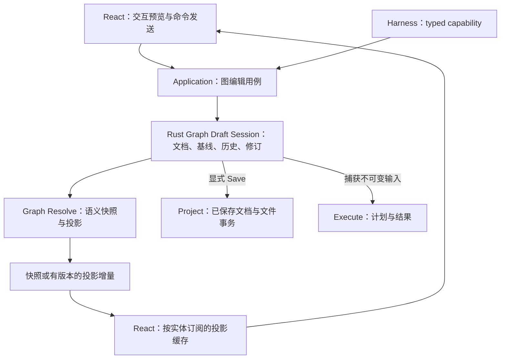

# Graph 草稿后端化与 JSON 界面方案评估

> Status: Historical
> Scope: motion.md 与 jsonDriver.md 的源码对照、后端草稿可行性、性能证据及实施建议
> Canonical owners: 当前可执行事实由源码和测试拥有；本文记录评估时的工作区快照，建议不代表已实施或已通过性能验收
> Update when: 保留本次评估；实施后的稳定契约由各架构文档维护

后续实施决策采用“直接编辑 Project 当前文档、Ctrl+S 落盘”，撤销和保存指纹属于数据层，不增加独立 Draft 文档容器。本文保留实施前的分析，源码链接已跟随后继 owner 更新；当前契约以 [Graph 与 Execution](../architecture/GRAPH_AND_EXECUTION.md) 为准。

## 1. 结论

**推荐推进后端草稿与撤销历史；推荐在结果报告中小范围采用语义化 JSON UI；两个方向分别实施和验收。** 草稿存放位置可以改变，评估的约束是交互性能、业务一致性和实际维护成本。

| 议题                                                                | 建议               | 主要理由                                                                    | 实施优先级     |
| ------------------------------------------------------------------- | ------------------ | --------------------------------------------------------------------------- | -------------- |
| `motion.md`：React/Harness 共用 Application 用例                    | 延续并补齐         | 已有共同 Rust 编辑实现，但 Harness 仍需要前端交付当前草稿                   | 高             |
| Rust 持有未保存草稿、保存基线和 undo/redo                           | 推荐迁移           | 可减少完整文档传输和前端复制，让工具结果不再依赖 Webview 安装确认           | 高             |
| Snapshot + 有版本的投影增量                                         | 推荐逐步实现       | 后端草稿只减少请求体，完整返回值仍会形成传输与渲染成本                      | 与草稿迁移配套 |
| 语义组件目录 + JSON 报告描述                                        | 推荐一个报告试点   | 有现成报告组件和结果查询能力可以复用                                        | 中             |
| 全应用通用 JSON Renderer、全局 JSON Patch 状态总线                  | 暂缓               | 工作台、图编辑、结果和表单具有不同生命周期；统一格式的新增收益尚未证明      | 低             |
| 立即引入 `json-render + Zod + Immer + JSON Patch + RJSF/JSON Forms` | 按试点需要逐项选择 | 当前已有 Zustand、参数 schema、报告组件和局部投影补丁；整套引入会扩大维护面 | 低             |

`motion.md` 的核心方向有价值，但示例距离可靠实现仍有明显缺口：草稿与保存的区别、提交顺序、增量丢失恢复、撤销粒度及性能预算都需要明确。`jsonDriver.md` 对语义组件的建议合理，但把状态管理、传输增量、渲染粒度和 AI 页面生成放在同一条链上，容易高估一次改造的收益。[^1]

评估对象是包含已有未提交改动的工作区。后端草稿的目标归属是方案建议，当前代码仍保留前端草稿。当前架构文档中的旧归属需要在迁移交付时同步更新，不能用旧归属直接否决新方案。[^2]

## 2. 当前代码已经具备什么

### 2.1 普通编辑和撤销已经依赖 Rust

普通编辑调用 `GraphDraftService.transform`，请求中包含完整 `document` 和一个 typed mutation，例如 `moveNodes`。Rust 的 `ApplicationState::transform_graph_draft` 创建 `GraphDraftEditor`，规划并应用文档补丁，再解析和返回完整文档及 editor projection。[^3]

撤销和重做由前端选择历史文档，然后调用 `GraphDraftService.resolve` 获取 Rust 的新投影。也就是说，当前撤销并不是完全在浏览器内即时完成；把历史放到 Rust，不必为其新增一轮本来不存在的语义查询。实际往返耗时仍需测量。[^4]

这使后端迁移具有实际简化空间：请求可以只携带草稿身份、预期修订和编辑意图，Rust 直接读取自己的草稿，不再让前端重复发送完整文档。

### 2.2 Harness 共用了编辑能力，但尚未脱离前端草稿

`assistantGraphTools.ts` 使用普通编辑的 `enqueueGraphDraftTask` 和 `installDraftProjection`。Rust 的自动化批量编辑与普通编辑都复用 `GraphDraftEditor`，所以不能把当前实现描述成两套独立的图编辑业务逻辑。[^5]

当前额外复杂度在交付流程：`HarnessGraphClientHub` 向 Webview 发出请求，Webview 在 FIFO 中取得草稿，调用 prepare、claim，安装投影后再 complete。Hub 没有对应客户端时返回 `GraphClientUnavailable`。这一流程服务于前端草稿归属；迁移后可让 Harness 直接调用后端草稿用例。[^5]

迁移后，工具的编辑成功应以 Rust 草稿事务提交为准。前端是否已经显示该修订可以另外观察，前端显示延迟不应让已完成的草稿编辑被判为失败。超时或回执丢失仍需通过请求 ID 查询结果；进程崩溃后的未知提交结果也不会仅因草稿迁移而自动消失。

### 2.3 后端撤销已有可复用基础

`GraphDocumentPatch` 包含有类型的文档操作，并已实现 `inverse()`：倒序处理操作，交换修改前后的内容。节点、连接、端口绑定、输入值和常量都有对应操作，因此无需为后端撤销先引入通用 JSON Diff 库。[^6]

但这还不是完整的后端历史系统。现有 `apply_graph_document_patch` 每次先克隆整个文档，在候选上应用并验证，通过后再替换；`GraphDraftEditor::new` 还会复制原文档，批量编辑循环也会逐次调用编辑器。把历史迁到 Rust 后若原样保留全部复制，成本只是部分换了位置。[^3][^6]

后续需要让一批编辑共用候选文档，记录可逆补丁，并在批次完成后一次提交。这里的优化必须保留原子性、失败回滚和每步必要的图语义校验。

### 2.4 高速交互已经与提交分开

`GraphFlowCanvas.tsx` 在拖动过程中维护局部位置预览，`stopNodeDrag` 才调用 `submitNodePositions`。提交未完成时保留预览，结束后按手势 owner 清理。这条路径可以继续使用后端草稿。[^7]

输入框也可以保留正在输入的文本、光标和 IME 组合状态，在确定的提交边界发送命令。前端拥有这些临时交互状态，与 Rust 拥有已接受的草稿修订可以同时成立。

### 2.5 JSON 驱动能力已在局部存在

| 现有能力                           | 源码依据                                            | 对方案的意义                                                |
| ---------------------------------- | --------------------------------------------------- | ----------------------------------------------------------- |
| Activity 文档的 snapshot/patch     | `ActivityPanelSyncState`、`activityPanelService.ts` | 已有 cursor、缓存预算及坏增量后的快照恢复经验               |
| 参数与配置表单                     | `ParameterEditorSpec`、`NodeConfigurationPanel.tsx` | Rust 声明字段，React 选择现成控件，已有受限 schema 驱动表单 |
| 报告类型到 React 组件的映射        | `reportViewResolver.tsx`                            | 已有报告级注册表，可从现有 owner 逐步扩展                   |
| OLS 报告的分页、按需分析及小节组件 | `OLSComponent.tsx`                                  | 可以抽取报告组合描述，复用数据获取和展示能力                |
| 结果引用与租约                     | `ResultReference`、结果查询协调器                   | UI Spec 可以引用结果，避免复制统计数据                      |
| 插件协议的 schema 生成             | `yss-plugin-protocol`                               | 跨语言校验可延续单一协议来源的方式                          |

这些能力有各自的职责。Activity 的行补丁不能直接冒充 Graph 的语义投影协议，报告类型映射也还不是任意页面生成器。它们提供可以复用的具体实现与设计经验。[^8][^9][^10]

## 3. 推荐的后端草稿架构



### 3.1 草稿仍然具有独立生命周期

建议在现有 Application 的 Graph/Session 边界内增加后端草稿会话责任，复用 Graph 的文档、编辑、解析及执行能力。无需先建设一个包揽全项目的可变 `ProjectState` 或额外服务进程。

每个逻辑草稿至少保存以下事实：

- 所属 Project session、graph path、独立 draft session ID。
- 当前草稿文档、保存基线、单调递增的文档修订。
- 可撤销和可重做的补丁批次、事务描述及容量统计。
- 当前解析依据、相关资源版本和投影交付基线。
- 最近请求的幂等结果，以及 dirty、saving、canUndo、canRedo 等投影事实。

同一逻辑图默认由多个视图共享一个后端草稿；独立草稿只有在产品确实支持分支编辑时才创建。图关闭、面板关闭、Harness 继续使用以及 Project replacement 要分别定义生命周期。UI 不显示某张图不应自动销毁仍被工具使用的草稿。

“后端存储”首先可以是 Rust 进程内的会话存储。若还要求进程崩溃后恢复未保存草稿，应另外定义恢复日志、检查点、写盘频率和恢复契约；每次拖动提交立即同步刷盘不是这次性能方案的前提。

### 3.2 四种版本不能混用

| 身份或版本                     | 解决的问题                             |
| ------------------------------ | -------------------------------------- |
| Project/Draft session ID       | 拒绝关闭重开、项目切换后到达的旧消息   |
| `draftRevision`                | 定位已接受的文档编辑和 undo/redo 顺序  |
| 语义输入 hash 与资源版本       | 决定解析、执行计划和结果缓存是否仍有效 |
| 投影 stream/sequence 或 cursor | 判断客户端是否具备应用增量的正确基线   |

位置变化通常改变草稿修订和保存状态，但不改变计算语义。当前 `semantic_document_fingerprint` 的节点部分包含 ID、类型和参数，排除了位置及用户标题，这一分离可以继续利用。dirty 判断应比较完整文档的保存身份，不能使用忽略位置的语义 hash。[^11]

资源变化、语言变化可能引起新投影而没有新的文档编辑，所以投影序号也不应简单等于草稿修订。Undo 是一次新的状态变更，修订应继续递增；历史恢复不应复用旧请求身份。

### 3.3 命令、提交和交付的顺序

推荐按逻辑草稿串行接受写命令，命令携带 session、`expectedDraftRevision` 和 `requestId`。同一请求重复交付返回已有结果；过期请求返回冲突和可重新查询的身份。

业务流程明确执行：捕获输入 → 生成候选 → 必要的 Resolve/结构校验 → 重验资源与 session → 原子提交草稿、历史及修订 → 发布同一次变更的回执/投影。业务提交不依赖订阅者执行顺序。

可编辑草稿需要容纳尚未连好或暂时无法执行的图。Resolve 得到阻断诊断时应按现有契约保留文档及 Problems；不能把“暂时不可执行”一律当成拒绝编辑的理由。结构损坏、过期身份和事务失败则仍应拒绝提交。

全局 Project 锁不应覆盖图解析、文件访问或 IPC 等待。可使用每图串行执行器或短临界区加重验；纯计算在适当执行线程运行，独立图的编辑不互相排队。Execute 捕获不可变输入后应允许队列处理后续编辑，运行结果带捕获的输入身份。

前端可以有发送队列和待提交手势，但最终写入顺序及冲突裁决由 Rust 决定。此时旧的前端文档历史和 Harness 草稿交接流程可删除；无需长期维护两套可写草稿。

### 3.4 Save、Undo 与 Execute 的边界

Save 将捕获的草稿交给现有 Project 文件事务，成功后更新保存基线。第一阶段可以沿用现有保存期间锁定编辑、保存成功后清理历史的可见行为，避免在迁移中同时改变用户体验。若允许保存期间继续编辑，必须只将被保存修订设为基线，后续编辑仍保持 dirty。[^4]

Undo/redo 保存文档意图的变化，恢复后使用当前资源重新解析。端口类型、诊断、结果有效性和执行计划缓存状态由对应 Rust owner 重新判断，历史不能直接恢复过时的运行样式或结果 payload。

一个 Harness 批次或一次完整拖动对应一个历史事务。删除节点必须连同相关连线、端口和输入状态在同一事务内恢复。补丁历史按条目数和字节数共同限制；大常量的前后值也可能很大，可逆补丁不天然等于低内存。

## 4. 对 motion.md 的具体修正

### 4.1 保留共同入口，细化各领域的状态归属

React 和 Harness 调用相同 Application 能力，适合作为长期方向。Application 负责编排，已保存项目、Graph 语义、Execution 结果等仍由现有领域 owner 管理。新增后端草稿不要求把这些状态合成一个锁保护的大对象。

文档将 Draft、Saved Graph、前端缓存都列为“多套事实源”，表述过于宽泛。关键是同一阶段的写入 authority 唯一；草稿、保存基线、只读投影和不可变执行输入本来就具有不同含义。

### 4.2 增量必须补齐恢复协议

`listen("app-event", store.apply)` 省略了初始化竞态、重复交付、缺失增量和项目切换。建议由一个原子 open/subscribe 用例返回绑定的快照与起始水位，并在返回快照期间缓存后续变更。客户端只应用基线连续的增量，忽略已覆盖的重复回执，发生 gap 时获取新快照。

原文示例先释放状态锁再发送事件。在并发调用下，后提交的操作可能先发送通知，因此不能仅凭发送发生在修改之后就假定顺序正确。修订分配和交付顺序需要由同一草稿的串行提交边界保证。

回执和后台推送若携带同一批变更，必须经过同一个投影安装入口并以 sequence/request ID 去重。慢消费者采用有界缓冲和重取快照策略；不能无界排队，也不能静默丢弃仍需用于增量应用的中间批次。

Tauri 官方说明普通 Event 不面向低延迟、高吞吐场景，并建议有序流使用 Channel。因此，图的持续投影交付更适合独立 Channel；低频失效通知仍可以使用 Event。Channel 的顺序交付也不能代替应用层的断线恢复和 session 校验。[^12]

### 4.3 图编辑增量需要表达派生影响

创建一条连线可能同时改变下游端口类型、Schema、诊断和运行准入。仅发送一个 `EdgeCreated` 不足以重建完整语义投影。

建议区分 typed 编辑命令与投影增量。编辑命令描述意图；Rust 生成的投影增量描述所有实际变化，包括节点、端口、连接、诊断、语义依据和其他同批交付事实。一个投影批次全部校验后原子安装，解析结果继续由 `GraphSemanticSnapshot` 产生。

首屏、重连、缓存淘汰或改动覆盖大部分图时仍应发送快照。选择快照还是增量，应比较构造成本及实际传输大小；计算增量本身可能需要遍历全图。

### 4.4 Event Bus 不承接业务控制流

编辑后该解析哪些事实、如何使结果失效、何时提交保存，都应由 Application 用例明确协调。事件用于提交后的通知和投影交付。统一入口并不要求把 Project、Execution、Harness、Logs 的不同流合并成一条全局事件历史。

`UiIntent::FocusNode` 值得保留，应绑定目标窗口、项目和图身份，交给现有 Workbench/Canvas 操作。视口、测量和面板物理布局继续由现有前端 owner 管理。[^7][^13]

## 5. 性能证据与验收条件

### 5.1 已完成的限定测量

使用仓库 editor projection fixture 中的一个节点作为模板，构造 100、1,000、5,000 节点的同质合成负载。测量脚本和完整输出随本文保留：

- [可复现脚本](probes/graph-draft-transfer.mjs)
- [原始结果](probes/graph-draft-transfer-results.json)

脚本只模拟 wire 结构和当前 Store 的两次文档 stringify、两次文档 clone、一次投影 clone。每项预热 8 次、采样 60 次。运行环境为 Windows x64、Node v24.13.0、i9-13900HX。合成文档不用于图语义验证，不包含真实边连接、数据集或复杂 Schema。[^14]

| 节点数 | 当前完整文档请求 | 后端草稿命令模型 | 当前完整响应模型 | 前端复制与比较 p50 / p95 |
| ------ | ---------------- | ---------------- | ---------------- | ------------------------ |
| 100    | 23,317 B         | 373 B            | 154,002 B        | 1.69 / 2.05 ms           |
| 1,000  | 231,574 B        | 373 B            | 1,538,016 B      | 13.90 / 18.66 ms         |
| 5,000  | 1,158,935 B      | 373 B            | 7,692,738 B      | 87.52 / 120.83 ms        |

这里的 373 B 是含 session、request ID、预期修订和单节点移动操作的建议请求模型，**尚未实现**。完整响应大小也来自合成对象，不能当作真实项目平均值。

测量支持两个判断：后端草稿能消除重复上传完整文档的结构性成本；只改请求还不够，完整投影传输和前端全量复制也值得处理。它不证明 Rust 解析更快，也不证明 Tauri 端到端延迟、React 帧率或实际迁移收益已经达标。

同一合成文档的 50 份 JSON 编码总大小分别约为 1.15、11.57、57.93 MB。这个数值仅用于说明快照历史的增长趋势，不代表 JS 堆或 Rust 常驻内存，后者需独立测量。[^14]

### 5.2 迁移应一并解决的成本

1. **本地即时反馈**：拖动、缩放、选择和文本组合在前端完成，已接受的编辑意图按事务提交。
2. **请求大小**：常规编辑只发送命令和身份；导入、粘贴等本身需要大内容的操作单独计量。
3. **后端复制**：复用批次候选，减少 `document.clone()`；可逆补丁记录历史，不能宣称现有实现已经增量化。
4. **解析成本**：纯位置更新在验证不改变语义且资源依据匹配后复用语义快照；涉及数据依赖的编辑按实际影响解析。当前统一编辑路径仍调用 Resolve，已有语义 hash 分离并不等于已经有该快速路径。[^3][^11]
5. **投影交付**：小改动传受影响实体；大改动、初始加载和恢复用快照。
6. **React 订阅**：未变化实体保持引用，组件订阅自身切片。当前 `buildProjectionBucket` 会重新构造图内节点、端口和连线对象，这是可以优化的具体位置。[^15]

React 对外部 Store 使用 `Object.is` 判断快照变化。采用 Immer 或收到一个 JSON Patch，都不自动保证只重渲染一个组件；实际对象引用、订阅范围和父组件传播共同决定更新成本。[^16]

### 5.3 建议的真实性能门槛

以下为实施前应固定的建议门槛，不是已取得的成绩。暂按 1,000 节点作为主验收规模、5,000 节点作为压力场景；实际产品规模确认后可调整。图形必须覆盖连线扇出、动态端口和复杂 Schema，不能只用同质空节点。

| 场景                                | 建议验收                                                                            |
| ----------------------------------- | ----------------------------------------------------------------------------------- |
| 拖动、缩放、框选                    | 60 Hz 设备上主验收场景帧间隔 p95 接近或低于 16.7 ms；相同图与视口下不劣于迁移前基线 |
| 单节点位置提交、轻量属性编辑        | 命令发送到对应投影安装的 p95 ≤ 50 ms；前端安装切片 p95 ≤ 5 ms                       |
| 需要 Resolve 的普通编辑与 undo/redo | 主验收场景 p95 ≤ 100 ms；超过预算的复杂图需显示明确处理状态并单独记录               |
| 前端主线程                          | 不因常规单实体增量产生 ≥ 50 ms 的长任务；压力场景另计                               |
| 图无关的并行工作                    | 一张图的慢 Resolve 或运行不持续阻塞另一张图的轻量编辑                               |
| 连续编辑与历史                      | 保留能力至少覆盖当前 50 次普通操作；历史、投影基线和请求账本同时有条目及字节上限    |
| 重连和慢消费者                      | 最终投影等于后端当前快照；gap 可恢复，缓存不随等待时间无界增长                      |

以同一机器的 release 构建比较迁移前后，固定图、视口、窗口数和数据输入，记录输入到首次视觉反馈、命令到提交、提交到投影安装以及帧间隔的 p50/p95/p99。1,000 节点与 5,000 节点各跑代表性操作，分别测冷启动和预热场景。

现有 Canvas 保持节点挂载，因此大图表现还可能受 React Flow/DOM 数量影响。后端草稿与传输优化无法替代画布本身的性能测量。先找到实际瓶颈，再决定是否需要可视区域裁剪等进一步改动。[^7]

## 6. 对 jsonDriver.md 的具体评估

### 6.1 最有价值的部分是语义组件组合

用 `RegressionSummary`、`CoefficientTable`、`ResidualPlot` 这样的语义块表达报告，能让 AI 或模板选择展示内容，而格式、主题、可访问性和数据访问留在现有组件中。这适合用户要求“展示本次 OLS 的系数和残差图”或比较若干分析结果的场景。

当前报告已有类型到组件的注册表，OLS 也已拆出模型摘要、ANOVA、系数、残差及诊断查询。建议先扩展这些 owner，让一个 OLS 报告的小节顺序和可见内容由受限描述控制，复用已有 Result 查询及分页。[^9]

如果需求只是减少重复 JSX，现有组件组合、配置数组和共享小节已能解决很多问题；JSON 协议的额外收益应体现为可保存、可生成、可传输或可复用的报告描述。缺少这些需求时，不宜仅为了格式统一建设一个运行时。

### 6.2 统计事实必须通过结果引用绑定

草稿示例让 AI 修改 `metric-r2.props.value`，这只能用于纯演示数据。生产统计报告中的 R²、AIC、系数和 p 值必须来自实际计算结果。只验证 `value` 是数字，无法证明它来自某个真实模型。[^1]

建议的最小报告描述可以是下面的结构；它是目标示意，尚非现有协议：

```json
{
  "schemaVersion": 1,
  "type": "regressionReport",
  "source": {
    "executionSessionId": "00000000-0000-0000-0000-000000000001",
    "resultId": "42"
  },
  "sections": [
    { "id": "summary", "kind": "modelSummary" },
    { "id": "coefficients", "kind": "coefficientTable" },
    { "id": "residuals", "kind": "residualPlot" }
  ]
}
```

页面加载时依据 `ResultReference` 获取真实结果。结果块需校验结果种类和可提供的分析项；缺失或失效的结果显示明确状态。LLM 可生成说明文字和排列建议，数值块的数据来源由宿主绑定。[^10]

已有结果引用绑定 execution session，报告需要按现有租约持有结果。保存一份包含 `resultId` 的 JSON 并不等于保存了可以跨会话恢复的结果；若需要长期报告，必须由现有 Project/Result owner 定义结果持久化、导出或重建方式。首个试点建议限于当前会话内的报告组合。

### 6.3 把三种 Patch 分开设计

| Patch 用途                  | 合适的表示                                      | 必须保证的语义                                   |
| --------------------------- | ----------------------------------------------- | ------------------------------------------------ |
| Graph 文档编辑与历史        | 现有 typed `GraphDocumentPatch`                 | 业务前置条件、批次原子性、可逆、一次事务一次历史 |
| Graph/Activity 的读投影交付 | 各 owner 的有类型增量                           | 实体身份、派生事实、版本连续、整体校验及快照恢复 |
| 报告布局或 UI Spec 编辑     | 小规模全量替换、语义操作；有需求时采用 RFC 6902 | 允许的字段、结构合法性、基线、失败不部分发布     |

这三类数据可以采用 JSON 编码，但服务不同生命周期。图的 Resolve、冲突处理和 undo 不应由前端通用 Patch 引擎重建。

`jsondiffpatch` 的默认 delta 格式与 RFC 6902 不同，它另外提供 RFC 6902 输出及应用能力；数组对象匹配需要明确 identity。`idubrov/json-patch` 则声明实现 RFC 6902 和 RFC 7396，并不是 `jsondiffpatch` 全部功能的 Rust 等价物。草稿中“换一个 Rust 库就可以接起来”的隐含前提需要更正。[^17]

RFC 6902 定义 JSON 操作和错误处理，不定义项目 session、版本协调、订阅恢复、undo 历史或 Graph 语义。即使使用现成库，也要在候选副本上验证完整批次后再发布，不能假定任意内存 API 都自动具有所需事务边界。[^18]

### 6.4 json-render 值得试用，库的状态需要按当前资料判断

官方文档已提供组件目录、schema、registry、数据绑定及流式 UI；当前也有专门的 `@json-render/zustand` 适配器，其文档要求 Zustand v5+。仓库自身使用 Zustand 5，因此可以直接评估既有 Store 的接入方式，无需预设必须另建一个状态容器。[^19][^20]

适配器默认支持向 Zustand 写回并进行浅合并，文档中的 `$bindState` 也具有双向绑定能力。接入时应把可写的表单临时值和 UI 设置限定在局部切片；Graph/Result 的后端投影通过受控查询与命令处理，不能将任意 renderer 写回直接发布为业务事实。[^20]

建议用同一个 OLS 报告样例比较两个实现：现有组件上的小型 typed 描述解释器，以及 `json-render` 的受限目录。比较实际新增代码、校验错误表现、包体积、节点级更新和已有样式兼容性。只有在动态组合、流式生成等能力确实减少了维护成本时才引入依赖。

稳定的 `UiSpec` 有价值，但自己包装协议也有维护成本。如果最后主要使用库的表达式、绑定和 action 模型，换 renderer 仍需适配这些语义。只有主动限制协议为小而清楚的领域子集，才能实际降低未来替换成本。

### 6.5 Zod、Immer 和表单库都应按缺口选择

| 选择                | 评估                                                                                                                      |
| ------------------- | ------------------------------------------------------------------------------------------------------------------------- |
| Zod                 | 可用于 AI 输入或纯前端 UI Spec 校验；跨 Rust/TS 的长期协议应选择一个 schema 来源并生成两端类型/验证，避免两套手写定义漂移 |
| Immer               | 可简化不可变更新写法，但不能代替实体级订阅和引用稳定；当前依赖表没有它，是否增加由试点决定                                |
| RJSF                | 支持由 JSON Schema 生成表单，也有 `uiSchema`；文档把 Data/UI Schema 分离只归给 JSON Forms 不够完整                        |
| JSON Forms          | 明确区分数据 schema 与 UI schema，适合确实需要通用表单的平台能力                                                          |
| ECharts / Vega-Lite | 作为特定图表需求的独立选型；JSON UI 试点先复用现有图表组件即可                                                            |

RJSF 与 JSON Forms 的上述定位可以从各自官方文档确认。当前节点配置已由 Rust schema 投影字段，并使用 `ParameterValueEditor` 处理提交；只有现有控件无法表达明确的真实需求时，替换表单引擎才有充分理由。[^8][^21]

草稿中无日期的 Star 数量、主题列表及“强烈建议整套使用”等内容不适合成为架构决策依据。依赖选型应以具体场景、API 契约、实测开销和维护范围为准。

### 6.6 首个 UI Spec 需要的约束

协议应明确 schema 版本、允许的小节类型、稳定 ID、结果引用及布局范围。校验包括 props、引用存在性、结果种类、重复 ID、递归/环和数量上限；仅通过字段类型校验不够。

交互通过宿主注册的语义 action 进入已有 Application/Workbench 用例，例如定位节点、打开结果或导出。沿用这些用例已有的作用域和操作约束，不把任意 Tauri command 名、脚本或网络地址作为可执行配置。

如果启用流式生成，应缓存尚不完整的片段，完成一个可校验块后再展示；出现未知组件或非法批次时保留最后一次有效显示。渲染一个未完成的按钮不能触发业务写入。先完成完整合法文档的路径，再增加 streaming，能降低第一阶段复杂度。

### 6.7 最适合与最不适合的范围

| 范围                                   | 适合程度 | 原因                                                     |
| -------------------------------------- | -------- | -------------------------------------------------------- |
| 当前结果的组合报告、Assistant 结果卡片 | 高       | 语义块稳定，宿主已有数据引用及展示能力                   |
| 简单插件标准视图和配置表单             | 中高     | 与已有/目标声明式扩展点一致，但需遵守插件协议 owner      |
| 普通详情面板                           | 中       | 已有 schema 驱动控件，需要先确认新增收益                 |
| React Flow 图编辑内部                  | 低       | 手势、测量、handle 和画布状态由专用实现处理              |
| Dockview 工作台物理布局                | 低       | 已有唯一运行实例和事务接口，不宜再持有一份独立可写布局树 |

JSON 可以表达“打开某个报告”或“聚焦某个节点”，由现有 Workbench/Canvas 接口执行。持久化布局描述也可以存在，但实时布局事实仍应由一个 owner 裁决。[^13]

## 7. 实施顺序、成本与停止条件

两个方向没有必须绑定的技术依赖。后端草稿在现有 React 组件上就能完成；报告 JSON 试点也可以读取当前 Result API。共同约束是业务引用可靠、写入口清晰和前端投影可恢复。

| 阶段                   | 工作范围                                                                                      | 相对工作量 | 完成条件                                                |
| ---------------------- | --------------------------------------------------------------------------------------------- | ---------- | ------------------------------------------------------- |
| P0：契约与基线         | 固定逻辑草稿 identity、Save/Undo 语义、命令提交点；记录真实交互性能                           | 小至中     | 性能场景和失败恢复场景可复现                            |
| P1：Rust Draft/History | 在现有 Application 边界持有草稿和保存基线，复用 typed patch；前端发送命令并安装投影           | 中至大     | 交互行为等价，普通编辑无需上传完整 document，历史有界   |
| P2：Harness 直达用例   | 工具使用同一后端草稿，结果账本关联提交回执；删除旧草稿 prepare/claim/adopt 流程               | 中         | 无图面板的授权工具调用仍能完成；UI 关闭不改变已提交结果 |
| P3：投影及性能优化     | 完整快照与增量共用安装器，保存引用，补齐 snapshot/subscribe、gap 与慢消费者恢复；减少候选复制 | 中至大     | 达到第 5 节门槛；若未达标，继续定位瓶颈后再交付迁移     |
| P4：报告 JSON 试点     | 一个 OLS 报告，绑定真实结果，比较轻量解释器与 json-render                                     | 中         | 布局可配置、结果准确、非法 spec 可处理、更新开销可接受  |

P1 可先用完整投影验证语义正确性，P3 决定性能验收能否通过。P2 可随 P1 的接口稳定推进。上表是工作范围判断，不是承诺工期；图规模、当前窗口行为、结果生命周期和恢复要求会显著影响投入。

迁移范围涉及草稿 Store/协调器、普通编辑与历史入口、Rust 编辑用例、Application session、Harness gateway/channel、IPC DTO/parser、Project lifecycle 和运行输入捕获。仅修改一个 Store 或替换传输格式无法完成迁移。

业务路径切换完成后同步更新 `AGENT_RULES.md`、Graph/Execution、Statistical Harness、IPC 和系统架构中的状态归属。现有规则允许的前端草稿会被新的后端草稿契约替代；提交前仍需明确区分目标设计与实际实现。

### 必须覆盖的行为验收

- 普通编辑与 Harness 同时修改同一图：顺序明确，过期请求不会覆盖新状态。
- 批量编辑中途失败：草稿、历史、dirty 和投影均无部分提交。
- 同一请求重复发送或回复丢失：能够确认原操作结果，不重复创建节点。
- Undo/redo 遇到资源变化：恢复文档后得到当前语义投影，旧结果不会错误显示为有效。
- 项目替换、关闭重开、订阅断开：旧 session 的回调无效，新投影能够从快照恢复。
- Save 失败、执行失败或取消：分别保留正确的草稿、保存基线和执行终态。
- 结果 JSON 报告关闭、结果失效或 session 结束：租约按既有生命周期释放，数值不会从 UI Spec 中伪造恢复。

Rust 用例、补丁原子性、版本校验和传输解析可以做聚焦自动验证。真实 UI 的拖动、输入、撤销、帧率和窗口切换按仓库要求进行人工验收，不新增 UI 单元测试。

## 8. 两份原文应怎样处理

**`motion.md` 值得改写为可实施的后端草稿设计。** 保留共同 Application 入口和单向投影原则，补充 Draft Session、可逆历史、命令提交点、版本化交付、Save/Execute 边界及性能门槛。原文没有稳定的文档状态声明且保留对话口吻，当前不适合直接当作生产契约。[^1]

**`jsonDriver.md` 适合作为方向资料，实施计划收敛为语义化结果报告试点。** 保留受限组件目录、结构化描述和后端结果引用；更正指标数值来源、Patch 格式区别和库能力信息。通过试点后再决定是否沉淀成长期 UI Spec 契约。

两份原文的正确处理方式是提炼为边界明确的设计与验收，不宜直接按示例一次性重写应用。优先投资于后端草稿与有界投影交付，能够同时服务人工编辑、Harness 和未来其他客户端；JSON UI 的进一步投入由报告试点的真实收益决定。

## 9. 证据范围与验证结果

已确认的事实包括现有完整文档请求、前端快照历史、共享 Rust 编辑器、可逆补丁、Harness Webview 交接，以及本地拖动预览。源码依据来自评估时的工作区，包含尚未提交的更改。

现有 Rust 原子性回归 `patch::tests::patch_commit_is_atomic` 实际执行，1 项通过。它证明测试覆盖的无效补丁未污染原文档，不证明完整后端历史、并发写入或断线恢复已经实现。

合成传输与复制探针实际执行，原始数据见第 5 节。没有真实 Tauri IPC、Rust Resolve、React render 或 release 桌面帧率测量，因此目前能给出的是**有源码和限定测量支持的迁移推荐，性能保证需由迁移后的验收结果建立**。

验证记录：

| 命令/范围                                                                                                 | 结果                                                                                                               |
| --------------------------------------------------------------------------------------------------------- | ------------------------------------------------------------------------------------------------------------------ |
| `node docs/reviews/probes/graph-draft-transfer.mjs`                                                       | 完成三个规模的合成测量；只测传输对象与 JavaScript 复制                                                             |
| `pnpm test:rs:package -p yss-graph-document-edit --lib patch::tests::patch_commit_is_atomic '--' --exact` | 1 项通过                                                                                                           |
| `pnpm test:ts src/tests/architecture/documentationContract.test.ts`                                       | 5 项通过、1 项失败；失败项为已有 `component-plan.md` 链接到已删除的 Application 图准备模块，新增报告未出现失效链接 |
| `git diff --check`                                                                                        | 工作区检查发现已有 IPC contract `graph_draft.rs` 第 27 行 EOF 多余空行；不属于本报告及探针改动                     |

这些失败记录描述检查时的工作区，相关文件处于既有修改中。全仓文档检查及空白检查不能记为通过。

## Sources

以下本地引用均对应评估时的工作区快照；外部文档于 2026-09-15 核对。源码链接标明文件，正文指出相关函数，避免把改造建议误认为当前行为。

[^1]: YssBI，[motion.md](../harness/motion.md)，共同入口、事件示例和状态归属讨论；[jsonDriver.md](../draft/jsonDriver.md)，组件目录、数值修改、Patch 与依赖建议。

[^2]: YssBI，[Repository Agent Policy](../development/AGENT_RULES.md)，当前架构约束；[Graph 与 Execution](../architecture/GRAPH_AND_EXECUTION.md)，Draft/Save/Execution 边界；[Statistical Harness](../architecture/STATISTICAL_HARNESS.md)，当前能力与恢复限制。

[^3]: YssBI，[graphDraftService.ts](../../src/services/nodeSystem/graphEditingService.ts)，`transform` 完整文档请求；[graph/edit.rs](../../src-tauri/crates/yss-application/src/graph/edit.rs)，`GraphDraftEditor::new/apply/finish` 和 `transform_graph_draft`。

[^4]: YssBI，[graphEditingStore.ts](../../src/features/core/graphEditing/graphEditingStore.ts)，文档复制、历史容量、Save 和 undo/redo；[historyCoordinator.ts](../../src/features/application/graphEditing/historyCoordinator.ts)，撤销前 Resolve。

[^5]: YssBI，[assistantGraphTools.ts](../../src-tauri/crates/yss-application/src/automation/graph.rs)，FIFO 与投影安装；[automation/graph.rs](../../src-tauri/crates/yss-application/src/automation/graph.rs)，共享编辑器及版本检查；[harness_graph.rs](../../src-tauri/crates/yss-application/src/ipc/channel/graph_activity.rs)，客户端交接、可用性及未知结果处理。

[^6]: YssBI，[GraphDocumentPatch](../../src-tauri/crates/yss-graph-document-edit/src/patch.rs)，`inverse`、`apply_graph_document_patch` 和原子性回归。

[^7]: YssBI，[GraphFlowCanvas.tsx](../../src/modules/graph-editor/internal/ui/Canvas/core/GraphFlowCanvas.tsx)，位置预览、拖动提交及受控节点；[Graph 与 Execution：Canvas](../architecture/GRAPH_AND_EXECUTION.md#canvas-presentation-and-input)，当前画布交互边界。

[^8]: YssBI，[activity_panel_sync.rs](../../src-tauri/crates/yss-application/src/ipc/activity_panel_sync.rs)，有界基线和行补丁；[activityPanelService.ts](../../src/services/workbench/activityPanelService.ts)，快照恢复；[parameter.rs](../../src-tauri/crates/yss-node-protocol/src/parameter.rs)，`ParameterEditorSpec`；[NodeConfigurationPanel.tsx](../../src/modules/details/internal/ui/node/NodeConfigurationPanel.tsx)，schema 字段到控件的映射。

[^9]: YssBI，[reportViewResolver.tsx](../../src/modules/results/internal/ui/info/reportViewResolver.tsx)，报告注册表；[OLSComponent.tsx](../../src/modules/results/internal/ui/info/OLSComponent.tsx)，报告小节、分页及残差分析。

[^10]: YssBI，[result.ts](../../src/shared/types/domain/result.ts)，`ResultReference`；[resultQueryCoordinator.ts](../../src/features/application/results/resultQueryCoordinator.ts)，引用及读取生命周期；[IPC contract](../../src-tauri/crates/yss-application/src/ipc/README.md)，结果租约与分页；[Plugin protocol](../../src-tauri/crates/yss-plugin-protocol/README.md)，类型/schema 生成入口。

[^11]: YssBI，[semantic_hash.rs](../../src-tauri/crates/yss-graph-document/src/semantic_hash.rs)，`semantic_document_fingerprint` 的输入范围。

[^12]: Tauri，[Calling the Frontend from Rust](https://v2.tauri.app/develop/calling-frontend/)，Event 与 Channel 的用途、顺序及吞吐边界。

[^13]: YssBI，[Workbench Dockview](../architecture/WORKBENCH_LAYOUT_ARCHITECTURE.md)，布局 authority 和语义操作接口；[Plugin 目标契约](../architecture/PLUGIN.md#11-声明式-ui-与-workbench)，声明式标准 UI 范围，属于目标设计而非全部已实现能力。

[^14]: YssBI，[传输与复制探针](probes/graph-draft-transfer.mjs)、[原始测量结果](probes/graph-draft-transfer-results.json)，60 次采样；模板来自 [editor-projection.json](../../src/tests/fixtures/node-system-contracts/editor-projection.json)。

[^15]: YssBI，[graphProjectionStore.ts](../../src/features/core/dataStore/graphProjectionStore.ts)，`buildProjectionBucket` 与投影整体替换；[package.json](../../package.json)，当前直接依赖。

[^16]: React，[useSyncExternalStore](https://react.dev/reference/react/useSyncExternalStore)，不可变快照、引用复用及 `Object.is` 比较。

[^17]: benjamine，[jsondiffpatch](https://github.com/benjamine/jsondiffpatch)，默认 delta、数组匹配及 RFC 6902 支持；idubrov，[json-patch](https://github.com/idubrov/json-patch)，Rust 的 RFC 6902/7396 实现。

[^18]: IETF，Bryan 与 Nottingham，[RFC 6902: JavaScript Object Notation (JSON) Patch](https://www.rfc-editor.org/rfc/rfc6902)，2013 年 4 月，操作和错误处理语义。

[^19]: Vercel Labs，[json-render Introduction](https://json-render.dev/docs)、[Schemas](https://json-render.dev/docs/schemas)、[Streaming](https://json-render.dev/docs/streaming)，目录、渲染协议及流式生成。

[^20]: Vercel Labs，[@json-render/zustand](https://json-render.dev/docs/api/zustand)，Zustand v5、selector/updater 和默认写回；[Schemas](https://json-render.dev/docs/schemas)，双向绑定语义。

[^21]: RJSF 团队，[react-jsonschema-form Introduction](https://rjsf-team.github.io/react-jsonschema-form/docs/)，表单定位和 `uiSchema`；JSON Forms，[What is JSON Forms?](https://jsonforms.io/docs/)，数据 schema 与 UI schema。
