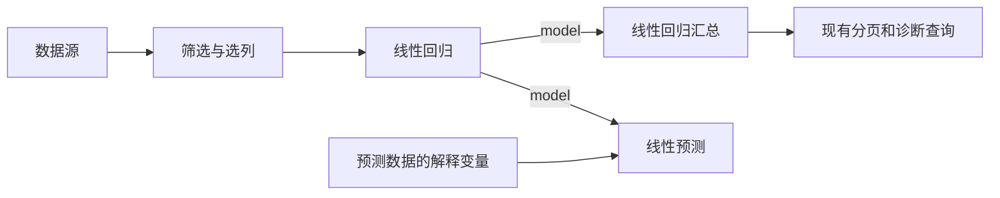

# 线性回归节点规格与后续验收

> Status: Planned
> Scope: 首批 OLS 数据流程的节点职责、输入输出、配置、模型复用、报告、当前契约与验收
> Canonical owners: 本文拥有首批目标规格；当前行为由所链接源码及 ../architecture/GRAPH_AND_EXECUTION.md 拥有
> Update when: 首批范围、节点契约、契约规则、参数和验收方案改变时

OLS/WLS/GLS 统一入口、原生模型复用、汇总与点预测已实现；变量显示名、详细配置元数据及 UI 人工验收等增强项仍按本文跟踪。当前行为以架构文档和源码为准；准备工作与后续批次见 [SCI 计划](README.md)，原始方法映射见 [METHOD_INVENTORY.csv](METHOD_INVENTORY.csv)，完整内置节点台账见 [NODE_INVENTORY.csv](NODE_INVENTORY.csv)。

节点的独立组件与装配、展示信息归属、直接图操作 API 及 commit/undo/redo 遵循[节点重构要求](NODE_REFACTOR_REQUIREMENTS.md)。本规格细化线性回归的模型行为；尚未实现的体验要求须在既有通用边界内落实。

## 1. 本批交付边界

交付流程为：数据源 → 筛选/选列 → 线性回归（OLS/WLS/GLS）→ 线性回归汇总与诊断，以及使用同一已拟合模型进行新数据点预测。

本批重点对应原清单 33/34（OLS）、271（残差分析）、274/275（序列相关检验）、282（线性约束 Wald）、286 的 OLS 点预测部分，以及 252 的现有系数 95% 区间。324/325 先覆盖已有 OLS 残差分析场景；一般时间序列入口归后续时间序列批次。

数据处理复用已有关系与数列节点。清单中的标题处理、生成变量和无效样本在本批仅涉及现有列重命名、四则运算与按谓词筛选的范围，完整业务定义继续跟踪在对照表。

Logit、Probit、聚类标准误、通用缺失插补、任意置信水平、预测区间以及新增 BP/White/VIF/Cook 图节点分别按后续批次推进。已有报告中的诊断能力继续可用；本批不以新增所有诊断节点为交付条件。

## 2. 已确认的当前状态

统一节点及参数见 [节点目录](../../src-tauri/crates/yss-node-catalog/src/statistics/mod.rs)，拟合、共享模型与预测见 [统计内核](../../src-tauri/crates/yss-node-kernel/src/builtins/statistics.rs)。

- 三种估计方法已接入 Fit。OLS 为默认；WLS 需要正精度权重；GLS 需要完整有限对称正定的相对误差协方差矩阵，当前仅支持 nonrobust。
- Fit 输出 `LinearRegressionResult`，Summary 直接共享同一 Arc，不再拟合；Predict 已注册并保留截距语义。
- 方法专用输入通过已有按需添加端口实现。`weights` 最多一列，`sigma` 按矩阵列顺序添加 n 个长度为 n 的数列。切换方法需移除不适用的输入；执行前进行检查。
- 输入模板名由 Graph 语义事实进入执行计划，再由适配器交给内核；图实例身份不进入 SCI。
- 现有报告查询、分页、残差分析和假设检验继续复用；报告类型及标题统一，实际估计方法保留。
- 尚未完成本文全部体验目标：模型仍使用匿名变量名称，详细拟合配置元数据及 UI 人工验收待后续落实。Newey lag=0 的目录限制保持原状。

## 3. 节点与端口目标

图中 model 是 Runtime 持有的类型化原生结果。前端使用现有结果引用查询视图，不接收完整设计矩阵或可修改的模型 JSON。

| 节点 ID                           | 显示名称     | 目标输入                                                              | 目标输出                                   | 配置与计算职责                                   |
| --------------------------------- | ------------ | --------------------------------------------------------------------- | ------------------------------------------ | ------------------------------------------------ |
| `yssbi.statistics.linear.fit`     | 线性回归     | `response`：一列因变量；`predictors`：有序解释变量组，至少一列        | 保留 `model`、`fitted`、`residuals` 三个键 | 仅此节点拟合；配置属于此节点                     |
| `yssbi.statistics.linear.summary` | 线性回归汇总 | `model`：`statistics.model.linear`                                    | 保留 `result`、`report` 两个键             | 读取原生模型，无拟合参数，不重新估计             |
| `yssbi.statistics.linear.predict` | 线性预测     | `model`：线性回归模型；`predictors`：与训练解释变量一一对应的有序列组 | `prediction`：Float64 数列                 | 使用训练时的系数和截距；没有第二份截距或拟合配置 |

Fit 的 model 名义类型保留 `statistics.model.linear`，运行值使用现有 `RuntimeValue::LinearRegression(Arc<LinearRegressionResult>)`。Summary 的 result/report 继续采用其现有声明类型和结果类别，但共享输入模型的同一原生结果。不同输出可以有不同 ResultReference，不能假定它们的 resultId 相同。

拟合值、残差与预测值沿用数列结果的读取方式。首批可保留现有有界物化输出表示，但内存估算必须计入完整模型及这些输出；不得把完整数值数组再次塞进报告 DTO。需要共享派生数列时，在现有数列/结果所有者内处理，不另建结果存储。

同一 Fit 节点被多个下游需要时，一次运行只执行一次拟合。不同 Fit 节点即使参数相同，也不承诺跨节点或跨运行自动合并计算。

### 3.1 数据节点的显示约定

| 现有节点                        | 建议显示名称     | 明确区分的用途                  |
| ------------------------------- | ---------------- | ------------------------------- |
| `yssbi.dataframe.source.get`    | 获取数据帧       | 绑定数据资源                    |
| `yssbi.dataframe.filter.rows`   | 筛选行           | 根据谓词保留共同样本            |
| `yssbi.dataframe.project`       | 选择列（数据帧） | 输出多列数据帧                  |
| `yssbi.dataframe.series.select` | 选择单列（数列） | 输出指定列，类型来自上游 Schema |
| `yssbi.dataframe.decompose`     | 拆分为数列       | 通过已有动态端口选择需要的列    |
| `yssbi.dataframe.rename`        | 重命名列         | 明确原列和目标列名              |

使用列选择与动态端口的现有交互，避免同时维护另一套模型配置中的变量选择事实。OLS 详情面板显示因变量和有序解释变量列表，来源与名称由当前连线投影，增删变量继续使用已有图编辑操作。

### 3.2 输入与样本策略

- 因变量和解释变量的语义必须为 Numeric，且值有限；内部 Int64 可按既有类型提升进入 Float64 计算。
- Identifier 不进入因变量、解释变量或自动推荐的数值列集合，即使它以 Int64/Float64 存储。直接绑定、旧图绑定或程序化调用必须产生可定位诊断并阻断执行，不能静默丢列、转为 Numeric 或编码后纳入模型；规则遵循[Identifier 统计输入约束](NODE_REFACTOR_REQUIREMENTS.md#39-identifier-的统计输入约束)。标识可用于明确的样本对齐或展示用途，不作为设计矩阵中的测量变量。
- 关系数列必须具有同一可证明行域，统一投影后读取；行数相同不能代替行域一致性。
- DataSeries 的内部物化表示可使用数值列表，保持位置对应并要求等长；不混合无对齐证明的物化数列与关系数列，不另暴露 Array 分析类型。
- 本批缺失策略为 `Reject`。NULL、NaN、无穷值不能在各列中独立删除。需要剔除缺失样本时，用户先在上游对共同样本筛选。
- 样本量应大于实际设计列数，实际设计列数包含启用的截距；至少有一列解释变量。
- 保留数据进入模型后的样本顺序。报告只能声明它实际掌握的拟合输入样本数，不能把上游筛选前的总行数编造为模型的原始样本数。
- 首批不自动生成虚拟变量、交互项或截距常数列。开启截距时用户再输入常数列造成的秩不足应有明确诊断。

## 4. 配置界面及实际参数

保留现有 `configuration` 容器和 Rust 声明式配置。仅 Fit 展示估计参数，Summary 和 Predict 展示其来源模型的只读配置信息。

| 参数键       | 显示名称            | 默认值      | 允许范围及显示条件                                  |
| ------------ | ------------------- | ----------- | --------------------------------------------------- |
| `method`     | 估计方法            | `OLS`       | OLS、WLS、GLS；权重与协方差输入按所选方法提供       |
| `constant`   | 包含截距            | `true`      | 基础参数；布尔值                                    |
| `covariance` | 标准误方法          | `nonrobust` | 常规、HC0、HC1、HC2、HC3、HAC、Newey–West、固定尺度 |
| `kernel`     | HAC 核函数          | `bartlett`  | 仅 HAC；bartlett/parzen/quadratic spectral          |
| `bandwidth`  | HAC 带宽            | `1`         | 仅 HAC；正整数；本批沿用显式带宽                    |
| `lag`        | Newey–West 最大滞后 | `1`         | 仅 newey；非负整数，允许 0                          |
| `scale`      | 固定尺度            | `1`         | 仅 fixed scale；有限且大于 0                        |

基础区展示变量、截距和标准误方法，条件参数置于对应方法下。模型报告保留实际生效的参数；未激活条件字段不参与算法解释。底层存在 Cluster 协方差不代表节点已支持，本批不显示没有聚类列输入的 Cluster 选项。

置信水平沿用当前 95% 系数区间，在表头和说明中明确。不提供尚未传入推断过程的置信水平控件。数值求解容差也不作为一个通用 UI 配置加入首批。

## 5. 拟合结果与预测契约

### 5.1 扩展已有 LinearRegressionResult

在 [LinearRegressionResult](../../src-tauri/crates/yss-sci-contract/src/scientific.rs) 中保留系数、拟合值、残差、设计列及类型化报告，并增加本批实际消费的中立元数据：训练时的 `OlsOptions`、因变量显示名、有序解释变量显示名、样本处理元数据。具体字段命名在同一实现提交中同步所有消费者。

这些元数据由 Execution 从已解析输入及配置构造，SCI/Runtime 使用中立记录，不依赖 Graph、项目路径或前端类型。关系字段名称可保留原名，匿名列表使用稳定的 y、x1、x2 等回退名称。

模型系数顺序必须与设计列及系数表一致。启用截距时其位置沿用当前约定；解释变量列表不把截距重复列入预测输入。报告标签、预测变量匹配与假设检验参数名使用同一顺序规则。

### 5.2 点预测

首批点预测使用拟合模型的系数和截距计算新数据的线性组合，不重新拟合，不要求提供新因变量。

预测输入的列数必须等于训练解释变量数。绑定按明确的输入顺序进行，面板展示“训练变量 → 预测输入列”的对应关系；不依靠偶然同名猜测，也不按字母顺序重排。预测数据可以来自不同于训练集的数据资源，但预测列彼此必须共享同一行域。

预测特征同样按 Numeric 语义校验；Identifier 不能因为名称与训练变量匹配或底层可转换为 Float64 就进入预测计算。

预测值行序和数量与预测输入一致。训练时无截距则预测时也无截距；拒绝非有限值、形状错误、错误模型类型及失效模型引用。现有模型结果经 Summary 不会丢失预测所需的配置和变量信息。

### 5.3 数值失败与资源限制

判秩失败应作为失败传播，不能回退到看似有效的统计结果。实际设计秩不足时本批明确拒绝估计，不静默丢列；近病态但仍被既有判秩策略认定满秩的输入保留条件数，并按已有错误处理返回求解失败。首批保留当前求解方法，避免把体验整理扩大成求解器整体替换。

报告对合法但未定义的统计量要表达不可用及原因，不能为便于序列化写成 0 或伪造有限值。结构化失败经现有 SCI、Execution、Graph/IPC 错误所有者映射；新增诊断词汇时同步生成模板，不把内部错误字符串直接作为界面文案。

继续使用既有输入内存预算、取消和 deadline。同步分解仅承诺已有的计算前后检查，不能宣称任意时刻可中断矩阵计算。结果查询继续分页或按预算投影。

## 6. 报告与诊断体验

保留现有十类章节和 [LinearRegressionReportSpec](../../src/shared/types/domain/linearRegressionReportSpec.ts) 的封闭章节词汇。本批不另建任意组件 JSON 系统。

| 区域           | 本批要求                                                              |
| -------------- | --------------------------------------------------------------------- |
| 模型概览与方程 | 显示真实变量名称、样本数、截距及标准误配置，保留既有模型指标          |
| ANOVA 与系数表 | 由本次拟合结果提供；无截距时沿用其实际统计定义；系数表注明 95% 区间   |
| 诊断           | 明确条件数含义；未接入的 BP/White/VIF/Cook 能力不显示为空的已完成结果 |
| 残差图与观测表 | 读取同一结果，保留拟合值与残差配对及分页/抽样说明                     |
| ACF/PACF       | 使用完整拟合残差计算，沿用已有查询和参数校验                          |
| 序列相关检验   | 沿用 DW/BG/Ljung–Box 等现有结果分析；计算范围由完整拟合数据决定       |
| 假设检验       | 在现有线性约束解析和 t/Wald 能力范围内执行；明确引用的参数名称        |
| 报告布局       | 调整章节顺序和显示状态，继续绑定实际结果引用；不改写数值或重新拟合    |

概览与系数首页先读，观测表和图形按展开需求读取；参数化检验由用户提交触发。Summary 的 report 仍使用现有统计报告类别路由。Fit 的 model 需能通过类型化展示入口打开同一报告查询，不能走通用 scalar 序列化强制展开原生 OLS 数据。

结果引用、会话隔离、迟到响应、结果租约和旧结果回收继续遵循[当前 Results 契约](../architecture/GRAPH_AND_EXECUTION.md)。本批不改变“编辑不保存、执行不保存、显式 Save 持久化当前图”的行为。

## 7. 当前契约

项目尚未发布，直接使用统一的节点 ID、模型类型与汇总输入契约。删除独立 OLS/WLS/GLS Fit/Summary 目录定义，不保留旧格式转换或迁移逻辑。测试与示例直接构造 Fit → Summary 的当前图。

## 8. 实现涉及的所有者

| 所有者                                                                                                                                                                       | 必要修改或消费检查                                                |
| ---------------------------------------------------------------------------------------------------------------------------------------------------------------------------- | ----------------------------------------------------------------- |
| [Node Catalog](../../src-tauri/crates/yss-node-catalog/src/statistics/mod.rs)                                                                                                | 名称、Summary 输入与配置、Newey lag 范围、文档及别名              |
| [SCI Contract](../../src-tauri/crates/yss-sci-contract/src/scientific.rs)                                                                                                    | 扩展实际需要的模型元数据并同步结果构造方                          |
| [SCI Runtime](../../src-tauri/crates/yss-sci-runtime/src/computation.rs) 与 [OLS](../../src-tauri/crates/yss-sci/src/regression/linear_model/ols/fit.rs)                     | 元数据/配置传递、点预测数值入口、判秩失败传播与秩不足行为         |
| [Node Kernel](../../src-tauri/crates/yss-node-kernel/src/builtins/statistics.rs) 与 [Kernel 注册](../../src-tauri/crates/yss-node-kernel/src/builtins/mod.rs)                | Fit 原生结果、Summary 复用、Predict 注册、参数/输出契约、revision |
| [Graph 结果类别](../../src-tauri/crates/yss-graph-analysis/src/result_category.rs) 与 [Application 报告](../../src-tauri/crates/yss-application/src/graph/results/report.rs) | 模型/报告展示路由及共享结果查询，保持边界和结果身份检查           |
| [参数面板](../../src/modules/details/internal/ui/node/NodeConfigurationPanel.tsx) 与 Results UI                                                                              | 变量角色、基础/高级配置、只读来源配置、现有章节及反馈             |
| Project/Graph 编辑、示例与相关夹具                                                                                                                                           | 当前节点 ID、模型连线与相关夹具                                   |

模型计算继续沿 Execution → Node Kernel → SCI Runtime → SCI → Linalg 路径执行。Application 报告用例通过已有 Execution 结果分析入口调用计算，前端只提交配置和消费投影。

## 9. 可重复的样例与验收

### 9.1 基准样例

[OLS_SAMPLE.csv](OLS_SAMPLE.csv) 为人工构造的 8 行平衡数据：`y = 1 + 2*x1 - 3*x2 + 0.25*x1*x2`。最后一项与截距、x1、x2 正交，因此默认 OLS 的可手算参考值为：

- 因变量 y，解释变量顺序 x1、x2，开启截距，nonrobust。
- 截距 1，x1 系数 2，x2 系数 -3。
- 前四行拟合值依次为 2、-4、6、0，后四行重复；残差依次为 0.25、-0.25、-0.25、0.25，后四行重复。
- 样本数 8，模型自由度 2，残差自由度 5，残差平方和 0.5，R² 为 208/209。
- 对新数据 `(x1=2, x2=1)` 做点预测，结果为 2。

这些期望来自样例的代数构造，不是本轮运行 YssBI 的结果。现有数值算法还应复用 [regression_golden.rs](../../src-tauri/crates/yss-sci/tests/regression_golden.rs) 等已有测试；外部参考值须记录软件、版本、选项和来源，不能把当前实现自生成值直接当作独立正确性证据。

Identifier 验收使用从该样例派生的输入：增加数字编码的 sample_id 并明确声明为 Identifier，保持 x1、x2、y 不变。sample_id 不进入自动选择的分析变量，按原 y/x1/x2 拟合仍得到上述参考结果；强制把 sample_id 绑定为因变量、解释变量或预测特征时应被阻断。原始 CSV 本身没有 sample_id，本段是实施时的验收准备要求。

### 9.2 UI 人工验收

| 编号 | 操作                                                           | 通过条件                                                                     |
| ---- | -------------------------------------------------------------- | ---------------------------------------------------------------------------- |
| U1   | 搜索“OLS”“线性回归”“普通最小二乘”，创建 Fit 和 Summary         | 名称与用途清楚，搜索别名一致；Summary 要求 model 输入                        |
| U2   | 导入样例，连接 y、x1、x2，运行并打开报告                       | 样本、系数、拟合值和残差对应上述参考；变量名称与顺序正确                     |
| U3   | 关闭截距再运行，然后撤销配置变化                               | 无截距配置实际参与拟合；撤销恢复原配置，报告能区分两次结果                   |
| U4   | 切换 HC、HAC、Newey、固定尺度并输入合法/非法条件参数           | 仅适用字段显示；实际配置进入报告；Newey lag=0 可提交，负值和非法尺度被拒绝   |
| U5   | 将 Fit 同时连接到 Summary 和 Predict，输入新预测列             | 预测使用原模型；样例新行预测为 2；不要求再次输入训练 y                       |
| U6   | 展开残差图、观测表和诊断，调整报告布局                         | 都对应同一真实结果；分页/抽样有说明，布局操作不重新拟合                      |
| U7   | 输入 NULL、不同关系的列、常数列冲突或不足样本                  | 提供可定位的输入或模型失败反馈，不产生伪成功报告                             |
| U8   | 分别用 WLS 权重和 GLS 协方差列运行，再切换方法                 | 三种方法共用汇总；不适用或非法辅助输入被拒绝                                 |
| U9   | 保留旧报告后重跑，再关闭结果视图或替换项目                     | 保留快照与过期引用按现有契约处理，不显示其他会话数据                         |
| U10  | 使用带 Identifier sample_id 的派生样例，尝试自动选列和手动绑定 | ID 不被选为分析变量；强制绑定有定位诊断且不能运行；原 y/x1/x2 结果保持参考值 |

### 9.3 后端验证与完成标准

实现时复用现有 Runtime 配置测试、OLS/WLS golden tests、Application 报告查询和结果生命周期测试。需要补充的回归风险是：Summary 不重复拟合、模型消费者共享一致结果、预测变量顺序及截距保持、判秩错误不被吞掉，以及数值编码的 Identifier 经程序化调用或字段投影后仍不能绕过统计输入限制。每个新增用例应保护其中明确的一项行为，避免对不变的 UI 或框架行为追加测试。

命令按[本地工作流](../development/LOCAL_WORKFLOW.md)选择 `:package` 入口和实际受影响 target。UI 使用上表人工验收，禁止新增 UI 单元测试。目录或序列化变化必须覆盖其 Graph、Execution、Application 和前端契约消费者。

本批完成条件为：上述节点行为已实现、样例可运行、配置实际贯通、既有与必要新增后端检查通过、U1–U10 有人工记录、示例及当前架构文档同步。核心方法合并与模型复用已实现；本文全部增强项和 U1–U10 人工验收尚未完成。

## 10. 本次合并的验证记录（2026-09-18）

以下为本次统一节点与模型契约的聚焦验证，不代表本文所有后续体验要求均已完成。

| 命令                                                                                                                                                 | 实际结果                                                                           |
| ---------------------------------------------------------------------------------------------------------------------------------------------------- | ---------------------------------------------------------------------------------- |
| `pnpm test:rs:package -p yss-node-kernel -p yss-node-catalog -p yss-sci-runtime --lib`                                                               | 23 项通过；新增内核用例另复跑，覆盖三种方法的有/无截距预测、模型共享及非法辅助输入 |
| `pnpm test:rs:package -p yss-sci --test weighted_statistics --test regression_golden`                                                                | 7 项通过                                                                           |
| `pnpm test:rs:package -p yss-application --lib graph::`                                                                                              | 29 项通过，包含 WLS/GLS 图输入到报告查询及原生模型共享                             |
| `pnpm test:rs:package -p yss-graph-execution --lib graph_preparation::tests`                                                                         | 6 项通过                                                                           |
| `pnpm test:rs:package -p yss-graph-analysis --lib result_category::tests`                                                                            | 1 项通过                                                                           |
| `pnpm test:rs:package -p yss-application --lib ipc::schema::result::tests`                                                                           | 2 项通过；原有报告探针导出用例按声明忽略                                           |
| `pnpm test:ts src/shared/types/report/report.test.ts src/services/result/resultService.test.ts src/tests/architecture/documentationContract.test.ts` | 25 项通过                                                                          |
| `pnpm test:rs:package -p yssbi --lib architecture_tests::tests::rust_production_architecture_matches_declared_policy`                                | 1 项通过，报告类型改名后的能力声明已同步                                           |
| `pnpm check:ts`                                                                                                                                      | 通过                                                                               |
| `pnpm docs:module-map:check`                                                                                                                         | 通过                                                                               |

`pnpm lint:ts` 完成，仍有未修改文件中的既有警告。按受影响 package 执行的 `pnpm lint:rs:package ... --lib --no-deps '--' -D warnings` 未通过：SCI 的 61 项错误均位于未修改文件，Runtime 的 `data/panel.rs` 另有既有 map_identity/type_complexity 问题；没有通过修改无关文件或放宽 lint 策略绕过它们。

UI 人工验收和完整 CI 未执行。权重与协方差输入使用现有按需添加端口；GLS 当前只支持常规标准误。代码直接使用当前节点和类型契约，不包含旧图转换。
