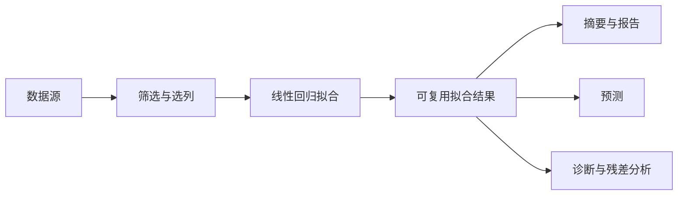

# SCI 节点整理与实施计划

> Status: Planned
> Scope: 355 项方法清单的规范化、现有节点整理、分类与参数及报告体验、分批实施和验收
> Canonical owners: 本文拥有 SCI 节点整理计划；实现事实属于源码，当前系统边界见 ../architecture/GRAPH_AND_EXECUTION.md
> Update when: 方法范围、整理规则、批次依赖、节点体验方案或验收状态改变时

本轮优先解决整体梳理和使用体验：明确现有能力的保留、重构与新增顺序，统一分类、命名、参数配置和报告展示。

推进顺序为：**核实现状 → 规范化方法清单 → 用 OLS 完成统一体验 → 按方法族扩展**。首个开发目标是一条完整、可复用、可验收的分析流程。

## 1. 文档入口与范围

- [节点组件与图操作 API 重构要求](NODE_REFACTOR_REQUIREMENTS.md)：PORTS/KERNEL/PARAMETERS/DATA/OPERATORS 的独立组件、节点装配、七类基础语义与 DataSeries/DataFrame 两类复合类型、Identifier 的统计输入限制、展示分离、直接端口操作及 commit/undo/redo 的实施与验收依据。
- [方法对照表](METHOD_INVENTORY.csv)：保留全部 355 项原始记录，逐项给出候选方法 ID、产品形态、实现映射、整理动作、批次和范围问题。
- [内置节点台账](NODE_INVENTORY.csv)：按节点定义列出执行实现标识、注册状态、算法证据及与方法清单的关系，包含清单未单列的基础设施节点。
- [线性回归规格](OLS_SPEC.md)：节点端口、参数、模型复用、点预测、报告、当前契约和验收要求。
- [OLS 人工构造样例](OLS_SAMPLE.csv)：首批实现与人工验收使用的小样本，参考值及构造理由见 OLS 规格。
- [2026-09-16 源码核对记录](2026-09-16-node-audit.md)：原始清单统计、统计节点注册情况、已确认差距与核对边界。
- [节点定义、注册与目录](../../src-tauri/crates/yss-node-catalog/README.md)：现有目录的职责及装配入口。
- [Graph 与 Execution](../architecture/GRAPH_AND_EXECUTION.md)：图解析、执行、结果存储及生命周期的当前契约。
- [SCI 算法](../../src-tauri/crates/yss-sci/README.md)、[SCI Runtime](../../src-tauri/crates/yss-sci-runtime/README.md)：复用算法与接入运行入口时的边界。
- [变更流程](../development/CHANGE_PROCESS.md)、[验证工作流](../development/LOCAL_WORKFLOW.md)：实际开发与交付要求。

本目录维护在 `docs/sci/`，由[文档总索引](../README.md)提供入口。方案中的目标形态和批次均为待实施工作；源码核对记录是带日期的快照，不能替代后续运行验收。

原始输入保存为 [YssBI_Method_Registry_355项.xlsx](YssBI_Method_Registry_355项.xlsx)，来源为用户提供的同名桌面文件；内容哈希与首轮核对记录一致。原表保留需求编号和来源，CSV 维护本轮派生的规划与核对信息。

准备批已完成 355 项初步映射、127 个内置节点的静态盘点和 线性回归规格。方法表有 63 项附已核对代码证据，另有仅定位相关目录定义的条目；其余“未定位”保留进一步核对的空间。122 项记录了名称、适用范围或产品形态问题。表中 352 个不同候选方法 ID 来自三组建议共享入口：33/34、44/47、124/332；这不是最终方法数量或实现覆盖率。

节点台账包含 25 个已绑定执行实现的叶节点、98 个未注册实现的叶节点、3 个函数结构节点和 1 个透明重路由节点。内置 kernel 表共有 26 项，其中同名的 reroute kernel 不属于透明节点的执行绑定；按名称直接匹配会多算一个可执行叶节点。上述数量均为 2026-09-16 的静态核对快照；该次审计没有修改节点实现或开展运行/UI 验收；线性回归后续实现状态见下文。

准备批后的通用节点与编辑接口重构遵循 [NODE_REFACTOR_REQUIREMENTS.md](NODE_REFACTOR_REQUIREMENTS.md)，OLS 的模型行为继续由 [OLS_SPEC.md](OLS_SPEC.md) 细化。先落实组件独立定义、装配与系统消费，再贯通图编辑和 OLS 首批流程；其他方法的范围问题按对应批次继续细化。

内核基础已迁移到 [yss-node-kernel](../../src-tauri/crates/yss-node-kernel/README.md)：调用契约、运行值、注册表及已有执行适配由该 crate 拥有，Execution 保留调度和结果生命周期。OLS/WLS/GLS 已统一为线性回归，Fit/Summary/Predict 执行已接通；上述数量保留为原始审计快照，当前线性回归状态见规格与节点台账。

## 2. 第一项工作：建立现有能力对照表

### 2.1 对照表字段

每个原始条目都应可以追溯。一个方法可以对应多个节点，多个原始条目也可以对应同一方法；算法、参数、指标和工作流模板分别记录其产品形态。

CSV 使用 UTF-8 BOM，方便 Excel 识别中文；多值单元格使用分号。代码证据采用仓库相对路径及可选行号，行号仅对应记录中的源码基线。表格是规划与核对记录，不参与运行注册。

实现文件迁移后，相应证据链接更新到新所有者并去掉失效行号；`source_revision` 的 `working-tree@<提交>` 表示基于该提交的当前未提交工作树。没有前缀的记录仍保留原核对基线。

`method_id` 全部为本轮候选语义 ID。对含义尚未明确的条目，必须同时阅读 `mapping_status`、`clarifications` 和 `notes`，不能因为已有 ID 就跳过范围确认。`merge_with_ids` 既记录建议同入口，也记录预设/方法族关联，是否合并以对应说明为准。

| 字段组     | 建议字段                                                | 填写规则                                     |
| ---------- | ------------------------------------------------------- | -------------------------------------------- |
| 原始来源   | 原编号、原分类、原名称、原优先级                        | 保留原表信息，不因改名或合并丢失需求         |
| 规范定义   | `method_id`、标准名称、别名、方法族、角色               | ID 独立于中文显示名；语义不明确时先标待澄清  |
| 产品形态   | 独立节点、参数/预设、结果指标、工作流模板、其他功能入口 | 先定义职责，再决定节点数量                   |
| 实现映射   | 节点 ID 列表、算法位置、执行入口、运行提供者            | 链接实际代码；尚未找到实现时保留未知         |
| 算法状态   | 未核对、缺失、部分实现、实现存在、已验证                | 有函数或文件只能证明实现存在                 |
| 节点状态   | 无定义、仅定义、已注册、已运行验证                      | 已注册不等于已完成图执行验证                 |
| 参数状态   | 未核对、需调整、已贯通                                  | 核对默认值、校验以及传入算法后的实际效果     |
| 报告与体验 | 未核对、需调整、已人工验收                              | 检查分类、命名、配置、结果展示及完整操作流程 |
| 整理动作   | 保留、改名/合并、补接、重构、新增                       | 可以组合，如“补接 + 参数重构”                |
| 计划与证据 | 前置依赖、交付批次、核对日期、版本、验收证据            | 未执行的检查不能填写通过                     |

状态分列维护，不使用一个“已完成”掩盖不同层面的缺口。汇报进度时分别统计方法覆盖、节点执行和验收结果，不直接用节点数除以原表条目数。

### 2.2 已交付 CSV 的字段与判读

| 方法表列                                                                    | 含义                                                                                  |
| --------------------------------------------------------------------------- | ------------------------------------------------------------------------------------- |
| `original_id/category/name/role/subtype/node_suggestion/priority`           | 实际列名均以 `original_` 开头，逐字段保留原表的七列值                                 |
| `method_id`、`standard_name`、`aliases`、`category`、`role`、`product_form` | 候选标准定义及产品形态；原分类与原角色不会被覆盖                                      |
| `mapping_status`、`merge_with_ids`                                          | 映射成熟度、重复或范围关联                                                            |
| `node_ids`                                                                  | 当前能直接对应或部分承载条目范围的节点；仍须阅读备注中的范围限制                      |
| `related_node_ids`                                                          | 可复用的上下游或相关节点，不作为该方法已实现的证明                                    |
| `algorithm_status`、`algorithm_evidence`                                    | 区分实际算法、部分能力、前端计算、类型/目录定义与本轮未定位；证据可以包含多个代码位置 |
| `node_status`、`kernel_ids`、`execution_status`                             | 区分定义、当前已注册 kernel 和没有独立节点但已有报告/IPC 入口的情况                   |
| `parameter_status`、`report_status`、`ui_acceptance`                        | 参数贯通、结果展示和人工验收分别记录；本轮人工验收均为“未执行”                        |
| `action`、`batch`、`dependencies`、`next_step`                              | 后续整理动作、交付批次、前置条件及条目级下一步                                        |
| `clarifications`、`notes`、`review_date`、`source_revision`                 | 范围问题、不能泛化的限制和证据基线                                                    |

“未定位（本轮检索）”表示在宿主 SCI、Runtime、目录/执行及相关数据画像、图表和前端统计模块的本轮检索中未找到直接实现，不能作为穷尽全部历史、插件或外部库的缺失证明。它也不会自动变成确定的新增工作量。

节点台账以 `node_id` 为主键，`method_ids` 是原表编号的反向关联，包含直接及相关映射。判断执行能力应先区分 leaf/structural/transparent，再使用 `kernel_id`，例如 `yssbi.logic.greater` 对应 `yssbi.compare.greater`；直接按节点 ID 与 kernel 名单比较会误算。三个函数结构节点按结构语义单独记录，当前函数执行链未接入；透明重路由由解析展开，不生成执行操作。

两张表的更新顺序是：修改对应条目/节点的状态与证据 → 同步正反向关联 → 更新批次及实际验收记录。保留原始七列、候选合并关系和未执行项，避免仅修改总计。新增或拆分规范方法时可共享原编号来源，但不要删除原始需求记录。

### 2.3 整理动作的判定

| 动作      | 判定依据                                   | 完成条件                                     |
| --------- | ------------------------------------------ | -------------------------------------------- |
| 保留      | 责任清楚，实现和体验满足本批要求           | 保留实现并记录有效验收证据                   |
| 改名/合并 | 名称重复、范围重叠或名称与实际行为不一致   | 明确唯一方法入口，保留来源和搜索别名         |
| 补接      | 已有算法或结果能力，但当前节点执行链未贯通 | 参数、执行、结果读取和图操作验证通过         |
| 重构      | 现有端口、参数、结果或交互与目标责任冲突   | 明确行为变化及受影响消费者，并按约定验收     |
| 新增      | 确认缺少所需能力                           | 连同输入契约、算法、节点、报告和示例一起交付 |

应优先核对现有目录与可复用实现，再扩展到原表中的其他条目。节点改名、端口变化或合并时，分别评估保存图、示例、结果消费者和自动化调用的影响，明确需要更新的对象。

## 3. 第二项工作：规范化方法及产品形态

以下为需要在对照表中确认的典型条目，合并建议不直接替代方法定义。

| 原表编号与条目                                           | 待确认问题                           | 建议落点                                 |
| -------------------------------------------------------- | ------------------------------------ | ---------------------------------------- |
| 33 线性回归、34 OLS 回归                                 | 两个入口的估计方法和适用范围是否相同 | 范围一致时合并入口，保留别名             |
| 44 二元 Logit、47 Logistic 回归                          | 是否均指同一二元模型                 | 同一能力采用统一名称和搜索别名           |
| 35 Robust 回归、304 Cluster-Robust 标准误                | 前者指稳健估计还是标准误选项         | 分开定义估计方法与推断配置               |
| 102 面板模型、299 FE、300 RE、302 第一差分、303 组间估计 | 方法族入口与具体估计方法如何对应     | 按实际输入、参数和输出差异确定节点或预设 |
| 279 AIC、280 BIC                                         | 是否需要独立节点才能满足使用场景     | 优先作为模型结果和比较能力               |
| 59 分组回归、60 基准回归                                 | 是独立算法还是分析组织方式           | 评估工作流模板                           |
| 253 Bootstrap、254 Jackknife                             | 重复抽样与被调用方法的边界是什么     | 先定义复用方式、随机种子和运行需求       |
| 240 AI 分析报告、241 文本分析模块                        | 输入、产物及具体能力尚需展开         | 单独定义功能范围和调用流程               |

原表的六类角色作为方法职责标签使用。先按实际职责复核，尤其是模型估计、统计量计算、分析设计和报告生成之间的区别。

运行定义继续由现有 Rust 节点协议、注册表、目录和执行入口拥有。对照表用于规划和追踪；如需新增方法元数据，优先扩展已有责任所有者，避免再维护一套与节点定义重复的运行注册表。图编辑与自动化调用应复用同一套方法定义和执行能力。

## 4. 第三项工作：统一用户体验

### 4.1 分类、搜索与可用性

- 主分类按统计领域组织，如数据处理、描述统计、假设检验、回归、面板与时间序列。
- 拟合、检验、诊断、估计后分析、变换、可视化作为角色标签或筛选条件。
- 搜索统一支持中文名、英文名、常用缩写和别名，别名指向同一能力入口。
- 创建前提供用途、输入要求、主要输出、示例和可用状态。默认呈现已接入能力，规划中的定义保留在明确的入口中。
- 运行可用性由后端已安装能力投影，不在前端或人工表格中维护第二份执行开关。

### 4.2 命名与节点边界

- “拟合”表示接收数据和配置，执行估计并产生可复用结果。
- “摘要/报告”表示读取已有结果并展示；保留直接拟合的快捷入口时，应明确命名为“拟合并查看报告”。
- “预测”表示消费已拟合模型和预测输入；明确变量要求及输出含义。
- “诊断/检验”说明所需数据或模型类型，不要求用户猜测支持范围。
- 可以组合已有节点形成快捷模板。诊断、预测和报告均复用同一次拟合结果。

上述是目标语义。当前 线性回归拟合与汇总的差异见核对记录；端口和结果契约调整应作为明确的行为变更处理。

### 4.3 参数配置

复用现有[参数配置面板](../../src/modules/details/internal/ui/node/NodeConfigurationPanel.tsx)及后端配置声明，逐个方法确认：

- 变量角色采用清楚的名称，例如因变量、解释变量、权重、实体、时间。
- 默认值、必填项、允许类型和取值范围统一表达；基础参数优先显示，高级参数按需要展开。
- 条件参数只在适用时出现，输入错误应能定位到相关字段或端口。
- 每个可编辑参数都能传到算法，并在结果中保留本次实际使用的配置。
- 数据行对齐、缺失值处理和样本剔除策略明确；报告可解释本次使用的样本范围。

### 4.4 报告与结果

以现有 [线性回归报告章节配置](../../src/shared/types/domain/linearRegressionReportSpec.ts)作为首个样板，复用已有结果查询和存储机制。

报告可按模型概览、配置与样本信息、参数表、诊断、图形和观测数据组织。不同模型只展示有统计含义的字段，例如二元模型保留自身的拟合指标。

布局配置只控制展示。统计值、结果引用、分页查询、结果租约和过期判断继续遵循现有 Results 契约；布局重排或隐藏章节不应触发重复拟合，也不应把其他结果的数据混入当前报告。

## 5. 首批开发：线性回归完整流程

具体端口、模型结果及下游复用契约已在 [OLS_SPEC.md](OLS_SPEC.md) 中定义，目标流程如下：

| 工作项         | 本批交付结果                                                                               |
| -------------- | ------------------------------------------------------------------------------------------ |
| 现状盘点       | 明确本链路各节点的定义、执行、参数和报告状态                                               |
| 端口及结果语义 | 明确拟合与报告的关系、下游消费方式及受影响的已有图                                         |
| 目录整理       | 统一名称、别名、用途说明和可用性展示                                                       |
| 参数贯通       | 验证变量选择、截距、协方差等本批支持选项的实际效果                                         |
| 下游能力       | 接通线性预测，并明确本批支持的诊断集合；优先复用已有残差、ACF/PACF、序列相关和假设检验入口 |
| 报告整理       | 按共同章节组织结果，保留真实计算和按需读取                                                 |
| 示例与验收     | 提供可重复运行的示例图、输入数据说明和验收记录                                             |

首批采用规格中约定的原生线性回归结果及现有 ResultStore，补充实际消费的配置和变量元数据；后续模型按真实差异扩展。

## 6. 实施批次与依赖

原表 P0/P1/P2 保留为需求优先级；实际开发批次按依赖和完整使用场景排序，不把全部 P0 视为一次交付。

方法表中的 B1/B2/B3/B4/B5 分别对应第一批、第二批、第三批、第四批和后续批。多批次条目以分号分隔并在备注限定范围；例如 ACF/PACF 的 OLS 残差场景属于 B1，一般序列入口属于 B4。

| 批次   | 范围                                   | 开始条件                             | 交付标准                                   |
| ------ | -------------------------------------- | ------------------------------------ | ------------------------------------------ |
| 准备批 | 能力对照表、名称与分类规则、OLS 规格   | 当前文档已整理                       | 原条目可追溯，首批实现范围与验收方式明确   |
| 第一批 | 数据处理基础与 线性回归完整流程        | OLS 规格明确                         | 示例图可运行，配置和结果一致，人工验收完成 |
| 第二批 | Logit、Probit                          | 第一批结果与体验规范可复用           | 权重、二元模型配置及报告差异得到验证       |
| 第三批 | 描述统计、常用检验、相关分析、基础绘图 | 数据输入和通用结果能力明确           | 形成基础探索与检验流程                     |
| 第四批 | 面板、工具变量、时间序列               | 相关模型的输入、参数和结果契约已核对 | 逐个方法族贯通现有算法和节点执行           |
| 后续批 | 生存、混合模型、Meta、空间统计等       | 需求范围、算法来源和依赖明确         | 按领域交付独立的完整分析场景               |

每一批都同时推进必要的整理与能力接入。已确认的正确性阻断问题应纳入使用它的方法批次；数值策略后续工作继续由 [TODO](../../TODO.md)及其链接的专项分析维护。

## 7. 验收方式

UI 按仓库要求人工验收，不新增 UI 单元测试。算法、图执行和跨模块契约按实际修改范围复用或补充有明确回归风险的后端验证；具体命令从[验证工作流](../development/LOCAL_WORKFLOW.md)选择。

| 验收路径       | 预期行为                                                       |
| -------------- | -------------------------------------------------------------- |
| 搜索与创建     | 中文名、缩写和别名能找到预期入口；创建前能识别可用性           |
| 配置与连线     | 类型、必填项和变量角色清楚；配置变更反映在实际结果中           |
| 执行与下游复用 | 同一模型结果可供报告、预测和诊断消费；只调整报告布局不重复拟合 |
| 错误处理       | 缺少输入、不合法配置和运行失败有明确反馈及定位                 |
| 图操作         | 修改、撤销、重做、显式保存和重开保持预期内容；执行不隐式保存   |
| 结果生命周期   | 重跑、结果回收及会话变化后的读取符合现有 Results 契约          |
| 报告读取       | 表格分页、图形、章节显示和布局调整对应同一真实结果             |
| 数值验证       | 使用约定输入与有来源的参考结果，记录配置、容差和适用范围       |

验收记录至少包含版本或提交、数据与示例图、操作步骤、实际结果、通过项、失败项和未执行项。历史测试记录、注册成功和静态源码检查均不能替代本次运行结果。

## 8. 接下来可以直接执行的任务

- [x] 建立覆盖全部原始条目的初步方法与产品形态对照表，保留范围问题。
- [x] 完成现有内置节点的首轮静态盘点，记录实现/注册证据及未核对项。
- [x] 确定首批目录、名称、参数与报告规范，完成 线性回归端口、结果与当前契约。
- [ ] 按通用节点重构要求落实独立组件、装配与复用，拆分节点级展示信息，贯通直接操作 API、候选编辑及 commit/undo/redo。
- [ ] 落实 OLS 示例流程，按受影响范围验证并完成 UI 人工验收。
- [ ] 用 Logit、Probit 检查规范的复用能力，再逐批扩展。
