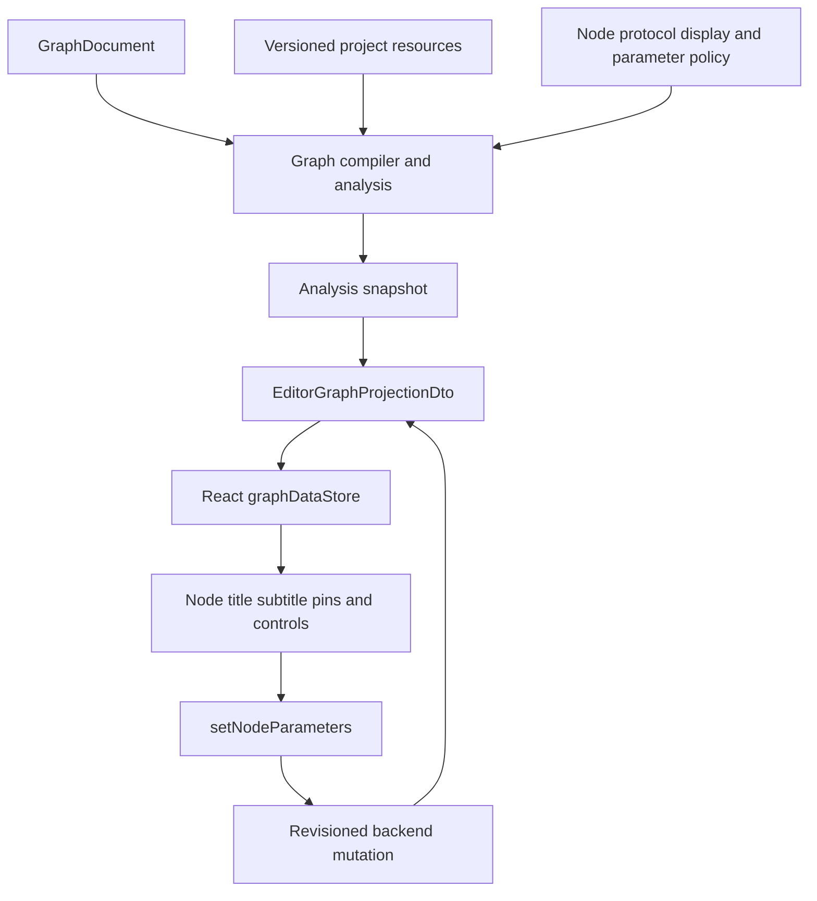

# Node Instance Metadata and Inline Constants Design

## Summary

YssBI currently projects static protocol titles for resource-bound node instances, loses some dynamic DataFrame column labels and types before they reach the editor, and exposes constant values only through the detail parameter editor. This design makes Rust authoritative for instance-specific display metadata, completes schema-derived DataFrame pin projection, and adds protocol-driven inline constant editing without creating a second source of graph state.

The work covers all resource-bound built-in nodes. Database source, variable get/set, and function call nodes are the required regression cases, but the implementation must use common protocol and projection mechanisms rather than `NodeTypeId`-specific frontend overrides.

## Decisions

- Resource-bound nodes use the authoritative resource name as their primary title.
- A user-defined node label remains visible as a subtitle and never replaces the resource title.
- Resource display behavior is declared by the node protocol and resolved by Rust.
- `Decompose DataFrame` automatically projects every column in final schema order.
- Dynamic column pins use column names and accurately mapped schema scalar types.
- Unsupported column types remain visible as `Any` pins and produce a structured diagnostic.
- Removed or identity-changed columns preserve connected or materialized pins as orphans with their last known name and type.
- Constant nodes provide compact inline controls and retain the existing detail-panel editor.
- Boolean constants submit immediately. Numeric and string constants submit on Enter or blur. Escape cancels the draft.
- Existing backend parameter mutation, validation, publication, and projection flows remain authoritative.

## Goals

1. Give every resource-identity node an accurate, revision-aware instance title.
2. Keep title calculation out of React and avoid parsing opaque resource paths.
3. Project every DataFrame decomposition column with the correct label, order, type, and stable identity.
4. Preserve useful orphan metadata when schemas evolve.
5. Make constants fast to edit on the canvas while retaining backend validation and detail editing.
6. Audit all built-in resource-bound nodes and prevent equivalent projection regressions.

## Non-goals

- Redesigning the node catalog, graph document, or compiler pipeline.
- Deriving display names from resource paths, UUIDs, filenames, or frontend stores.
- Automatically migrating orphan pins to similarly named, positioned, or typed columns.
- Adding inline editing to arbitrary node parameters.
- Making React authoritative for pending or committed parameter values.
- Adding DataFrame column folding or virtualization in this slice.

## Architecture

Rust remains authoritative for node protocols, resource resolution, graph state, dynamic interfaces, types, diagnostics, and editor projection. React consumes purpose-specific projection DTOs and sends mutations through existing application services.



No frontend component may associate a resource parameter with a database, variable, or function store to compute display metadata. Resource paths remain opaque.

## Resource-bound Node Titles

### Protocol declaration

The node protocol gains an explicit instance display policy. The conceptual model is:

```rust
enum NodeInstanceDisplay {
    Static,
    ResourceParameter {
        parameter: ParameterKey,
        kind: ResourceKind,
    },
}
```

The final representation may follow existing protocol naming and validation patterns, but it must preserve these semantics:

- `Static` uses the localized protocol catalog title.
- `ResourceParameter` identifies exactly one parameter and its resource kind as the source of instance identity.
- Protocol validation rejects a missing parameter, a non-resource parameter, or a resource kind incompatible with that parameter.
- A resource parameter used only for execution does not automatically become a title source.

This avoids treating every `ParameterEditorSpec::Resource` as instance identity and avoids branches based on `NodeTypeId`.

### Resource metadata

Analysis resource resolution must expose enough versioned metadata to obtain the display name alongside semantic data:

- Function resources expose the authoritative function resource name and function document/graph.
- Variable resources expose `VariableInstance` and its authoritative name.
- Database resources expose the authoritative database name and schema columns.

If the current resolver return type contains only semantic data, extend the resolved value rather than querying an unrelated project index while constructing the DTO. Every display read must remain represented in `AnalysisResourceReads`, observations, and compilation basis.

### Projection rules

For each node:

1. Resolve the protocol-localized static title.
2. If the protocol declares `ResourceParameter`, read the normalized parameter and resolve that resource from the same analysis resource snapshot.
3. If the resource exists and has a non-empty valid name, set `NodeDisplayDto.title` to that exact resource name.
4. If resolution fails or the name is invalid, retain the localized static title.
5. Preserve `DocumentNode.user_label` independently in `NodeDisplayDto.user_label`.
6. Preserve or emit the structured resource resolution diagnostic; title fallback must not hide the failure.
7. Never infer a title from a path or stale cached name.

The required primary-title examples are:

- DataFrame database source: database name.
- Variable get and set: variable name.
- Function call: function name.

The operation type remains discoverable through icon, style, description, detail view, and tooltip. It is not prefixed to the title.

### Rename and invalidation

A resource rename changes its revision. That revision invalidates affected analysis products, triggers a new editor projection, and atomically updates the frontend title. React does not subscribe to a separate resource store to patch the node title.

## DataFrame Decompose Dynamic Pins

### Complete automatic projection

`yssbi.dataframe.decompose` resolves the final upstream DataFrame schema and emits one output pin per current schema field:

- Every current field appears automatically.
- Pin order exactly follows schema field order.
- The pin label is the schema field label.
- Pin identity is `DynamicMemberLocator::SchemaField`, including stable source and field identity.
- No user action or connection is required to expose a current field.

The compiler may keep unconnected current fields as projection-only members. It materializes persistent graph bindings only when existing document semantics require stable persistence, such as a connection or an orphaned prior binding. Schema refresh alone must not generate noisy graph mutations.

### Label propagation

The authoritative label flow is:

```text
SchemaField label
  -> dynamic interface member metadata
  -> resolved port metadata
  -> PortDisplayDto.instance_label
  -> frontend pin name
```

The localized template label is only a fallback when no instance metadata exists. React retains its current generic selection rule:

```ts
port.display.instanceLabel ?? port.display.label
```

React does not read schemas or decode dynamic addresses to derive labels.

### Type propagation

A centralized Rust mapping converts every supported `RelationalScalarType` to the appropriate concrete node-system type and projected structured `DataType`. It must cover all scalar variants currently supported by the schema and type systems, including at least:

- Boolean
- Int64
- Float64
- String
- Date
- Datetime

The implementation must audit the complete enum rather than relying only on this minimum list. Known scalar variants may not silently become `Any`.

The authoritative type flow is:

```text
SchemaField.scalar_type
  -> dynamic member concrete TypeExpr
  -> resolved port type
  -> compiler partial/resolved type facts
  -> ResolvedPortDto.resolved_type.data_type
  -> frontend pin compatibility and visuals
```

For a genuinely unsupported or unrepresentable schema type:

- Keep the column pin.
- Give it an explicit `Any` resolved type.
- Emit a structured column-level diagnostic.
- Include the column name, original schema type, and degradation reason in diagnostic arguments.

This makes `Any` an observable fallback, not a silent symptom of missing propagation.

### Orphan behavior

When a previously materialized or connected field disappears or its stable locator changes:

- Preserve the old pin as an orphan.
- Preserve all existing connections.
- Preserve the last known field label.
- Preserve the last known resolved type.
- Do not automatically reconnect or migrate it.
- Project the new or renamed field independently when stable identity does not match.

`LastKnownPortMetadata` therefore needs enough structured metadata to project both the last known name and type. The stored representation must use the existing serializable type vocabulary rather than display-only text.

For field rename behavior:

- If stable lineage identity is preserved, keep the pin identity and update its label.
- If lineage identity changes or is unavailable in a way that changes the locator, orphan the old pin and expose a new pin.
- Equal labels with different locators remain distinct pins.
- Duplicate locators remain a deterministic resolver error.

If the entire schema is unavailable, preserve relevant existing materialized pins as orphans and report the schema failure.

## Inline Constant Editing

### One authoritative value

Constant nodes continue to store their value only in the existing `value` node parameter. Inline controls and the detail panel edit the same projected parameter and call the same mutation path. No inline-only graph field is introduced.

### Protocol presentation policy

Parameter presentation becomes explicit and protocol-driven. Conceptually:

```rust
enum ParameterPresentation {
    DetailPanel,
    InlineAndDetail,
}
```

The final shape may be a field on `ParameterSpec` or another focused protocol structure, provided that:

- The default preserves current detail-only behavior.
- Constant `value` parameters declare `InlineAndDetail`.
- `ParameterEditorDto` carries the presentation policy.
- React never detects constants by `NodeTypeId`, category, or the key string `value`.

Constant editor kinds are explicit:

- Boolean: `Toggle`
- Int64: `Number` with integer validation
- Float64: `Number`
- String: single-line `Text`

The detail panel remains available for these parameters.

### Frontend controls

Node rendering shows compact shadcn/ui controls between the title area and pins for projected `InlineAndDetail` parameters:

- Boolean uses a compact switch.
- Int64 and Float64 use numeric inputs.
- String uses a single-line text input.

The control is initialized from the latest Rust projection. A local draft exists only for an active edit and does not become graph authority.

### Commit behavior

- Boolean submits immediately on toggle.
- Numeric and string inputs submit on Enter or blur.
- Escape discards the draft and restores the latest projected value.
- An empty or syntactically invalid numeric draft does not submit.
- Basic parsing errors use inline feedback or the shared toast system; browser dialogs are prohibited.
- Backend validation remains authoritative for constraints and nominal values.
- Mutation failure restores the latest projected value and reports the error through the shared toast system.
- Successful completion is acknowledged by the normal backend event and refreshed editor projection.

Pending edits must integrate with the existing mutation coordinator and echo suppression. A concurrent newer projection wins according to existing revision semantics; the component must not overwrite it with stale local state.

### Canvas interaction

Pointer and keyboard events originating in inline controls must not trigger node dragging, box selection, connection gestures, deletion shortcuts, or unrelated canvas commands.

- Enter commits only the active text/number control.
- Escape first cancels the active control edit.
- Pointer interaction with a control does not initiate node drag.
- Inputs remain within established node width constraints.
- Long strings scroll inside the input rather than widening the node.

All global listeners continue to obey the shared global event utility rule.

## Resource-bound Node Audit

Audit every built-in protocol with resource parameters and classify it explicitly:

1. Resource defines node instance identity: declare `ResourceParameter` display policy.
2. Resource is operational configuration only: retain `Static` display policy.

At minimum, the audit covers function, variable, and database resource node families. Tests must make the classification explicit so future resource-bound nodes cannot accidentally inherit or omit title behavior.

The same audit checks:

- Resource parameter normalization and validation.
- Resource revision tracking.
- Missing-resource diagnostics and fallback titles.
- Managed function entry/return behavior, where graph-owned identity may differ from ordinary resource-bound instances.
- Catalog titles versus instantiated editor titles.

Catalog resource items may continue to use resource names in the palette. This design concerns instantiated graph node projection and does not merge catalog and editor projection responsibilities.

## Error Handling

### Resource display errors

- Do not block editor projection solely because a display name cannot be resolved.
- Fall back to the localized protocol title.
- Preserve the user subtitle.
- Preserve or emit a structured resource diagnostic.
- Never synthesize a name from an opaque path.

### Dynamic interface errors

- Missing schema: keep eligible existing ports as orphans and diagnose the schema failure.
- Unsupported scalar type: keep the current pin as `Any` and emit a column-level diagnostic.
- Duplicate stable locator: reject ambiguous materialization deterministically.
- Duplicate labels with distinct locators: allow both pins.

### Constant mutation errors

- Do not mutate Zustand graph entities directly.
- Do not publish local drafts as committed values.
- Restore the latest projected value after rejection.
- Surface ordinary errors through the shared bottom-right toast system.

## Testing Strategy

Behavior changes are implemented with focused failing regression tests first.

### Rust tests

Resource title projection:

- Database source title is the database name.
- Variable get and set titles are the variable name.
- Function call title is the function name.
- User label remains a separate subtitle.
- Resource rename produces a new title in a new projection.
- Missing resource falls back to localized protocol title and retains a diagnostic.
- An operational-only resource parameter does not override the static title.
- Protocol validation rejects invalid instance display declarations.

DataFrame decomposition:

- Every schema field is automatically projected.
- Labels and order exactly match schema fields.
- Every supported relational scalar type maps to the expected structured node data type.
- Known supported types never degrade to `Any`.
- Unsupported types degrade to `Any` with the required structured diagnostic.
- Field removal preserves last known label, type, and connections on the orphan.
- Stable-lineage rename retains pin identity and changes the label.
- Changed lineage creates a new pin and orphans the old one.
- Equal labels with distinct locators remain distinct.
- Duplicate locators fail deterministically.

Constant protocols and mutation:

- Each constant kind projects the expected editor kind.
- Each constant `value` parameter projects `InlineAndDetail`.
- Detail-panel editing remains available.
- Parameter mutations continue through existing validation, compilation, and publication flows.

### React tests

- Node primary title uses the Rust-projected resource name.
- User label renders as a subtitle and does not replace the primary title.
- Pins use `instanceLabel` and structured `resolvedType.dataType` without frontend schema parsing.
- Inline controls render only from projected presentation policy.
- Boolean toggles submit immediately.
- Numeric and string edits submit on Enter and blur.
- Escape restores the latest projected value.
- Invalid numeric drafts do not submit.
- Failed mutations restore projected state and report an error.
- Control interaction does not start dragging or trigger canvas shortcuts.
- Detail-panel editing remains functional for inline parameters.

### Verification

Run focused tests first, then project-required checks:

```text
pnpm rust:check
focused Rust tests for projection, dynamic DataFrame interfaces, and constants
pnpm typecheck
focused Vitest tests for graph projection and inline controls
git diff --check
pnpm verify
```

The full `pnpm verify` is required before delivery because the implementation spans Rust and React.

## Acceptance Criteria

- All resource-identity built-in nodes use authoritative resource names as editor titles.
- User labels render independently as subtitles.
- Resource rename updates titles through a revisioned backend projection.
- React contains no resource-path parsing or resource-store title joins.
- Decompose DataFrame displays every current column in schema order.
- Dynamic column pin names equal column names.
- Supported column scalar types project accurately and do not appear as `Any`.
- Unsupported scalar types remain visible as `Any` and produce a structured diagnostic.
- Orphan pins preserve last known name, type, and connections.
- Boolean, Int64, Float64, and String constants can be edited inline and in the detail panel.
- Inline submissions follow the approved immediate/Enter/blur/Escape behavior.
- All writes continue through backend-authoritative parameter mutation and projection flows.
- Focused regression suites and `pnpm verify` pass before implementation delivery.
