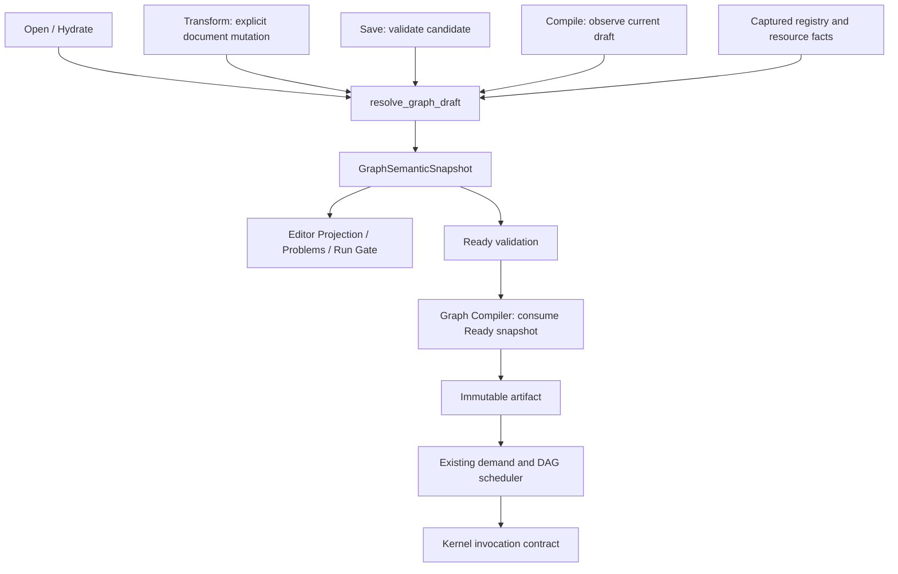

# Graph Compile / Execute 准备计划

> Status: Planned
> Progress: 本轮准备项已实现；真实 Function 子计划和 Workflow/tool 输出 adapter 保留为后续接入
> Scope: 重写 Graph Compiler 与 Execute kernel 调用前的契约准备、实施顺序和验收；合并 Problems、Logs、Run Output 的相关工作
> Canonical owners: 本文拥有本轮计划及验收进度；当前行为由代码、测试及 `docs/architecture/GRAPH_AND_EXECUTION.md`、`docs/architecture/RUNTIME_SIGNALS.md` 定义
> Update when: 准备项实现、契约定稿、准入条件改变或后续工作开始时

核对基线为本地 `f88c7d74` 及上一轮工作区中的文档修正、局部重命名。本文件保留实施基线并跟踪完成情况；`TODO.md` 只保留其他开放事项。P0–P6 准备、Logs continuity 与定位交互已实现；真实 Function bundle/subplan execution 和 Workflow/tool 生产 adapter 仍按下文条件保留为后续接入，不冒充已完成。

## 1. 实施基线与审查修正（f88c7d74）

下表和紧随其后的流程记录实施前的事实，用于修正两份旧审查中的过时判断。完成后的架构以 [Graph and Execution](docs/architecture/GRAPH_AND_EXECUTION.md) 为准。

| 审查主题                                | 当前代码事实                                                                                                                                                                                                                                                 | 本轮处理方向                                                           |
| --------------------------------------- | ------------------------------------------------------------------------------------------------------------------------------------------------------------------------------------------------------------------------------------------------------------ | ---------------------------------------------------------------------- |
| Compiler 和 Projection 使用不同语义结果 | [Runtime `compile_draft`](src-tauri/crates/yss-graph-runtime/src/lib.rs) 在 cache miss 时先 `analyze_neutral`，再将同一 snapshot 传给 Compiler；[Application](src-tauri/crates/yss-application/src/graph_compile.rs) 从返回 analysis 本地化并投影            | 保留已完成的共享语义结果，统一各操作入口                               |
| Compiler 重新枚举 protocol/template     | [input/output contracts](src-tauri/crates/yss-graph-compiler/src/compiler.rs) 已从 `semantics.nodes().ports` 读取 concrete ports；仍从 document 读取连接、literal 和参数                                                                                     | 不按旧 synthetic declared pin 问题重写；收敛最终输入绑定和顺序的 owner |
| 缺少节点级类型求解                      | [TypeState](src-tauri/crates/yss-graph-protocol/src/typing.rs) 已有 Exact/Constrained/Unknown/Conflict；[type resolver](src-tauri/crates/yss-graph-analysis/src/type_resolution.rs) 已有 NumericFold、Identity、ParameterOutput、generic binding 和 coercion | 复用 Add/Reroute/Convert 规则，验证完整链路及未覆盖失败场景            |
| Analysis diagnostics 为空               | [主 Analysis](src-tauri/crates/yss-graph-analysis/src/lib.rs) 已生成 unbound、resource、port、parameter、cycle 和类型诊断                                                                                                                                    | 补齐 connection/input 与 nominal parameter 覆盖，修正文案和 blocking   |
| 所有入口 materialization 一致           | [Open](src-tauri/crates/yss-application/src/graph_open.rs) 和 Compile 先 materialize；[Transform/Save](src-tauri/crates/yss-application/src/resource_mutation.rs) 的 projection helper 直接 analyze，Save 在持久化前后各构建一次 projection                  | 建立统一 Resolve 和 candidate 采用规则                                 |
| Derived 只在使用时写入                  | [derived materialization](src-tauri/crates/yss-graph-analysis/src/derived_ports.rs) 目前把所有发现的成员写入 candidate，已有稳定 locator 和引用消失后的 orphan 处理                                                                                          | 改为 projection 展示、首次使用时原子 claim                             |
| Pin append 顺序可靠                     | [add port instance](src-tauri/crates/yss-graph-editor/src/mutation.rs) 无 order 时使用随机 UUID 文本；member group 已共享 instance ID/order                                                                                                                  | 保留组身份，统一 placement/order 分配                                  |
| Type/Schema/Lineage 已是一次节点求值    | 最终 snapshot 集中持有事实，但 [schema resolver](src-tauri/crates/yss-graph-analysis/src/schema_resolution.rs) 仍先独立递归求解，使用 Option/空集合；type cache 复用内容主要是 output states/coercions                                                       | 区分事实状态，收敛节点求值与 cache 有效性                              |
| `kind` 直接等于 node type               | [GraphOperation](src-tauri/crates/yss-graph-compiler/src/package.rs) 的 `kind()` 已返回 `specialization.implementation`，resolver 已读取 registry implementation identity                                                                                    | 固定 KernelId 命名与调用契约，保留现有 specialization                  |
| 精确依赖和 artifact identity            | [catalog fingerprint](src-tauri/crates/yss-application/src/graph_contracts.rs) 包含整个 catalog 和 authority generation；Compile 的 resource versions/observations 仍为空；source hash 已排除 node position/user label，但整体 port binding 元数据仍参与     | 提取实际依赖和语义 hash 输入，不重复修复已排除的位置字段               |
| Compile 只观察 Draft                    | [completeCompile](src/features/core/graphDraft/graphDraftStore.ts) 仍采用返回 document；[Compile coordinator](src/features/application/graphDraft/compileGraphDraft.ts) 仍比较 JSON 序列化结果                                                               | 去掉 Compile 的 document 回写，采用明确 generation 和请求身份          |
| Function、多参数、逐 Output 契约完整    | [Graph→Execution mapper](src-tauri/crates/yss-application/src/graph_contracts.rs) 仍生成空 Function bundle；[executor](src-tauri/crates/yss-execution/src/state.rs) 仍只取第一个 parameter payload，Function 节点为透传，category 属于 operation             | 先定稿 ABI、完整参数与逐 Output slots，再实施 lowering/kernel 接入     |

基线版本 Compile 的准确顺序是：

```text
capture coherent facts → materialize → structural validation
  → cache hit: reuse analysis/package
  → cache miss: analyze → compile(document, snapshot) → cache
  → localize returned analysis → build editor projection
```

因此主要缺口是不同入口的一致性、未完成的语义覆盖和下游契约，不能再以“Compiler 在 Analysis 之前运行”作为重构依据。当前运行调度已有 demand、DAG、精确输出地址校验和 ResultStore；但默认 `execute_node` 仍只接受单个 output，不等于所有多输出 kernel 已接通。

## 2. 目标边界与唯一事实源



`GraphSemanticSnapshot` 继续作为唯一 resolved authority。Concrete interface、节点 type/schema/lineage、诊断、specialization、精确依赖及 resolution outcome 由它统一拥有或派生。不要按审查草图再保存一份 `ResolvedGraphDraft.diagnostics`、另一份 `projection_facts` 和独立可写 status；Projection 是单向派生结果。

`ConcreteGraphInterface` 从现有 `GraphNodeSemanticFact.ports` / `GraphPortSemanticFact` 抽取责任。若独立成类型，则 concrete address、backing、direction、group 和 order 只在该类型维护，其他 facts 按地址引用；不并行维护两套端口表。`ReadyGraphSemanticSnapshot` 只作为已验证 snapshot 的只读证明，不复制或重新求解语义。

| 层                             | 责任                                                              | 失败语义                                       |
| ------------------------------ | ----------------------------------------------------------------- | ---------------------------------------------- |
| Document structural validation | ID、引用、binding 形状和文档结构可读取                            | malformed document / typed command rejection   |
| Semantic resolution            | concrete ports、连接、类型、schema、lineage、资源、函数和用户问题 | 完整 snapshot，Ready 或 Blocked                |
| Compiler                       | 对已 Ready 的输入分配 slots/value refs、lower immutable package   | 内部 invariant/lowering failure                |
| Execute                        | 校验 artifact/session/dependencies，执行 immutable plan           | admission rejection、运行失败、cancel/deadline |

Rust Application 捕获 Project/Database/Registry 的一致事实并在采用前重验；Graph owners 做纯求解，`yss-api` 只映射 DTO。图节点的排列、布局文案和 locale 不参与语义就绪判定。Project `graph_resource_revisions` 保留其事务、历史与执行资源版本职责。

## 3. 实施顺序

| 阶段 | 交付物                                                       | 依赖与结束条件                                                |
| ---- | ------------------------------------------------------------ | ------------------------------------------------------------- |
| P0   | 现有行为基线、诊断 message/blocking 契约                     | 优先保护已正确的边界，完成 Diagnostic contract                |
| P1   | Resolve/Concrete Interface 统一入口                          | 先抽取现有算法；各入口切换和 materialization 行为变更单独验收 |
| P2   | Derived claim、orphan、canonical order/member group          | 依赖 P1；同输入跨入口一致且 Resolve 不改写 Draft              |
| P3   | 节点 type/schema/lineage/diagnostics 完整求值                | 依赖 P1/P2；复用既有类型规则，补足阻断原因                    |
| P4   | 精确依赖、Function ABI/依赖图、artifact identity             | 依赖 P3；ABI 与 hash 输入在采用前定稿                         |
| P5   | Draft currentness、观察性 Compile、Ready/Blocked             | 依赖 P0–P4；普通 Graph 问题退出 Compile→Logs 路径             |
| P6   | Ready Compiler 输入、Kernel Invocation、逐 Output slots 定稿 | 依赖上述事实；通过全部 Compiler 准入条件                      |

本轮保留现有 DAG lowering 和 demand scheduler，完成统一入口、使用时 claim、观察性 Compile 及必要的数据契约接入。Schema 与类型求解仍分阶段执行并共同生成完整 snapshot。真实 Function bundle/subplan execution 留待后续实现。

## 4. Resolve pipeline

- [x] 在 `yss-graph-analysis` 内拥有 concrete interface / 节点求值，在 `yss-graph-runtime` 提供唯一 `resolve_graph_draft` facade；返回现有 snapshot 的演进类型。函数接收明确 graph identity、document、registry/resource facts，不做 Project commit、文件 I/O 或 UI 发布。
- [x] Open、Hydrate、Transform、Save、Compile 全部经过该 facade；Transform 对 mutation candidate resolve，Save 在持久化前 resolve，Compile 对当前 Draft 只读 resolve。Project resource refresh 和 locale refresh 复用同一语义路径，locale 仅改变展示映射。
- [x] 每次操作尝试使用同一份 coherent facts capture；求解在锁外进行，采用前重验 session、资源 observations 和 lifecycle。Save 将预先验证的 document/projection 与事务提交点绑定；不得在已保存后首次发现 projection 无法构建，再把保存成功报告成未保存失败。资源事实变化时重新捕获并重试、明确拒绝或返回已提交后的刷新状态。
- [x] Resolve 内按数据依赖求解 Schema，再据此产生 derived concrete ports、类型和完整节点事实。Schema 与类型仍是同一 Resolve 内的阶段；每次对外发布完整 snapshot，保留 full/cache 等价性，不把全图 Concrete Interface 先于所有 Schema 作为循环前提。
- [x] Analysis 统一拥有 protocol/binding/member 解释和 concrete port 排序；Projection、mutation endpoint validation 和 Compiler 使用最终 concrete interface。Schema 的声明解析属于 Resolve 的前置阶段，semantic input bindings 在最终 snapshot 中固定，Compiler 不重新解释 document。

验收：相同 document、registry 和所需资源事实，经 Open/Transform/Save/Compile 得到相同 concrete identities/order、types、schema、lineage、diagnostics、dependencies 和 readiness；比较领域事实，排除 locale、操作 receipt 与 UI position。Resolve 可重复、无 document 写入，资源变更后不会出现 Projection Pin 可见却不可连接的状态。

## 5. Port lifecycle and order

采用三类端口模型：

| 类型         | Document 中的内容                                              | Resolve / Mutation 行为                           |
| ------------ | -------------------------------------------------------------- | ------------------------------------------------- |
| Declared     | 不新增 `port_bindings`                                         | protocol 固定声明的可寻址端口                     |
| User-created | instance ID、template/group、order                             | 后端 mutation 创建、排序、删除，纳入 undo/redo    |
| Derived      | 已使用成员的稳定 locator/instance identity 与恢复所需 metadata | 未使用成员只投影；首次连接或设置 literal 时 claim |

- [x] 使用现有 `DynamicMemberLocator` 和确定性地址规则；重算、资源改名/成员重排不改变同一成员 identity。显示 label 不充当成员 identity。
- [x] 将 claim 与 insert/move connection、literal assignment 合成一个 document patch，先验证完整 candidate，再一次采用。Clipboard/import/reconnect 走同一规则；失败不留下孤立 binding，undo/redo 保留稳定身份。
- [x] 被引用成员消失时投影为 orphan 并产生 Blocking Problem，保留其 locator/last-known facts 供展示和恢复；未引用成员消失时移出 projection。移除最后一次引用后的 binding 清理通过显式 mutation 完成。资源刷新和 Compile 不暗中改写 Draft。
- [x] 旧文档中 eager materialization 留下的未使用 derived bindings，只在明确的导入/规范化或编辑 mutation 中清理并记录状态；不得把 Compile 作为迁移入口。若短期保留 eager 模型，统一 materialization 只是过渡交付，P2 和整体准备不能标为完成。
- [x] 增加 backend-owned `PortPlacement::Append | Before(instance) | After(instance)`，用于新增和移动；现有 `OrderKey` 可继续使用，但中间序号生成、相邻项不存在、重复 order、空间耗尽后的重排都由同一 owner 处理。UUID 和 Map 遍历顺序不参与默认 append 语义。
- [x] Member group 使用同一 instance ID 和组 order；组内 template 顺序来自 protocol。区分“端口实例顺序”和“同一输入端口多条连接顺序”，两者都形成确定的 compiled slot 顺序。

验收：append/insert/move/remove 后 reload、clipboard、undo/redo 的顺序一致；同组成员一起变化；两组非交换输入的结果验证实际执行顺序，不能仅用满足交换律的 Add 判断顺序正确。大量未使用 DataFrame 字段只增加 projection，不线性膨胀持久 document。

## 6. Type, Schema and Lineage

- [x] 保留现有 `TypeExpr` 作为声明 pattern、`TypeState` 作为实例事实，不新增同义 `PortTypeState` domain 模型或 `resolved: boolean`。Fixed typing 继续工作。
- [x] 将 Add/Reroute/Convert 作为跨层验收切片：`Int64 + Float64 → Float64`、`Series<Int64> + Float64 → Series<Float64>`；Reroute 保留 exact input type；Convert 使用 `target_type`。复用现有 numeric join、shape join、generic binding、specialization 与 coercion，不另写一套推导。
- [x] Schema/lineage 状态需要明确区分 exact-empty、not-applicable、上游未就绪、资源不可用、冲突及内部失败。可采用 `FactState<T>`，但不强迫 scalar 端口必须拥有 schema。内部 resolver failure 返回 typed internal error，不能降格为空列或普通 Unknown。
- [x] 每次 Resolve 完整组装节点所有 concrete ports 的 type/schema/lineage、diagnostics、input coercions 和 specialization，consumer 只观察完整结果。当前 Schema 与 type 求解分阶段执行；lineage 由已有 `ResolvedSchemaFact` 持有，不复制第二份来源权威。
- [x] 补齐方向、容量、ordered required/forbidden、conflicting input binding、literal forbidden/invalid、schema 失效和 nominal parameter 验证。替换 `SkipTypeValidation` 的跳过逻辑，使用当前 schema 校验 filter predicate/project columns。类型 mismatch 复用现有 `compiler.type.connection_mismatch` 等 code。
- [x] 保留现有 `GraphSemanticCache`，新 facts 纳入 cache key/entry 或暂时走 full resolve；不得复用旧 output types 却携带旧 schema/diagnostics。改变 variable type、schema 或 function signature 后，结果与无 cache 求解一致；暂不增加 dirty queue/background channel。

验收：同一 Add 输出在 Projection、Ready snapshot 和现有 Compiler specialization 中为同一 exact type/coercion；无效 nominal 参数、删列、资源缺失和 cycle 有不同的可见原因。当前 scalar executor 的 series 能力单独验收，不能用 type resolver 的测试通过代替执行支持。

## Diagnostic contract

- [x] Rust diagnostic definitions 继续拥有 code、message key、参数名称和模板。Application/API 交付安全结构化 arguments，React 从同一 vocabulary 复用或生成的模板本地化；移除 `message = code` 的误导字段契约，避免手工维护两套 code/template。
- [x] 同步 DTO/parser、Problems、Node/Pin tooltip 和 Details 的展示；保留 code 作为技术标识，未知 code/缺参数使用安全回退，不透传 parser/provider 原始错误 prose。
- [x] definition → fact → editor model → DTO 显式传递 `blocking`。Severity 管显示级别，blocking 管语义就绪；必需输入未绑定即使为 Warning 也须明确阻断。aggregate 为 canonical diagnostics 中 blocking 的汇总；内部 failure/outcome 另行阻止执行。
- [x] 每个普通 Blocked 原因必须对应 canonical diagnostic/location，node diagnostics 只作局部索引。Problems 继续读取顶层 projection，不拥有 store/channel，不通过 Logs 重建，也不提供清空。

验收：中英文问题文案在各展示入口一致；单条 blocking、aggregate、resolution outcome 和 Run Gate 无矛盾；资源、连接和 graph-level 问题不会因没有 node ID 而丢失。日志与文案的当前缺口详见 [Graph Problems](docs/architecture/GRAPH_AND_EXECUTION.md#7-graph-problems)。

## 7. Dependency manifest and artifact identity

- [x] Resolver 记录实际读取的函数、变量、数据库/schema 及 registry/implementation facts，形成 `GraphDependencyManifest`；包含缺失/可选资源的 lookup observation，使资源重新出现也能使旧结果失效。
- [x] Function dependency 包含可达函数的 signature/ABI 与语义 body identity，并有确定的传递闭包和环检测。仅有 signature 不足以保证函数 body 修改后 artifact 失效。函数文档由 Application 在一致资源上下文中捕获，domain resolver 不访问磁盘。
- [x] 从 manifest 填充 Projection/Compilation basis 的 resource versions 和 observations。重验捕获事实时可以使用 Project generation，但整个 Project generation 和不相关资源不作为 artifact hash 输入。
- [x] 定稿语义 hash 白名单：node/type identity、语义参数、已使用 concrete identities/顺序、connections/连接顺序、typed literals、精确资源契约、协议/实现 fingerprint、可达 Function body/ABI。去掉 node layout/label、derived 展示 metadata、locale、panel 状态与无关资源。采用现有 canonical hash owner 和版本化 domain separator，不将 `DefaultHasher` 临时结果当跨版本稳定内容地址。
- [x] 区分 compile dependency 和 run resource freshness：Variable 值更新而类型未变时，可复用不内嵌该值的 plan，但 Execute 必须绑定当前获准的 resource version；若值/列结构参与 specialization，则将对应语义事实纳入依赖。数据行不通过 IPC/hash DTO 回传。
- [x] 将 [Execute admission](src-tauri/crates/yss-application/src/execution/run_graph.rs) 的全 catalog fingerprint 比较同步迁到精确 dependency gate；只改 Compile cache key 不足以避免无关资源变化导致执行被拒绝。

验收：Graph 使用 A 时，B 的无关 schema/函数变化不改变 artifact identity 也不阻止有效执行；A 的语义变化、函数 body/ABI 改变或观察到的缺失资源出现后，旧 artifact 被明确判为不匹配。资源/session 身份检查仍有效，`graph_resource_revisions` 不删除。

## Projection adoption

- [x] 在 `GraphDraftSession` 中明确 editor lifecycle、`draftGeneration`、当前 compile request identity 和 backend-issued semantic input identity。Mutation/undo/redo/replace 由同一 Draft owner 推进 generation；关闭重开、Project replacement 使旧请求失效，不能只比较相同 JSON。
- [x] Compile 请求先等待当前 graph mutation FIFO，再捕获 `{project identity, graph lifecycle, draftGeneration, compileRequestId}`。所有 success、Blocked、error/finally 回调都重验该 token；旧失败不能清除新请求的 artifact 或状态。
- [x] 分离 `saveDirty` 与 `compileDirty` 的含义：position/label 改动只影响保存；连接、语义参数、literal、port/order 与有效依赖变化影响编译。语义身份由 Rust 计算或通过 typed mutation impact 更新，React 不建立第二个资源/hash authority。
- [x] 完整校验 command 返回 projection 后，再协调采用 Draft/history/projection；将现有“先改 Draft、后检查 projection replacement”的顺序改为先 prepare/validate，再发布一致状态。定义各 store 的提交与失败保留语义，而不是只依赖 React render batching。
- [x] Layout 在 Compile 请求进行中改变时，旧 generation 的整份 projection 不覆盖新布局；已有且语义仍匹配的 artifact 可以保留，过期 Compile response 不用于回写 document。dirty Draft 的外部资源刷新只更新语义或标记需 resolve，不覆盖未保存用户意图。

验收：无效 projection 不留下新 Draft 配旧 Projection；A→B→A 编辑、关闭重开同一路径、重复 Compile 和旧失败晚到都不能越过 token；移动节点保留已有匹配 artifact，语义编辑阻止旧 artifact 执行。Save 成功才更新保存基线/清除保存历史。

## Compile outcome

- [x] 在现有 Compiler lowering 外加 readiness guard，先打通 typed `Ready | Blocked` 用例结果；具体 DAG lowering 重写留到准入之后。不得仅凭 method 名称认定 Compile 已经过统一 Resolve。
- [x] Ready 返回 opaque artifact identity、完整 projection 和 cache-hit；Blocked 返回完整 projection、无当前可执行 artifact。两个分支均不返回用于替换 Draft 的 document，Compile 不生成 undo 项、不改变 saved baseline，也不隐式 Save 或 claim derived ports。
- [x] 在当前请求被接受时统一安装 projection 与 compile state。Blocked 清除该 Draft 的 artifact 可执行标记；历史 cache entry 可以保留，但 Execute 不得回退使用。
- [x] 未绑定输入、类型/Schema 冲突、orphan、cycle、缺失 Function 和 ABI 错误返回 Blocked。API 把它映射成成功领域结果；frontend 不写 `logger.exec.error`、不弹 Compile 失败阻塞框。Problems/Canvas/Details/Run Gate 继续共享 projection。
- [x] 保留精确的 `{code, details, incidentId}` rejection wire。内部 invariant、resolver panic、cache 损坏进入 incident 技术记录；malformed input、失效 session、用户取消等仍有各自 typed rejection/lifecycle outcome，不能统统改成 `internal_error`。

拟定 wire 语义如下，字段在实施时同步严格 parser 和 boundary fixtures：

```text
Ready   { type: ready,   artifactId, projection, cacheHit }
Blocked { type: blocked, projection }
```

验收：对有 cycle/type mismatch 的真实 Draft 调用 Compile，获得最新 Problems 和禁止执行状态，没有同一用户问题的技术 incident/log/阻塞错误框；内部故障仍可关联排障。Compile 前后 document、saveDirty、undo/redo 保持一致。

## 8. Compiled node, output and Function contracts

P6 数据契约已落入 ReadyGraphSemanticSnapshot、GraphInputContract、GraphOperation/GraphOutputContract、PlanInputContract/PlanOutputContract 和 PreparedKernelInvocation；KernelRegistry 已接入现有调度器。Snapshot 保存去重后的可达 Function 语义及 GraphFunctionAbi，FunctionPlanAbi 使用稳定参数 ID、顺序、Entry output、Return input 和类型字段。真实 Function bundle/subplan execution 仍是后续 Compiler 接入项。

- [x] Ready snapshot 提供完整 semantic input bindings、有效默认参数、精确 port types/schema、coercions、specialization 与 dependencies。Compiler 最终只接收只读 Ready 输入；若还需 source metadata，则通过同一捕获结果显式传入，不能另取 mutable document 再推理。
- [x] `CompiledNode`/现有 GraphOperation 的演进保留 source node type 与独立 KernelId；kernel identity 来自已验证 implementation，不以字符串内容猜来源。用完整的 keyed parameter set 替换 `find_map()` 单 payload 选择，覆盖 explicit/default/nominal/resource 参数。
- [x] `CompiledInputSlot` 固定 address、member group、canonical slot order、source、expected type 与 coercion。运行时允许连续数组，但索引映射在编译时确定；传入 kernel 的 PreparedKernelInvocation 同时带完整参数、已准备资源、output contracts 与 cancel/deadline control。
- [x] `CompiledOutputSlot` 拥有精确 output address/value ref、resolved type、schema/lineage、category 和 provenance。将现有 `result_category_for_output` 的能力带入 snapshot/package；不再把 operation-level category 复制到每个输出。ResultStore 的 node activation outputs 仍一次进入 terminal 状态，不新增按 Pin 求值的 authority。
- [x] Function 按 signature 中稳定的 parameter identity/order 和 return identity 定义 ABI；同名不同 ID 不可替代。Resolver 检查缺失函数、签名变化、orphan、Entry/Return 不一致及调用依赖环。初期明确拒绝递归（包括自递归和间接递归），以 Blocked 交付。
- [ ] 后续 Compiler 接入：根 artifact 包含全部可达 Function 子计划及 ABI，复用已有 `CompiledFunctionBundle`，同一函数只编译一次。采用子计划调用，初期不内联；Function Call 执行对应 subplan，Entry/Return 按 ABI 绑定，保留实际 nested source provenance。完整 bundle 尚未接入前，不把透传占位执行视为有效 Function 支持。

定稿验收：至少能说明一个具有两个不同参数、成组输入和不同 category 输出的节点如何映射到 invocation；能说明 Root→A→C 与 Root→B 的依赖闭包、共享函数去重、ABI 改变和递归阻断。这里验证 contract 完整性，不提前要求重写全部统计节点或执行调度器。

## 9. Naming and command migration

保留已有含义清晰的 Project/Open/Save 操作。以下命名迁移已随所属契约实施：

| 现有名称                                          | 目标名称/处理                                                                                            | 实施阶段           |
| ------------------------------------------------- | -------------------------------------------------------------------------------------------------------- | ------------------ |
| Runtime `analyze` / `materialize_draft` 分散组合  | 对外收敛为内部 `resolve_graph_draft`；materialize 只保留明确的 mutation/规范化职责                       | P1/P2              |
| `GraphCompilationOutcome` 用于 Analysis readiness | 改为 `GraphResolutionOutcome`，与 Compile 的 Ready/Blocked receipt 区分                                  | P0/P3              |
| `compile_graph_draft`                             | 保留：确实以当前 Draft 为输入；只迁移结果契约                                                            | P5                 |
| `sourceHash` / `compiledSourceHash`               | 在 artifact contract 定稿时统一为 `artifactId` / `compiledArtifactId`，不与前端 `semanticInputHash` 混用 | P4/P5              |
| `execute_graph_document` / `executeGraphDocument` | 改为 `execute_compiled_graph` / `executeCompiledGraph`，准确表达输入是匹配 artifact 与 demand            | Execute 契约接入时 |
| `GraphOperation::kind()` / `PlanOperationKind`    | 使用明确的 `kernel_id()` / KernelId；Graph 与 Execution 各自拥有中性类型，由 Application 映射            | P6 后接入          |
| `execute_node(kind, inputs, one_parameter, ...)`  | kernel registry dispatch + PreparedKernelInvocation                                                      | Execute 契约接入时 |

`resolve_graph_draft` 是统一内部 seam；同步只读 IPC 已增加，用于 dirty Draft 资源刷新与 undo/redo 的当前语义验证。没有新增 background channel。`load_project_graph`、`hydrate_editor_graph`、`transform_graph_draft`、`save_project_graph` 可继续作为不同操作的薄 transport 入口。命令迁移一次同步 Rust registry、handler、TS service、DTO/parser、权限/调用清单（若引用）和测试；0.x 直接替换，避免双命令别名长期共存。

## Logs continuity

- [x] 独立修复 active diagnostic receiver 的 gap/stream replacement 处理：停止推进旧 receiver，触发有界重订阅与 recent snapshot handoff，过期订阅不能再次写 buffer。
- [x] 将连接状态和 `complete | truncated | disconnected` 连续性暴露给 Logs UI；ring 无法补齐、容量淘汰或重连失败时持续显示“部分日志可能已丢失”。恢复 live 不代表已恢复历史完整性，日志文件不是 channel replay source。
- [x] 保持手动刷新和本地清空语义，不影响业务状态或后端 recent/file facts。

这是独立可靠性任务，不阻塞 P1–P6；Compile 的普通问题退出 Logs 路径仍属于 P5 必须完成的边界。

## Run Output producer

- [x] Workflow/tool 接入时增加 Execution-owned `RunOutputEmitter`，统一 run sequence、真实 source identity、单条/总条数/总字节限制和有限的 truncated/dropped marker。
- [ ] Workflow/tool producer 实现后验收：验证生产 adapter→Execution channel→Output panel 的 stdout/stderr、慢 consumer、跨 run 切换和可见丢失状态。清空当前 Graph 只影响该 Graph 的 Output，不影响 Pin history、ResultStore 或其他 Graph。

此前继续标为预留能力；不为 Analysis Graph 增加 Print/Effect，不用 logging 或 Assistant text 充当 producer。该能力不作为 Compiler 准入条件。

## Problem navigation

- [x] 完整 location 跳转：graph 聚焦 editor、connection 选中线、port 聚焦 Pin、parameter 聚焦 Details 字段、resource 打开资源或显示 opaque identity，并提供 related 跳转；所有跳转使用当前 Project/Graph context。
- [x] 默认与 reset 的底部顺序改为 Problems→Output→Logs，保留有效用户布局；旧 Diagnostics identity 沿用当前 0.x 默认回退策略。

这两项在核心语义和 Compile feedback 稳定后实施，不阻塞 Compiler；Problems/Logs/Output 三个模块继续独立。

## 10. Compiler 准入与后续重写

开始替换 `yss-graph-compiler` 的 lowering 主体前，必须通过：

- [x] P1：所有入口共享 Resolve，capture/revalidation 与 Save commit 语义明确。
- [x] P2：template/concrete port 分离，Derived claim/orphan/member group 和顺序验收通过。
- [x] P3：Add/Reroute/Convert 的 exact type/coercion 一致，type/schema/lineage 的节点事实及 cache 等价性可靠。
- [x] Diagnostic contract：文案可读、canonical 覆盖完整、每个 Blocked 原因可见，blocking 与 aggregate 一致。
- [x] P4：精确依赖与 semantic/artifact hash 输入已定稿，Function 的 body/ABI/递归策略明确。
- [x] P5：Compile 观察性、Ready/Blocked、无普通问题 Logs 污染、Draft currentness/dirty 和 projection 采用验收通过。
- [x] P6：Ready Compiler 输入、完整参数、Kernel Invocation、逐 Output 和 Function bundle 数据契约定稿。

Ready snapshot 输入、输入/输出契约 lowering 和现有 KernelRegistry 调用已接通；下一阶段实现可达 Function bundle/subplan execution，并按节点能力接入更多 kernel。保留现有 demand selection、DAG scheduler、取消/deadline、resource admission、结果发布与地址校验。等 full resolve 和执行正确性稳定后，再扩大增量 cache、异步 dirty queue 或并行调度。

## 11. 验证与交付

P0 先复用并核对已有测试，不能把静态读到测试代码等同于测试已通过：

| 现有覆盖入口                                                                                                                                                                                   | 保留的行为                                                                                                         |
| ---------------------------------------------------------------------------------------------------------------------------------------------------------------------------------------------- | ------------------------------------------------------------------------------------------------------------------ |
| [Analysis tests](src-tauri/crates/yss-graph-analysis/src/lib.rs)                                                                                                                               | 数值 shape/element 提升、resource type cache 失效、full/cache 等价、类型 mismatch、unbound/resource/cycle Problems |
| [Compiler tests](src-tauri/crates/yss-graph-compiler/src/compiler.rs)                                                                                                                          | 同 snapshot 的 Add type/coercion、精确多输出地址连接                                                               |
| [Runtime tests](src-tauri/crates/yss-graph-runtime/src/lib.rs)                                                                                                                                 | derived projection/claim/orphan、语义 hash 与缓存展示刷新                                                          |
| [Executor](src-tauri/crates/yss-execution/src/state.rs)、[Run registry](src-tauri/crates/yss-execution/src/run_registry.rs)、[ResultStore](src-tauri/crates/yss-execution/src/result_store.rs) | demand/DAG、取消与生命周期、activation group 发布；deadline 与 output cardinality 检查按现有 seam 补缺             |
| [Frontend execution tests](src/features/application/editor/useProjectOperations.execution.test.tsx)                                                                                            | compiled identity、projection Run Gate、结果打开与旧 run 隔离                                                      |

新增回归按不同失败模式组织，优先复用 fixture：跨入口派生端口一致；claim/顺序/undo；schema/nominal 失效；文案与 Blocked feedback；精确依赖变化；过期 Compile/adoption；Function ABI/完整参数/逐 Output 契约。每个阶段先说明新增测试保护的独立风险，不为删除的旧 symbol 添加全仓字符串禁令，也不复制完整历史测试矩阵。

验证命令由 [Local Workflow](docs/development/LOCAL_WORKFLOW.md) 维护。实现时从对应 `pnpm test:ts <path>` / `pnpm test:rs:package -p <crate> <filter>` 开始，按实际改动运行 stack checks；跨前后端契约完成后按该文档执行交付门禁。每阶段更新 owning Current 文档，再勾选本计划的对应条目。

本次验证记录：

| 检查                                                                  | 结果                                                                                                               |
| --------------------------------------------------------------------- | ------------------------------------------------------------------------------------------------------------------ |
| `pnpm test:ts`                                                        | 319 个文件、1662 项测试通过                                                                                        |
| `pnpm test:rs`                                                        | 完整 workspace 测试及 doc-tests 通过；732 项通过、0 项忽略，包含 95 项架构测试                                     |
| 最后局部修改的 Rust 定向回归                                          | GraphDocument 3、Execution 17、Runtime 7、Application 58 项通过；覆盖连接顺序 hash 与 package admission 的最终修改 |
| `pnpm check:ts` / `pnpm check:rs`                                     | 通过                                                                                                               |
| 本次 Graph / Execution / Application / Project crates 的 Clippy       | `--all-targets --all-features --no-deps -- -D warnings` 通过                                                       |
| 格式、diagnostic 生成表、module map、本地文档链接、`git diff --check` | 通过                                                                                                               |
| `pnpm run ci`                                                         | 未通过：停在既有 `yss-sci` Clippy 问题；测试已通过独立命令执行，不把独立测试通过记为完整 CI 通过                   |
| 桌面交互与安装包                                                      | 本次未运行人工验收或 `pnpm build`                                                                                  |

Function 子计划执行、Workflow/tool 生产 stdout/stderr adapter 的后续验收仍保留在上文两个未勾选条目中。
