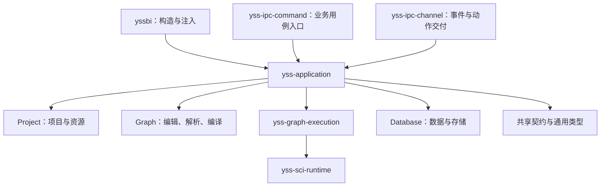

# yss-application

> Status: Current
> Scope: Application 的职责、直接依赖、应用会话和跨子系统用例
> Canonical owners: [Cargo.toml](Cargo.toml) 与 [src/](src/) 拥有依赖和实现事实；本文说明本 crate 的用途与调用关系；跨阶段契约由 [Graph 与 Execution](../../../docs/architecture/GRAPH_AND_EXECUTION.md) 维护
> Update when: Application 的依赖、公开入口、会话组合或职责归属改变时

`yss-application` 组织跨 Project、Graph、Database 和 Graph Execution 的业务用例，并协调它们的会话、资源版本和提交结果。它拥有应用会话替换、操作顺序、失败分类和应用事件事实；具体图编辑、编译、执行、存储和统计算法由对应子系统实现。

## 调用方与依赖方向

目前有三个包直接依赖 Application：

| 调用方                                            | 用途                                                      |
| ------------------------------------------------- | --------------------------------------------------------- |
| [`yssbi`](../../src/lib.rs)                       | 构造并注入应用状态、初始会话、示例目录和插件宿主服务      |
| [`yss-ipc-command`](../yss-ipc-command/README.md) | 将 IPC 请求转换为业务参数，调用应用用例，再映射结果与错误 |
| [`yss-ipc-channel`](../yss-ipc-channel/README.md) | 消费应用运行事件、自动化图动作和更新类型，完成通道交付    |

下图展示主要直接依赖方向；Project、Graph、Database 和契约节点各自代表一组 crate，不是完整的 workspace 依赖图。



Application 不依赖桌面根包、Tauri 或 IPC crates。插件运行时通过注入的 `HostServices` 接口回调宿主业务能力，这种运行时调用不要求 Application 依赖 `yss-plugin-runtime`。

## 直接依赖

当前 [Cargo.toml](Cargo.toml) 声明 **41 个内部正式依赖、8 个外部正式依赖，以及 12 条开发依赖**。这里统计直接声明，不累计传递依赖，也不把开发依赖重复计入正式依赖。调整 manifest 时同步更新本节。

### 内部正式依赖

| 类别                  | Crates                                                                                                                                                                                                                                                                                                               | 使用目的                                                   |
| --------------------- | -------------------------------------------------------------------------------------------------------------------------------------------------------------------------------------------------------------------------------------------------------------------------------------------------------------------- | ---------------------------------------------------------- |
| Graph 与执行：13 个   | `yss-graph-analysis`、`yss-graph-analysis-contract`、`yss-graph-catalog`、`yss-graph-compiler`、`yss-graph-document`、`yss-graph-document-edit`、`yss-graph-editor`、`yss-graph-execution`、`yss-graph-protocol`、`yss-graph-registry`、`yss-graph-resource-contract`、`yss-graph-runtime`、`yss-graph-type-mapping` | 组织图编辑、解析、编译与执行，转换各阶段的类型和产物       |
| Project 与资源：10 个 | `yss-project`、`yss-project-change`、`yss-project-filesystem`、`yss-project-history`、`yss-project-identity`、`yss-project-model`、`yss-project-registry`、`yss-project-registry-contract`、`yss-resource-naming`、`yss-function-editor-projection`                                                                  | 项目生命周期、资源操作、身份与版本、文件提交、函数签名展示 |
| 数据：12 个           | `yss-data-contract`、`yss-database-contract`、`yss-database-edit`、`yss-database-runtime`、`yss-database-schema`、`yss-dataset-profile`、`yss-dataset-store`、`yss-relational-contract`、`yss-sql-source`、`yss-tabular-arrow`、`yss-tabular-contract`、`yss-tabular-io`                                             | 数据导入导出、编辑、查询、快照和项目资源发布               |
| 自动化与插件：2 个    | `yss-automation-contract`、`yss-plugin-protocol`                                                                                                                                                                                                                                                                     | 为 Assistant 和插件提供宿主业务能力                        |
| 科学计算契约：1 个    | `yss-sci-contract`                                                                                                                                                                                                                                                                                                   | 使用统计结果、报告和错误类型                               |
| 图表文档：1 个        | `yss-chart-document`                                                                                                                                                                                                                                                                                                 | 图表文档操作与查询                                         |
| 通用能力：2 个        | `yss-canonical-hash`、`yss-display-naming`                                                                                                                                                                                                                                                                           | 稳定哈希与展示名称                                         |

直接依赖同时包含实现调用和类型引用。例如，`yss-graph-compiler` 提供编译包与输出契约类型，[graph_contracts.rs](src/graph_contracts.rs) 使用它们转换执行包，编译算法仍由 Graph Compiler 拥有。`yss-function-editor-projection` 用于项目函数签名的展示与类型转换，通用图编辑器投影由 `yss-graph-editor::projection` 提供。

### 外部正式依赖

| 依赖                  | 使用目的                                                     |
| --------------------- | ------------------------------------------------------------ |
| `atomicwrites`        | 导出文件的原子替换；临时文件和发布结果处理仍由应用用例负责   |
| `serde`、`serde_json` | 静态示例目录、离线源定义和结构化数据的序列化、反序列化与转换 |
| `thiserror`           | 应用层类型化错误                                             |
| `tracing`             | 技术故障记录                                                 |
| `uuid`                | 操作、资源及快照相关标识                                     |
| `arrow`               | 导入导出和插件快照中的批式表格数据交换                       |
| `dunce`               | 项目路径展示                                                 |

### 开发依赖与示例

| 声明方式                                | Crates                                                                                                                              | 用途                                                         |
| --------------------------------------- | ----------------------------------------------------------------------------------------------------------------------------------- | ------------------------------------------------------------ |
| 仅开发依赖                              | `yss-datafusion`、`yss-project-layout`、`yss-project-registry-sqlite`、`sqlx`、`tokio`、`tracing-subscriber`                        | 测试中的查询引擎、项目文件布局、注册存储、异步执行与日志环境 |
| 正式依赖在开发配置中开启 `test-support` | `yss-database-runtime`、`yss-graph-execution`、`yss-graph-runtime`、`yss-project`、`yss-project-filesystem`、`yss-project-identity` | 构造测试会话和验证跨 crate 契约，共六条声明                  |

Application 自身的 `test-support` feature 只开放跨 crate contract 测试所需的构造与 publication seam，转发范围以 manifest 为准。

生产程序仍通过数据库与存储层间接使用 DataFusion；Application 没有正式直接依赖 DataFusion，不表示它从最终程序的依赖树中消失。

[数据引擎基准示例](../yss-dataset-store/examples/dataset_engine_bench.rs) 归 `yss-dataset-store`，[OLS 基准示例](../yss-graph-execution/examples/ols_bench.rs) 归 Graph Execution。Application 保留与数据库导入用例关联的 [内置示例资源生成器](examples/build_samples.rs)。

## 主要职责与源码入口

| 工作             | Application 负责的部分                                                           | 源码入口                                                                                                                                                       |
| ---------------- | -------------------------------------------------------------------------------- | -------------------------------------------------------------------------------------------------------------------------------------------------------------- |
| 会话管理         | 组合当前项目的运行时，协调任务准入、项目切换、旧任务清理和失败恢复               | [session_slot](src/execution/session_slot.rs)、[session_factory](src/execution/session_factory.rs)                                                             |
| 项目与资源操作   | 组织打开、新建、另存为、项目登记、资源创建删除、图保存和函数签名修改             | [project_lifecycle](src/project_lifecycle/mod.rs)、[resource_mutation](src/resource_mutation.rs)、[project_change](src/project_change.rs)                      |
| 图编译与执行用例 | 捕获资源事实、重验版本、调用编译、转换执行包、准备资源并协调执行结果提交         | [graph_compile](src/graph_compile.rs)、[graph_contracts](src/graph_contracts.rs)、[run_graph](src/execution/run_graph.rs)                                      |
| 数据业务用例     | 协调导入导出、编辑、存储提交、数据库运行时更新和 Project 发布                    | [database](src/database.rs)、[database_mutation](src/database_mutation.rs)、[database_session](src/database_session.rs)                                        |
| 查询与应用投影   | 组织资源目录、数据库页面、图表数据、结果报告和活动面板，并检查查询结果是否仍有效 | [catalog_query](src/catalog_query.rs)、[result_query](src/execution/result_query.rs)、[chart_plot](src/chart_plot.rs)、[activity_panel](src/activity_panel.rs) |
| 自动化与插件接入 | 校验调用上下文，提供图操作、数据快照和插件结果提交能力                           | [automation](src/automation.rs)、[plugins](src/plugins.rs)                                                                                                     |

### 应用会话

`ApplicationState` 持有 `ApplicationSessionSlot`，用作应用会话入口。一个 `ApplicationSession` 将以下运行时和身份绑定在一起：

```text
ApplicationSession
├── ProjectState
├── GraphRuntimeState
├── ExecutionRuntimeState
├── DatabaseRuntimeSession
├── ResourceProviderFactory
└── 项目实例、项目会话、执行会话、应用 epoch 与运行时 generation
```

Session slot 区分 `Inactive`、`Active`、`Replacing` 和 `Recovering`。子系统继续拥有各自的项目数据、编译缓存、数据库和结果；Application 管理它们在当前项目下的组合及生命周期。

例如，项目 A 的计算尚未结束时用户切换到项目 B，Application 协调准入关闭、旧任务收尾与会话替换。相关用例在关键提交或返回位置重验捕获的会话、资源版本和结果身份，防止旧会话的迟到结果进入新项目。

### 图编译与运行

[compile_graph_draft](src/graph_compile.rs) 捕获当前 Project 与 Database 资源事实，组织 Graph Runtime 编译请求，并调用 Graph Editor 生成编辑器投影。返回前重验会话和资源事实，交付 `Ready` 或 `Blocked` 应用回执。

[run_graph_with_sink](src/execution/run_graph.rs) 组织一次完整图运行：

1. 捕获应用会话并取得执行准入，检查请求控制条件。
2. 获取匹配的编译产物，向 Project 准备资源授权并核对编译依赖。
3. 通过 `graph_contracts::execution_package_from_graph` 转换执行包，准备计划与资源绑定。
4. 调用 Graph Execution 执行计划，由节点 kernel 完成具体计算。
5. 协调 Project finalization 与 Graph Execution 的结果发布，生成应用运行事件。
6. 由调用方提供的 sink 交付事件；Tauri Channel 编码与发送归 IPC 层。

`yss-graph-runtime` 负责解析与编译产物缓存，`yss-graph-execution` 负责执行计划、节点计算、运行状态和结果生命周期。Application 的 `execution/` 目录保存跨子系统运行用例、结果查询和会话协调；Graph Execution 保存实际执行机制。Compile、Save、Execute 及 Results 的完整契约见 [Graph 与 Execution](../../../docs/architecture/GRAPH_AND_EXECUTION.md)。

### 数据提交与查询

数据库修改同时涉及 DatasetStore 的持久化数据、Database Runtime 状态和 Project 资源发布。[database_mutation.rs](src/database_mutation.rs) 协调各方的准备、提交、会话重验、失败补偿与恢复，具体存储和数据库规则留在相应 owner。

数据导入与导出分别由 [database/import.rs](src/database/import.rs) 和 [database/export.rs](src/database/export.rs) 组织。查询与报告用例捕获当前快照，在完成读取或计算后检查结果是否仍有效，再交付应用投影。

[结果报告查询](src/execution/result_query/report.rs) 使用 `yss-sci-contract` 的类型，读取由 Graph Execution 持有的结果。已有 OLS 结果的 ACF/PACF、序列检验和假设检验通过 `yss_graph_execution::result::analysis` 调用 SCI runtime；Application 保留请求范围、会话与结果有效性检查。

### Assistant 与插件

[automation](src/automation.rs) 实现中性的自动化业务能力，并将图编辑、编译、运行和保存接入已有用例。[PluginHostServices](src/plugins.rs) 实现 `yss-plugin-protocol::HostServices`，提供项目绑定的数据列表、Arrow 快照租约、来源记录和宿主结果提交。

插件安装、进程与任务生命周期由 Plugin Runtime 负责。Julia/Bayes 的专属编排属于插件内部的 `yss-bayes-runtime`。Application 通过通用协议向插件开放宿主能力，不依赖 Harness、Julia/Bayes 或插件运行时实现。

## 职责边界

| 内容                     | Owner                                          | Application 的参与方式                                     |
| ------------------------ | ---------------------------------------------- | ---------------------------------------------------------- |
| 图语义与编辑器投影       | Graph Analysis、`yss-graph-editor::projection` | 捕获输入、调用并重验身份                                   |
| 图解析与编译缓存         | `yss-graph-runtime`                            | 组织跨 Project、Database 的资源事实与请求                  |
| 图运行与结果生命周期     | `yss-graph-execution`                          | 准备资源、协调提交、组织有界查询与应用投影                 |
| 科学计算                 | `yss-sci-runtime`、`yss-sci`                   | 已有图结果的分析交由 Graph Execution；直接使用中性契约类型 |
| 已提交项目与持久化数据   | Project、Database 与各存储 owner               | 协调会话、跨系统提交及补偿                                 |
| IPC wire、事件和通道发送 | IPC crates                                     | 返回类型化应用事实，提供应用事件                           |

Application 保留跨系统业务流程，依赖数量同时反映其使用的类型契约和运行时能力。判断一段逻辑的归属时，重点检查它是否仅涉及单个子系统、是否重复实现该子系统的规则；独立的领域规则应由已有 owner 承接。

## Bundled samples

`database::samples::SampleCatalog` owns the installed sample catalog. The desktop
composition root injects a Tauri-resolved resource path; the application layer does
not depend on Tauri or the process working directory. Only a successfully parsed,
bounded catalog is cached. Listing does not open any dataset payload.

Sample imports accept a sample ID and exact version together with the ordinary
project instance and operation identities. The catalog derives the versioned file
path, rejects redirects, verifies size and SHA-256, then reads the same opened file
in bounded Arrow batches. Counts and batch memory are checked before publication.
The sample's canonical display name and provenance enter the common `database/import.rs`
reader workflow. That workflow owns operation reservation, project revalidation,
unique naming, DatasetStore preparation/commit and the durable publication handoff.
An uncertain or committed publication is recovered using the existing catalog;
delivery failure does not trigger an automatic import under a new operation ID.

Each explicit import creates a new editable dataset. Sample origin and source hashes
persist in `yssbi.sample.origin` schema metadata; no separate sample history store
or project schema migration is needed. Reopening a project uses its managed datasets
and has no dependency on the installed sample catalog. Source definitions, preparation
and versioning are described in the [resource notes](../../resources/samples/README.md).
