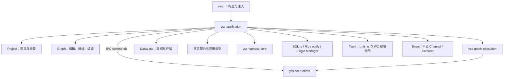

# yss-application

> Status: Current
> Scope: Application 的职责、直接依赖、桌面初始化、应用会话和跨子系统用例
> Canonical owners: [Cargo.toml](Cargo.toml) 与 [src/](src/) 拥有依赖和实现事实；本文说明本 crate 的用途与调用关系；跨阶段契约由 [Graph 与 Execution](../../../docs/architecture/GRAPH_AND_EXECUTION.md) 维护
> Update when: Application 的依赖、公开入口、会话组合或职责归属改变时

`yss-application` 组织跨 Project、Graph、Database 和 Graph Execution 的业务用例，并协调它们的会话、资源版本和提交结果。它拥有应用初始会话、会话替换、项目管理任务、Harness 启动协调、操作顺序、失败分类和应用事件事实；具体图编辑、编译、执行、存储和统计算法由对应子系统实现。`runtime` 另外承担桌面运行服务的具体组装，公开 `initialize(app)` 供 Tauri setup 调用。

## 调用方与依赖方向

桌面根包 `yssbi` 直接调用 Application 的 `initialize(app)` 和 `invoke_handler()`。命令处理与应用专属通道适配位于本 crate 的 `ipc` 模块，业务用例仍由各 Application 模块提供。

下图展示主要直接依赖方向；Project、Graph、Database 和契约节点各自代表一组 crate，不是完整的 workspace 依赖图。



Application 的 `runtime` 和 `ipc` 模块使用 Tauri；`ipc` 消费 Event、Channel 和 Contract crates。Channel 不反向依赖 Application；依赖应用事件和图动作的通道适配器已归入 `ipc/channel`。普通用例模块保持原有分层约束，Application 不依赖桌面根包。

## 直接依赖

当前 [Cargo.toml](Cargo.toml) 声明 **50 个内部正式依赖、10 个外部正式依赖，以及 11 条开发依赖**。这里统计直接声明，不累计传递依赖，也不把开发依赖重复计入正式依赖。调整 manifest 时同步更新本节。

### 内部正式依赖

| 类别                 | Crates                                                                                                                                                                                                                                                                                | 使用目的                                                   |
| -------------------- | ------------------------------------------------------------------------------------------------------------------------------------------------------------------------------------------------------------------------------------------------------------------------------------- | ---------------------------------------------------------- |
| Node：3 个           | `yss-node-protocol`、`yss-node-registry`、`yss-node-catalog`                                                                                                                                                                                                                          | 节点能力声明、注册校验和本地化目录                         |
| Graph 与执行：11 个  | `yss-graph-analysis`、`yss-graph-analysis-contract`、`yss-graph-compiler`、`yss-graph-document`、`yss-graph-document-edit`、`yss-graph-editor`、`yss-graph-execution`、`yss-graph-resource-contract`、`yss-graph-runtime`、`yss-graph-type-mapping`、`yss-function-editor-projection` | 组织图编辑、解析、编译与执行，转换各阶段的类型和产物       |
| Project 与资源：9 个 | `yss-project`、`yss-project-history`、`yss-project-identity`、`yss-project-model`、`yss-project-progress`、`yss-project-registry`、`yss-project-registry-contract`、`yss-project-registry-sqlite`、`yss-resource-naming`                                                              | 项目生命周期、资源操作、身份与版本、文件提交、函数签名展示 |
| 数据：11 个          | `yss-data-contract`、`yss-database-contract`、`yss-database-runtime`、`yss-database-schema`、`yss-dataset-profile`、`yss-dataset-store`、`yss-relational-contract`、`yss-sql-source`、`yss-tabular-arrow`、`yss-tabular-contract`、`yss-tabular-io`              | 数据导入导出、编辑、查询、快照和项目资源发布               |
| 自动化与插件：6 个   | `yss-harness-contract`、`yss-plugin-protocol`、`yss-harness-core`、`yss-harness-sqlite`、`yss-harness-rig`、`yss-plugin-runtime`                                                                                                                                  | 协调 Harness 生命周期，为 Assistant 和插件提供宿主业务能力 |
| IPC 支持：3 个       | `yss-ipc-event`、`yss-ipc-channel`、`yss-ipc-contract`                                                                                                                                                                                                                                | 命令事件、通道交付及共享 wire 类型                         |
| 科学计算：2 个       | `yss-sci-contract`、`yss-sci-runtime`                                                                                                                                                                                                                                                 | 使用统计结果、报告和错误类型                               |
| 图表文档：1 个       | `yss-chart-document`                                                                                                                                                                                                                                                                  | 图表文档操作与查询                                         |
| 通用能力：3 个       | `yss-canonical-hash`、`yss-display-naming`、`yss-math-expr`                                                                                                                                                                                                                           | 稳定哈希与展示名称                                         |

直接依赖同时包含实现调用和类型引用。例如，`yss-graph-compiler` 提供编译包与输出契约类型，[graph/execution_mapping.rs](src/graph/execution_mapping.rs) 使用它们转换执行包，编译算法仍由 Graph Compiler 拥有。`yss-function-editor-projection` 用于项目函数签名的展示与类型转换，通用图编辑器投影由 `yss-graph-editor::projection` 提供。

文件系统基础设施另由 `yss-filesystem` 提供，共 1 个内部依赖：通用文件访问、事务和监听会话。Application 将项目路径过滤器传入 NotifyFileWatcher；索引刷新仍调用 Project 用例。

### 外部正式依赖

| 依赖                  | 使用目的                                                     |
| --------------------- | ------------------------------------------------------------ |
| `atomicwrites`        | 导出文件的原子替换；临时文件和发布结果处理仍由应用用例负责   |
| `serde`、`serde_json` | 静态示例目录、离线源定义和结构化数据的序列化、反序列化与转换 |
| `thiserror`           | 应用层类型化错误                                             |
| `tracing`             | 技术故障记录                                                 |
| `uuid`                | 操作、资源及快照相关标识                                     |
| `arrow`               | 导入导出和插件快照中的批式表格数据交换                       |
| `tokio`               | IPC 异步调度、取消、期限和通道交接                           |
| `tauri`               | runtime 绑定桌面生命周期；IPC 注册命令并适配事件和通道       |
| `dunce`               | 项目路径展示                                                 |

### 开发依赖与示例

| 声明方式                                | Crates                                                                                                                                                 | 用途                                                         |
| --------------------------------------- | ------------------------------------------------------------------------------------------------------------------------------------------------------ | ------------------------------------------------------------ |
| 仅开发依赖                              | `yss-datafusion`、`yss-project-layout`、`sqlx`、`tracing-subscriber`                                                                                   | 测试中的查询引擎、项目文件布局、注册存储、异步执行与日志环境 |
| 正式依赖在开发配置中开启 `test-support` | `yss-database-runtime`、`yss-graph-execution`、`yss-graph-runtime`、`yss-project`、`yss-filesystem`、`yss-project-identity`、`yss-harness-core` | 构造测试会话和验证跨 crate 契约，共七条声明                  |

Application 自身的 `test-support` feature 只开放跨 crate contract 测试所需的构造与 publication seam，转发范围以 manifest 为准。

生产程序仍通过数据库与存储层间接使用 DataFusion；Application 没有正式直接依赖 DataFusion，不表示它从最终程序的依赖树中消失。

[数据引擎基准示例](../yss-dataset-store/examples/dataset_engine_bench.rs) 归 `yss-dataset-store`，[OLS 基准示例](../yss-graph-execution/examples/ols_bench.rs) 归 Graph Execution。Application 保留与数据库导入用例关联的 [内置示例资源生成器](examples/build_samples.rs)。

## 主要职责与源码入口

| 工作             | Application 负责的部分                                                           | 源码入口                                                                                                                                                   |
| ---------------- | -------------------------------------------------------------------------------- | ---------------------------------------------------------------------------------------------------------------------------------------------------------- |
| 会话管理         | 组合当前项目的运行时，协调任务准入、项目切换、旧任务清理和失败恢复               | [session_slot](src/session/slot.rs)、[session_factory](src/session/factory.rs)                                                                             |
| 项目与资源操作   | 组织打开、新建、另存为、项目登记、资源创建删除、图保存和函数签名修改             | [project_lifecycle](src/project/lifecycle.rs)、[resource_mutation](src/graph/resources.rs)、[project_change](src/project/change.rs)                        |
| 图编译与执行用例 | 捕获资源事实、重验版本、调用编译、转换执行包、准备资源并协调执行结果提交         | [graph_compile](src/graph/compile.rs)、[graph_contracts](src/graph/execution_mapping.rs)、[run_graph](src/graph/run.rs)                                    |
| 数据业务用例     | 协调导入导出、编辑、存储提交、数据库运行时更新和 Project 发布                    | [database](src/database/mod.rs)、[database_mutation](src/database/mutation.rs)、[database_session](src/session/database.rs)                                |
| 查询与应用投影   | 组织资源目录、数据库页面、图表数据、结果报告和活动面板，并检查查询结果是否仍有效 | [catalog_query](src/graph/catalog.rs)、[result_query](src/graph/results/mod.rs)、[chart_plot](src/chart/query.rs)、[activity_panel](src/activity_panel.rs) |
| 自动化与插件接入 | 校验调用上下文，提供图操作、数据快照和插件结果提交能力                           | [automation](src/automation.rs)、[plugins](src/plugins.rs)                                                                                                 |

### 桌面初始化

[initialize(app)](src/runtime.rs) 接收 `&mut tauri::App`，构造内部 `CommandRuntime` 和业务服务，通过 `app.manage()` 注册状态，最后显示主窗口。桌面入口在此之前安装日志平台插件；Application 使用普通 `tracing` 报告结构化运行观测，不持有日志运行时。

[默认 Harness 组装](src/runtime/harness.rs) 选择 SQLite、Rig、系统时钟与 ID 实现；项目注册 SQLite、notify 文件监听器和 Plugin Manager 也在 runtime 内构造。内部 `ipc::CommandRuntime` 提供 Harness 通道端口并安装命令专属上下文，初始化直接调用它。业务路径解析、项目与通用业务插件等服务的安装属于 Application；桌面日志插件单独安装。

`runtime.rs`、`runtime/harness.rs` 和 IPC runtime 按具体文件划分为 Composition Root；IPC 命令与 wire 适配分别按 Commands 和 Transport 检查。普通用例模块没有 Tauri 或具体 provider 构造权限。桌面入口注册 Application 与本地日志平台插件；[数据库集成测试](tests/database_test.rs) 归 Application。

### 应用会话

`session/` 拥有完整应用会话；slot、factory 和数据库绑定适配保持私有，通过 `session` 的明确公开项使用。桌面宿主从 crate 根导入 `ApplicationState`，窗口销毁调用现有 `close_result_owner` 释放该窗口的结果租约。

`ApplicationState::initialize()` 在现有 [session_factory](src/session/factory.rs) 中创建 Project、构造初始 candidate 并完成 slot 安装；失败通过 `ApplicationInitializationError` 返回。桌面入口无需逐步组装 Project 和应用会话。

自定义节点通过 `NodeComponents::new(registry, catalog, kernel_builder)` 组装，再交给
`ApplicationState::initialize_with_nodes`。slot 持有这份冻结配置，项目切换继续使用相同定义和实现，
不会退回默认 kernel 表。组装检查参数字段与输出数量，Compile 阻断未安装的实现；实现 revision 和
契约组成能力指纹，编译包映射、准备和执行入口都核对该指纹。
[普通数值扩展示例](src/session/components/tests.rs)覆盖注册冲突、绑定不匹配、会话替换及旧产物拒绝。

`ApplicationState` 持有 `ApplicationSessionSlot`，用作应用会话入口。一个 `ApplicationSession` 将以下运行时和身份绑定在一起：

```text
ApplicationSession
├── ProjectState
├── GraphRuntimeState
├── ExecutionRuntimeState
├── DatabaseRuntimeSession
├── ResourceProviderFactory
└── 项目实例、项目会话、执行会话、应用 epoch 与运行时 generation
```

Session slot 区分 `Inactive`、`Active`、`Replacing` 和 `Recovering`。子系统继续拥有各自的项目数据、编译缓存、数据库和结果；Application 管理它们在当前项目下的组合及生命周期。

例如，项目 A 的计算尚未结束时用户切换到项目 B，Application 协调准入关闭、旧任务收尾与会话替换。相关用例在关键提交或返回位置重验捕获的会话、资源版本和结果身份，防止旧会话的迟到结果进入新项目。

### 桌面 IPC

[ipc](src/ipc/README.md) 拥有唯一命令注册表、私有 handler/schema/error 和活动面板响应缓存。其 `channel` 子模块编码应用执行事件并协调图草稿交接；中立的 Harness 订阅、项目进度和诊断交付复用 `yss-ipc-channel`。Standalone SCI 命令可以调用 `yss-sci-runtime`，普通 Application 用例仍通过 Graph Execution 访问已保留结果的分析能力。

### 项目管理服务

`project/` 聚合生命周期、查询、文件变更和失败投影；`ProjectManagement` 由 `project` 明确导出，注册服务不随项目会话替换。`database/` 聚合查询、导入导出、示例及私有 `mutation` 协调；准备、提交、补偿和恢复仍在原有协议内完成。

[ProjectManagement](src/project/registry.rs) 持有进程级 `ProjectRegistry` 和项目选择器任务取消注册表，接收注入的 `ProjectRegistryStore`。扫描和清理在应用层登记任务，完成或 future 被丢弃时释放登记；旧任务结束不能清除较新任务的取消入口。注册表规则仍由 `yss-project-registry` 实现，进度编码和通道排空仍由 IPC 负责。

ProjectManagement 与 Harness Host 独立于可替换的 `ApplicationSession`。项目切换不重建注册存储和模型 provider；Harness 在启动和创建会话时按当前项目绑定协调旧会话。SQLite、Rig 和文件监听器由 Application runtime 选择，Tauri Channel 由内部 IPC 模块提供。

### 图编译与运行

`graph/inputs.rs` 中的 `DraftResolutionContext` 统一捕获及重验项目、数据库和函数依赖。打开、编辑、编译及目录查询复用这些事实，直接构造 Graph 的编译依据；运行入口仍单独建立 Project 授权与 Execution 依据。`graph/edit.rs` 中的操作级编辑器供界面单次变更和自动化批量变更共用，批量全部成功并通过最终重验后才发布结果输入；别名、权限和取消解释仍归自动化适配。

[compile_graph_draft](src/graph/compile.rs) 捕获当前 Project 与 Database 资源事实，组织 Graph Runtime 编译请求，并调用 Graph Editor 生成编辑器投影。返回前重验会话和资源事实，交付 `Ready` 或 `Blocked` 应用回执。

[run_graph_with_sink](src/graph/run.rs) 组织一次完整图运行：

1. 捕获应用会话并取得执行准入，检查请求控制条件。
2. 获取匹配的编译产物，向 Project 准备资源授权并核对编译依赖。
3. 通过 `graph/execution_mapping.rs` 转换执行包，准备计划与资源绑定。
4. 调用 Graph Execution 执行计划，由节点 kernel 完成具体计算。
5. 协调 Project finalization 与 Graph Execution 的结果发布，生成应用运行事件。
6. 由调用方提供的 sink 交付事件；Tauri Channel 编码与发送归 IPC 层。

`yss-graph-runtime` 负责解析与编译产物缓存，`yss-graph-execution` 负责执行计划、节点计算、运行状态和结果生命周期。Application 的 `graph/` 聚合图用例、运行和结果查询，完整应用会话独立归 `session/`。Graph Runtime 与 Graph Execution 的底层依赖隔离保持不变。Compile、Save、Execute 及 Results 的完整契约见 [Graph 与 Execution](../../../docs/architecture/GRAPH_AND_EXECUTION.md)。

### 图表

`chart/resources.rs` 协调 Project 的图表文档操作；`query.rs` 捕获及重验项目、数据库版本，`projection.rs` 只接收数值和轴格式并生成有界绘图点，不访问会话或执行器。采样保留原有步长规则，输出点数组受请求上限约束，不再先复制全部有效点。

独立图表的 `ChartPreview` 与图结果的 `PlotResultView` 复用现有 `ChartRenderer`。图表预览按项目、路径、声明和 Rust 投影的数据库 revision 缓存；配置变更或视图离开后，旧请求不再更新该视图。图结果仍由 ResultStore 和报告租约管理。真实界面的切换、编辑与迟到回执验收尚待完成，见组件计划。

### 数据提交与查询

数据库修改同时涉及 DatasetStore 的持久化数据、Database Runtime 状态和 Project 资源发布。[database_mutation.rs](src/database/mutation.rs) 协调各方的准备、提交、会话重验、失败补偿与恢复，具体存储和数据库规则留在相应 owner。

数据导入与导出分别由 [database/import.rs](src/database/import.rs) 和 [database/export.rs](src/database/export.rs) 组织。查询与报告用例捕获当前快照，在完成读取或计算后检查结果是否仍有效，再交付应用投影。

[结果报告查询](src/graph/results/report.rs) 使用 `yss-sci-contract` 的类型，读取由 Graph Execution 持有的结果。已有 OLS 结果的 ACF/PACF、序列检验和假设检验通过 `yss_graph_execution::result::analysis` 调用 SCI runtime；Application 保留请求范围、会话与结果有效性检查。

### Assistant 与插件

[automation](src/automation.rs) 实现中性的自动化业务能力，并将图编辑、编译、运行和保存接入已有用例。[PluginHostServices](src/plugins.rs) 实现 `yss-plugin-protocol::HostServices`，提供项目绑定的数据列表、Arrow 快照租约、来源记录和宿主结果提交。

[harness](src/harness.rs) 接收已有 `HarnessPorts`，安装内置知识、构造 Host，并依次恢复中断 turn、协调当前项目绑定、恢复 workflow。创建 Harness 会话也通过 Application 捕获项目绑定并协调旧会话；Harness Core 继续拥有具体状态和恢复规则。这些用例不选择具体适配器；SQLite 和 Rig 的默认选择在 runtime，Channel 与桌面 capability gateway 由内部 IPC runtime 提供。

插件安装、进程与任务生命周期由 Plugin Runtime 负责。Julia/Bayes 的专属编排属于插件内部的 `yss-bayes-runtime`。Application 通过通用协议向插件开放宿主能力，runtime 构造通用 Plugin Manager，业务用例通过 `PluginHostServices` 提供能力；Application 不依赖 Julia/Bayes 专属实现。

## 职责边界

| 内容                     | Owner                                          | Application 的参与方式                                     |
| ------------------------ | ---------------------------------------------- | ---------------------------------------------------------- |
| 图语义与编辑器投影       | Graph Analysis、`yss-graph-editor::projection` | 捕获输入、调用并重验身份                                   |
| 图解析与编译缓存         | `yss-graph-runtime`                            | 组织跨 Project、Database 的资源事实与请求                  |
| 图运行与结果生命周期     | `yss-graph-execution`                          | 准备资源、协调提交、组织有界查询与应用投影                 |
| 科学计算                 | `yss-sci-runtime`、`yss-sci`                   | 已有图结果的分析交由 Graph Execution；直接使用中性契约类型 |
| 已提交项目与持久化数据   | Project、Database 与各存储 owner               | 协调会话、跨系统提交及补偿                                 |
| IPC wire、事件和通道发送 | IPC crates                                     | 返回类型化应用事实，提供应用事件                           |

Application 保留跨系统业务流程，依赖数量同时反映其使用的类型契约和运行时能力。判断一段逻辑的归属时，重点检查它是否仅涉及单个子系统、是否重复实现该子系统的规则；独立的领域规则应由已有 owner 承接。

## Bundled samples

`database::samples::SampleCatalog` owns the installed sample catalog. The Application desktop
runtime injects a Tauri-resolved resource path; the sample use cases do not access
Tauri or the process working directory. Only a successfully parsed,
bounded catalog is cached. Listing does not open any dataset payload.

Sample imports accept a sample ID and exact version together with the ordinary
project instance and operation identities. The catalog derives the versioned file
path, rejects redirects, verifies size and SHA-256, then reads the same opened file
in bounded Arrow batches. Counts and batch memory are checked before publication.
The sample's canonical display name and provenance enter the common `database/import.rs`
reader workflow. That workflow owns operation reservation, project revalidation,
unique naming, DatasetStore preparation/commit and the durable publication handoff.
An uncertain or committed publication is recovered using the existing catalog;
delivery failure does not trigger an automatic import under a new operation ID.

Each explicit import creates a new editable dataset. Sample origin and source hashes
persist in `yssbi.sample.origin` schema metadata; no separate sample history store
or project schema migration is needed. Reopening a project uses its managed datasets
and has no dependency on the installed sample catalog. Source definitions, preparation
and versioning are described in the [resource notes](../../resources/samples/README.md).
