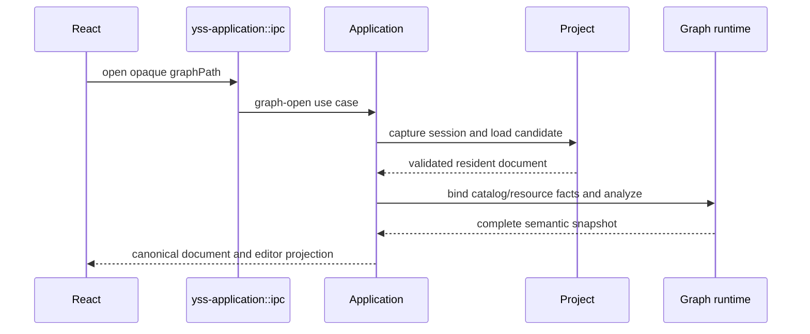

# Project application

> Status: Current
> Scope: 项目发现、路径、激活与会话替换编排
> Canonical owners: Application project 用例、Project authority 和项目注册服务
> Update when: 本模块的公开入口、状态归属、生命周期或契约改变时

## Project lifecycle

通用文件能力集中在 [yss-filesystem](../../../yss-filesystem/README.md)，其运行、开发和构建依赖都不包含内部 crate。FS 不解释项目入口、图表/图文档、资源版本或索引失效；Project 解释这些业务规则并映射 ProjectOperationError，Application 组装带项目路径过滤器的监听器。文件事务默认接受任意字节，项目文档校验由 Project 显式提供。

项目发现由 `yss-project-registry` 的私有 `discovery` 模块使用 `walkdir` 遍历候选目录，链接与重解析点判断复用 `yss-filesystem`。注册流程采用发现结果并通过存储端口持久化；直接注册和扫描复用已有记录时，共用项目根身份校验。项目默认名称与规范化规则由 `yss-project-model` 统一拥有。共享进度与任务取消归 `yss-project-progress`，通信适配负责向前端投递进度。

已有项目路径由 Rust `dunce::canonicalize` 解析，默认父目录与资源显示路径使用不访问文件系统的 `dunce::simplified`。Windows 仅在安全时简化扩展前缀，长路径、UNC 和特殊文件名所需的前缀保留；非 Windows 的展示路径原样保留。重新注册已有项目时刷新规范路径，项目身份仍由根身份校验决定。React 原样保存和展示 Rust 路径投影，项目选择器精确匹配规范路径，不再自行剥离前缀、替换分隔符或忽略大小写来判断项目身份。

扫描与清理在返回成功前重查取消状态；取消不回滚已经完成的注册或清理。注册列表按收藏状态、数值化的 Unix 秒时间和名称排序，已有记录的名称与收藏状态不会被重复扫描覆盖。

活动项目以一个 application session 为边界：

```text
Application session
├─ Project authority and project session
├─ Database runtime session
├─ Graph registry/runtime facts
├─ Execution runtime and ResultStore
└─ session generation / admission state
```

Project replacement 先关闭旧 session 的新任务准入并 drain 或取消活动工作，再构造和验证 candidate session，最后原子替换。旧 session 的 late event、result、database handle 和 Graph projection 因身份或 generation 不匹配而被拒绝；前端在 hydrate 新项目之前先清理旧的 backend-owned projection。

工作台“关闭项目”在保存/放弃/取消确认后调用 `close_project(projectInstanceId)`，先按预期项目身份关闭旧会话、释放执行与数据库资源并停止 watcher，再清空前端项目投影、交互、执行结果及项目面板，完成后才返回项目选择页。关闭不删除项目文件或注册记录；随后可作为非活动项目移到回收站。取消或保存失败保持当前项目。窗口布局与应用设置保留。

单窗口仍保留项目生命周期隔离：`projectInstanceId` 标识一次 Rust 项目激活并随 IPC 请求传递；前端 `epoch` 在本地生命周期启动或清理时递增，拒绝取消或重新加载之前的回调；`activationRevision` 为激活回执排序并去重，清理投影时仍保留其水位。三个值不可互换。节点目录读取通过 `projectIOStore.captureProjectReadContext` 捕获请求上下文，统一校验生命周期与已安装投影的身份；调用方用 `isCurrent()` 判断是否接收异步结果，不自行拼装 epoch 或重复读取项目 store。

打开项目先通过 Project 的 activation preparation 检查目标文件，再进入 replacement。
旧格式、损坏文件或无效路径在这一阶段拒绝时，当前 Application session、准入、当前文档和 Results 保持不变。
若最终文件重验在 drain 之后失败，则从仍然有效的 Project authority 重建可用会话并返回打开错误；
只有 drain、authority 或会话重建确实无法完成时才保留恢复状态。

Project 文件、resource revision 和提交事务由 Project owner 管理。Graph resource 可以存在于磁盘和 revision index 中但保持 unloaded；create/duplicate 只声明新资源，不为了发布事件而临时加载。需要 resident document 的 load/patch/move 路径统一经过 Project 的受验证安装边界。

典型打开链路：


