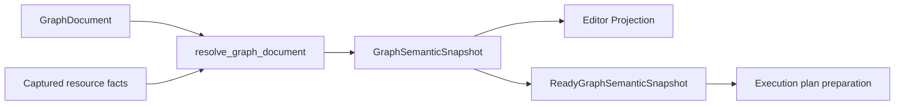

# Graph analysis

> Status: Current
> Scope: 语义快照、类型与 Schema、端口、常量和配置解析
> Canonical owners: 本 crate、Graph Document 与 Editor 的源码拥有相应类型和解析事实
> Update when: 本模块的公开入口、状态归属、生命周期或契约改变时

## Semantic resolution

`ConcreteGraphInterface` 是 snapshot 内端口事实的借用视图，不存第二份端口表。类型使用 `Exact / Constrained / Unknown / Conflict`；`TypeExpr` 只描述声明 pattern。Add、Reroute、Convert 复用 NumericFold、Identity、ParameterOutput 规则，coercion 和 kernel specialization 与类型结果一起交付。

Schema 按 data DAG 顺序求解并保留 lineage，cycle 在递归解析前识别。`GraphSchemaState` 区分 NotApplicable、Exact（含空字段集合）、Pending、Unavailable、Conflict 和 InternalFailure。Reroute 可传递上游 Schema。Schema 和类型仍是同一次 Resolve 内的阶段，最终组装完整节点事实并发布完整 snapshot。

Schema 输出缓存校验 registry、节点参数、常量内容、输入地址与上游 Schema 状态，以及该输出实际读取的资源依赖。上游编辑没有改变 Schema 时，下游可复用已有求解结果。缓存命中也记录所依赖的资源和 absent lookup，避免资源恢复后继续复用缺失状态；cycle 清空该图的 Schema 缓存，删除节点时清除其输出。类型/coercion 缓存继续使用最新 Schema 作为输入。增量结果、诊断和依赖记录须与 full resolve 一致；缓存未命中时仍遍历图、校验输入并组装完整 snapshot，不代表整个流程只访问受影响节点。

编辑器仅在操作引用端口、需要校验或 claim 派生端口时请求前置 Resolve。移动、普通节点创建、参数设置等操作直接准备文档补丁；批次在最终文档上统一解析并生成投影，批次内部的连接操作仍读取其前序操作之后的端口事实。函数正文也延后到需要解析时捕获。图活动、历史与显式保存仍由原有事务提交。

每次解析使用借用文档的节点 binding、连线计数和有序输入索引，投影使用节点语义与诊断索引，避免逐节点或逐端口扫描整张图。局部索引随请求释放，不形成第二套图状态。

三类端口的生命周期：

- Declared：protocol 定义的固定地址，不新增 document binding。
- User-created：instance ID/order 持久化；后端 placement 负责 append、before、after、move，member group 共用 ID/order。
- Derived：未使用成员只投影；首次连接或设置 literal 时与 mutation 原子 claim。被引用成员消失时显示 orphan；未引用的消失成员不再投影。显式编辑清理无引用的旧 derived bindings，解析与运行准备不改写 document。

未知但被文档引用的端口以有 canonical address 的 orphan fact 展示，便于定位和断开损坏连接。Template 只表示新增能力。普通连接错误保留在 canonical Problems 中；只有附有阻断连接诊断的错误方向连接才可通过 frontend projection 验证。

Analysis Graph 只含数据依赖。Print、Control/Effect 等副作用属于 Workflow。

内置节点的每个数据输出端口允许连接多个下游输入，包括 Decompose 列端口和函数派生输出。
新增分支保留已有连线；输入端口仍遵循自身容量，替换单连接输入时只移除该输入的旧连线。
连接数量与动态端口数量是独立约束，同一个输出值由多个消费者共享。

命名常量由 `GraphDocument.constants` 持有，使用稳定 `ConstantId`。Event 和 Function 的 Details 面板编辑名称、类型和值；增删改通过 `SetConstant` 和同一 当前图文档 FIFO、undo/redo、Save 路径处理，没有独立的变量 Store、revision、作用域或项目资源文件。名称在所属图内唯一，重命名不会改变引用身份。

前端常量、端口和协议默认值共用 `SerializedDataValue` 及严格校验器；编辑字段是临时输入状态。常量编辑不依赖 IPC 编码器，也不维护另一份已提交数据。

表格常量保存 `tabular` 快照，`dataValue` 为 Null，不再保存由常量 ID 派生的资源句柄。编辑时提交的 JSON 文本由 Graph 原子解析、按外层 `ValueType` 校验；序列不另存元素类型、dummy 或 time-series 状态。

图内自定义常量通过 `yssbi.constant.get` 访问，其 `constant` 参数引用当前图内的常量。Details 面板可直接插入引用节点，也可在 Get 节点的参数中选择常量。尚未选择或已删除的引用可保留在草稿中，编辑解析会报告阻断诊断。单次使用的输入值仍可通过端口 literal 编辑。
固定数学常量 `yssbi.constant.pi` 和 `yssbi.constant.e` 同样位于常量目录，无输入和参数，输出 Numeric 标量。Kernel 从 Rust 标准库读取对应 Float64 常量，不创建或引用 GraphConstant；类型推导、缓存及下游广播使用现有固定节点契约。

常量类型和值由 Graph Document 校验；DataFrame/DataSeries 将列数据持久化为常量内的 `TabularSnapshot`，句柄由 ConstantId 派生。Graph Analysis 解析输出类型及表格列 Schema；Execution 的计划准备捕获不可变值，将数列转换为值列表、数据帧转换为列记录，运行过程不读取可变项目变量。常量内容参与语义 fingerprint，名称、说明和标签不使计划缓存失效。

Clipboard 仅携带选中 Get 节点引用的常量。目标图已有同一身份且内容相同的常量时复用；身份或名称冲突时复制定义并重写引用。常量和节点进入同一个可撤销补丁。复制整张图则生成独立常量身份。

节点参数使用文档中显式保存的值，未填写时使用 protocol 定义的默认值。Editor Projection 交付该有效值供直接编辑；参数编辑从 当前图文档 合并改动，保留未展示参数，也不把其他参数的显示默认值写回文档。计算参数与缺失值策略由具体算法契约和输入校验拥有，节点参数没有项目设置继承/覆盖模式。

节点通过 `ParameterEditorSpec::Configuration(ConfigurationSchema)` 声明 Detail 配置表单。Schema 复用标量 `ParameterSpec`，提供默认值、选项、约束和基于选择项的条件字段；Rust 只投影当前适用字段，React 复用参数控件。配置对象属于当前节点，保存在节点参数中。`SetConfiguration { node_id, key, values }` 在当前候选文档上合并部分字段、补齐默认值、移除不适用字段，并通过已有 后端图历史 和 Save 路径支持撤销、重做与持久化。导入的配置参数必须包含完整且适用的字段，验证不会暗中补写文档。

Detail 直接编辑节点配置，不提供配置来源选择；静态配置不声明 Canvas 引脚。统计目录中的独立 Configure/VCE 节点和 Config 输入已移除，原有模型配置字段归各自 Fit/Summary 节点所有。OLS/WLS 使用常数项和协方差表单，GLS、IV、Logit、Probit、Prais、Panel 使用各自已有配置字段；其他统计节点保留原有参数。Y、X、权重等数据输入仍通过连线表达依赖。0.x 文档中已保存的旧 Configure/VCE 节点不作兼容转换，应在目标模型的 Detail 中重新设置。

同一配置约定覆盖整个内置目录：分布采样节点将分布参数与样本数放入配置表单，整数范围将起点、终点和步长放入配置表单，相关图将最大滞后阶数放入配置表单；常量值、数据转换和其他既有节点参数继续在 Detail 直接编辑。数学操作数、标准化结果、数据列等实际数据依赖保留为数据引脚。旧文档中的这些静态配置引脚及其连线不再有效，需要在对应节点的 Detail 中重新设置。

数据帧的列投影、筛选谓词和列选择控件从 semantic snapshot 获取当前输入 Schema 的列、兼容操作符和字面量类型，输入变化时刷新，断开输入后停止提供过期列。没有封闭选项集的字符串参数使用文本编辑。配置能力不自动提供执行 kernel；是否已安装由当前会话的冻结 KernelRegistry 决定，缺少实现时仍阻断执行。

## 相关模块

[语义缓存](../yss-graph-runtime/README.md) · [共享数据契约](../yss-data-contract/README.md) · [应用编排](../yss-application/src/graph/README.md)
