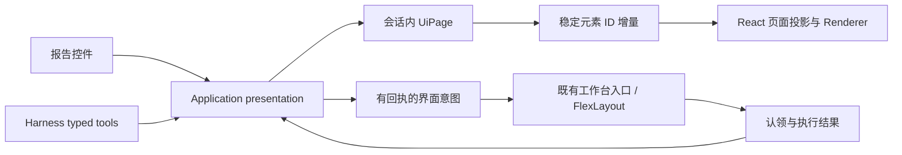

# JSON 页面与界面意图

> Status: Current
> Scope: 后端页面状态、封闭组件目录、GUI / Harness 动作、增量安装与工作台界面意图
> Canonical owners: `yss-ui-contract` 拥有共享协议；Application presentation 拥有运行期页面与意图；本文维护跨端契约
> Update when: 组件、动作、状态归属、会话边界、增量或意图回执改变时

## 状态归属

首个接入场景是线性回归结果报告。Rust Application session 保存每个结果的页面 JSON，React 只安装其只读投影。
GUI 的排序、显隐、重置、JSON 导入和 Harness 的页面修改调用相同用例。模型不能改写统计结果；报告组件继续使用既有 Results 查询、分页、分析与面板租约。

Summary 内容和检验参数属于图节点参数。默认页面只生成本次结果已选择的绑定；布局 replace/patch/reset 同样受该结果能力约束，不能通过 JSON 加入未计算的分析。Report 的“添加并计算”调用 Results 的节点编辑与定向执行流程，成功后切换到新结果及其默认页面，不改写旧结果的统计快照。

Workbench 拓扑、标签顺序、尺寸、选中面板和折叠状态仍由 FlexLayout Model 拥有。后端可以请求打开图、定位节点、打开结果和显示登记过的面板，由前端调用已有的面板与编辑器操作。输入草稿、选择、视口、拖拽和悬停保留在前端；拖拽过程不往返 IPC。



协议见 [UI contract](src/lib.rs)，用例见 [presentation](../yss-application/src/presentation.rs)，渲染见 [UiPageRenderer](../../../src/components/ui-presentation/UiPageRenderer.tsx)。

## 页面、目录与数据绑定

UiPage 包含 `source: { executionSessionId, resultId }`、运行期 `revision` 和 `spec`。结果 ID 沿用 Results 的十进制字符串。
Spec 只包含 `root` 和按稳定 ID 索引的 `elements`；每个元素有 `component`、`visible`、`children`。
容器以 ID 引用子元素，必须形成单根树；循环、重复引用、孤立元素和未知字段均被拒绝。没有旧报告 Spec 的转换或迁移路径。

| 组件                                                              | props                     | children         |
| ----------------------------------------------------------------- | ------------------------- | ---------------- |
| column / row                                                      | gap                       | 稳定元素 ID 列表 |
| section                                                           | title、collapsible        | 稳定元素 ID 列表 |
| text                                                              | text，按纯文本呈现        | 空               |
| equation / keyValue / table / statCard / coefficientTable / chart | binding                   | 空               |
| analysis                                                          | binding，登记过的分析交互 | 空               |
| button                                                            | label、封闭的 intent      | 空               |

组件目录按展示方式定义。`section` 只负责标题和折叠；模型概览、ANOVA、诊断等业务名称属于报告模板的元素 ID 和数据绑定。默认模板按报告类型放在 Application 的 [templates/regression.rs](../yss-application/src/presentation/templates/regression.rs)，UI contract 不拥有回归模板。

模板条目直接关联 Summary 的内容选项，仅为已选内容构造元素及子树；同一份生成结果用于默认页、重置和绑定能力校验。

`binding` 是当前报告登记的数据名称，按组件类型校验；未知绑定、类型不匹配和超出当前结果能力的绑定在提交前被拒绝。原生回归报告的 `presentation` 字段提供 `summary` 键值条目、`anova` 列和行、`conditionNumber` 指标，数值保持原始类型并带格式标记。`coefficients` / `observations` 沿用分页表引用；公式、图表和分析绑定由 Results 交付，系数表与系数图可独立排序、显隐。绑定目标始终是页面的当前结果，Spec 不携带可覆盖 Results 的数值或查询参数。
纯文本可以作说明，但不会被当作计算证据。按钮不能指定 IPC 命令名、脚本、URL 或任意事件处理函数；点击时提交元素 ID 和页面修订，Rust 从当前 Spec 解析操作并再次校验目标。

`inspect_ui` 的 catalog 查询返回由 Rust 类型生成的 JSON Schema 及大小、节点数、深度上限。Harness 和 GUI 遵循同一份封闭词汇；前端在 Service 边界校验 wire，在页面导入和安装时校验完整 Spec。
当前上限为每页 128 个元素、深度 12、Spec 64 KiB；单会话最多保留 64 个已修改页面。默认布局按需生成，不占页面记录；访问展示用例时清理已不可用结果的页面，仍有结果租约的布局继续保留。Reset 后保留当前修订以拒绝旧更新。有效修改页满额时明确失败，不静默丢弃布局。

最小组合示例：

```json
{
  "root": "report",
  "elements": {
    "report": {
      "component": { "type": "column", "props": { "gap": 4 } },
      "visible": true,
      "children": ["summary", "assistant"]
    },
    "summary": {
      "component": { "type": "keyValue", "props": { "binding": "summary" } },
      "visible": true,
      "children": []
    },
    "assistant": {
      "component": {
        "type": "button",
        "props": { "label": "打开助手", "intent": { "kind": "showPanel", "panel": "assistant" } }
      },
      "visible": true,
      "children": []
    }
  }
}
```

## 动作与增量

页面修改必须携带 `baseRevision`。Rust 在隔离候选上执行 replace、patch、visibility、move 或 reset，校验完整树后才原子提交；冲突、错误操作或非法结构不改变当前页面。无变化不推进修订。
GUI 与 Harness 交错提交遵循相同的修订比较。流式生成按完整有效的批次调用 patch，不把未完成 JSON 文本安装成页面。

首次读取得到快照。更新响应和会话 Channel 都携带 `{ kind: "patch", source, baseRevision, revision, operations }`。
操作只有 `set { id, element }`、`remove { id }`、`root { id }`，Rust 比较提交前后页面生成差分，不让前端计算新权威状态。
这是 UI 专用的稳定元素协议，不宣称实现 RFC 6902 的全部操作，也不复用 Graph 编辑或 Graph 投影补丁。

前端先订阅再读取快照，只安装与当前项目生命周期、结果引用和修订基线相符的更新。重复或较旧回复忽略；未变化元素保留引用，React key 保持稳定。
修订缺口、无基线或非法增量触发一次只读快照恢复，读取期间再收到更新会合并为后续恢复；失败保留上一有效页面和错误提示。
恢复不重放写操作，丢失命令回复不能证明动作没有提交。

后端 Channel 使用 128 条有界广播缓冲；慢消费产生 resync，前端重读当前快照，不补发无界历史。
每个 WebView、每个项目通过 presentationService 共用一条会话级订阅，按监听者分发到页面与工作台意图。页面卸载只释放自己的监听者，最后一个监听者离开才关闭 Channel；工作台监听者加入或退出时重新绑定订阅权限并恢复快照。页面仍统一通过 installUiUpdate 接纳 Command 和 Channel 更新。
Application 只发布中立 observer 通知，Tokio 缓冲与任务归 IPC；取消订阅释放 observer，Application 用例不依赖异步传输运行时。
关闭窗口或卸载取消订阅；Application session 替换后旧流发出 sessionChanged 并结束，前端重新订阅。旧结果引用仍由 Results 拒绝，不重绑定到新运行。
独立报告窗口通过已有项目初始化入口建立上下文，使用相同的 Spec 和同步协议。

## 意图与回执

GUI 页面按钮和 Harness `request_ui_intent` 共用 Application。意图仅包括打开已有图及可选节点定位、打开保留结果、显示白名单面板。
后端验证项目、资源成员关系、结果会话和请求大小；只有 `main` 工作台订阅能认领意图，其他报告窗口可以发起但不能执行工作台操作。

请求携带 `clientKey`，在调用者与 Application session 内去重。相同 key 和内容返回原回执，不同内容拒绝；回执缓存有界，跨会话或淘汰后不承诺重放。
回执状态是 pending → claimed → applied / failed。前端先原子认领，再串行调用现有入口，最后确认实际结果；重复消息不能重复认领。
关闭面板不要求结束 Harness 对话，界面操作也不保存图文档。

未认领或未确认的请求超过 30 秒转为 expired；它表示没有及时得到完成证据，不能宣称已执行或撤销。没有活动工作台时请求直接失败。
重连恢复只投递 pending 意图，不重新执行 claimed 意图。Harness 可通过 `inspect_ui` 的 intent 查询回执，pending 不是成功证据。
项目替换后不执行旧队列，结果打开仍经既有租约取得与失败释放流程。

## 保存与技术选择

配置保留在当前 Application session，关闭报告再打开会恢复该结果的布局；结果会话结束、项目替换或应用重启后重建默认配置。
Spec 本身不取得结果租约、不保存 Project、不持久化 FlexLayout。模板落盘、跨结果重绑定、通用表单/图表目录和性能人工验收继续见 [JSON Driver](../../../docs/roadmap/jsonDriver.md)。

本轮沿用 Rust serde / schemars、前端类型与既有状态设施，没有新增 npm 依赖。json-render 的目录模式可作参考，但目前不需要其独立状态/动作运行时；Zod 不是必需条件，校验仍不可省略；已有 Zustand 继续服务其他投影，无需复制页面权威状态。
JSON Patch 是候选协议/实现库，不是必选依赖；当前受限的稳定元素差分足以支持首个页面场景。参考 [json-render catalog](https://json-render.dev/docs/catalog) 与 [RFC 6902](https://www.rfc-editor.org/rfc/rfc6902)。
