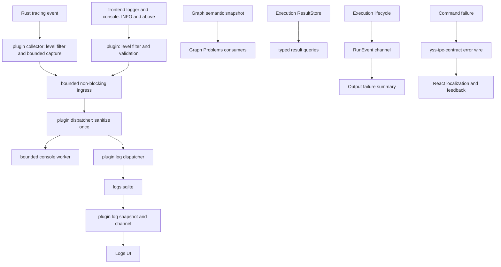

# Observability and feedback

> Status: Current
> Scope: 运行信号路由、结构化观察与用户反馈
> Canonical owners: 本 Application 模块协调日志与反馈；各业务 owner 保留业务事实
> Update when: 本模块的公开入口、状态归属、生命周期或契约改变时

## Authority matrix

| 信息                  | Authority                                                  | Delivery / retention                         | UI 用途                             | Canonical detail                                                                                |
| --------------------- | ---------------------------------------------------------- | -------------------------------------------- | ----------------------------------- | ----------------------------------------------------------------------------------------------- |
| Graph Problems        | Rust `GraphSemanticSnapshot` 经完整 editor projection 投影 | command response 原子替换                    | Canvas、Details、Problems、Run Gate | [Graph 与 Execution](../../../modules/problems/README.md#graph-problems)                        |
| Results / 当前输出    | Rust `ResultStore`                                         | typed queries；event 只公告 identity         | Result、Inspect、Preview            | [Graph 与 Execution](../results/README.md#results)                                              |
| Graph 运行失败        | Rust Execution RunErrored / command rejection              | typed channel 与当前图失败摘要               | Output panel                        | [Graph 与 Execution](../../../modules/output/README.md#运行失败反馈)                            |
| Logging               | sanitized Rust `tracing` + frontend logs                   | SQLite history + bounded recent/live channel | Logs UI、本地技术排障               | 本文                                                                                            |
| IPC error             | Rust `yss-application::ipc` transport error                | command rejection                            | React 按 stable code 映射           | [`yss-application::ipc` README](../../../../src-tauri/crates/yss-application/src/ipc/README.md) |
| User feedback         | React application/view                                     | UI state，按交互生命周期保留                 | Alert、Dialog、inline/status        | 本文                                                                                            |
| Assistant text/events | Rust Statistical Harness                                   | ordered persisted event stream               | Assistant projection                | [Statistical Harness](../../../../src-tauri/crates/yss-harness-core/README.md)                  |

直接规则：

- 运行观测统一进入 structured logging，允许 loss，且不是业务 authority；
- Graph Problems 来自完整语义快照，独立于运行日志；
- Result event 不是 result authority；
- 运行失败摘要来自业务事件或命令失败，不从 log 重建；
- command error 不是 backend user message；
- Assistant transcript 不进入 logs、Output 或 Graph Problems。

## Signal flow

运行观测共用日志插件的输入校验、脱敏、identity、sequence、持久存储、缓冲和订阅。Rust tracing、前端 logger 和显式结构化日志都进入同一条链；Graph Problems、Result、运行状态和错误响应由各自业务 owner 管理。

编辑解析的普通语义问题使用阻断 outcome 与完整 projection；内部故障继续走 diagnosed rejection。详情见 [语义解析](../../../../src-tauri/crates/yss-graph-analysis/README.md#semantic-resolution)。

桌面入口在 Application setup 前注册 `tauri-plugin-tracing`，由插件解析日志路径、打开 SQLite、安装全局 logging subscriber 并保留 guard。Application 组装业务服务；日志插件不可用时仍可完成业务初始化。日志目录或 SQLite 不可用时保留 console，插件查询/订阅返回 `logs_unavailable`。

## Structured runtime observations

Application、Execution、System、Graph、Data 和 Ui 是日志的领域标签，共用 `LogRecordDto` 的 level、origin、domain、target、event、source 和 fields。领域标签不产生独立的业务状态或交付通道。

Rust 使用普通 tracing 宏；显式 `log_domain`、`log_event`、`log_source` 和 `log_target` 字段由插件映射为日志元数据，其余安全字段保留在 fields 中。例如数据校验的缺失值数量、运行阶段、耗时和 incidentId 都可作为结构化技术观察。

前端通过已有 logger 或 `LogService.submitFrontendLogs` 提交记录，经同一有界批次链进入日志插件。显式结构化记录可包含 event 和 fields；客户端不指定 origin、timestamp 或 sequence。Logs 的订阅、历史查询和统计统一使用 `plugin:tracing|` 命令。Application 不注册另一套运行诊断命令、runtime 或 buffer。

运行观测遵循日志级别过滤、SQLite 持久化及存储故障语义。字段仅保留排障所需的 ID、计数、阶段和安全错误代码。业务校验结果、Graph Problems、模型诊断、运行状态与 Results 仍从业务接口获取；用户反馈由 typed outcome 驱动。

## User feedback

React application/view 根据 use case 将 stable code 和安全 details 映射为本地化文案与反馈表面：

| 情况                   | 反馈表面                                      |
| ---------------------- | --------------------------------------------- |
| 页面或区块仍可继续使用 | persistent `Alert` / page or section state    |
| 输入字段无效           | inline error + accessible description         |
| 必须确认后继续         | application `MessageDialog` / ordinary Dialog |
| 破坏性操作确认         | `AlertDialog`                                 |
| 成功                   | 优先用新状态、列表变化或持久状态表达          |

用户反馈应由应用动作与 typed outcome 驱动，不使用日志触发通知，也不把 `IpcError.message`、Rust error 或 parser reason 当作用户文案。Logs panel 展示 sanitized operational record 是其自身职责；Graph diagnostic 按 Rust-owned 模板键与安全参数在 React 本地化，具体契约见 [Graph Problems](../../../modules/problems/README.md#graph-problems)。路径选择等桌面 capability dialog 不等同于应用错误反馈。

Graph 运行失败由 Output panel 的失败摘要反馈：React 本地化 Rust RunErrored 的原因和阶段，保留节点定位及可用的 incidentId。该 UI 摘要不由 Logs 重建；具体生命周期和 terminal channel 排空契约见 [运行失败反馈](../../../modules/output/README.md#运行失败反馈)。

## Routing decisions

新增信息流时先回答：

1. 它是当前业务事实、可查询结果、用户程序输出、技术观察、transport failure，还是 UI feedback？
2. 谁是唯一 authority，consumer 丢失全部本地状态后如何恢复？
3. delivery 是 reliable、replayable、latest-snapshot，还是允许 loss？
4. 容量、backpressure、drop/gap/terminal semantics 在哪里由代码定义？
5. payload 是否跨越数据、隐私或用户文案边界？

具体修改检查项见 [Change Process](../../../../docs/development/CHANGE_PROCESS.md)，前端命令见 [src README](../../../README.md)，本文不复制 checklist 或容量表。

## 相关模块

[日志采集与存储](../../../../src-tauri/crates/tauri-plugin-tracing/README.md) · [Logs 面板](../../../modules/logs/README.md) · [IPC 错误](../../../../src-tauri/crates/yss-application/src/ipc/README.md)
